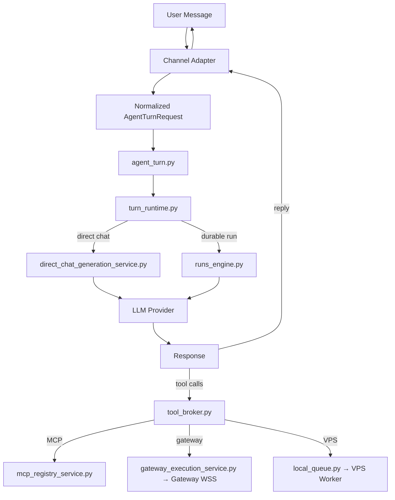

# Empyralis — Complete Platform Map

**Updated:** 2026-07-13  
**Commit:** `01c6081ce` (on branch `verify`; HEAD moved `2d5396d27` → `b3c122028` → `13f9fc09e` → `01c6081ce` the same day — the transport root-cause fix, the durable-delivery redesign, the event-loop-freeze fix, the Phase 1 warm-daemon builds for both codex and claude_code, and the Phase 2 streaming wire-up, all documented in **Part 26**; Phases 1a/1b/2 are now live-enabled on the prod-box Gateway, not just committed)  
**Graph:** 97,296 nodes · 190,019 edges · 4,448 communities · 3,259 files _(fresh graphify run 2026-07-08 — predates the changes in this refresh; treat as directional, not current)_  
**Test baseline:** ~1,319 pre-existing failures — compare failing sets in isolation, not counts  
**Code:** ~275,000 lines Python (server_modules/) + TypeScript (frontend/, gateway/) + Rust (kernel/; supervisor/ archived, see §2.3)  
**For:** Outside engineers and agents — read this cold, understand the entire platform.

> **2026-07-13 refresh #2 (later the same day) — the `cli_subscription`
> transport itself was root-caused and rebuilt; see the new Part 26 for the
> full wire-level trace.** Orthogonal to the cofounder-inventory pass below
> (that one audited product surfaces read-only; this one is the
> BYO-subscription execution path). Short version: the multi-day "Gateway
> shows Online but dispatch says not connected" symptom had two real bugs
> (a reconnect map-eviction race, an auth-retry storm) plus one that
> dwarfed both — a synchronous `next()` call on the FastAPI event loop that
> froze the entire backend for the full duration of every
> `cli_subscription` turn, which in turn starved the Gateway's own
> heartbeats and made a perfectly healthy connection look dead. All three
> are fixed. Gateway→machine delivery was redesigned from
> push-and-retry-until-deadline to enqueue-then-flush-on-connect-or-heartbeat
> (the pattern GitHub Actions runners and Buildkite use for unreliable
> worker machines). First confirmed real end-to-end turn landed (Codex
> genuinely ran, returned a real usage-limit message from the actual
> ChatGPT account). Turn latency measured and cut ~18.7s → ~4.4s. Phase 1
> of a 4-phase latency plan (a warm, reused `codex app-server` daemon
> instead of a cold `codex exec` per turn) is built and committed,
> flag-gated OFF by default — not yet enabled in production.
>
> **2026-07-13 refresh — a cofounder-decision inventory ran 11 independent
> read-only investigations in parallel across every capability this map
> either didn't cover or only mentioned in passing, each one required to cite
> `file:line` for every claim and write "NOT FOUND" rather than guess.**
> Eleven new/expanded sections were added: **Skills** (§14), **Self-Improving
> Agents** (§15, mostly a gap — the `reflection_enabled` flag and
> `REFLECTION.md`'s own "loaded every turn" claim are both dead scaffolding),
> **Persistent Memory** (§16, expands §3.6 — the MemoryTab "starter scaffold"
> banner is confirmed real, byte-compared against a template), **Sub-Agent
> Delegation** (§17, a fully-built backend pipeline with zero confirmed
> callers), **Scheduled/Autonomous Wake-Up** (§18 — the critical finding: the
> per-agent "schedule a wake-up" feature writes real rows to a real table,
> but the one scheduler that would execute them starts with
> `workspace_id=None` and dies at `scope_missing` on every tick, while a
> *separate* cron/weekly scheduler genuinely runs in production with no UI to
> create a schedule through), **Tool Governance** (§19), **Connectors — Vault,
> Bindings & Execution** (§20, confirms Notion/GitHub actually execute, not
> just store credentials), **Tool-Honesty Guard** (§21, previously
> undocumented — two independent runtime pipelines, both wired), **Hardware**
> (§22, confirms the placement-resolver claim "`cli_subscription` reads
> `gateway_binding`, not `hardware_access`" is TRUE and that
> `docs/HARDWARE-BRAIN-REALITY-REPORT.md`'s contrary claims predate a real
> fix), **Landing Page, Invite Gating & Auth** (§23 — there is no marketing
> landing page to gate; both invite-code mechanisms are OFF by default in
> this repo, so signup is open as shipped here), and **Sage's Actual
> Boundaries** (§24 — the "Sage has no connectors" framing is backwards: Sage
> has *strictly more* tool access than a deployed agent, not less; "Ask
> Sage" → "Ask AI" has not been started anywhere in the code), and **BYO
> Subscription/BYOK/Platform-Credits execution-layer findings** (§25 — the
> durable-dispatch deadline is reconciled definitively at 60s, not the 240s
> or 600s either individual commit message suggests on its own; a real,
> saveable UI path lets an owner set Sage's own Model tab to
> `cli_subscription`/`local` and it is silently never honored at turn time;
> a specialist's own BYOK provider choice can diverge from the credentials
> actually sent with it; every new specialist is seeded with the specific
> DeepSeek model the platform's own code comment says measured worse on a
> tool-honesty metric). Existing sections amended in place with corrections
> where the new pass found
> something the map previously got wrong or missed: §2.5/§9.1 (Agent Detail
> is 8 tabs plus a deliberately-hidden 9th `chat` route, not just 8), §5
> (Slack's checked-in app manifest points at stale URLs; Discord's per-agent
> OAuth silently produces a workspace-wide credential, not an agent-scoped
> one; a third, UI-unreachable Telegram mode exists via Cloud Session
> Manager), §10 (adds the soft pre-turn tool-visibility filter,
> `audience_tool_filter.py`, distinct from the two hard execution gates
> already documented), §11 (the channel kill-switch scope has a real,
> owner-gated write path that actually persists — the gap is that the one
> function which would read it back before dispatching a channel message is
> never called), §12 (`channel_activity_service.py` is fully dead — its
> caller was deleted in the Phase 7B consolidation and nothing replaced it;
> `config/agent_activity_timeline_map.json`'s event-class list has drifted
> from the real enum in `activity_ledger_service.py` and nothing in the
> runtime reads the file anyway).
>
> **2026-07-09 refresh — this map was materially stale and had already caused
> wrong briefs.** Corrected in this pass: the create-agent wizard is
> documented as its actual current 4-step flow (Placement → Brain → Channels
> → Connections, auto-named, agent created on step 1), not the old 5-step
> Name-first flow. The Rust Supervisor is documented as **archived by owner
> decision** (moved to `_archive/`, "agents do not control user desktops"),
> not "never compiled" as if still pending. Four new sections were added:
> **Authority Mandate** (§10), **Kill switch** (§11), **Attribution** (§12),
> and **One agent class** (§13) — covering work that existed in the repo but
> had no map entry. Every file reference touched by this pass was checked
> against the live tree, not memory; stale pointers to files deleted in the
> Phase 7B consolidation (`channel_execution_service.py`,
> `transparency_settings_service.py`, `supervisor_client.py`,
> `computer_control.py`, and their dead test files) were removed. Part 9 ("what
> blocks a real user") is rewritten to the true current list — the wizard,
> provider modes, kill switch, attribution, and first-run honesty gaps this
> map used to list as blockers are now solved and moved into "works today."
>
> **Phase 8 changes (2026-07-06):** The legacy workstation shell is gone. Every
> workspace surface now renders **fleet-native** inside `FleetShell` — landing,
> agents, projects, billing, inbox, hardware, settings — on the new
> **floating-panel chrome** (flat `--bg-canvas` with a bordered `--bg-panel`
> content column, Inter 13px). The `WorkspaceSurfacePage` surface router, the
> workstation kernel/shell-frame, and ~40 `workstation-*` panes were deleted (a
> 47-file grep-proven sweep); all legacy segment URLs 307-redirect to their
> fleet homes in `next.config.ts`. New this phase: live Work tab (7s polling +
> unread indicators), first-run onboarding (one action → the create-agent
> wizard; post-signup lands in the wizard), human error states + loading
> skeletons on every surface, and a CSRF fix so an expired session cookie no
> longer blocks re-login. Frontend section (2.5) below reflects this; backend
> sections carry forward from Fix-1 (owned separately).
>
> **Fix-1 changes (2026-07-05):** Provider system expanded to 4 modes + 17 providers. Create-agent wizard fully functional (all 5 steps). Interactive Model tab in agent detail. SQLite fallback for local dev (no DATABASE_URL needed).

---

## Part 1: Architecture Diagram

```
┌──────────────────────────────────────────────────────────────────────────┐
│                    CONSUMER SURFACES (Channels = Pigeons)                 │
│                                                                          │
│  Web Chat │ Telegram │ Discord │ Slack │ WhatsApp │ Signal │ iMessage    │
│  (Next.js)│ Bot API  │Interact │ Events│ Personal │ bridge │ BlueBubbles │
│           │+ GramJS  │  Bot+DM │+OAuth │ (Baileys, gataway )│  CLI   │   API       │
│                                                                          │
│  Every channel normalizes into AgentTurnRequest. No channel holds        │
│  routing logic, policy, or session state.                                │
└────────────────────────────┬─────────────────────────────────────────────┘
                             │  Normalized AgentTurnRequest
                             ▼
┌──────────────────────────────────────────────────────────────────────────┐
│                    CONTROL PLANE (Python/FastAPI :8001)                    │
│                                                                          │
│  server.py ── Composition root (21 routers mounted, 403 lines)           │
│  │                                                                       │
│  ├─ agent_turn.py ── Canonical turn entry (all channels converge here)   │
│  │   └─ turn_runtime.py ── Execution switchboard                         │
│  │       ├─ direct-chat path ── direct_chat_generation_service.py        │
│  │       │   └─ LLM provider → response → tool_broker (if tool calls)    │
│  │       └─ durable-run path ── runs_engine.py → run_service.py          │
│  │                                                                       │
│  ├─ Sage (operator agent) ── sage_agent_runtime_service.py               │
│  ├─ Studio (specialist agents) ── agent_registry_repository.py           │
│  ├─ Memory ── memory_service.py + unified_memory_service.py              │
│  ├─ Governance ── unified_governance_gate.py + runtime_policy.py         │
│  │                                                                       │
│  ├─ Tool Broker ── tool_broker.py                                        │
│  │   ├─ MCP path ── mcp_registry_service.py → external MCP servers       │
│  │   ├─ Gateway path ── gateway_execution_service.py → Gateway WSS       │
│  │   └─ VPS path ── local_queue.py → VPS worker (HTTP poll)              │
│  │                                                                       │
│  ├─ MCP Server (Empyralis AS MCP) ── mcp_server.py (9 tools at /mcp)     │
│  ├─ MCP Auth ── mcp_server_auth.py (per-workspace API keys)             │
│  ├─ OAuth Vault ── vault_store.py + connection_oauth_service.py          │
│  └─ Preflight ── preflight.py (kernel, Postgres, Redis checks)           │
└──────────┬──────────────────────┬──────────────────────┬─────────────────┘
           │ Cloud                │ Gateway (WSS)         │ VPS (HTTP poll)
           ▼                      ▼                       ▼
┌──────────────┐  ┌──────────────────────┐  ┌──────────────────────────┐
│  CLOUD TIER  │  │  AGENT COMPUTER      │  │  SELF-HOSTED NODE        │
│  (no hw)     │  │  (user hardware)     │  │  (user VPS)              │
│              │  │                      │  │                          │
│ • Bot APIs   │  │ empyralis-gateway    │  │ • Command worker          │
│ • Webhooks   │  │ (Node.js, WSS)       │  │ • HTTP poll → claim →    │
│ • OAuth apps │  │   ├─ channels/       │  │   execute → heartbeat    │
│ • Cloud      │  │   ├─ browser/        │  │ • Shell + File ONLY      │
│   Computer   │  │   ├─ supervisor/     │  │                          │
│   (droplet)  │  │   └─ bridges/        │  │                          │
│              │  │                      │  │                          │
│              │  │ empyralis-supervisor │  │                          │
│              │  │ ARCHIVED (owner      │  │                          │
│              │  │ decision 2026-07-04) │  │                          │
│              │  │  desktop control is  │  │                          │
│              │  │  OUT of the product; │  │                          │
│              │  │  code kept in        │  │                          │
│              │  │  _archive/supervisor/│  │                          │
└──────────────┘  └──────────────────────┘  └──────────────────────────┘

              empyralis-runtime-kernel (Rust CLI)
              Policy decision engine — 52 commands
              Reads JSON from stdin → writes {ok, decision, reason} to stdout
```

### Data Flow (Mermaid)



### Provider Architecture — Who Pays for the Brain?

Every agent has a `model_config` dict in its install metadata. Four payment modes
gate which providers are available. This is the single biggest user-facing
decision in the platform.

```
┌─────────────────────────────────────────────────────────────────────┐
│                    MODEL CONFIG (per agent)                         │
│                                                                     │
│  mode: "platform_credits" | "byok_api" | "cli_subscription" | "local" │
│  provider: "deepseek" | "anthropic" | "openai" | ...               │
│  model: "deepseek-chat" | "claude-sonnet-4-6" | ... (optional)     │
└─────────────────────────────────────────────────────────────────────┘

MODE 1: platform_credits (Empyralis pays)
├── DeepSeek ONLY (hard policy gate: PLATFORM_CREDIT_MODEL_ALLOWLIST)
├── Models: deepseek-chat, deepseek-v4-pro
├── No setup — works immediately
└── Billed against workspace credit ledger

MODE 2: byok_api (Customer pays provider directly)
├── 13 providers: Anthropic, OpenAI, DeepSeek, Google Gemini, Groq,
│   OpenRouter, xAI (Grok), Azure OpenAI, AWS Bedrock, Qwen, Mistral,
│   Ollama Cloud, Custom OpenAI-compatible
├── API key stored in workspace vault (vault_store.py)
├── Key never leaves workspace boundary
└── Customer billed by provider directly

MODE 3: cli_subscription (Customer's existing subscription)
├── Claude Code CLI — local Claude Pro subscription via Gateway
├── OpenAI Codex — ChatGPT/Codex subscription via Gateway
├── Gateway invokes local CLI with customer's login
├── Empyralis never touches the subscription token
└── Requires Gateway paired on customer's machine

MODE 4: local (Runs on customer's own hardware)
├── Ollama — local model runtime
├── No data leaves customer's machine
├── Requires Gateway + Ollama installed
└── Zero platform cost
```

**See Part 26 for the exact wire-level trace of a `cli_subscription` turn**
— every hop from the browser's `fetch("/api/turn")` through backend
dispatch, the Gateway on the customer's own machine, the real `codex`/
`claude` CLI, and back — plus the three bugs that broke it for days and
the latency work in progress.

**Where each mode is configured:**

| Surface | File | What it does |
|---------|------|--------------|
| Create-agent wizard | `FleetCreateAgentWizard.tsx` | `model_config` defaults to `platform_credits` the moment the agent is created (Step 1, "Placement"); the "Brain" step (Step 2) only PATCHes it if the user picks BYOK or local. **`cli_subscription` was silently broken here until recently** — the wizard's own code comment (`:307-312`) records that this branch used to fall through with no PATCH at all, so "Every BYO-brain agent created via the wizard hit this bug," fixed by commit `df06f7577`. Confirmed fixed as of `verify` HEAD. |
| Agent detail → Model tab | `FleetAgentDetail.tsx` (ModelTab) | Edits model_config post-creation via PATCH. **Rendered for every agent with no `isMaster` gate** (`:341`) — unlike sibling rows in the same file that do gate on `isMaster` — see Part 25 for what happens when you actually use it on Sage's own card. |
| Backend validation | `fleet_tools.py` `_VALID_MODEL_MODES` | Rejects invalid modes |
| Provider catalog | `provider_profiles.py` `PROVIDER_CATALOG` | 17 providers with auth modes, models, scopes |
| Platform credit gating | `provider_catalog_service.py` `PLATFORM_CREDIT_MODEL_ALLOWLIST` | Only DeepSeek for platform credits |
| Tier routing | `empyralis_model_tier_routing_service.py` | Maps public tiers → internal provider+model |
| Provider resolution | `provider_catalog_service.py` `resolve_provider_model_selection()` | Validates provider+model+surface+payer |

**See Part 25 for the 2026-07-13 execution-layer deep dive** — confirms
DeepSeek-as-default with a passing unit test, confirms BYOK storage is
genuinely Fernet-encrypted (not plaintext), and finds two gaps this summary
table doesn't show: `cli_subscription`/`local` mode saved on **Sage's own**
Model tab is silently never honored at turn time, and a specialist's own
`byok_api` provider choice can diverge from the credentials actually sent
with it.

**Provider catalog (full list):**

| ID | Label | Auth | Platform Credits? |
|----|-------|------|-------------------|
| `deepseek` | DeepSeek | API key | **YES (only one)** |
| `anthropic` | Anthropic | API key / local CLI | No (BYOK) |
| `openai` | OpenAI | API key / OAuth | No (BYOK) |
| `gemini` | Google Gemini | API key / CLI OAuth | No (BYOK) |
| `groq` | Groq | API key | No (BYOK) |
| `openrouter` | OpenRouter | API key | No (BYOK) |
| `xai` | xAI (Grok) | API key | No (BYOK) |
| `azure_openai` | Azure OpenAI | API key | No (BYOK) |
| `bedrock` | AWS Bedrock | Access token | No (BYOK) |
| `qwen` | Qwen | API key | No (BYOK) |
| `mistral` | Mistral | API key | No (BYOK) |
| `ollama_cloud` | Ollama Cloud | API key | No (BYOK) |
| `custom_openai_compatible` | Custom OpenAI-compatible | API key | No (BYOK) |
| `vertex` | Google Vertex AI | Access token | No (BYOK) |
| `claude_code_cli` | Claude Code (Subscription) | Local CLI | No (subscription, hidden) |
| `openai-codex` | OpenAI Codex | OAuth | No (subscription) |
| `ollama` | Ollama | Local | No (local) |

### Key Contracts

1. **One turn engine** — all channels converge on `agent_turn.py`. No parallel turn contracts.
2. **Channels = pigeons** — transport only. Channel logic must not bleed into agent brain or control plane.
3. **Brokered everything** — tools → `tool_broker.py`, secrets → `secrets_broker.py`, runtime → policy-bound.
4. **No fallback** — credits at zero = hard stop. No silent downgrade.
5. **Internalized governance** — no approval UX. Agent internalizes rules. Kernel hard-blocks at execution.
6. **Shell-first tools** — agent uses shell + browser. Minimal bespoke tools. Keep: memory, channel plumbing, OAuth.
7. **WSS reverse tunnel** — Gateway opens outbound WSS to cloud. No inbound holes. Survives NAT/firewalls.
8. **Platform voice ≠ Agent voice** — "Heads up:" prefix for platform. Never "I"/"my" from infrastructure.

### Two MCP Surfaces

Empyralis has a DUAL MCP role:

**1. Empyralis AS MCP CLIENT** — connects TO 30+ SaaS apps (Gmail, GitHub, Slack, Notion, etc.)
- Files: `mcp_registry_service.py`, `connection_oauth_service.py`, `skill_registry.py`
- Flow: OAuth → credential vault → MCP server registration → tool discovery → approval → invocation
- Transport: streamable_http only (no stdio, no SSE)

**2. Empyralis AS MCP SERVER** — external AI clients connect TO Empyralis at `/mcp`
- Files: `mcp_server.py` (9 tools), `mcp_server_auth.py` (per-workspace API keys)
- Auth: Bearer token (`empyralis_mcp_...`) — SHA-256 hashed storage
- 5 read tools (live): list_agents, get_agent_activity, memory_read, memory_list, chat
- 4 write tools (gated behind `EMPYRALIS_MCP_WRITE_ENABLED=true`): create_agent, configure_agent, message_agent, memory_write

---

## Part 2: Complete File Map

### 2.1 Backend — `server_modules/` (~275,000 lines Python, ~190 service files)

This IS the production backend. Everything below lives at `server_modules/`.

#### Composition Root & Core

| File | Lines | Purpose |
|------|-------|---------|
| `server.py` | ~400 | FastAPI app, CORS, 21 router mounts, exception handlers, MCP mount, preflight |
| `mcp_server.py` | 267 | Empyralis AS MCP server — 9 tools at `/mcp` for external AI clients |
| `mcp_server_auth.py` | ~120 | Per-workspace MCP API key creation, SHA-256 hashing, revocation, resolution |
| `preflight.py` | 223 | Startup checks: kernel binary, Postgres (+stage_4b columns), Redis |
| `runtime_config.py` | — | Env, paths, provider resolution |
| `runtime_common.py` | — | Shared utilities, auth middleware |
| `state_paths.py` | — | Runtime state file path resolution |

#### Turn Engine

| File | Lines | Purpose |
|------|-------|---------|
| `agent_turn.py` | — | **Canonical turn entry** — all channels normalize into AgentTurnRequest → here |
| `turn_runtime.py` | — | **Execution switchboard** — direct chat vs durable run dispatch |
| `turn_ingress_service.py` | — | Turn ingress normalization |

#### Sage / Operator Agent

| File | Lines | Purpose |
|------|-------|---------|
| `sage_agent_runtime_service.py` | 3,417 | ⚠️ Sage agent loop — `_COMMUNICATION_SCOPES`, `_CONNECTOR_ROUTE_KEYWORDS`, `_GATEWAY_ROUTE_KEYWORDS` hardcode channel names |
| `sage_command_dispatcher.py` | — | Command dispatcher + error messages (classify_error token leak fixed in T2) |
| `sage_turn_adapter.py` | — | ✅ Unified sage turn execution for all channels |
| `sage_reply_dispatcher.py` | — | ⚠️ Reply dispatch |
| `sage_transparency_service.py` | — | Sage transparency events |
| `sage_daily_operator_service.py` | — | Daily operator tasks |
| `universal_operator.py` | — | Universal operator actions (14 strings fixed in T2) |
| `channel_adapter.py` | — | ✅ Channel normalization — NormalizedSageTurn |
| `error_response_service.py` | — | Error response normalization |

#### Direct Chat Subsystem (~30 files)

| File | Lines | Purpose |
|------|-------|---------|
| `direct_chat_service.py` | — | Direct chat orchestration |
| `direct_chat_generation_service.py` | 2,022 | LLM generation loop (provider-backed) |
| `direct_chat_composition_service.py` | — | Chat composition |
| `direct_chat_response_service.py` | — | Slash command dispatch |
| `direct_chat_provider_service.py` | — | Provider selection/routing |
| `direct_chat_provider_facade_service.py` | — | Provider facade |
| `direct_chat_entry_service.py` | — | Chat entry |
| `direct_chat_entry_policy_service.py` | — | Entry policy |
| `direct_chat_runtime_service.py` | — | Chat runtime |
| `direct_chat_runtime_facade_service.py` | — | Chat runtime facade |
| `direct_chat_runtime_entry_facade_service.py` | — | Runtime entry facade |
| `direct_chat_stream_runtime_service.py` | — | Stream runtime |
| `direct_chat_stream_state_service.py` | — | Stream state |
| `direct_chat_stream_transport_service.py` | — | Stream transport |
| `direct_chat_stream_response_service.py` | — | Stream response |
| `direct_chat_transport_service.py` | — | Chat transport |
| `direct_chat_memory_facade_service.py` | — | Memory facade |
| `direct_chat_handoff_service.py` | — | Handoff logic |
| `direct_chat_handoff_facade_service.py` | — | Handoff facade |
| `direct_chat_operator_binding_service.py` | 2,516 | Operator tool routing bindings |
| `direct_chat_operator_support_service.py` | — | Operator support |
| `direct_chat_callback_facade_service.py` | — | Callback facade |
| `direct_chat_support_binding_service.py` | — | Support binding |
| `direct_chat_metadata_service.py` | — | Metadata |
| `direct_chat_prompt_service.py` | — | Prompt assembly |
| `direct_chat_context_service.py` | — | Context building |
| `direct_chat_intervention_service.py` | — | Intervention builder |
| `direct_chat_availability_service.py` | — | Availability checks |
| `direct_chat_routing_service.py` | — | Routing |
| `direct_chat_hosted_usage_service.py` | — | Hosted usage tracking |
| `direct_chat_tool_catalog_service.py` | — | Tool catalog |

#### Channel System

| File | Lines | Purpose |
|------|-------|---------|
| `agent_channel_router.py` | 2,375 | ⚠️ Channel routing — per-channel handler classes, LOCAL_BRIDGE_PERSONAL_CHANNELS hardcoded |
| `channel_lane_contract_service.py` | — | Canonical channel lane definitions (discord_personal contradiction) |
| `channel_types.py` | — | Channel type definitions |
| `channel_platform_service.py` | — | Channel platform management |
| `channel_blocking_policy_service.py` | — | Channel blocking/safe mode |
| `personal_channel_sage_bridge_service.py` | — | ⚠️ 6 near-identical per-channel wrapper functions |
| `personal_channels_service.py` | 2,270 | Personal channel management |
| `personal_channel_handler_registry.py` | — | Personal channel handler registry |
| `personal_channel_thread_command_service.py` | — | Personal channel thread commands |
| `routes_sage_telegram_hosted.py` | — | ⚠️ Telegram hosted bot routes |
| `routes_personal_channels.py` | — | Personal channel API routes |

**Dead route files** (preserved, not mounted in server.py):
`routes_signal.py`, `routes_imessage.py`, `routes_wechat.py`, `routes_slack.py`, `routes_discovery.py`, `routes_mini_apps.py`

#### Connectors (`server_modules/connectors/`)

| File | Purpose |
|------|---------|
| `slack_connector.py` | Slack — OAuth, webhooks, message handling |
| `discord_connector.py` | ⚠️ Discord — bot REST + personal DM |
| `discord_bot_runtime_service.py` | Discord bot runtime |
| `telegram_ingress_service.py` | ⚠️ Telegram ingress |
| `telegram_connector_services.py` | Telegram connector services |
| `telegram_connector_context_service.py` | Telegram context |
| `telegram_connector_poll_service.py` | Telegram polling |
| `telegram_run_action_service.py` | Telegram run actions |
| `telegram_run_dispatch_service.py` | Telegram run dispatch |
| `telegram_inbound_context_service.py` | Telegram inbound context |
| `whatsapp_ingress_service.py` | ⚠️ WhatsApp ingress |
| `whatsapp_webhook_service.py` | WhatsApp webhook |
| `whatsapp_webhook_bridge_service.py` | WhatsApp webhook bridge |
| `whatsapp_transport_service.py` | WhatsApp transport |
| `whatsapp_autopilot_state_service.py` | WhatsApp autopilot state |
| `whatsapp_run_dispatch_service.py` | WhatsApp run dispatch |
| `github_connector.py` | GitHub — webhooks, issues, PRs |
| `linear_connector.py` | Linear API connector |
| `notion_connector.py` | Notion API connector |
| `dropbox_connector.py` | Dropbox API connector |
| `s3_connector.py` | AWS S3 connector |
| `smtp_connector.py` | SMTP/IMAP email connector |
| `connector_runtime.py` | Connector runtime base |
| `connector_webhook.py` | Connector webhook base |
| `runtime_status_service.py` | Connector runtime status |

#### Autopilot Subsystem (~18 files in `connectors/`)

`autopilot_endpoint_service.py`, `autopilot_runtime_exports.py`, `autopilot_runtime_facade_service.py`, `autopilot_runtime_support_service.py` (⚠️ 7 "I" messages), `autopilot_runtime_service_registry.py`, `autopilot_registry_facade_service.py`, `autopilot_approval_service.py`, `autopilot_skill_service.py`, `autopilot_workflow_setup_service.py`, `autopilot_event_service.py`, `autopilot_event_bridge_service.py`, `autopilot_state_bridge_service.py`, `autopilot_bridge_registry_service.py`, `autopilot_bridge_facade_service.py`, `autopilot_connector_shell_service.py`, `autopilot_channel_support_service.py`, `autopilot_common_support_service.py`, `autopilot_terminal_bridge_service.py`, `autopilot_run_entry_service.py`, `channel_delivery_outbox_service.py`, `channel_workspace_scope_service.py`

#### Gateway / Hardware

| File | Lines | Purpose |
|------|-------|---------|
| `gateway_execution_service.py` | — | Gateway tool dispatch |
| `gateway_protocol_service.py` | 2,254 | Gateway protocol handling (in 3-file import cycle with personal_channels_service) |
| `gateway_health_service.py` | — | Gateway health monitoring |
| `gateway_pairing_service.py` | — | Gateway pairing flow |
| `gateway_approval_service.py` | — | Gateway approval flow |
| `gateway_activity_service.py` | — | Gateway activity tracking |
| `gateway_browser_service.py` | — | Gateway browser execution |
| `gateway_inventory_service.py` | — | Gateway capability inventory |
| `gateway_state_repository.py` | 2,516 | Gateway state persistence |
| `routes_gateway.py` | 3,281 | Gateway REST + WSS routes |
| `hardware_runtime_target_resolver.py` | — | ⚠️ Hardware target resolution (self_hosted_node label bug) |
| `hardware_runtime_session_service.py` | — | Hardware runtime sessions |
| `hardware_action_broker_service.py` | — | Hardware action brokering |
| `hardware_access_policy_service.py` | — | Hardware access policy |
| `hardware_runtime_adapters/cloud_computer_adapter.py` | — | Cloud computer adapter |
| `hardware_runtime_adapters/gateway_adapter.py` | — | Gateway adapter |
| `hardware_runtime_adapters/self_hosted_node_adapter.py` | — | Self-hosted VPS adapter |
| ~~`supervisor_client.py`~~ | — | **Gone** — archived to `_archive/supervisor/` (see §2.3), not present in `server_modules/` |

#### Runtime / Sessions

| File | Lines | Purpose |
|------|-------|---------|
| `runtime_runtime_api.py` | 2,046 | Runtime registration, sessions, claims |
| `runtime_route_registry_service.py` | — | Runtime route registry |
| `runtime_route_registration_service.py` | — | Runtime route registration |
| `runtime_route_bootstrap_service.py` | — | Runtime route bootstrap |
| `runtime_run_entry_service.py` | — | Run entry |
| `runtime_run_query_service.py` | — | Run query |
| `runtime_run_control_service.py` | — | Run control |
| `runtime_run_approval_service.py` | — | Run approval |
| `runtime_run_delegation_service.py` | — | Run delegation |
| `runtime_run_detail_service.py` | — | Run detail |
| `runtime_run_access_service.py` | — | Run access control |
| `runtime_run_resume_service.py` | — | Run resume |
| `runtime_heartbeat_service.py` | — | Runtime heartbeat |
| `runtime_history_service.py` | — | Runtime history |
| `runtime_usage_service.py` | — | Runtime usage tracking |
| `runtime_workspace_service.py` | — | Runtime workspace service |
| `runtime_attachment_service.py` | — | Runtime attachment |
| `runtime_request_service.py` | — | Runtime request handling |
| `runtime_webhook_trigger_service.py` | — | Runtime webhook triggers |
| `runtime_local_execution_approval_service.py` | — | Local execution approval |
| `runtime_policy.py` | 3,885 | Runtime policy enforcement |
| `runtime_state_store.py` | 2,193 | Runtime state store |
| `local_queue.py` | 4,189 | Local queue — claims, heartbeats, dead letters (in 3 import cycles) |
| `machine_lease_service.py` | — | Machine lease management |
| `session_service.py` | — | Session management |
| `session_lifecycle_service.py` | — | Session lifecycle |
| `session_manager/manager.py` | — | Session manager |
| `session_manager/actor_queue.py` | — | Actor queue for sessions |
| `session_manager/observability.py` | — | Session observability |
| `session_manager/runtime_cache.py` | — | Session runtime cache |
| `thread_service.py` | — | Thread management |
| `setup_sessions.py` | — | Setup session management |

#### Runs Engine

| File | Lines | Purpose |
|------|-------|---------|
| `run_service.py` | 6,474 | Run orchestration service |
| `runs_core.py` | — | Runs core |
| `runs_engine.py` | — | Runs engine |
| `runs_execution.py` | 6,046 | Runs execution |
| `runs_history.py` | — | Runs history |
| `run_state_repository.py` | 3,865 | Run state persistence |

#### MCP / OAuth / Connector Bridge

| File | Purpose |
|------|---------|
| `mcp_registry_service.py` | MCP server registry, tool discovery, approval, invocation |
| `connection_oauth_service.py` | OAuth provider configs (32) + `APP_MCP_SERVER_MAP` (31 providers) + `_register_mcp_servers_for_provider()` |
| `connection_catalog_service.py` | Connection catalog |
| `connection_readiness_service.py` | Connection readiness checks |
| `connection_verify_service.py` | Connection verification |
| `routes_connections.py` | Connection REST: `GET /api/connections/mcp-catalog`, MCP key CRUD |
| `connectors_actions.py` | ⚠️ DEPRECATED connector tools (2,521 lines — replaced by MCP, pending removal) |
| `connectors_core.py` | Connector core utilities |
| `connector_manifests.py` | Connector manifest catalog |
| `connector_validators.py` | Connector validation |
| `routes_connectors.py` | Connector REST routes |

#### Memory

| File | Lines | Purpose |
|------|-------|---------|
| `memory_service.py` | 2,701 | Memory/embedding service |
| `unified_memory_service.py` | — | Unified memory across captain + specialists |
| `agent_memory_tools.py` | — | memory_read, memory_write, memory_list tool implementations |

#### Agent Registry

| File | Lines | Purpose |
|------|-------|---------|
| `agent_registry_api.py` | 2,168 | Agent registry REST API |
| `agent_registry_repository.py` | 2,436 | Agent registry persistence (Sage + specialist seeds with display_name) |
| `agent_specialist_repository.py` | — | Specialist agent persistence |
| `specialist_service.py` | — | Specialist agent service |
| `fleet_tools.py` | — | fleet_list_agents, fleet_create_agent, fleet_configure_agent, fleet_get_agent_activity, fleet_message_agent, schedule_task + _parse_when() |

#### Auth / Billing / Quota

| File | Lines | Purpose |
|------|-------|---------|
| `auth.py` | 5,796 | Authentication — users, sessions, API keys, SQLite fallback |
| `db.py` | — | Database connection, pool management, `durable_runtime_required()` |
| `control_plane_repository.py` | 13,049 | **LARGEST FILE** — Postgres: tenants, workspaces, agents, installs |
| `provider_profiles.py` | 4,289 | Provider profile management |
| `secrets_broker.py` | — | Secret/vault access — hosted keys, workspace BYOK |
| `vault_store.py` | — | Encrypted credential vault |
| `billing_service.py` | — | Billing integration (Stripe) |
| `routes_billing.py` | — | Billing API routes |
| `entitlements_service.py` | — | Entitlement and quota enforcement |
| `quota_response_service.py` | — | ⚠️ Quota response messages |
| `quota_policy_service.py` | — | Quota policy |
| `workspace_bootstrap_service.py` | — | New workspace setup, credit grants |

#### Tools / Safety

| File | Purpose |
|------|---------|
| `tool_broker.py` | Tool access gateway |
| `tool_broker_guard_service.py` | Tool brokering safety guards |
| `direct_tool_approval_service.py` | Tool approval workflow |
| `direct_tool_loop_guard_service.py` | Loop detection (3 repeat → abort) |
| `skill_registry.py` | Skill definitions + MCP-to-skill integration (11 strings fixed in T2) |
| `skill_scanner.py` | Skill file scanner |
| `unified_governance_gate.py` | Unified governance gate |
| `hybrid_policy_service.py` | Hybrid cloud/local placement policy |
| `safe_mode_service.py` | Safe mode — degraded operation |
| `execution_sandbox_service.py` | Execution sandbox |
| `external_content_guard.py` | External content safety |

#### Other Services

`activity_ledger_service.py`, `notification_service.py`, `app_registry_api.py`, `app_bridge_service.py`, `acp_bridge_service.py`, `acp_manager.py`, `workflow_service.py`, `workflow_api.py`, `workflow_repository.py`, `agent/action_service.py`, `agent/automation_setup_service.py`, `agent/user_profile_service.py`, `inventory_skill.py`, `personal_context_engine.py`, `shared_operational_board_service.py`, `voice_notification_policy_service.py`, `doctor_report.py`, `health_core.py`, `routes_health.py`, `routes_agents.py`, `api_contract.py`, `logging_config.py`, `config_loader.py`, `cloud_cutover_config.py`, `sqlite_helpers.py`, `attachment_utils.py`, `url_security.py`, `browser_engine.py`, `blackbox_runtime_support.py`, `data_retention_service.py`, `retention_enforcement_job.py`, `platform_analytics_service.py`, `customer_ops_pack.py`

### 2.2 Gateway — `empyralis-gateway/src/` (Node.js/TypeScript)

The Gateway runs on user hardware, opens an outbound WSS tunnel to cloud, and routes capability invocations locally.

| Subsystem | Key Files | Purpose |
|-----------|-----------|---------|
| **Entry** | `index.ts`, `config.ts` | Process lock, subsystem init, WSS client start |
| **Cloud** | `cloud/ws-client.ts` (997 lines), `cloud/heartbeat.ts`, `cloud/heartbeat-payload.ts`, `cloud/reconnect.ts` | WSS connection, heartbeat, exponential-backoff reconnection |
| **Channels** | `channels/telegram/runtime.ts` (825 lines), `channels/whatsapp/runtime.ts` (665 lines), `channels/foundation/` (6 files: credential-redactor, draft-manager, outbound-store, reconnect-utils, typing-keepalive), `channels/local-bridge-runtime.ts` (433 lines), `channels/personal-runtime.ts`, `channels/personal-config-store.ts` | Personal messaging: Telegram (GramJS), WhatsApp (Baileys), Signal/iMessage/WeChat (local HTTP bridge) |
| **Capability router** | `supervisor/capability-router.ts` (directory name is historical — the Rust supervisor executor was removed from it in the 2026-07-04 archival) | Central dispatch hub — current `ExecutorName` type is `browser \| external_agent_proxy \| personal_channel \| shell_sandbox \| llm`. No supervisor executor; `supervisor/client.ts` and `supervisor/signing.ts` now live in `_archive/supervisor/gateway/`, not here. |
| **LLM / CLI runtime** | `llm/runtime.ts` (`generateViaCli` — picks daemon/pool vs. cold-spawn), `llm/cli-runner.ts` (373 lines — `buildInvocation`/`spawnAndCollect`, the real non-shell `child_process.spawn` of the customer's own `claude`/`codex` binary), `llm/codex-app-server.ts` (400 lines, NEW 2026-07-13 — persistent, reused `codex app-server` JSON-RPC daemon, flag-gated OFF by default), `llm/claude-cli-prewarm.ts` (NEW 2026-07-13 — a pool of pre-spawned, SINGLE-USE `claude` CLI processes; deliberately not a reused daemon like codex's — see Part 26.5 for why — flag-gated OFF by default), `llm/cli-installer.ts`, `llm/cli-login-session.ts`, `llm/cli-setup-runtime.ts` | Executes `capability_id="llm.generate"` for `cli_subscription` agents (Mode 3, §1) — the code that actually runs Codex/Claude on the customer's machine under their own login. See Part 26 for the full wire trace and the warm-daemon latency work. |
| **Browser** | `browser/runtime.ts`, `browser/worker.ts`, `browser/session-store.ts` | Browser automation via Python subprocess |
| **Pairing** | `pairing/device-identity.ts`, `pairing/token-store.ts` | Device UUID + pairing token persistence |
| **Protocol** | `protocol/types.ts`, `protocol/codec.ts` | Wire format `v1alpha2`: frame types, validation, 256KB limit, 32-level nesting limit |
| **Runtime** | `runtime/service-mode.ts`, `runtime/desktop-permissions.ts`, `runtime/runtime-metadata.ts` | OS-level service mode detection, 16 capabilities → 5 permission types |
| **Health** | `health/service-inventory.ts` (590 lines) | Passive inventory: PostgreSQL, Docker, Ollama, Codex CLI, GPU detection |
| **Bridges** | `bridges/signal-cli-bridge.ts` (381 lines), `bridges/bluebubbles-bridge.ts` (422 lines) | Standalone HTTP bridge servers for Signal (signal-cli JSON-RPC) and iMessage (BlueBubbles API) |
| **State** | `state/db.ts`, `state/journal.ts`, `state/outbox.ts`, `state/checkpoints.ts` | JSON-file persistence: atomic writes, corruption detection, NDJSON journal, outbox (at-least-once delivery) |

### 2.3 Supervisor — ARCHIVED BY OWNER DECISION (2026-07-04, Phase U1)

**Not "never compiled" — deliberately disabled and moved.** Per
`_archive/supervisor/README.md`: *"Empyralis agents do NOT control user
desktops. The Gateway STAYS (personal channels + VPS pairing). Desktop
control via supervisor is OUT of the product."* The code was fully
functional (as of commit `44451aa9c`, Phase P3) and is preserved for
auditability, not deleted — an 18-step revival checklist is documented in
that same README if desktop control is ever brought back.

**What moved:** `empyralis-supervisor/` (the whole Rust tree below) →
`_archive/supervisor/empyralis-supervisor/`; `server_modules/supervisor_client.py`
and `server_modules/computer_control.py` → `_archive/supervisor/`;
`empyralis-gateway/src/supervisor/{client,signing}.ts` → `_archive/supervisor/gateway/`.
Their test files (`test_supervisor_client.py`, `test_computer_control.py`)
still exist in `server_modules/tests/` but now fail to collect (import a
module that no longer exists) — dead tests, not a regression to chase.

**Current impact:** `gateway_execution_service.py:57-60` documents this
directly — desktop-control tool calls (`computer__click`, `computer__type`,
`computer__ocr`, `computer__clipboard_read`, `computer__clipboard_write`,
`computer__launch_app`, `computer__focus_window`, `computer__speak`,
`computer__applescript`) "have no executor on the gateway side." The Gateway
itself is unaffected — personal channels (Telegram/WhatsApp via GramJS/Baileys)
and VPS pairing route through it exactly as before; only the supervisor
dispatch branch is gone.

Original file inventory (historical reference — files below now live under
`_archive/supervisor/empyralis-supervisor/src/`, not `empyralis-supervisor/src/`):

HTTP server at `127.0.0.1:7788`. HMAC-SHA256 signature verification on all requests.

| File | Lines | Purpose |
|------|-------|---------|
| `main.rs` | 989 | Axum/Tokio HTTP server. `POST /execute` (policy eval + capability dispatch), `POST /interrupt` (cancellation), `GET /health`. SQLite audit trail. |
| `execution.rs` | 25 | ExecutionContext — request_id, run_id, CancellationToken |
| `capabilities/clipboard.rs` | 27 | Clipboard read/write (arboard crate) |
| `capabilities/control.rs` | 225 | Mouse/keyboard (enigo crate): click, move, type, key combos |
| `capabilities/filesystem.rs` | 497 | Read/write/append/delete with hard-protected roots (~/.ssh, ~/.gnupg), symlink bypass detection |
| `capabilities/launch.rs` | 16 | App/URL launch (opener crate) |
| `capabilities/ocr.rs` | 111 | Tesseract OCR: screen capture → text extraction, text-center finding |
| `capabilities/screenshot.rs` | 150 | Screenshot (xcap + macOS screencapture fallback), region cropping |
| `capabilities/shell.rs` | 549 | Shell execution with hard-blocked patterns: `rm -rf /`, `mkfs.*`, fork bombs, shutdown. Shell injection blocking. Read-only command enforcement. |
| `capabilities/system.rs` | 182 | Desktop notifications, AppleScript execution, text-to-speech |
| `capabilities/windows.rs` | 23 | Window enumeration (xcap): title, app_name, position, size |

### 2.4 Runtime Kernel — `empyralis-runtime-kernel/src/` (Rust CLI)

52 decision commands dispatched from `main.rs`. Reads JSON from stdin → writes `{ok, decision, reason}` to stdout.

| Group | Files | Purpose |
|-------|-------|---------|
| **Policy** | `policy.rs` (492), `presets.rs` (205), `risk.rs`, `authorization.rs`, `approvals.rs`, `safe_mode.rs` | Policy evaluation with 7 autonomy modes (yolo/cautious/read_only/safe_autopilot/trusted_workstation/ask_every_time/deny_all), 3 presets, capability allowlists/blocklists |
| **Execution** | `execution_plan.rs`, `execution_runtime.rs`, `execution_outcome.rs`, `execution_authorization.rs`, `sandbox.rs`, `sandbox_execution.rs` | Execution planning, Docker sandbox config, outcome processing |
| **Gateway** | `gateway.rs`, `gateway_action.rs`, `gateway_frame.rs`, `gateway_service.rs`, `gateway_state.rs`, `heartbeat.rs`, `outbox_delivery.rs` | Gateway frame validation, heartbeat evaluation, outbox delivery authorization |
| **Runs** | `runs.rs`, `run_api.rs`, `run_approval.rs`, `run_preparation.rs`, `run_record.rs`, `run_routing.rs`, `run_service.rs`, `run_triggers.rs` | Run lifecycle (max 3 attempts, 1000-cent budget, 600s runtime) |
| **Deployed** | `deployed_agent.rs`, `deployed_readiness.rs`, `deployed_data.rs`, `deployed_virtual_runtime.rs` + service variants | Agent deployment authorization |
| **Infra** | `control_plane.rs`, `session.rs`, `platform_orchestration.rs`, `virtual_computer.rs`, `lease.rs`, `queue.rs`, `scheduler.rs`, `state.rs` | Control plane decisions, session bounds (20/80/200 turns, 4h/24h/168h age) |

### 2.5 Frontend — `frontend/`

#### Pages (`frontend/app/`)

| File | Route | Purpose |
|------|-------|---------|
| `layout.tsx` | `/` | Root layout — font, metadata, theme bootstrap |
| `page.tsx` | `/` | Landing page → redirects |
| `login/page.tsx` | `/login` | Login |
| `signup/page.tsx` | `/signup` | Signup |
| `auth/complete/page.tsx` | `/auth/complete` | OAuth callback |
| `onboarding/page.tsx` | `/onboarding` | Onboarding wizard |
| `(account)/layout.tsx` | `/w/*` | Auth gate layout |
| `(account)/w/[workspaceId]/page.tsx` | `/w/[workspaceId]` | Workspace landing → **Fleet Home** (`FleetHome`) |
| `(account)/w/[workspaceId]/layout.tsx` | `/w/[id]/*` | Bootstraps the workspace, mounts `FleetShell` (shellSlot now `null` — no workstation shell) |
| `(account)/w/[workspaceId]/agents/page.tsx` | `/w/[id]/agents` | Agent list + "New agent" wizard host (honors `?new=1`) |
| `(account)/w/[workspaceId]/projects/page.tsx` | `/w/[id]/projects` | Projects list |
| `(account)/w/[workspaceId]/projects/[projectId]/…` | `/w/[id]/projects/[pid]/agents/[aid]/[tab]` | Project detail → routed, deep-linkable agent detail |
| `(account)/w/[workspaceId]/billing/page.tsx` | `/w/[id]/billing` | Usage/cost by project → agent |
| `(account)/w/[workspaceId]/inbox/page.tsx` | `/w/[id]/inbox` | Workspace activity + escalations feed (fleet-native, Phase 8) |
| `(account)/w/[workspaceId]/hardware/page.tsx` | `/w/[id]/hardware` | Paired computers + `GatewayPairPanel` (fleet-native, Phase 8) |
| `(account)/w/[workspaceId]/settings/page.tsx` | `/w/[id]/settings` | MCP API keys + billing link (fleet-native, Phase 8) |
| `(account)/w/[workspaceId]/fleet/page.tsx` | `/w/[id]/fleet` | Alias of Fleet Home (redirects to `/agents`) |
| `api/[...path]/route.ts` | `/api/*` | **Catch-all proxy** — forwards GET/POST/PATCH/DELETE to backend |
| `api/w/[workspaceId]/fleet/agents/route.ts` | `GET/POST /api/w/[id]/fleet/agents` | Fleet agent list + create proxy |
| `api/w/[workspaceId]/fleet/agent-activity/route.ts` | `GET /api/w/[id]/fleet/agent-activity` | Agent activity proxy |

#### Fleet UI (`frontend/lib/workspace/fleet/`) — Post-Fix-1

As of **Phase 8 the fleet surface is the _only_ workspace UI** — the legacy
workstation shell was deleted. `FleetShell` → `FleetShellDecider` →
`FleetContentFrame` renders every route directly inside a floating panel; the
old `shellSlot` fall-through is now `null` (see §2.5 "Legacy shell — removed").
Fleet components own their own data (no `useWorkspaceBoundary()` context).

| File | Purpose |
|------|---------|
| `FleetShell.tsx` / `FleetShellDecider.tsx` / `FleetContentFrame.tsx` | Themed root (canvas), segment router, and bordered content panel + breadcrumbs. |
| `PrimaryRail.tsx` | Persistent left rail (Inbox, Projects, Agents, Hardware, Billing, Settings) with keyboard chords. |
| `FleetHome.tsx` | Agent grid + status strip + "New agent" button. Opens wizard. |
| `FleetAgentDetail.tsx` | **Routed, deep-linkable** agent detail (not a modal) — `/projects/[pid]/agents/[aid]/[tab]`. **2,132 lines.** 8 visible tabs (`TABS`, `FleetAgentDetail.tsx:101-110`): Overview, Work, Channels, Connectors, **Tools**, Hardware, Model (editable), Memory — confirmed as exactly 8 in the 2026-07-13 pass, re-verified against the live array, not assumed from the tab folder (see next row). **Plus a 9th, deliberately hidden tab: `chat`** — present in the `TabId` type (`:99`) and the route's `VALID_TABS` (`.../[agentId]/[tab]/page.tsx:11`), but excluded from the `TABS` pill array on purpose; reached only via the "Chat with this agent" CTA (`:362-365`) or a direct URL (`.../agents/{id}/chat`). Six of the 8+1 tab bodies (`OverviewTab` `:495`, `ChannelsTab` `:1032`, `ConnectorsTab` `:1387`, `ToolsTab` `:1476`, `ModelTab` `:1782`, `ChatTab` `:921`) are defined **inline inside this one file** — only Work/Hardware/Memory got broken out to `tabs/*.tsx` (see below), which is why a `*Tab.tsx` filename glob undercounts. Exports `ChannelsTab` for wizard reuse. Overview hosts `AgentTitle` (inline click-to-edit rename, `:596`) and `PersonaEditor` (instructions, `:692`) — the only places those fields are set post-creation. |
| `tabs/WorkTab.tsx` | End-customer conversations, split-view. **Live** — 7s polling of the list + open transcript, unread dots, "{n} new" count (Phase 8 Part A). |
| `first-agent-empty.tsx` | Shared first-run empty state + create-agent wizard (`FirstAgentEmpty` / `CreateFirstAgentEmpty`) used by Agents/Projects/Inbox (Phase 8 Part B). |
| `fleet-states.tsx` | Shared `FleetListSkeleton` + `FleetSurfaceError` — human error states + loading skeletons on every list/tab (Phase 8 Part C5). |
| `FleetCreateAgentWizard.tsx` | **v2, 4-step wizard** (own docstring, `:92-100`): Placement → Brain → Channels → Connections. Name/Project/Capability preset are no longer steps — sane defaults, editable later. Agent is created on Step 1's commit (`submitPlacement()`, `:182-217`); later steps are incremental PATCHes. Closing early = real agent, not lost work. |
| `FleetCommandPalette.tsx` | Keyboard-driven command palette for switching agent tabs. |
| `fleet-data.ts` | React hooks (each exposes `{ data, loading, error }` where relevant): `useFleetAgents`, `useFleetProjects`, `useFleetAgentActivity`, `useFleetAgentChannels`, `useFleetAgentConnectors`, `useFleetAgentTools`, `useWorkspaceActivity`, `useWorkspaceStatusStrip`. |
| `fleet-presentation.ts` | Agent summary projection, status/placement derivation, tint colors. |
| `fleet-preferences.ts` | Theme toggle — reads account-wide `globalTheme`, no separate fleet localStorage key. |
| `fleet-icons.ts` | Channel + connector icon registry (maps backend IDs to icon assets). |
| `fleet-provider-constants.ts` | **Shared provider catalog** — 4 modes, 17 providers, used by both wizard and Model tab. |
| `fleet-theme.css` | Fleet CSS: the **floating-panel chrome** (`--bg-canvas`/`--bg-panel`, Inter 13px), cards, grid, lists, wizard, work split-view + unread dots, empty/error/skeleton states, rail. |

#### Agent Detail — 7 Tabs (routed, deep-linkable: `/projects/[pid]/agents/[aid]/[tab]`)

| Tab | Data Source | Notes |
|-----|-------------|-------|
| **Overview** | `useFleetAgentActivity` → `GET /fleet/agent-activity` | Status, placement, role, recent activity feed |
| **Work** | `GET /api/threads?workspace_id=...&agent_id=...` (+ transcript) | End-customer conversations, split-view. **Live** — 7s polling + unread dots (Phase C switched this off the deployed-agents conversations endpoint onto fleet's own thread store) |
| **Channels** | `GET /fleet/agent-channels` | 7-platform grid. Telegram: hosted / BYO token / personal-via-Gateway. Slack/Discord: OAuth. WhatsApp/Signal/iMessage/WeChat: Gateway pair panel. Exports `ChannelsTab` for wizard reuse |
| **Connectors** | `GET /fleet/agent-connectors` | MCP/OAuth connector grid with inline credential setup |
| **Hardware** | agent `hardware_access` + gateway registrations | Cloud (default) vs a paired Gateway computer |
| **Model** | agent `model_config` + `PATCH /fleet/agents/{id}` | **Interactive** — 4-mode selector (platform credits / BYOK / subscription / local), provider dropdown, API key, Save |
| **Memory** | `GET /api/sage-context-files?agent_id=` | Split-pane MD file browser, editable + Save |

#### Wizard — 4 Steps (v2, `FleetCreateAgentWizard.tsx`)

`STEP_LABELS` (`FleetCreateAgentWizard.tsx:29`): `["Placement", "Brain", "Channels", "Connections"]`.
Name, project, and capability preset are no longer steps — they're sane
defaults (auto-generated name, `"standard"` preset), editable later from the
Overview tab. Every field below that isn't touched by a step is still set
automatically at creation (see Part 13 for the full breakdown of what's
seeded vs. what needs a later PATCH).

| Step | What happens | Persisted via |
|------|-------------|---------------|
| 1. Placement | Cloud (default) / self-hosted VPS / paired-Gateway computer | `POST /fleet/agents` — **agent is created here**, on first commit (`submitPlacement()`, `:182-217`, guarded so a later re-visit only PATCHes); immediately followed by `PATCH /fleet/agents/{id}` for `hardware_access`/`preferred_gateway_id` |
| 2. Brain | Who pays for the model (`platform_credits` default / BYOK / local) + which model | `PATCH /fleet/agents/{id}` — `model_config`, only sent for BYOK/local (platform_credits needs no patch — it's already the default) |
| 3. Channels | Optional — same `ChannelsTab` component as the agent detail page | Inline via `ChannelsTab`; button reads "Skip for now" if nothing's connected |
| 4. Connections | Optional — MCP/OAuth connector picker (`ConnectorPicker`) | Inline; explicitly "skip and add them later" |
| Finish | Closes wizard, opens agent detail | Agent already exists and is usable — closing at any step keeps a real, working agent, not a discarded draft |

**Auto-naming:** the wizard sends no `name`; the backend (`fleet_create_agent`,
`fleet_tools.py:1189-1203`) assigns one from a 50-name curated pool
(`agent_name_pool.py` — `NAME_POOL`, `assign_agent_name()`; "Sage" reserved
for the operator), collision-checked against every existing label in the
workspace including the master agent. **Inline rename** lives in the
Overview tab: `AgentTitle` (`FleetAgentDetail.tsx:497-588`) is a click-to-edit
control that PATCHes `display_name` directly — the only place an agent is
renamed post-creation.

#### Theme System

Single `data-theme` attribute on `<html>` and `<body>`. One source of truth:

| Layer | File | Role |
|-------|------|------|
| Design tokens | `shared/design-system/tokens.ts` | `DESIGN_SYSTEM_THEME_ATTRIBUTE = 'data-theme'` |
| Shared colors | `frontend/lib/ui/theme-tokens.css` | CSS custom properties consumed by all surfaces |
| Legacy shell | `frontend/lib/ui/chrome.css` | Consumes tokens via `var(--bg-page)` etc. |
| Fleet shell | `frontend/lib/workspace/fleet/fleet-theme.css` | Consumes same tokens |
| Preference source | `empyralis.account-shell.v2` localStorage → `globalTheme` | Account-wide, stored by `AccountShellProvider` |

#### Legacy workstation shell — **REMOVED (Phase 8)**

The workstation shell that used to render workspace surfaces is gone. A
grep-proven 47-file sweep deleted `WorkspaceSurfacePage.tsx`,
`workstation-kernel-shell.tsx`, `workstation-shell-frame.tsx`,
`desktop-startup-screen.tsx`, `AccountTenantSwitcher.tsx`, `WorkspaceHomeRedirect.tsx`,
and ~40 `workstation-*` surface panes (activity, artifacts, chat, deployed-agents,
sage-heartbeat/connectors/profile/tools, notifications, runs, settings,
studio-integrations, gateway-operator, hardware, billing, platform-analytics,
titlebar, hosted-mini-apps, discovery-pane, and their helpers). `layout.tsx`
passes `shellSlot={null}`; every legacy segment URL 307-redirects to its fleet
home in `next.config.ts`.

**What still lives in `frontend/lib/workspace/`** (had live consumers outside the
shell, so kept): `workspace-boundary.tsx` (16 importers), `workspace-shell.ts`,
`server-workspace-bootstrap.ts`, `workspace-setup-form.tsx`,
`workspace-channel-pairing-surface.tsx`, `hosted-mini-app-surface.tsx`,
`cloud-vps-setup-panel.tsx`, the `sage-chat/` stack + `workstation-chat-pane-hooks/-model`,
`workstation-split-workbench.tsx`, `workstation-surface-primitives.tsx`,
`workstation-stream-manager.ts`, `workstation-client.ts`. (`application-surface-tabs.ts`
is a pre-existing orphan, unrelated to the sweep — left for separate cleanup.)

### 2.6 `shared/` (Cross-Project Contracts)

| File | Purpose |
|------|---------|
| `nav-manifest.ts` | Canonical navigation destinations |
| `mini-app-sdk.js` | Mini-app SDK |
| `design-system/tokens.ts` | Shared design tokens |
| `api-contract/index.ts` | API type contracts |
| `api-contract/client.ts` | API client |
| `api-contract/model-tier-contract.ts` | Model tier definitions |

### 2.7 `legacy/` (v1 Reference Snapshot)

Broad snapshot of the old repo. Contains copies of: `frontend/`, `server_modules/`, `empyralis-gateway/`, `empyralis-supervisor/`, `empyralis-runtime-kernel/`, `cloud-session-manager/`, `python_engine/`, `scripts/`, `docs/`, `references/`. Most subdirectories contain only build artifacts (node_modules, target, venv). The `frontend/` and `server_modules/` copies have real source code — v1 reference implementations. Not yet pruned to clean backend+frontend split per target architecture.

### 2.8 `server/` — DOES NOT EXIST

The v2 target backend directory (`server/`) has NOT been created. The Linear PLATFORM OVERVIEW (2026-07-01) declares `server/` as THE future backend with: `agent/`, `tools/`, `oauth/`, `memory/`, `mcp/`, `vault/`, `channels/` — one file per concern. **Zero files exist at that path.** The consolidation hasn't started. All production backend logic is in `server_modules/`.

### 2.9 Config & Deploy Files

| File | Purpose |
|------|---------|
| `server.py` | FastAPI composition root (21 routers, MCP mount) |
| `mcp.json` | MCP client configuration for Empyralis connecting TO external MCP servers |
| `pytest.ini` | Pytest config: `blackbox_db` (needs Postgres), `kernel` (needs Rust binary) markers |
| `Dockerfile.*` | Container builds |
| `render.yaml` | Render.com deploy config |
| `graphify-out/graph.json` | AST knowledge graph (40MB, 28,619 nodes) |
| `graphify-out/GRAPH_REPORT.md` | Human-readable graph analysis with community reports |

---

## Part 3: Subsystem Connection Map

### 3.1 Entry Points — What Kicks Off a Turn?

Every inbound message enters through one of these files:

| Entry Point | Transport | File | Handler |
|-------------|-----------|------|---------|
| Telegram Bot webhook | HTTPS POST | `routes_sage_telegram_hosted.py` | Bot API → `sage_turn_adapter.py` → `agent_turn.py` |
| Telegram Personal | Gateway WSS | `gateway_protocol_service.py` | GramJS → Gateway → WSS → `gateway_execution_service.py` → `agent_turn.py` |
| Discord Bot | HTTPS Interactions | `connectors/discord_connector.py` | Discord HTTP → `sage_turn_adapter.py` → `agent_turn.py` |
| Discord Personal | Gateway WSS | `gateway_protocol_service.py` | Bot token via Gateway → `agent_turn.py` |
| Slack Events | HTTPS webhook | `connectors/slack_connector.py` | Slack API → `sage_turn_adapter.py` → `agent_turn.py` |
| WhatsApp Business | Twilio webhook | `connectors/whatsapp_webhook_service.py` | Twilio → `sage_turn_adapter.py` → `agent_turn.py` (BLOCKED by Meta ban) |
| WhatsApp Personal | Gateway WSS | `gateway_protocol_service.py` | Baileys → Gateway → WSS → `agent_turn.py` |
| Web Chat | HTTP POST | `routes_connectors.py` or chat API | Web → `direct_chat_service.py` |
| Direct API call | HTTP POST | `server.py` chat route | `direct_chat_entry_service.py` → `direct_chat_service.py` |
| Signal/iMessage/WeChat | local bridge → Gateway WSS | `gateway_protocol_service.py` | Bridge HTTP → Gateway → WSS (WIRED, untested) |
| MCP inbound | `/mcp` Streamable HTTP | `mcp_server.py` | External AI client → `empyralis_chat()` → direct chat path |

### 3.2 The Turn Engine

```
agent_turn.py  ←── All channels converge here
    │
    ▼
turn_runtime.py  ←── Execution switchboard
    │
    ├── direct-chat path (synchronous, in-process):
    │   direct_chat_service.py
    │     → direct_chat_generation_service.py  (LLM call)
    │       → direct_chat_provider_service.py  (provider selection)
    │       → direct_chat_prompt_service.py    (prompt assembly)
    │       → direct_chat_context_service.py   (context building)
    │       → direct_chat_tool_catalog_service.py  (available tools)
    │     → direct_chat_response_service.py    (response parsing)
    │     → direct_chat_composition_service.py (reply composition)
    │     → direct_chat_memory_facade_service.py   (memory hooks)
    │     → direct_chat_handoff_service.py     (agent-to-agent handoff)
    │
    └── durable-run path (async, persistent):
        runs_engine.py
          → run_service.py  (6,474 lines — orchestration)
          → runs_execution.py  (6,046 lines — execution)
          → runtime_policy.py  (3,885 lines — policy enforcement)
          → local_queue.py  (4,189 lines — claims, heartbeats)
          → runtime_run_control_service.py  (run lifecycle)
          → runs_history.py  (persistence)
```

### 3.3 Tool Dispatch

When the LLM responds with a tool call:

```
LLM response: "call tool X with args {...}"
    │
    ▼
tool_broker.py  ←── Tool access gateway
    │
    ├── MCP tools:
    │   mcp_registry_service.py
    │     → invoke_workspace_mcp_skill_async()
    │     → streamable_http → external MCP server
    │     → return result
    │
    ├── Gateway tools (shell, browser, channels):
    │   gateway_execution_service.py
    │     → gateway_protocol_service.py
    │     → WSS → Gateway capability-router.ts
    │       → supervisor client (Rust daemon) OR
    │       → browser worker (Python subprocess) OR
    │       → personal channel runtime (GramJS/Baileys)
    │     → return result
    │
    ├── VPS tools:
    │   local_queue.py
    │     → enqueue task → VPS worker polls → claims → executes
    │     → HTTP heartbeat → result returned
    │
    └── Fleet tools (agent management):
        fleet_tools.py
          → fleet_list_agents, fleet_create_agent, fleet_configure_agent, etc.
          → agent_registry_repository.py
```

### 3.4 Channel Response

When the agent produces a reply:

```
Agent output (text or tool result)
    │
    ▼
sage_reply_dispatcher.py  ←── Reply dispatch
    │
    ├── Cloud channels (Telegram Bot, Discord Bot, Slack):
    │   channel_adapter.py → channel-specific delivery
    │     → Telegram: Bot API sendMessage
    │     → Discord: Interaction response / REST API
    │     → Slack: chat.postMessage
    │
    ├── Gateway channels (Telegram Personal, WhatsApp Personal, etc.):
    │   gateway_execution_service.py
    │     → gateway_protocol_service.py
    │     → WSS → Gateway → channel runtime → send message
    │
    └── Web Chat:
        direct_chat_transport_service.py → SSE stream or HTTP response
```

### 3.5 OAuth → MCP Connector Flow

```
User clicks "Connect Gmail"
    │
    ▼
connection_oauth_service.py
    → GET /api/connections/oauth/{provider}/authorize
    → Redirect to Google OAuth consent screen
    → User approves
    → Google redirects to OAuth callback
    │
    ▼
connection_oauth_service.py: complete_oauth_callback()
    → Exchange code for tokens
    → Store tokens in vault_store.py (encrypted)
    │
    ▼
_register_mcp_servers_for_provider()  [Phase U]
    → Look up provider in APP_MCP_SERVER_MAP
    → For each MCP endpoint:
        mcp_registry_service.py: upsert_workspace_mcp_server_async()
    → MCP server registered in workspace
    │
    ▼
mcp_registry_service.py: discover_tools()
    → Connect to MCP endpoint (streamable_http)
    → Call list_tools()
    → Store discovered tools (approved: false by default)
    │
    ▼
User approves tools → skill_registry.py dispatches mcp_tool → invocation
```

### 3.6 Memory Flow

```
Agent writes memory:
    agent_memory_tools.py: memory_write(key, value)
      → memory_service.py
      → unified_memory_service.py
      → Three-tier scoping:
          1. config — agent configuration, prompts, rules
          2. outputs — generated content, decisions, results
          3. private — user-specific data, credentials

Agent reads memory:
    agent_memory_tools.py: memory_read(key)
      → memory_service.py
      → unified_memory_service.py
      → Returns value scoped to workspace + agent

Memory list:
    agent_memory_tools.py: memory_list()
      → Returns all keys visible to this agent in this workspace
```

### 3.7 Gateway Connection Lifecycle

```
1. User installs Gateway binary
2. Gateway: pair → POST /gateway/registrations (pairing token)
3. Cloud: returns gateway_id + session token
4. Gateway: WSS connect to cloud (outbound, TLS)
5. Gateway: send heartbeat with capability inventory
   → health/service-inventory.ts: probes PG, Docker, Ollama, Codex, GPU
6. Cloud: agent turn arrives with tool call
7. Cloud → Gateway: WSS tool.invoke frame
8. Gateway → capability-router.ts: dispatch to executor
   → browser / external-agent-proxy / personal-channels / supervisor
9. Gateway → Cloud: WSS tool.result frame
10. On disconnect: exponential backoff reconnect with outbox replay
```

### 3.8 VPS Worker Lifecycle

```
1. User installs worker on VPS
2. Worker: HTTP poll → GET /runtime/queue/claim?worker_id=X
3. Cloud: local_queue.py → find pending task → return claim
4. Worker: execute → shell command or file operation
5. Worker: HTTP heartbeat → POST /runtime/queue/heartbeat
6. Worker: HTTP result → POST /runtime/queue/result
7. Cloud: local_queue.py → mark complete → return result to waiting turn
8. If heartbeat missed: task returned to queue (dead letter after N retries)
```

---

## Part 4: God Objects and Fragility Points

### 4.1 God Objects — Top 10 by Edge Count

From `graphify-out/GRAPH_REPORT.md` (2026-07-08, fresh run):

| Rank | Node | Edges | What Breaks If It Changes |
|------|------|-------|---------------------------|
| 1 | `Communities` | 763 | Graph structure — metadata node |
| 2 | `RunStartRequest` | 175 | All run execution — turn start, session creation, VPS claim |
| 3 | `RunServiceTests` | 143 | Test suite for the second-largest service file (6,474 lines) |
| 4 | `InMemoryVirtualComputerRuntime` | 132 | All virtual computer tests and simulation |
| 5 | `enforce_workspace_access()` | 124 | Every API route — auth wall across the entire platform |
| 6 | `_scoped_connection()` | 118 | Every Postgres query through the control plane |
| 7 | `runtime_state_store_decision_command()` | 114 | All state persistence authorization |
| 8 | `AgentManifest` | 110 | Every agent definition, every registry read, every specialist |
| 9 | `_token()` | 102 | Auth token resolution — every request |
| 10 | `AgentTurnRequest` | 96 | **NEW** — canonical turn contract, all channels converge here |

**Largest files (lines):**

| File | Lines | Risk |
|------|-------|------|
| `control_plane_repository.py` | 13,049 | **God object** — tenants, workspaces, agents, installs, migrations all in one file |
| `run_service.py` | 6,474 | Run orchestration monolith |
| `runs_execution.py` | 6,046 | Execution monolith |
| `deployed_agent_service.py` | 6,037 | Deployment monolith |
| `auth.py` | 5,796 | Auth + session + API keys + SQLite in one file |

### 4.2 Import Cycles — All 19

From the graphify report (2026-07-08):

**1-file self-cycles (4):**
- `_archive/supervisor/empyralis-supervisor/src/capabilities/clipboard.rs` → self
- `legacy/frontend/shared/nav-manifest.ts` → self
- `scripts/orion_terminal/wizard/engine.py` → self
- `shared/nav-manifest.ts` → self

**3-file cycles (13):**
1. `gateway_execution_service.py → gateway_protocol_service.py → personal_channels_service.py → gateway_execution_service.py`
2. `conversation_memory_policy.py → memory_service.py → memory_summary_service.py → conversation_memory_policy.py`
3. `conversation_memory_policy.py → memory_service.py → workspace_context_memory_adapter.py → conversation_memory_policy.py`
4. `memory_service.py → workspace_context_memory_adapter.py → unified_memory_service.py → memory_service.py`
5. `local_queue.py → run_service.py → runtime_policy.py → local_queue.py`
6. `local_queue.py → runtime_runs_api.py → runtime_policy.py → local_queue.py`
7. `local_queue.py → runtime_runs_api.py → runtime_route_registration_service.py → local_queue.py`
8. `direct_chat_tool_catalog_service.py → skills_service.py → no_provider_service.py → direct_chat_tool_catalog_service.py`
9. `policy_service.py → skills_service.py → runs_execution.py → policy_service.py`
10. `runtime_config.py → setup_sessions.py → shared.py → runtime_config.py`
11. `runtime_common.py → runtime_config.py → setup_sessions.py → runtime_common.py`
12. `connector_validators.py → connectors/discord_connector.py → runtime_config.py → connector_validators.py`
13. `local_queue.py → run_service.py → runtime_attachment_service.py → local_queue.py`

**3-file cycles — new since Fix-1 (1):**
14. `agent_memory_tree_service.py → memory_service.py → workspace_context_memory_adapter.py → agent_memory_tree_service.py`

**3-file cycles — resolved since Fix-1 (1):**
- ~~`policy_service.py → skills_service.py → runtime_config.py`~~ — no longer present

**4-file cycles (2):**
15. `scripts/orion_terminal/__init__.py → app.py → flows.py → flows_shared.py → __init__.py`
16. `local_queue.py → run_service.py → policy_service.py → runtime_policy.py → local_queue.py` ⚠️ **NEW**

**4-file cycles — resolved since Fix-1 (1):**
- ~~`auth.py → direct_tool_config_service.py → skills_service.py → gateway_protocol_service.py`~~ — no longer present

`local_queue.py` is now in **5 cycles** (was 4) — still the most entangled file. `memory_service.py` appears in 4 cycles (was 3, gained `agent_memory_tree_service.py`).

### 4.3 Isolated Nodes — 2,804 with ≤1 Connection

The graph has 2,804 nodes with ≤1 connection. These are candidates for dead code, but many are dynamically called (test functions, route handlers registered via decorators). **Do not blindly delete** — each must be audited for dynamic dispatch.

### 4.4 Low-Cohesion Communities (2)

| Community | Cohesion | Nodes | Files |
|-----------|----------|-------|-------|
| Community 1 — "Agent Settings UI" | 0.02 | 251 | Frontend components: DataBadge, FormReadout, FormSelect, ListDetailPanel, SkeletonBlock, ChatMessage, AgentActionCapabilitySections |
| Community 2 — "Run Service Management" | 0.02 | 176 | activate_live_run, approval_resolution_fingerprint, begin_run_pending_approval, assert_workflow_turn_depth_allowed |

Both should be split. Community 1 is a catch-all for UI components that don't really relate. Community 2 bundles run lifecycle functions with approval and workflow functions that have weak connections.

### 4.5 Inferred Edges — 1,552 at 0.62 Avg Confidence

1,552 edges are inferred (not extracted from AST). At 0.62 average confidence, a significant number may be wrong. Key risk: inferred edges involving god objects (`enforce_workspace_access`, `_scoped_connection`) could mislead navigation.

### 4.6 Thin Communities — 989 of 4,448

989 communities have too few nodes or edges to be meaningful — they exist as isolated clusters in the graph. They are omitted from the report entirely.

---

## Part 5: Channel System — Truth Table

### 5.1 Personal Channels (require Agent Computer Gateway)

| Channel | Transport | Status | Session Owner | Routes Through Sage? | Requires Hardware? | Files |
|---------|-----------|--------|---------------|---------------------|--------------------|-------|
| `telegram_personal` | GramJS via Gateway WSS | **PROVEN** | `paired_gateway` | yes | yes | `gateway/channels/telegram/runtime.ts` (825 lines), `personal_channel_sage_bridge_service.py` |
| `whatsapp_personal` | Baileys via Gateway WSS | **PROVEN** | `paired_gateway` | yes | yes | `gateway/channels/whatsapp/runtime.ts` (665 lines) |
| `discord_personal` | discord.py bot token via Gateway | **WIRED** | `cloud_connector` ⚠️ | yes | no ⚠️ | `connectors/discord_connector.py` |
| `signal_personal` | signal-cli bridge → Gateway WSS | **WIRED** | `paired_gateway` | partial | yes | `gateway/bridges/signal-cli-bridge.ts` (381 lines), `routes_signal.py` (DEAD) |
| `imessage_personal` | BlueBubbles bridge → Gateway WSS | **WIRED** | `paired_gateway` | partial | yes (Mac) | `gateway/bridges/bluebubbles-bridge.ts` (422 lines), `routes_imessage.py` (DEAD) |
| `wechat_personal` | WeChat bridge → Gateway WSS | **PLANNED** | `paired_gateway` | no | yes | `routes_wechat.py` (DEAD) |

### 5.2 Business Channels (cloud-only, no hardware)

| Channel | Transport | Status | Routes Through Sage? | Files |
|---------|-----------|--------|---------------------|-------|
| `telegram_bot` | Bot API (webhook + polling) | **PROVEN** | yes | `routes_sage_telegram_hosted.py`, `connectors/telegram_ingress_service.py` |
| `discord_bot` | Discord HTTP Interactions | **PROVEN** | yes | `connectors/discord_connector.py`, `connectors/discord_bot_runtime_service.py` |
| `slack` | Slack Events API + OAuth | **PROVEN** | yes | `connectors/slack_connector.py` |
| `email_gmail` | Gmail API (OAuth) | **PARTIAL** | partial | `connectors_actions.py` (DEPRECATED), MCP bridge |
| `email_smtp` | SMTP/IMAP | **PARTIAL** | partial | `connectors/smtp_connector.py` |
| `whatsapp_business` | Twilio API | **BLOCKED** (nuance below) | — | Meta banned general-purpose AI assistants Jan 2026; task-specific bots (support, bookings, notifications) remain allowed |
| `apple_messages_business` | MSP API | **PLANNED** | — | Needs Apple approval |
| `web_chat` | WebSocket widget | **PLANNED** | — | Not implemented |
| `teams` | Teams Bot Framework | **PLANNED** | — | Not implemented |
| `matrix` | Matrix CS API | **PLANNED** | — | Not implemented |

### 5.3 Work System Connectors (cloud-only)

| Connector | Transport | Status |
|-----------|-----------|--------|
| `github` | GitHub API webhooks | **PROVEN** |
| `linear` | Linear API | **PROVEN** |
| `notion` | Notion API | **PROVEN** |
| `dropbox` | Dropbox API | **PROVEN** |
| `s3` | AWS SDK | **PROVEN** |
| `smtp` | SMTP/IMAP | **PROVEN** |
| `wechat_work` | WeChat Work webhook | **PROVEN** |
| `instagram_business` | Facebook Graph API | **PROVEN** |
| `microsoft_365` | Microsoft Graph API | **PARTIAL** |

### 5.4 Channel Violations Summary

- **Adding a channel requires touching 12+ files** — should be 1-2
- **Frontend only shows 2 channels** (Telegram, WhatsApp) despite 27 in backend catalog
- **Only 3 studio channels route through Sage**: `slack`, `discord`, `github`. All others return `channel_unavailable`
- **Two `telegram_personal` paths**: Gateway (GramJS on user machine) vs Cloud Session Manager (GramJS in cloud) — no code sharing
- **`discord_personal` metadata contradiction**: ~~`runtime_lane: personal_gateway` but `session_owner: cloud_connector`~~ — **fixed as of the 2026-07-13 pass.** `channel_lane_contract_service.py:114-118` now carries an explicit comment ("this previously said `personal_gateway`, which contradicted both") and correctly declares `discord_personal` as `runtime_lane: "cloud_connector"` throughout — there is no self-hosted/Gateway mode for Discord by design (Discord's ToS forbids automating a real user account; `FleetAgentDetail.tsx:974` states this directly in a comment). The contradiction this map used to describe no longer exists in the code.

### 5.5 2026-07-13 pass — per-channel corrections and new findings

Re-verified each of the six channels above against current code. What changed or was newly confirmed, per channel:

- **Telegram** — the most fully-built of the six. Self-hosted Gateway path (`empyralis-gateway/src/channels/telegram/runtime.ts:73`, real GramJS), hosted-bot path (`routes_sage_telegram_hosted.py:131-233`), and genuine per-agent BYO-bot binding (`hosted_bot_provisioning_service.py:171-216` → `agent_channel_bindings` unique index) are all wired end-to-end, click through DB constraint. **But** a third, fully-coded mode — a cloud-hosted personal account via Cloud Session Manager (`cloud-session-manager/src/telegram/client-factory.js:16-350`, real GramJS, real relay to the backend) — has session-*creation* endpoints (`cloud-session-manager/src/api/routes.js:162-220`) that nothing in the frontend ever calls; a user cannot self-serve into this mode. A second, generic pairing-UI component, `frontend/lib/workspace/workspace-channel-pairing-surface.tsx`, is dead code — its backend (`routes_auth.py:419-452`) and Next.js proxy routes are real, but nothing renders the component.
- **WhatsApp** — exactly one real path: personal account via Gateway/Baileys (`empyralis-gateway/src/channels/whatsapp/runtime.ts:116`), with genuine QR-code and pairing-code UI (`PersonalChannelConnectPanel.tsx:318-478`). "WhatsApp Business" via Twilio (`routes_connectors.py:546` → `connectors/autopilot_runtime_exports.py`) is real, dormant legacy code — `channel_lane_contract_service.py:164-174,317-332` itself marks it `"stage": "roadmap"`, `"live_capable": False`, and there is no setup UI for it at all (only an icon-name string). No cloud-hosted alternative exists for WhatsApp (confirmed: no `whatsapp/` subdirectory under `cloud-session-manager/src/`).
- **Discord** — the bot runtime is a genuine live Discord Gateway WebSocket running **inside the Python backend process itself** (`server_modules/connectors/discord_connector.py:1062-1141`, started at boot via `server.py:269-292`) — there is no TypeScript/Gateway bridge for Discord at all. DM-to-Sage pairing (`/pair CODE`) and OAuth identify-bind both work. **New finding:** the per-agent "Bot" OAuth button in the Channels tab (`FleetAgentDetail.tsx:1108-1132`) never sends `metadata.agent_install_id` in its `startOAuth()` call — per `connection_oauth_service.py:1701-1731`'s own code comment, the resulting credential is stored as *"a bare workspace credential,"* not bound to the specific agent whose tab it was clicked from. The backend mechanism that *would* do a real per-agent Discord bind (`discord_bot_provisioning_service.py:133-198`) exists and is DB-enforced, but has zero frontend callers (contrast: the equivalent Telegram string IS found in the frontend).
- **Slack** — the OAuth-connect and inbound-webhook-to-reply round trip is real, live code (`connectors/slack_connector.py`, 707 lines; `connectors_actions.py:1105` `slack_events_webhook`). **New finding:** the checked-in `slack-app-manifest.json` declares OAuth/event URLs that don't match the actually-registered routes — the manifest is stale relative to the code. **New finding:** binding a specific deployed agent (rather than Sage) to a specific Slack workspace does not work — the one DB writer for a `"slack"` channel binding is never called, and `agent_channel_router.py:2251-2298`'s own comment says specialist dispatch was deferred to a future stage ("Stage 5") and a literal `pass` discards the resolved candidate. Every connected Slack workspace answers as Sage today, by the router's own comment.
- **iMessage** — the most complete of the three "bridge" channels: `empyralis-gateway/src/bridges/bluebubbles-bridge.ts` (421 lines) is a genuinely complete BlueBubbles HTTP bridge, and the UI (`LocalBridgeChannelStatus`, `FleetAgentDetail.tsx:987-1022`) honestly shows live bridge health rather than a faked "connected" state — its own comment explicitly rejects inventing a connected state. There is no in-app pairing *flow* by design (the UI tells the user to set two env vars manually), and — same pattern as Slack/Discord — no verified way for an agent other than Sage to own an iMessage conversation.
- **WeChat** — every layer's own code comments call it unbuilt: *"Personal WeChat has no official API to build a bridge against, so this isn't supported yet"* (`SageLauncher.tsx:53`); the connector catalog entry itself says *"Not launch-ready until the local bridge runtime is certified"* (`connection_catalog_service.py:272`). No bridge program exists anywhere under `empyralis-gateway/src/bridges/` (confirmed by directory listing — only BlueBubbles and signal-cli live there). The generic personal-channel HTTP route would accept and forward a `wechat_personal` send, but nothing at the far end can deliver it. (A separately-named, unrelated `wechat_work` connector — outbound-only enterprise WeCom webhooks — is real and marked "PROVEN" in §5.3; don't conflate the two.)

---

## Part 6: MCP/Apps Layer — Truth Table

### 6.1 Fully Wired + Bridge Auto-Registers (8)

These providers have OAuth → credential vault → MCP server auto-registration via `_register_mcp_servers_for_provider()` (Phase U):

| App | Provider | OAuth | MCP Transport | Status |
|-----|----------|-------|---------------|--------|
| Gmail | google_workspace | yes | streamable_http | **WIRED** |
| Google Calendar | google_workspace | yes | streamable_http | **WIRED** |
| GitHub | github | yes | streamable_http | **WIRED** |
| Notion | notion | yes | streamable_http | **WIRED** |
| Linear | linear | yes | streamable_http | **WIRED** |
| Slack | slack | yes | streamable_http | **WIRED** |
| Figma | figma | yes | streamable_http | **WIRED** |
| Dropbox | dropbox | yes | streamable_http | **WIRED** |

### 6.2 Frontend + Backend Bridge Live (13)

Endpoints in `APP_MCP_SERVER_MAP`, bridge wired (Phase U), frontend reads from single-source catalog API:

| App | Provider | Status |
|-----|----------|--------|
| Calendly | calendly | **WIRED** |
| ClickUp | clickup | **WIRED** |
| Webflow | webflow | **WIRED** |
| Monday.com | monday | **WIRED** |
| Box | box | **WIRED** |
| Confluence | confluence | **WIRED** |
| Miro | miro | **WIRED** |
| Intercom | intercom | **WIRED** |
| DocuSign | docusign | **WIRED** |
| Square | square | **WIRED** |
| Typeform | typeform | **WIRED** |
| Vercel | vercel | **WIRED** |
| Higgsfield | higgsfield | **WIRED** — official MCP aggregator (`mcp.higgsfield.ai/mcp`) for ~30 image/video models (Kling, Sora, Veo, Seedream, Seedance, FLUX, etc.) behind one connection. **New auth shape (2026-07-19):** the only provider here with no developer console to pre-register a static `client_id` — confirmed live via `mcp.higgsfield.ai/.well-known/oauth-authorization-server` (`registration_endpoint` present, no userinfo/introspection endpoint). Added `OAuthProviderConfig.registration_endpoint` (`connection_oauth_service.py:55`) + `_resolve_oauth_client()` (`:839`): tries static `HIGGSFIELD_CLIENT_ID`/`SECRET` first, else self-registers via RFC 7591 (gated by `HIGGSFIELD_OAUTH_ENABLED`) and caches the result for the process lifetime. Inert for all 31 other providers (`registration_endpoint` stays `None`). |

### 6.3 OAuth-Only, No MCP Tools (3)

| App | Provider | Status |
|-----|----------|--------|
| Todoist | todoist | **OAUTH_ONLY** — endpoints known, in catalog |
| HubSpot | hubspot | **OAUTH_ONLY** — endpoints known, in catalog |
| Jira | jira | **OAUTH_ONLY** — endpoints known, in catalog |

### 6.4 OAuth-Only, No Public MCP Endpoint (1)

| App | Provider | Status |
|-----|----------|--------|
| Microsoft 365 | microsoft_365 | **OAUTH_ONLY** — endpoint=null, no public MCP endpoint yet |

### 6.5 OAuth-Only, Standard Exchange (16)

canva, asana, zoom, airtable, stripe, salesforce, webhook, gitlab, and others — use `standard` token_parser.

**Total:** 31 providers in catalog (30 with a live MCP endpoint; `microsoft_365` remains endpoint=null per §6.4). Honest status per provider (live/partial/preview). Single source: `GET /api/connections/mcp-catalog`. (Verified 2026-07-19 via `len(connection_oauth_service.OAUTH_PROVIDER_CONFIGS)` == 32 — the 31 above plus `discord`, which has an OAuth config but intentionally no `APP_MCP_SERVER_MAP` entry; its OAuth flow feeds the bot-token `discord_bot` connector instead, not an MCP server.)

### 6.6 Empyralis IS an MCP Server (Phase U2)

| Tool | Type | Description |
|------|------|-------------|
| `empyralis_list_agents` | Read | List all agents in workspace |
| `empyralis_get_agent_activity` | Read | Recent ledger activity for a specific agent |
| `empyralis_memory_read` | Read | Read memory entry by key |
| `empyralis_memory_list` | Read | List all memory entries |
| `empyralis_chat` | Read | Full turn through triage + reasoning |
| `empyralis_create_agent` | Write (gated) | Create new specialist agent |
| `empyralis_configure_agent` | Write (gated) | Configure agent settings |
| `empyralis_message_agent` | Write (gated) | Send message to agent's fleet inbox |
| `empyralis_memory_write` | Write (gated) | Write a memory entry |

Auth: Bearer `empyralis_mcp_...` (SHA-256 hashed). Write tools gated behind `EMPYRALIS_MCP_WRITE_ENABLED=true`. All calls ledgered with `event_class: mcp_inbound`, `actor: external_mcp_client`.

---

## Part 7: Violations — The Full Catalog

### 7.1 Hardcoded "I"/"my" Strings — Platform Impersonates Agent (~57 total)

**Fixed (Phase T2 — 26 strings):** `triage_service.py` (1), `skill_registry.py` (11), `universal_operator.py` (14), `sage_command_dispatcher.py` classify_error leak (1). All converted to platform voice ("Heads up: ...").

**Remaining (~31 strings in lower-priority paths):**

| File | Count | Status |
|------|-------|--------|
| `sage_command_dispatcher.py` | 3 | Fixed (platform_event.py constants) |
| `sage_reply_dispatcher.py` | 1 | Fixed (platform_event.py) |
| `quota_response_service.py` | 3 | Fixed (platform_event.py) |
| `autopilot_runtime_support_service.py` | 7 | **Deferred** |
| `inventory_skill.py` | 5 | **Deferred** |
| `agent/automation_setup_service.py` | 6 | **Deferred** |
| `agent/user_profile_service.py` | 4 | **Deferred** |
| `connectors/telegram_run_action_service.py` | 1 | **Deferred** |
| `tool_broker.py` | 1 | **Deferred** |

### 7.2 "Your"/"You've" Personalization (20 instances)

| Location | Count | Example |
|----------|-------|---------|
| `sage_command_dispatcher.py:28-78` | 8 | "your main thread", "your API key", "You've reached your AI limit" |
| `autopilot_runtime_support_service.py:135-176` | 5 | "your AI account", "your current safety settings" |
| `entitlements_service.py:552`, `direct_chat_hosted_usage_service.py:197` | 2 | "You've reached your AI limit" |
| `direct_chat_context_service.py:10-12` | 3 | "sage hit a temporary error" (lowercase — wrong persona) |
| `agent_policy_context.py:74` | 1 | "Your capabilities are currently suspended..." |

### 7.3 Channel Logic Bleeding into Control Plane (10)

| File | Line(s) | Issue |
|------|---------|-------|
| `sage_agent_runtime_service.py` | 130-140 | `_COMMUNICATION_SCOPES` hardcodes channel names |
| `sage_agent_runtime_service.py` | 158-169 | `_CONNECTOR_ROUTE_KEYWORDS` maps channel names in agent brain |
| `sage_agent_runtime_service.py` | 170-195 | `_GATEWAY_ROUTE_KEYWORDS` has channel-specific terms |
| `agent_channel_router.py` | 62-66 | `LOCAL_BRIDGE_PERSONAL_CHANNELS` hardcoded |
| `personal_channel_sage_bridge_service.py` | 291-514 | 6 near-identical per-channel wrapper functions |
| `sage_agent_runtime_service.py` | 832-836 | "my hardware", "my mac" routing tokens in agent code |

### 7.4 Gateway Logic Misplaced (6)

| File | Issue |
|------|-------|
| `gateway/capability-router.ts:38-214` | Bundles channel messaging + hardware execution in one router |
| `gateway/capability-router.ts:73-141` | `handleToolInvoke()` mixes browser, channel, and supervisor dispatch |
| `hardware_runtime_target_resolver.py:93-101` | `self_hosted_node` falls through to wrong label `cloud_provider` |
| `hardware_runtime_target_resolver.py:121-128` | Gateway-offline fallback loses execution environment info |
| `channel_lane_contract_service.py:50-56` | `discord_personal` contradicting `runtime_lane` vs `session_owner` |

### 7.5 Structural Problems (8)

1. `AgentTurnResponse.reply` conflates agent responses and platform errors — no flag to distinguish
2. API contract mirrors the conflation — no `is_platform_error` field
3. Intervention system exists but is underused — most errors use raw `reply` strings
4. Frontend `ChannelProvider` type is hardcoded `'telegram' | 'whatsapp'`
5. Frontend `CHANNEL_PROVIDER_DEFINITIONS` is static, not data-driven
6. Frontend `visibleProviders` is a hardcoded array
7. Adding a channel requires touching 12+ files
8. Generic `build_personal_channel_reply_async()` exists but is bypassed by per-channel wrappers

**Total: 75 known violations across 5 categories. 26 fixed, ~49 remaining.**

---

## Part 8: The Gap — Current vs Target Architecture

### 8.1 Target (from Linear PLATFORM OVERVIEW, 2026-07-01)

The target is ONE of each primitive:

| Primitive | Target Location | Current Reality |
|-----------|----------------|-----------------|
| ONE Agent class | `server/agent/` | `server_modules/` — Sage + specialist + autopilot = at least 3 agent classes |
| ONE channel router | `server/channels/router.py` | `agent_channel_router.py` + `channel_lane_contract_service.py` + `personal_channel_handler_registry.py` + `personal_channel_sage_bridge_service.py` = at least 4 routing layers |
| ONE OAuth vault | `server/vault/` | `vault_store.py` + `connection_oauth_service.py` + `secrets_broker.py` — 3 files |
| ONE MCP client | `server/mcp/client.py` | `mcp_registry_service.py` + `skill_registry.py` + `connectors_actions.py` (DEPRECATED) |
| ONE session store | `server/sessions/` | `session_service.py` + `session_lifecycle_service.py` + `session_manager/` (4 files) + `thread_service.py` + `setup_sessions.py` |
| ONE memory system | `server/memory/` | `memory_service.py` + `unified_memory_service.py` + `agent_memory_tools.py` + `conversation_memory_policy.py` + `memory_summary_service.py` |
| ONE remote-hands protocol | `server/hardware/` | 3 adapters + `gateway_protocol_service.py` + `gateway_execution_service.py` + `hardware_runtime_target_resolver.py` + `hardware_action_broker_service.py` |
| `server/` as THE backend | `server/` | **DOES NOT EXIST** — zero files created |
| `legacy/` as clean reference | `legacy/frontend/` + `legacy/server_modules/` | Broad snapshot with build artifacts, not yet pruned |
| `frontend/v2/` deleted | N/A | Still exists (build artifacts only) |

### 8.2 Duplicate Implementations

Each "ONE primitive" in the target currently has multiple implementations:

- **Channel routing**: 4 layers (agent_channel_router, channel_lane_contract, personal_channel_handler_registry, personal_channel_sage_bridge)
- **Agent classes**: Sage operator + fleet specialist + autopilot = 3 distinct agent types with separate code paths
- **Session management**: 7 files spread across session_service, session_lifecycle_service, session_manager/ (4 files), thread_service
- **Tool dispatch**: tool_broker.py + skill_registry.py + connectors_actions.py (DEPRECATED but still 2,521 lines)
- **Memory**: 5 files with import cycles between them

### 8.3 What `server/` Would Need

To reach feature parity with `server_modules/`, the `server/` directory would need:

- `agent/` — Sage loop, specialist service, triage, turn runtime, context building, prompt assembly
- `channels/` — Telegram, Discord, Slack, WhatsApp, Signal, iMessage adapters + router
- `tools/` — Tool broker, fleet tools, skill registry, MCP client, schedule_task
- `oauth/` — Provider configs, token exchange, refresh, APP_MCP_SERVER_MAP (31 providers)
- `memory/` — Memory service, unified memory, agent memory tools, embeddings
- `mcp/` — MCP registry, server auth, MCP server (Empyralis as MCP)
- `vault/` — Encrypted credential storage
- `gateway/` — Gateway protocol, execution, pairing, health, WSS handler
- `runtime/` — Sessions, runs engine, local queue, runtime policy, heartbeat
- `auth/` — Authentication, billing, entitlements, quotas, workspace bootstrap
- `connectors/` — Connector actions, manifests, validators
- `governance/` — Policy service, safe mode, governance gate, sandbox

**Estimated: ~190 files, ~275,000 lines of Python.** This is not a refactor — it's a full rewrite with a different architecture.

---

## Part 9: What's Missing for "One Real User"

Per the platform vision: the cure for doubt is ONE real user who finds it useful enough to come back the next day.

### 9.1 What Works Today (updated 2026-07-09)

- ✅ Platform boots (frontend :3000, backend :8001)
- ✅ Preflight checks pass for local dev (Postgres/Redis can be skipped)
- ✅ Telegram bot channel (PROVEN)
- ✅ Discord bot channel (PROVEN)
- ✅ Slack channel (PROVEN)
- ✅ OAuth → MCP bridge for 8 providers
- ✅ MCP catalog API with 30 honest statuses
- ✅ Empyralis as MCP server (9 tools, per-workspace API keys)
- ✅ Fleet tools: create, configure, list agents
- ✅ **Fleet Home UI** — agent grid, status strip, "New agent" button
- ✅ **4-step create-agent wizard (v2)** — Placement → Brain → Channels → Connections, agent created on Step 1, auto-named from a curated pool, inline click-to-edit rename from the Overview tab (Part 2.5, Part 13)
- ✅ **Agent detail modal** — 8 tabs (Overview, Work, Channels, Connectors, Tools, Hardware, Model, Memory)
- ✅ **Interactive Model tab** — switch provider/mode/payment from agent modal
- ✅ **Provider catalog** — 4 modes (platform_credits, byok_api, cli_subscription, local), 17 providers
- ✅ **Memory browser** — per-agent MD file tree with editable textarea + Save
- ✅ **Channels grid** — 7 platforms, Telegram 3-option sheet (hosted/BYO token/personal)
- ✅ **Connectors grid** — real MCP/OAuth connectors with inline credential setup
- ✅ **SQLite fallback** — entire agent registry works without DATABASE_URL (local dev)
- ✅ **Theme unification** — single `data-theme` attribute, dark mode consistent across all surfaces
- ✅ **Chat composer** — attach button visible with real file picker, vision support gating
- ✅ schedule_task for proactive agents, authority-tier-inherited (Part 10)
- ✅ Operator/specialist agent roles with purpose_preset
- ✅ **Kill switch** — workspace and per-agent emergency stop, hard-blocked before any LLM call, wired to real UI controls (Part 11)
- ✅ **Authority Mandate** — owner/audience/system tiers, two fail-closed choke points on tool execution, owner-declared per-agent `audience_tools` allowlist (Part 10)
- ✅ **Activity and usage attribution** — an agent's Overview activity feed and per-agent cost/usage now correctly filter by that agent's own install_id instead of returning empty or blending into Sage's identity (Part 12)
- ✅ **First-run honesty** — a freshly created agent's Overview ("Now" status strip, recent-activity feed), chat transparency events, and Work tab conversation rows show true zero/empty state instead of stale or fabricated data
- ✅ **One agent class** — Fleet is the only live agent path; Deployed/Studio is frozen as a dormant reference implementation, not active scaffolding (Part 13)
- ✅ **Persistent memory** — MEMORY.md is genuinely injected into every Sage turn, the agent is instructed to silently write facts to it, and an owner can read/edit it live in the Memory tab; the "starter scaffold" banner shown before anyone has written to it is a real byte-comparison against a template, not a guess (Part 16)
- ✅ **Tool enable/disable** — the Tools tab toggle genuinely changes what the LLM can call; a real historical bug (toggles silently inert due to an id-space mismatch) was fixed via `migrations/unify_fleet_tool_toggle_ids.sql` (Part 19)
- ✅ **Connector execution, confirmed for at least 2 of 46 catalog entries** — once connected, a chat agent can actually call the Notion and GitHub APIs, not just store a credential (Part 20)
- ✅ **Tool-honesty guard** — two independent runtime pipelines (Sage-mediated chat and a specialist's own direct chat) both run a structural post-hoc check that catches an agent claiming success without a tool call, or denying success after one succeeded, plus three separate proactive prompt-construction sites that tell the model only about tools actually installed (Part 21)
- ✅ **Hardware placement resolver** — a `cli_subscription` agent's brain dispatch reads `model_config.gateway_binding` exclusively; it does not fall back to `hardware_access` at all, confirmed by grep returning zero hits in either owning file (Part 22)

### 9.2 What Blocks a Real User

| Blocker | Detail | Impact |
|---------|--------|--------|
| **No production deploy** | Frontend runs on localhost:3000 — no public URL, no HTTPS, no production build. Unchanged since the last refresh — still the single biggest blocker. | Nobody outside this machine can use it |
| **Per-agent channel identities not built** | One shared workspace bot per channel — specialists can't have their own Telegram/Discord identities. Confirmed worse than previously stated: Discord's per-agent OAuth button silently produces a *workspace-wide* credential (Part 5.5), and Slack has no working per-agent bind at all — every connected Slack workspace answers as Sage. | Agent identity is invisible to end users |
| **No channel health alerts** | If a Telegram bot token expires or Discord webhook fails, no alert | Silent failures lose messages |
| **No mandate/schedule UI** | The Authority Mandate's `mandate.audience_tools` allowlist (Part 10) and per-agent wake/heartbeat scheduling are both real, enforced backend mechanisms with **zero frontend surface for the mandate half** — owners can only set `audience_tools` via a raw PATCH. (The wake-schedule half now *does* have a real UI — `ScheduleSection` in the agent Overview tab — see the next row for why scheduling still doesn't work.) | Owners can't see or control what their agent lets end-customers trigger without reading API docs |
| ~~**Scheduled wake-ups silently never fire**~~ **RESOLVED 2026-07-13, live-verified — no longer a blocker.** | Was: the one scheduler instance that would execute a wake-up (`HeartbeatScheduler`) is started with `workspace_id=None` and dies at `scope_missing` before ever advancing a row — still true of *that specific* legacy instance. Fixed by a second, cross-workspace scanner (already on this branch as `dbde0a6aa`) that claims due wake requests across all workspaces independent of that broken instance; live-verified twice (a real scheduled wake-up claimed within ~1-16s of due and reached `status="executed"`, cross-confirmed by a matching `HEARTBEAT.md` entry). Two secondary bugs found and fixed in the same pass: the finalized wake request's own `run_id` was always null (wrong nesting level read), and `trigger_source` was never set to `"schedule"` (silently defaulted to `"user"`) — both confirmed fixed by inspecting the resulting run's own persisted metadata. (Part 18, top-of-section update) | An owner who schedules a wake-up now gets a real, autonomous turn — this un-blocks the whole "autonomous agent" story, not just this one feature. A newly-surfaced, separate, NOT-yet-fixed issue: the test run itself failed with a credentials error instead of reaching the agent's actual `cli_subscription` gateway brain — flagged as follow-up work, not fixed here (out of that fix's scope). |
| **Sub-agent delegation has a complete backend and zero confirmed callers** | `POST /runs/{run_id}/delegate` and its two siblings are fully implemented (role model, depth cap, trace events the chat UI already knows how to render) but a repo-wide search found no code — frontend, tool registration, or scripts — that ever calls them. A separate agent-to-agent mailbox tool (`fleet__message_agent`) writes real rows but nothing ever reads them back out into a turn. (Part 17) | A cofounder should not assume agents can currently delegate to each other in the live product |
| **Two of three "skills" subsystems are backend-only or fully dead** | The marketplace install/publish pipeline works over a direct API call but has no frontend and is never invoked from any agent-facing code path; the curated device-skill pack (1Password, Apple Notes, Apple Reminders, tmux) is described to the LLM as available but has no execution implementation anywhere — not in the backend, not in the Gateway. Only the Tools-tab enable/disable toggle (which the product calls "Tools," not "Skills") is genuinely wired end-to-end. (Part 14) | The product's public description of "skills" is broader than what a user can actually create, install, or run |
| **No marketing landing page exists, so there's nothing to gate** | `frontend/app/page.tsx` is a pure 25-line auth-redirect (logged out → `/login`, logged in → workspace). No hero/pricing/marketing component exists anywhere in the frontend. Separately, both invite-gating mechanisms that *do* exist in code (`EMPYRALIS_INVITE_CODE`, `ORION_PILOT_SIGNUP_MODE`) are unset in every env file in this repo, so signup is open as shipped here. (Part 23) | Anything describing a marketing site or invite-only positioning is describing work that either isn't merged to `verify` or isn't turned on |
| **Sage has broader tool access than a deployed agent, not a restricted one** | The recurring internal framing that Sage "has no connectors, only helps operate the platform" does not match the code: Sage's turn gets the full, unfiltered workspace tool registry plus exclusive operator-only tools, while a deployed specialist is restricted to its explicitly-bound connectors. The one real restriction is that Sage cannot be given a public/business-channel persona (a Slack app, a Discord bot identity) — a hard 403, confirmed. The "Ask Sage" → "Ask AI" rename referenced elsewhere has not been started: zero occurrences of "Ask AI" anywhere in the codebase. (Part 24) | Any plan premised on "Sage is sandboxed relative to specialists" or "the rename already happened" needs correcting first |
| **Channel-scope kill switch is dead** | An owner can flip a channel-scope kill switch through a real, owner-gated API and it saves correctly to `security_control_states` — but the one function that would check it before dispatching an inbound channel message (`is_channel_disabled`) is imported and never called anywhere in production. Global/workspace/agent/gateway scopes are genuinely wired (with caveats — see amended Part 11); channel is the exception. | Setting a channel-scope kill switch currently has no effect |
| **Setting Sage's own Model tab to a subscription/local brain silently does nothing** | The Model tab renders for Sage with no master-agent gate, and the PATCH that saves `cli_subscription`/`local` mode succeeds — but Sage's own turn-time provider resolution (`_resolve_cloud_provider`) has zero knowledge of `model_config` modes at all; only specialist agents' turns ever reach the function that understands them. No error is shown. (Part 25.1) | An owner can configure Sage to use their own Claude/Codex subscription, see it save, and Sage will keep silently running on the platform-credits/DeepSeek default instead |
| **A specialist's own BYOK provider choice can outrun its credentials** | If a specialist sets its own `model_config.provider` different from the workspace default, the code swaps the provider label but doesn't re-fetch matching credentials — the stale credentials dict flows through four call sites unchanged. The one function that resolves provider+credentials together correctly is never called from anywhere in the codebase. Traced at the source level; the live failure mode (error vs. silently wrong key) wasn't observed directly. (Part 25.3) | A specialist configured with its own API key may not actually be using it |

Smaller known gaps, not re-verified in this pass (carried forward from the
prior version of this map — confirm against the tree before relying on
them): no in-product MCP-server discovery tile, no guided
first-message onboarding walkthrough, and an unknown remaining count of
platform-voice "I"/"my" strings in lower-traffic paths (autopilot, inventory,
automation).

### 9.3 Minimum Viable Onboarding

To get ONE real user:

1. **Deploy frontend** — production build, public URL, HTTPS
2. **Per-agent channel identities** — so specialists have their own Telegram/Discord identities, not one shared workspace bot (and so an agent's own OAuth actually binds to it, per Part 5.5)
3. **Mandate/schedule UI** — a real settings surface for `audience_tools`, and a fix to the scheduler's `workspace_id=None` bug so the wake-up UI that already exists actually does something (Part 18)
4. **Channel health alerts** — so a dead bot token fails loudly instead of silently

That's the shortest path to validating with a real user. The fleet console,
wizard, provider system, kill switch, and attribution — previously the
biggest gaps — are now built.

### 9.4 SQLite Fallback Architecture (Fix-1)

When `DATABASE_URL` is not set (local dev), the agent registry uses SQLite
instead of Postgres. This is why the platform works without a configured database.

```
Postgres path (production):               SQLite path (local dev):
  ensure_control_plane_schema()             _connect_local_control_plane_db()
  → asyncpg pool                            → sqlite3 connection
  → agent_definitions table                 → same schema, SQLite file
  → workspace_agent_installs table          → ~/.empyralis/state/control-plane/
                                              control-plane.sqlite3

Functions with dual paths:
  ensure_workspace_agent_registry_seeded()  → _ensure_agent_registry_seeded_local()
  list_agent_definitions()                  → _list_agent_definitions_local()
  create_workspace_agent_install()          → _create_workspace_agent_install_local()
  get_workspace_agent_install_bundle()      → _get_workspace_agent_install_bundle_local()
  update_workspace_agent_install()          → _update_workspace_agent_install_local()
  list_workspace_agent_installs()           → _list_workspace_agent_installs_local()

Fallback is transparent — callers use the same async functions and get the
same return shapes. They cannot tell which storage is active.
```

---

## Part 10: Authority Mandate

Distinguishes *who* is actually driving a turn — the workspace owner, an
end-customer over some channel, or an unattended scheduled/system trigger —
and hard-blocks non-owner-safe tool calls accordingly. Core module:
`server_modules/authority_mandate_service.py`.

**Tiers** (`authority_mandate_service.py:30-34`): `TIER_OWNER = "owner"`,
`TIER_AUDIENCE = "audience"`, `TIER_SYSTEM = "system"`. `"system"` is a
provenance label for scheduled/unattended turns, **not an elevated tier** —
only `owner` bypasses enforcement; `system` is checked exactly like
`audience`. `normalize_tier()` (`:76-86`) is the single coercion point:
anything outside the three valid strings fails to `"audience"`, never
`"owner"`.

**Derivation at ingress** — two live sites, converging on the same
vocabulary:
- **Channel/sender path** — `triage_service.resolve_sender_identity()`
  (`triage_service.py:83-137`) classifies a sender as `owner`/`audience`/
  `unknown` from the workspace's identity-linked channel bindings, called
  inside `handle_sage_chat` (`sage_agent_runtime_service.py:3020-3047`,
  defaulting to owner only when there's no live channel sender at all — a
  web/API session). Stamped as `authority_tier` at
  `sage_agent_runtime_service.py:2097` via
  `derive_tier_from_sender_class()` — the one site covering Sage and every
  fleet specialist, on every channel.
- **Web/API session path** — `agent_turn.build_direct_chat_turn_request`
  (`agent_turn.py:1028-1030`) derives from
  `derive_tier_from_owner_flag(_current_user_is_owner(current_user))`; a
  parallel helper (`agent_registry_api._authority_tier_for_current_user`,
  `:375-388`) does the same for registry/scheduler routes.

**Two fail-closed choke points** — both hard execution blocks, not
visibility filters, and both share one predicate,
`authority_mandate_service.is_tool_call_allowed()` (`:102-111`: owner always
passes; any other tier needs the tool marked `audience_safe`, either on its
`ToolDescriptor` manifest or via `mandate.audience_tools` below):
1. `skills_service._authority_mandate_gate()` (`:1506-1548`), gating both
   live tool-dispatch entry points (`execute_single_direct_tool_call_async`
   and its sync twin, `skills_service.py:3415-3417`/`3452` and
   `:3797-3799`/`3838`). Raises `RuntimeError` with
   `MANDATE_BLOCKED_MESSAGE` ("Heads up: that action is only available to
   the workspace owner.").
2. `runs_execution._connector_mandate_gate()` (`:2350-2389`), gating
   connector/MCP tool calls inside the durable-run path
   (`_workflow_execute_connector_action`, `:2481-2483`/`2522`).

Fail-closed means exactly that: a `session_ctx`/run with no stamped tier at
all is treated as `audience`, never `owner` — pinned by
`test_missing_authority_tier_key_fails_closed_to_audience`
(`test_skills_service.py:1214`) and `test_no_stamped_tier_blocked_fail_closed`
(`test_runs_execution_graph.py:2012`). `bounded_scheduler_service.py` is
**not** a third choke point — it only resolves/stamps a tier onto a wake
request for the two gates above to check later; it never itself blocks a
call.

**Inheritance** — `inherit_tier()` (`authority_mandate_service.py:89-99`) is
a thin fail-safe alias of `normalize_tier()`, and its only direct call site
in the repo is `fleet_tools.schedule_task` (`fleet_tools.py:1488`), which
persists the caller's tier onto the wake-request payload so a self-proposed
wake-up can never execute at a higher tier than the turn that scheduled it.
Run-to-run inheritance uses a different mechanism (dict propagation, not an
`inherit_tier()` call) and is **not uniform**: workflow-subflow and
local-tool child runs genuinely inherit — `build_workflow_child_metadata()`
(`run_service.py:132-148`) shallow-copies the parent's full metadata dict,
tier included. Orchestrator→specialist **delegation does not** —
`build_delegated_child_run_request()` (`run_service.py:5428-5498`) copies
ownership/lineage fields but not `authority_tier`, so a delegated child
re-derives its tier from scratch and lands on `audience` (the safe
direction — it can never escalate to owner this way — but it is
re-derivation, not literal propagation; no test currently pins this specific
path).

**`mandate.audience_tools`** — a plain `list[str]` at
`install_metadata["mandate"]["audience_tools"]`: an owner-declared allowlist
of tools an audience-tier sender may trigger even though they aren't
globally `audience_safe`. Set via `fleet_tools.fleet_configure_agent()`'s
`"mandate"` patch branch (`:763-787`, capped at 200 entries) through
`PATCH /api/w/{workspace_id}/fleet/agents/{agent_id}`. Consulted at both
choke points: `skills_service` reads it off `session_ctx["mandate_audience_tools"]`
(populated in `_resolve_specialist_toolset()`,
`sage_agent_runtime_service.py:1510-1514`); `runs_execution` fetches it fresh
via `_run_agent_mandate_audience_tools()` (`:2320-2347`). The tool that edits
this field is itself marked `audience_safe=False`, so an audience-tier
caller cannot grant itself more access.

**Tests:** `test_authority_mandate_service.py` (primitives),
`test_skills_service.py::AuthorityMandateGateTests` (choke point 1),
`test_runs_execution_graph.py::ConnectorActionMandateGateTests` (choke point
2), `test_hierarchy.py::FleetConfigureValidationTests` (mandate patch
validation), `test_agent_turn.py` (run-start tier precedence),
`test_bounded_scheduler_service.py` (wake-request tier grouping).

**Addendum (2026-07-13 pass) — a third, softer layer sits in front of the
two hard gates above.** `audience_tool_filter.py:46-94`
(`filter_tools_for_audience`, reading each `ToolDescriptor.audience_safe`
manifest flag) prunes the tool list the LLM is even *shown* for a
non-owner turn, called at `sage_agent_runtime_service.py:2072-2075`. This is
visibility only — it's what keeps a non-owner-safe tool out of the model's
menu in the first place — and it is not itself an enforcement point: a tool
call that slips past it (e.g. the model calls a tool it wasn't shown) still
has to clear `is_tool_call_allowed()` at one of the two hard gates above, which
is what actually raises `RuntimeError`. Don't mistake the filter for the
enforcement — it's defense in depth, not the backstop.

---

## Part 11: Kill Switch

Emergency-stop system. Core module: `server_modules/kill_switch_gate.py`.

**Scopes** (`kill_switch_gate.py:38-42`): `global_pilot` (flat key),
`workspace:{id}`, `agent:{id}`, `gateway:{id}`, `channel:{workspace_id}:{channel_name}`
(per the code comment — compound format, unverified in practice, see below).
**Only workspace and agent are actually wired end-to-end** (route + UI + live
enforcement). `gateway:` has routes but no UI. `global_pilot` and `channel:`
are checked by `evaluate_kill_switch()` but have **zero write callers**
anywhere in the codebase — nothing ever calls `set_kill_switch` with either
key. Don't describe all five as equally live.

**Core functions:** `evaluate_kill_switch()` (`:181-245`) — pure read, checks
global → workspace → agent → gateway → channel in order, then falls through
to a read-only bridge into the separate `safe_mode_service` system (below).
Returns a `KillSwitchDecision`. `assert_not_killed()` (`:248-284`) calls it
and raises `KillSwitchBlockedError` if blocked, after emitting a
`kill_switch.denied` security-audit event.

**Hard block, pre-LLM, on the primary chat pipeline:**
`sage_agent_runtime_service._run_sage_action_loop_v3()` (`:2008-2038`) calls
`evaluate_kill_switch()` as the very first thing it does — before tool
bundling, ~190 lines before the actual provider call
(`direct_chat_generation_service.stream_provider_backed_direct_chat()` at
`:2210`). If tripped, the function returns early with a synthetic "stopped"
reply; zero tokens are spent, no LLM call happens. (A second,
explicitly-commented *informational-only* check at `:3220` only sets a
prompt-context flag — it never blocks.) This path is reached by every
channel and the web/API chat entry (`sage_chat_api.py` → `sage_turn_adapter.py`
→ `handle_sage_chat`). Gateway/personal-channel dispatch has its own
pre-dispatch hard gate via `assert_not_killed(gateway_id=...)`, called from
`personal_channels_service.py`, `agent_channel_router.py`, and
`gateway_protocol_service.py` (16 call sites total).
**Resolved (2026-07-09 follow-up audit):** `direct_chat_runtime_service.py`'s
chat producer (`build_direct_operator_reply`/`build_chat_turn_event_stream`)
calls the generation function directly with zero references to
`kill_switch_gate` — genuinely unsafe if reachable. It is **confirmed
unreachable**. Every real web-chat turn sends `execution_mode="sync",
response_mode="stream"`; `turn_ingress_service.start_turn()` routes that
shape through `build_agent_turn_stream_response()`, which re-enters
`start_turn()` without a stream builder and falls to `agent_turn()` →
`turn_runtime.execute_agent_turn_request()` (`turn_runtime.py:71`) →
`direct_chat_service.execute_direct_chat_turn_request()` — the "UNIFIED
ENTRY" function whose entire body touches its injected
`DirectChatExecutionServices` exactly once (`chat_stream_key()`); it never
calls `build_direct_operator_reply`/`build_chat_turn_event_stream`, always
routing through `execute_sage_turn()` → `handle_sage_chat()` instead. The
other route to this module —
`direct_chat_service.build_direct_chat_event_producer()`, gated behind
`ORION_DIRECT_CHAT_SESSION_MANAGER` — is separately unreachable: its only
wrapper (`runtime_runs_api.py`'s `_build_direct_chat_event_producer` lambda)
has zero call sites in the repo. `agent_turn.py`'s own construction of these
services stubs them as `_unreachable` (`agent_turn.py:1467-1468`) — the code
already agreed with this finding. All three sites now carry a `DORMANT`
docstring/comment recording this evidence chain, so a future caller doesn't
wire into this path believing it's kill-switch-safe.

**REST routes** — workspace and agent scopes only have write routes:
`POST .../fleet/agents/{id}/stop` / `.../resume` (`routes_fleet.py:276,301`
→ `fleet_tools.py:1008,1053`) and `POST .../fleet/stop-all` / `.../resume-all`
(`routes_fleet.py:324,346` → `fleet_tools.py:1093,1130`). Gateway scope has
routes (`routes_gateway.py:1339` emergency-stop, `:1384` clear) but no
frontend control found. `routes_deployed_agents.py`'s kill/emergency-stop
routes are a **separate, unrelated mechanism** — they key a deployed-agent's
own metadata via a different Rust decision, not `kill_switch_gate`.

**Duplicate mechanism, not unified — flag for Part 7/8's violation
catalog:** `safe_mode_service.py` has its own independent `set_kill_switch()`
with its own storage and a different, richer scope model
(tenant/workspace/machine/capability/agent/channel/connector), exposed via
`POST /admin/kill-switch` and `POST /agent-registry/security/kill-switches`.
`kill_switch_gate` only reads it (read-only bridge,
`_evaluate_safe_mode_emergency_kill()`, `:287-352`) for
global/tenant/workspace/machine/agent — **not** channel, so a
channel-scoped safe-mode kill never affects `kill_switch_gate`'s decision.
A unifying reader, `safe_mode_service.resolve_operator_control_report()`,
exists but has zero callers — built, never wired.

**Confirmed independently (2026-07-13 pass) — channel scope is dead by a
second, more direct route too, not just the bridge gap above.** Setting a
channel-scope kill through `safe_mode_service` is real: the write path
(`safe_mode_service.py:523-530`, scope="channel") persists a genuine row to
`security_control_states`, and it's reachable through the same real,
owner-gated `POST /agent-registry/security/kill-switches` route used for
workspace/agent scopes. The *read* side is also correctly implemented —
`safe_mode_service.resolve_channel_disable_state()` (`:1271-1327`) and
`is_channel_disabled()` (`:1327-1343`) both exist and look correct. But the
one function that would call `is_channel_disabled()` before an inbound
channel message is processed, `channel_preflight_service.assert_inbound_allowed()`
(`:33-39`), is imported into `channel_turn_request_service.py` and never
actually invoked anywhere in that file or anywhere else in production —
confirmed by a full read of the file. Its only callers anywhere in the repo
are two unit tests exercising it in isolation. So: an owner can flip a
channel kill switch through a real API, it saves durably and correctly, and
it currently has **zero effect** on any live message — not because the
scope doesn't exist, but because nothing downstream ever asks it the
question. Global, workspace, agent, and gateway scopes don't have this gap;
channel is the one exception, confirmed from two independent angles now.

**UI:** workspace scope — Settings page "Emergency stop"
(`StopAllAgentsSection`, `frontend/app/(account)/w/[workspaceId]/settings/page.tsx:24-115`).
Per-agent scope — `StopAgentControl` in the agent Overview header
(`FleetAgentDetail.tsx:313-363`). Both components' own comments cite the
exact backend key and enforcement site. No gateway- or global-scoped kill
control exists in the frontend.

**Rust kernel enforcement — write path only.** `set_kill_switch()`/
`clear_kill_switch()` (`:139,147`) call
`_enforce_kill_switch_state_decision()` (`:53-80`) *before* touching
in-memory state or the JSON file — fail-closed via
`rust_runtime_kernel_client.py` (unavailable kernel binary → block, per its
own docstring "Thin fail-closed client"). The **read** path
(`is_kill_active`/`evaluate_kill_switch`) is a plain in-memory/file lookup
with no kernel call — a compromised/bypassed write is what the kernel
guards against, not read latency or availability.

---

## Part 12: Attribution

Whether a piece of activity or usage links back to the *specific agent
install* that produced it, rather than blurring into the workspace or
Sage's own identity. Two independent mechanisms — do not conflate them.

**Activity ledger attribution** (`activity_ledger_events.install_id`,
`control_plane_repository.py:1361`). `specialist_activity` is not a table —
it's one whitelisted `event_class` value
(`activity_ledger_service.py:14-31`, EVENT_CLASSES) emitted whenever a
non-master agent handled a turn, as opposed to `sage_activity` for the
operator itself.

- **Write path:** `activity_ledger_service.append_activity_event()`
  (`:425-487`, `install_id` param at `:433`) →
  `control_plane_repository.append_activity_ledger_event()`
  (`:11811-11917`, `install_id` bound into the INSERT at `:11893`). This
  plumbing already existed. **What was actually broken and fixed in this
  pass:** the two call sites inside `handle_sage_chat`
  (`sage_agent_runtime_service.py:3649,4031`) previously didn't pass
  `install_id=` at all (defaulting to `NULL`) and hardcoded
  `event_class="sage_activity"`/`status="logged"` unconditionally — so
  every specialist's turn got misattributed into Sage's own identity, and
  failed turns were mislabeled as successfully "completed." They now pass
  `install_id=_acting_install_id` (resolved at `:2915-2935`, with a
  master-Sage fallback when no specialist is acting) and derive the correct
  event_class/status per turn outcome via `_sage_chat_ledger_fields()`
  (`:587-619`).
- **Read path:** `fleet_tools.fleet_get_agent_activity()` (`:469-537`) and
  `fleet_get_project_activity()` (`:540-599`) now filter
  `WHERE install_id = $N` (`:501`, `:579`). **Also broken before this
  pass:** both filtered on `actor_id` instead — which stores the *human*
  sender, never an agent's install id — so these queries always returned
  zero rows for any real agent turn, which is why an agent's Overview tab
  read "No activity yet" even after real conversations happened.
- **Tests:** `test_fleet_activity_install_id_attribution.py` (7 methods) —
  pins both the corrected SQL filter and the four `_sage_chat_ledger_fields()`
  outcome combinations (Sage/specialist × success/failure).

**Usage/billing attribution** — a **separate** system, untouched by this
pass, covered in full in the `usage_events` fix write-up: `usage_events.agent_install_id`
(`usage_events_repository.py:87-106`), set via a `contextvars.ContextVar`
(`USAGE_ATTRIBUTION`, `:24-30`) rather than an explicit parameter, read back
by `record_usage_from_context()` (`:56-85`), queried per-agent by
`summarize_usage(scope="agent", ...)` (`:202-290`).

**Where the two meet:** both mechanisms are fed by the same upstream value —
`sage_agent_runtime_service.py` computes `_acting_install_id` once per turn
(`:2926-2953`) and threads it into *both* `set_usage_attribution(agent_install_id=...)`
and the ledger writes' `install_id=...` — so a change to how the acting
install is resolved affects both, but they otherwise write to different
tables through different plumbing and should be reasoned about separately.

**Addendum (2026-07-13 pass) — three more attribution surfaces checked,
two turned out dead, one turned out drifted:**

- **`fleet_get_project_activity()`** (`fleet_tools.py:614-674`, route
  `routes_fleet.py:497-517`) is a real, correctly-written query — resolves a
  project's agent ids, then `WHERE install_id = ANY($2::text[])` — but a
  repo-wide search for its route string finds zero frontend callers. It's
  backend-complete, unreachable from the product today.
- **`channel_activity_service.record_result()`** (`channel_activity_service.py:34-218`)
  is a fully-implemented recorder that would log `sage_activity`/
  `specialist_activity`/`blocked_action`/`artifact_created` rows per channel
  turn — but its evident caller, `channel_execution_service.py`, was one of
  the files deleted in the Phase 7B consolidation (see the changelog at the
  top of this document and Part 13) and nothing replaced it. The only other
  reference to `channel_activity_service.py` anywhere in `server_modules/`
  is a filename listed in an architecture-boundary allowlist test. This file
  is fully dead, not partially — flag for the same cleanup pass that already
  removed `computer_control.py` and `supervisor_client.py`.
- **`config/agent_activity_timeline_map.json`** — not read by any runtime
  code (the only reference anywhere in the repo is the path constant inside
  `test_architecture_docs.py`, which only asserts the JSON is internally
  consistent with itself, never cross-checked against real code). It has
  drifted: its `event_classes` list includes `artifact_activity`,
  `approval_state`, and `connector_action`, none of which exist in the real,
  enforced `EVENT_CLASSES` at `activity_ledger_service.py:14-31` — and the
  real enum has seven classes (`run_status`, `system_activity`,
  `gateway_channel`, `gateway_hardware`, `fleet_control`,
  `platform_integrity`, `mandate_blocked`) the JSON never mentions at all.
  Treat this file as a stale design artifact, not a contract anything
  enforces.
- One more, smaller finding: the BFF auth-guard comment markers in
  `frontend/app/api/activity/timeline/route.ts` (`enforceBffRouteGuard` /
  `requireControlPlaneSession` / `requireControlPlaneWorkspaceAccess`) are
  comment text only, never actually called — real auth for this route
  happens via the backend's own `require_api_key` + `enforce_workspace_access`
  dependencies (`runtime_events_api.py:401,417,421-426`), not via these named
  functions. `test_architecture_docs.py:467-474` passes on a substring match
  against the comment text, which is why this drift wasn't caught — doc/test
  rot, not an open auth hole; the real auth check is present and correct.

---

## Part 13: One Agent Class

Part 8.1 lists "ONE Agent class" as a target-architecture gap — as of the
2026-07-09 Phase 7B consolidation, this is now true in practice, not just
aspiration.

**Fleet (`workspace_agent_installs`) is the one live agent class.** 107 rows
in the shared dev database as of this refresh. Every current creation path
(the wizard, `fleet_create_agent`), read path (`fleet_list_agents`, agent
detail), and configuration path (`fleet_configure_agent`) operates on this
table exclusively.

**Deployed/Studio agents are FROZEN, not deleted — a dormant reference
implementation.** `server_modules/deployed_agent_service.py:1-19` (module
docstring, added in this consolidation) states it directly: *"Fleet ...
is now the one agent class. The live-channel delivery, quota/cost-cap
enforcement, and every Studio UI surface that used to call into this file
have been deleted as dead code ... What's left here is intentionally NOT
deleted: the customer-facing, monetized agent product this file implements
(public marketplace listing, daily message quotas with upsell CTAs, monthly
cost caps, GDPR-style external-user deletion, escalation-to-owner policy,
the Telegram shop-assistant vertical, computer-automation safety budgets) is
novel capability Fleet doesn't have an equivalent for ... It stays as a
dormant, fully-built reference implementation ... do not delete, do not
extend, do not treat as dead code to clean up. Any change here needs an
explicit owner decision first."*

The backing `deployed_agents` table still holds 6 historical rows — nothing
deletes them, but nothing live writes new ones either (`mcp_server.py`, the
one-time path that used to provision them, has zero references to deployed
agents left). The backend service files themselves
(`deployed_agent_service.py`, `deployed_agent_config_schema.py`,
`deployed_agent_runtime_contract_service.py`,
`deployed_agent_virtual_runtime_service.py`,
`deployed_agent_transparency_service.py`,
`deployed_agent_admin_dashboard_service.py`,
`deployed_agent_analytics_service.py`,
`deployed_agent_business_insights_service.py`,
`deployed_agent_marketplace_service.py`, `deployed_agent_test_turn_service.py`,
`routes_deployed_agents.py`, `routes_marketplace.py`) all still exist on disk
— D.10's file listing is still accurate. What's gone is everything that used
to call INTO them from the live product: the entire
`frontend/lib/workspace/deployed-agents/` directory (15 files, ~9,100 lines),
`frontend/lib/marketplace/marketplace-pane.tsx`, the Studio-specific
workstation panes, and three backend files that had zero real callers
(`channel_execution_service.py`, `deployed_agent_daily_quota_adapter.py`,
`deployed_agent_rate_limit_service.py` — see the changelog at the top of this
document). Full inventory and the ordered strangler-fig plan this cleanup
followed: `docs/DEPLOYED-AGENT-CONSOLIDATION-MAP.md`.

**Practical implication for anyone touching agent code:** if you're adding a
feature, it goes in the Fleet path (`fleet_tools.py`,
`agent_registry_repository.py`, `sage_agent_runtime_service.py`). If you find
yourself about to edit `deployed_agent_service.py` or its siblings for
anything other than the frozen monetized-product surface, stop and check
whether Fleet already has (or should have) the equivalent — that file's own
docstring is the owner-level warning not to casually extend it.

---

## Part 14: Skills

"Skills" turns out to name three separate, largely-disconnected subsystems
in this codebase, none of which share a frontend surface with the others.

**1. The built-in catalog (this is what the product UI actually calls
"Tools," not "Skills") — VERIFIED, wired end-to-end.**
`skill_registry.py:31-49` (`SkillDefinition` dataclass), `:1147`
(`list_skill_definitions`), `:367` (`enforcement_tool_name`). Consumed live
at `sage_agent_runtime_service.py:1224-1240` (`_load_safe_skill_catalog`)
and enforced at `:1951-2050`. API: `routes_fleet.py:959-978` →
`fleet_tools.py:696-786` (`fleet_get_agent_tools`). Frontend: the **Tools
tab** in `FleetAgentDetail.tsx:1476-1626` (see Part 19 for the full
governance picture — presets, admin-only contracts, the `/tools` chat
command). Data: `workspace_agent_installs.tool_toggles` JSONB column,
confirmed by `migrations/unify_fleet_tool_toggle_ids.sql` (a real historical
bug — toggles were silently inert due to an id-space mismatch — is evidence
this loop is real and was in active use).

**2. Marketplace install/publish pipeline — PARTIAL, backend-complete,
zero live consumers.** Seven routes at `routes_health.py:131-137` →
`skills_registry.py` (`install_marketplace_skill:494`,
`publish_marketplace_skill:575`, `list_marketplace_skills:433`) → a real
security scanner (`skill_scanner.py`) → storage (`installed_skills.py:27,34`).
Storage is JSON files on disk (`marketplace/registry.json` +
per-workspace `.registry.json`), **not** a database table. This is a
complete, working git-clone/zip-install pipeline reachable with a direct API
call and an admin key — but a repo-wide grep for its routes across
`frontend/lib` and `frontend/app` returns zero matches, and it's never
called from any agent-facing tool code either (`skill_registry.py`,
`skills_service.py`, `universal_operator.py` all grepped for
`skills_registry` calls: zero).

**3. The curated device-skill pack — DEAD SCAFFOLDING at the execution
layer.** `sage_skills_api.py:21-65` defines `_CURATED_SKILL_PACK`: 1Password,
Apple Notes, Apple Reminders, tmux — with real setup-instruction copy,
registered at `routes_workflows.py:8,21` as `/api/sage-skills` and
`/api/sage-capabilities`. The fallback executor for skills with no real
implementation, `skill_registry.py:52-62` (`_manual_skill_stub`), literally
replies *"Heads up: {skill_label} is not wired to a live execution path
yet."* A repo-wide, case-insensitive grep of `empyralis-gateway/src` for
"skill", "1password", "apple.notes", "apple.reminders", and "tmux" returns
**zero matches anywhere** — there is no Gateway implementation for any of
these. Frontend API-client methods exist (`workstation-client.ts:737-738,2258`
`listSageSkills`; `:738,2263` `listSageCapabilities`) with zero call sites.
The curated pack's metadata does feed into the LLM's own capability manifest
(`sage_instruction_compiler_service.py:580-584`), so the model can be told a
skill is nominally "ready" — but no code path anywhere makes it actually do
anything when called.

**Practical read:** if someone asks "can an agent use a skill," the honest
answer depends entirely on which of the three systems they mean. Only #1
(the Tools tab toggle) is real and reachable by a user today, and it's an
enable/disable switch over a fixed catalog, not a place to author a new
skill.

---

## Part 15: Self-Improving Agents

The closest thing to "an agent that gets better from experience" in this
codebase is a memory-note-writing habit, not skill or tool authoring — and
even the one policy flag that gestures at something richer is inert.

**What's real: prompted memory-fact capture (see Part 16 for the full
memory picture).** The system prompt itself instructs the model to silently
call `memory_write` after meaningful exchanges — the "Durable Memory Rule"
at `sage_instruction_compiler_service.py:404-456` — backed by a dedicated,
retry-once, forced flush before old turns get compacted away
(`sage_agent_runtime_service.py:3154-3256`,
`_run_memory_flush_before_compaction` — this call must succeed before
compaction proceeds). This genuinely runs, end to end. But it produces
plain-text notes in `MEMORY.md`, not new skills, new tools, or changed
behavior beyond "remember this fact next time."

**What's NOT FOUND: any `write_skill`/`generate_skill` equivalent.** No
mechanism lets an agent autonomously create a new skill or tool definition
from what it learned. Every one of the ~30 `ToolDescriptor` registrations in
`skills_service.py` was grepped for a "skill"-authoring `tool_name`: zero.
The one function that *could* create a new skill,
`skills_registry.install_marketplace_skill` (Part 14, #2), is never called
from any agent-facing or tool-dispatch code — only from the admin HTTP
routes.

**What's DEAD SCAFFOLDING: the `reflection_enabled` policy flag.**
`agent_manifest.py:67-69` defines `AgentManifestPolicy.reflection_enabled`,
default `True` (`:182`). It's serialized into the manifest's API
representation (`agent_specialist_repository.py:244`) — and then never
consulted anywhere else; grepped for `.reflection_enabled` beyond its
definition and serialization: zero hits — left as dead scaffolding rather
than deleted (not user-facing, not displayed anywhere; removing a manifest
field is a bigger API-contract change than this pass's scope). **The
`REFLECTION.md` starter template's false claim is fixed as of 2026-07-14**
(Part 27.6): it used to claim *"Sage writes here after meaningful
conversations"* and *"Loaded every turn so Sage learns and improves over
time"* — both contradicted by the actual injection code, which has an
explicit comment stating it loads **only** `MEMORY.md` every turn
(`sage_instruction_compiler_service.py:260-262`: *"inject ONLY MEMORY.md
content ... Every other file is available on-demand"*). The template
(`workspace_context.py:128-138`) now says so plainly — nothing writes here
automatically, it is not loaded every turn, and it's just another optional
note file surfaced on demand like any other memory file.

**Correction to a plausible-sounding lead:** `agent_turn.py`, despite its
name, is a request/data-shape contract (the `AgentTurnRequest` dataclass and
its normalizers) — not turn-construction or prompt-assembly logic. It
contains zero memory or skill references. The actual prompt construction
happens in `sage_instruction_compiler_service.py`
(`build_sage_instruction_bundle`), called from `handle_sage_chat`
(`sage_agent_runtime_service.py:3367`).

---

## Part 16: Persistent Memory (expands §3.6)

§3.6 above sketches the read/write/list tool surface. Here's the full,
verified picture of how memory actually reaches the model and what an owner
sees.

**Tools and dispatch.** `agent_memory_tools.py:110-254` implements
`memory_read`/`memory_write`/`memory_list` (path-traversal hardened),
dispatched through `tool_broker.py:489-539`.

**Turn injection — this is the load-bearing part.**
`sage_instruction_compiler_service.py:249-334`
(`build_root_memory_brief_sections`) is called from `:611-619` inside
`build_sage_instruction_bundle` (`:554`), itself called from
`handle_sage_chat` (`sage_agent_runtime_service.py:3714`) on every Sage
turn, reached via `POST /api/sage/chat` (`sage_chat_api.py:99-173`, mounted
through `routes_workflows.py:10,23`). This is a real, traced, end-to-end
path from HTTP request to LLM system prompt.

**Storage.** Plain markdown files on disk:
`<workspace_context_dir>/agents/<install_id>/memory/MEMORY.md` plus
`memory/files/**.md` (path rules in `workspace_context.py:13-48`) — not a
database table.

**Frontend — the Memory tab.** `frontend/lib/workspace/fleet/tabs/MemoryTab.tsx`,
rendered at `FleetAgentDetail.tsx:342-344`, live at the real routed URL
(`.../agents/[agentId]/[tab]/page.tsx`, `memory` is a `VALID_TABS` entry).
Tree API: `routes_fleet.py:566-624` → `agent_memory_tree_service.py`.

**The "starter scaffold" honesty banner — confirmed real, exact text.**
`MemoryTab.tsx:173`: *"Starter scaffold — nobody has written to this file
yet. This is Empyralis' default template, not saved content."* This is not
a hardcoded guess — it's driven by a real byte-for-byte comparison,
`is_default_context_content()` (`workspace_context.py:600-609`), checked
against `DEFAULT_CONTEXT_FILE_CONTENTS` (`:50-145`), propagated through
`memory_service.py:766` → `agent_memory_tree_service.py:84` →
`routes_fleet.py:591`. Full data lineage traced from disk to banner.

**A second, gated retrieval layer sits on top of the always-on MEMORY.md
injection.** `workspace_context_memory_adapter.py:220-320`
(`load_workspace_context_payload`) calls semantic/topic search
(`agent_memory_tree_service.retrieve_relevant_topics:132-178`) against a
SQLite `memory_entries` table (`agent_memory.py:267-274`), with optional
embeddings via `sentence_transformers` that soft-fail to none if the
package isn't installed. It only fires when a message-content heuristic
(`_message_needs_memory_context`, `sage_instruction_compiler_service.py:459-491`)
decides the query looks like it needs it — not on every turn.

**Cross-session continuity.** `sage_agent_runtime_service.py:3300-3360`
(`_apply_fresh_session_context_policy`) summarizes old turns via
`compaction_service.compact_turns` and carries a `carried_summary` into a
new session's `runtime_sessions.metadata` JSONB — how the agent survives a
context-window reset without losing everything.

**Not fully traced this pass:** a "memory sheet" hook cluster in the
frontend (`workstation-chat-pane-hooks.ts`'s `useChatMemoryProfileState`)
calls a real, separate `/api/sage-memory` CRUD API
(`sage_memory_api.py:26-208`, with export/wipe/pin endpoints) — no live
component was found that renders based on it, but this codebase has two
apparent UI generations layered on top of each other and a negative grep
result isn't proof no consumer exists anywhere.

---

## Part 17: Sub-Agent Delegation

Two distinct mechanisms exist under this name. Neither is confirmed reachable
from the live product today.

**Mechanism A — orchestrator→specialist child-run spawning.** Routes:
`POST /runs/{run_id}/delegate` (`runtime_route_registry_service.py:360`),
`/delegate/auto` (`:376`), `/delegate/retry-failed` (`:393`). Service:
`runtime_run_delegation_service.py:413` (`delegate_run_children`), `:544`
(`auto_delegate_run_children`), `:731` (`retry_failed_delegation_runs`).
Role model (`orchestrator`/`support`/`sales`/`research`/`finance`/`builder`/
`private-assistant`) and auto-routing planner in `runs_delegation.py:35-43,
190-237, 555-567`. A depth cap (`MAX_SUBAGENT_DEPTH_DEFAULT=1`) is enforced
at `run_service.py:81-128`, gated on a per-agent `subagents_enabled` flag
(below), and emits real `delegation.started`/`delegation.finished` trace
events (`agent_trace_service.py:678-717`) — which the chat UI already knows
how to render (`frontend/lib/workspace/codex-chat/event-projector.ts:771-795`
maps them to "Delegated to {specialist}" / "Specialist finished" cells). But
a search across every frontend route, every `ToolDescriptor` registration in
`skills_service.py`/`skill_registry.py`, and `scripts/` found **no caller**
of any of the three HTTP endpoints outside unit tests calling the Python
functions directly with mocked callbacks. **PARTIAL — no confirmed caller.**
The backend and the UI's rendering path are both real; nothing triggers it.

**Mechanism B — operator→agent mailbox messaging.** The `fleet__message_agent`
tool is a real, callable LLM tool (`skills_service.py:1295-1312`, dispatched
to `fleet_tools.py:1085-1152`), which writes into the target agent's
`workspace_agent_installs.metadata.fleet_inbox` (capped at 20 entries) and
ledgers the action. Gated to operator-role callers only. **DEAD SCAFFOLDING
on the read side.** A repo-wide grep for `fleet_inbox` finds exactly two
writers and **zero readers** — nothing in `sage_agent_runtime_service.py`,
`direct_chat_runtime_service.py`, `turn_runtime.py`, or `agent_turn.py` ever
pulls a `fleet_inbox` entry back out into a turn's context. The tool's own
docstring promises *"the target agent's next turn may read and process
it"* — no implementation of that promise was found anywhere. Messages go
into the mailbox and are never delivered.

**The permission gate itself, `subagents_enabled`, is real but has no UI.**
Resolved at `fleet_tools.py:92-98` (operator role defaults `True`,
specialist defaults `False`), seeded by `capability_presets.py:57-99`
(Knowledge/Standard presets → `False`; the Operator preset → `True`, but
Operator is explicitly reserved and "not creatable through the normal
create-agent flow"). It's a genuinely enforced gate — flipping it off blocks
Mechanism A with a ledgered denial (`runtime_run_delegation_service.py:438-465`)
— but a repo-wide grep for `subagent` across all of `frontend/` returns only
one bare type declaration (`fleet-data.ts:42`), never rendered as a control.
The only way to change it today is to ask the agent to call
`fleet__configure_agent` on its own behalf.

---

## Part 18: Scheduled / Autonomous Wake-Up

**This is two entirely separate scheduler systems that happen to share the
word "schedule." Do not conflate them.**

> **2026-07-13 update — §18.1's executor is FIXED and live-verified, not
> dead anymore.** A commit already on this branch when this update was
> written, `dbde0a6aa` ("make scheduled wake-ups actually fire, not just
> save"), added a second, cross-workspace scanner
> (`bounded_scheduler_service.run_wake_request_scan_forever` +
> `scan_due_wake_requests_once`, started by
> `runtime_route_registration_service._ensure_wake_request_scanner_started`)
> that works around the still-broken single-workspace `HeartbeatScheduler`
> described below rather than fixing it directly — it polls
> `control_plane_repository.list_due_agent_scheduler_wake_request_scopes`
> (a `bypass_rls=True` cross-tenant scan) every 20s for which
> `(tenant_id, workspace_id)` pairs have due work, then runs the SAME
> claim → tier-grouped execute → finalize pipeline §18.1 already documents
> below, once per scope found. This was **verified live, twice, not just
> read as code**: a real wake-up scheduled ~2 minutes out was claimed
> within ~1-16s of its due time and reached `status="executed"`, cross-
> confirmed by a matching `HEARTBEAT.md` log entry with the correct
> `acted`/tier-group counts. Two secondary bugs were found and fixed in the
> same pass (both in `runtime_heartbeat_service.py`, both live-verified):
> the finalized wake request's own `metadata.run_id` was always `null`
> (the durable-dispatch result nests the real run's `run_id` one level
> down under a `"result"` key; the code read the top level) — fixed via a
> new `_extract_turn_run_id()` helper; and `trigger_source` was never set
> for scheduler-driven turns, so it silently defaulted to the generic
> `"user"` value instead of `"schedule"` (unlike §18.2's cron/weekly path,
> which already tagged this correctly via a real `schedule_id`) — now set
> explicitly. Both confirmed by querying the resulting run's own persisted
> metadata in `run_archive` after a live test. **A separate, NOT yet fixed
> issue surfaced during this same verification** (flagged, not fixed, since
> its fix lives in `sage_agent_runtime_service.py` — out of scope for that
> pass): the test run itself (for an agent on `cli_subscription`/`codex`)
> failed with `"No credentials available for provider 'openai'"` instead of
> reaching the gateway/CLI path a normal chat turn to the same agent
> reaches correctly — the scheduler-triggered durable-run path appears to
> resolve the agent's provider differently than the direct-chat path does.
> The rest of this section (the `HeartbeatScheduler`/`workspace_id=None`
> bug, §18.2, §18.3) is preserved below exactly as originally investigated,
> since it's still an accurate description of the *legacy* single-workspace
> path that the new scanner works around rather than replaces — that
> legacy path is still broken on its own, it's just no longer the only way
> a wake-up gets executed.

### 18.1 Per-agent wake-up requests — real UI, now a live executor (via a second, cross-workspace scanner — see update above)

**Creation is fully wired.** `bounded_scheduler_service.py:631-711`
(`propose_self_wakeup`) and `:561-628` (`maybe_schedule_event_trigger`)
write rows via `control_plane_repository.append_agent_scheduler_wake_request`
(`:506`). Reachable two ways that both funnel into the same function: an LLM
tool, `fleet__schedule_task` (`skills_service.py:1313-1342` →
`fleet_tools.py:1640-1740`), and a real owner-facing REST route, `POST
.../fleet/agents/{agent_id}/schedule` (`routes_fleet.py:423-449`). The
frontend UI is genuinely real and live: **"Schedule a wake-up,"**
`ScheduleSection` in the agent Overview tab
(`FleetAgentDetail.tsx:750-910`, rendered at `:532-533` for non-master
agents), calling `createFleetAgentSchedule`/`previewFleetAgentSchedule`/
`deleteFleetAgentSchedule` (`fleet-data.ts:498-580`). Requests land in a real
Postgres table, `agent_scheduler_wake_requests`
(`control_plane_repository.py:1211-1232`: `due_at`, `status`, `claimed_at`,
`executed_at`, ...), and creation is separately ledgered
(`bounded_scheduler_service.py:526-556`). (Note: despite its docstring
claiming cron support, the natural-language time parser,
`fleet_tools.py:1597-1637` `_parse_when`, has no cron-expression branch and
returns `None` for one — it only understands ISO-8601 and "in N
minutes/hours/seconds.")

**Execution is not wired — confirmed, not inferred, by tracing every call
site.** The only consumer of the queue is `claim_due_wake_requests`
(`bounded_scheduler_service.py:714-742`), reachable solely through
`HeartbeatScheduler.run_callback` → `_execute_heartbeat_run`
(`runtime_heartbeat_service.py:304-310`). That scheduler is instantiated
exactly once, at server import time: `server.py:255` imports
`routes_runs.py`, whose module-level `register_run_routes(router)`
(`routes_runs.py:19` → `runtime_runs_api.py:948-980`) **does not pass a
`workspace_id`**, so the value defaults to `None`
(`runtime_route_registration_service.py:221-222`). Every heartbeat tick then
short-circuits at `heartbeat.py:119-126`
(`if not self.workspace_id: return ...status="scope_missing"`) **before**
`run_callback`/`claim_due_wake_requests` is ever invoked. The manual "trigger
now" route (`POST /heartbeat/trigger`, `runtime_route_registry_service.py:271-277`)
hits the exact same misconfigured instance and dies the same way. No other
instantiation of `HeartbeatScheduler(` exists anywhere in the repo. The
daemon thread genuinely starts in the real, deployed production process —
cross-checked against `deploy/empyralis-backend.service` — it just can never
advance a single row past `status="pending"`.

**Net effect (as originally investigated — see the 2026-07-13 update above
for the current, fixed state):** a user schedules a wake-up through a real
UI, the request is durably saved, and nothing ever happens via *this*
single-workspace `HeartbeatScheduler` path specifically. No error surfaces
anywhere on this path. As of the update above, the cross-workspace scanner
now claims and executes it regardless — the wake-up itself does fire.

### 18.2 Cron / weekly scheduler — live executor, no UI

A completely separate subsystem. REST routes `POST /schedules` (croniter
cron expressions) and `POST /schedules/weekly` (`routes_runs.py:120-130`),
handlers `runs_core.py:1042` (`list_schedules`) / `:1193`
(`create_schedule`). The tick loop, `run_service.py:2913-3008`
(`run_weekly_scheduler_forever`, a genuine `while True: sleep(poll_seconds)`
loop), starts as a daemon thread at `run_service.py:3099-3101`, invoked from
`runs_core.initialize_runtime_services()`, which **is** called at real
FastAPI startup (`server.py:290`, inside the `runtime_app_lifespan` ASGI
handler). Gated by `ORION_SCHEDULER_ENABLED` (`runtime_config.py:545`,
**defaults on**), polling every 20 seconds by default. A due schedule fires
through `_execute_scheduled_run_request` (`runs_core.py:965-970`), which
creates a genuine run through the normal turn-runtime pipeline, tagged
`trigger_source="schedule"`.

Storage is unusual for this codebase: `WEEKLY_SCHEDULES` is an in-memory
dict persisted to a **local JSON file**, `automations/weekly_schedules.json`
(`runtime_config.py:519`, load/save at `runs_core.py:160-179`) — not a SQL
table, unlike almost everything else in this map.

**No frontend UI was found anywhere that creates a cron or weekly schedule
through these specific routes** — the "Schedule a wake-up" UI in §18.1 talks
to the *other* subsystem entirely.

### 18.3 The direct answer to "has any scheduled run actually fired in
production, per the ledger"

**Superseded for §18.1 by the 2026-07-13 update at the top of this Part —
a scheduled wake-up has now been directly, live-verified to fire, twice,
independent of the ledger question below** (which remains true and is kept
for the record): no ledger event type exists anywhere meaning "a
scheduled/autonomous run fired." The closest is `event_class="delegation"`
/ `title="Delegated wake request scheduled"`
(`bounded_scheduler_service.py:526-556`) — which fires at **creation** time,
not execution time. `finalize_wake_requests`
(`bounded_scheduler_service.py:759-808`), the function that resolves a
claimed wake request, never calls `activity_ledger_service` at all. The
evidence used instead was direct: polling `agent_scheduler_wake_requests`
for the `pending → claimed → executed` transition, and cross-checking the
matching `HEARTBEAT.md` entry and the resulting `run_archive` row's own
metadata — none of which are ledger events, which is why this gap is worth
closing separately (a real "autonomous run fired" ledger event would make
this answerable without a live test every time). For §18.2's cron/weekly
path, the tick loop is unambiguously live in the real deployed process and
would execute a due schedule — but there is no DB or log access available
to confirm whether any schedule has ever actually been created by a real
user (state lives in a local JSON file this investigation had no access
to), and there is no dedicated ledger event type that would let you query
the answer even with that access.

---

## Part 19: Tool Governance — Presets, Contracts & the `/tools` Command

Supplements Part 14 §1 (the Tools tab itself) with the surrounding
governance layer: what decides a *new* agent's starting toolset, who can
manage the catalog centrally, and one confirmed source of drift.

**Capability presets — backend-complete, unreachable from the wizard.**
`capability_presets.py:57-99` defines three presets (`knowledge`, `standard`,
`operator`) with real, different starting toolsets
(`build_install_defaults`, `:115-143`), validated at agent-creation time
(`fleet_tools.py:1357-1385` correctly rejects the reserved `operator`
preset) and exposed via `FleetCreateAgentRequest.capability_preset`
(`routes_fleet.py:199-224`). But `FleetCreateAgentWizard.tsx:197` — the
wizard's only creation call — hardcodes `capability_preset: "standard"`.
The `knowledge` preset (locked-down, cheap-tier, no hardware) is fully
implemented and completely unreachable: every agent created through the
product today gets the same default preset.

**Admin-only tool contracts — an ops kill-switch layer, not a product
feature.** `connectors_core.py:274-299` (`get_tool_contracts`,
`update_tool_contract_state`) backs three admin-key-gated routes
(`routes_connectors.py:526-528`: `GET /tools/contracts`, `PUT
/tools/contracts/{tool_id}`, `POST /tools/policy/evaluate`). Real and
working, reachable only with a platform-ops key — a repo-wide grep of
`frontend/lib` and `frontend/app` for these paths returns zero matches, and
none was expected: this is infrastructure, not a workspace-owner-facing
control.

**The `/tools` chat command has drifted from the catalog the Tools tab
uses.** `command_registry.py:467-469` registers `/tools`; the handler
(`:736-759`, `_handle_tools`) replies with a **hand-maintained, hardcoded
tool-name string list** (`:743-745`) — not a call into `skill_registry`, the
same catalog source the Tools tab and the runtime enforcement both use. The
command works and is dispatched from real channel/chat entry points
(`direct_chat_runtime_service.py:777`, `sage_turn_adapter.py:174-175`,
`sage_command_dispatcher.py:276`), but what it lists can silently disagree
with what's actually enabled for that agent.

**Shared risk backbone, not itself a Tools-tab feature.**
`capability_registry.py:47-660` (`CAPABILITY_REGISTRY`, ~40 risk/approval
contracts) and `capability_risk_classifier_service.py` are widely imported
(browser, hardware, policy, runs-execution, runtime-policy, skills, unified
governance, gateway routes) — real and central, but this is shared plumbing
for hardware/approval flows generally (see Part 21's note on the same file
from the tool-honesty angle), not the enable/disable mechanism itself.

---

## Part 20: Connectors — Vault, Bindings & Execution

**The connect/disconnect round trip is real, VERIFIED end-to-end in both
directions, for both OAuth and manual-credential paths.** Setup:
`routes_connections.py:333-504` (`POST .../setup/start`), OAuth callback
`:523-617` → `connection_oauth_service.complete_oauth_callback`
(`connection_oauth_service.py:1642-1741`). Manual add/reuse/remove:
`routes_fleet.py:744-818` → `connectors_actions.py`
(`store_agent_connector_credential:2470-2540`,
`subscribe_agent_to_project_credential:2543-2596`,
`unsubscribe_agent_connector:2642-2668`). Status:
`routes_fleet.py:679-729` → `connection_catalog_service.agent_status_items`
(`connection_catalog_service.py:1479-1558`). Frontend: `ConnectorPicker.tsx`
(253 lines), rendered by the Connectors tab (`FleetAgentDetail.tsx:1387-1407`)
and reused verbatim by the wizard's Connections step. Storage: a real
`vault_credentials` table (`control_plane_repository.py:765-778`,
project-scoped) plus an `agent_connector_bindings` table
(`:718-729`, per-agent enable/disable) — traced through every layer, in
both the connect and disconnect directions.

**The catalog is large — 46 entries — but catalog presence isn't proof of
working actions.** `connection_catalog_service.py:161` onward defines
`_CATALOG` (46 `connection_id` entries), backed by ~30 `validate_*_connector`
functions in `connector_validators.py`. What was independently confirmed to
**execute real third-party API calls**, not just store a credential: Notion
(`connectors/notion_connector.py:128-253` — `search`, `get_page`,
`create_page`, `update_page`, `append_blocks`, `query_database`,
`create_database_item`, all real HTTP calls) and GitHub
(`connectors/github_connector.py`, 682 lines — `list_repos`, `get_repo`,
`list_issues`, `create_issue`, `comment_on_issue`, confirmed present).
Dispatched from workflow nodes (`runs_execution.py:3571+`) and from
direct-chat LLM tool calls (`skills_service.py:3272-3329`
`_execute_custom_connector_tool_call_sync`), gated by the same
authority-mandate enforcement described in Part 10. **Not** independently
verified for the other ~44 catalog entries this pass — they may rely
entirely on the MCP auto-registration path below, which was not traced
end-to-end for any single provider.

**A second, parallel connector pathway runs on every OAuth completion.**
`connection_oauth_service.py:1732-1738`
(`_register_mcp_servers_for_provider`) fires automatically after every OAuth
callback, using `APP_MCP_SERVER_MAP` (`:1194-1283+`, ~15 providers with
official vendor remote-MCP endpoints). Its registry is stored in a local
**file** (`mcp_servers.json`, `mcp_registry_service.py:33-40`) — an
inconsistency with the Postgres-backed storage everywhere else in this
capability. `GET /connections/mcp-catalog` exists (`routes_connections.py:732-796`)
but no confirmed frontend caller was found for it.

**Dead scaffolding: a superseded credential-vault API, kept alive only by
one internal fallback.** `POST/PATCH/DELETE /api/connectors/vault`
(`routes_connectors.py:558-561` → `connectors_actions.create_connector_vault`
et al.) is fully functional. A frontend client method exists
(`workstation-client.ts:1206,2659-2663`, `listConnectorsVault`) with **zero
callers**. `FleetAgentDetail.tsx:1847-1850` carries a code comment that
explicitly documents this history: the route was mistakenly used in the
past for LLM-provider credentials before being corrected to
`/api/credentials/vault`. It's kept technically alive only because one
non-agent-scoped OAuth-callback fallback path still calls it internally
(`connection_oauth_service.py:1719-1731`) — no UI reaches it.

---

## Part 21: Tool-Honesty Guard

Previously undocumented in this map. Core module: `tool_honesty_guard.py`
(300 lines). Its own docstring (`:12-19`) states the architecture plainly:
**"Two live pipelines reach a 'final reply, about to be delivered' point
with no shared code between them"** — Pipeline A is
`sage_agent_runtime_service.py`'s `_run_sage_action_loop_v3` (Sage-mediated
chat, which covers every channel including all personal channels); Pipeline
B is `direct_chat_generation_service.py`'s
`stream_provider_backed_direct_chat` (a specialist's own Chat tab / `/api/turn`).
Both are independently, verifiably wired.

**Forward-looking guards — three separate prompt-construction sites, all
proactive, all confirmed present in the live code:**
1. A capability manifest genuinely filtered to what's actually installed —
   `sage_instruction_compiler_service.py:341-370`
   (`build_model_capability_manifest`) filters the live, per-workspace
   `sage_skills_api.build_sage_capabilities_payload()` down to
   status "ready"/"approval_required," emits *"Do not mention or invent
   unavailable tools"* (`:373-395`), and is injected into every Sage system
   prompt (`:625`, inside `build_sage_instruction_bundle`). This is derived
   from the live tool registry at prompt-build time, not a static string.
2. A specialist-specific "tool honesty" rule —
   `sage_agent_runtime_service.py:3841-3854` (`_spec_honesty_rule`): used a
   tool → say so; didn't run it → say so; never fabricate a result.
3. A direct-chat "Tool Use Rules" section —
   `direct_chat_prompt_service.py:62-98` (`build_system_prompt`), rule text
   at `:83-91`.

**A structural, post-hoc consistency check backs up the prompt-level
rules.** `tool_honesty_guard.py:113-128`
(`check_tool_reply_consistency`) detects two failure shapes: denying success
after a tool actually succeeded (`_DENIAL_PATTERNS`, `:52-66`) and claiming
a result without any tool call having run (`_CLAIM_PATTERNS`, `:84-94`),
with a deterministic non-model fallback (`:147-158`) if a regeneration
attempt is still inconsistent. Gated by
`EMPYRALIS_TOOL_HONESTY_GUARD_ENABLED` (default **on**, `:34-39`), with its
own dedicated test file, `test_tool_honesty_guard.py`. Wired into both
pipelines independently: Pipeline A calls `apply_tool_honesty_guard`
(`sage_agent_runtime_service.py:4100-4150`, call at `:4133`); Pipeline B
calls the sync twin, `apply_tool_honesty_guard_sync`
(`direct_chat_generation_service.py:1998-2036`, call at `:2021`).

**The display guard — raw HTML/proxy error bodies never rendered in
chat.** Frontend-only, `AgentChat.tsx:43-67`
(`friendlyTurnFailureMessage`), called on a non-OK turn response (`:310`).
This is commit `e37898d83`, confirmed present at the current lines on
`verify` HEAD. Two other, independently-written HTML-body guards
pre-existed elsewhere in the frontend for the same general intent
(`workstation-client.ts:1362-1367`, `workspace-json-request.ts:18-61`) —
same goal, no shared code, not part of this specific commit.

**Related but distinct — flagging to prevent conflation with tool-honesty:**
`capability_risk_classifier_service.py` (451 lines) classifies
blast-radius/risk for hardware and computer-use actions and feeds an
allow/approval/block decision into `unified_governance_gate.py`, and
`computer_action_safety.py` (416 lines) separately classifies dangerous
on-screen actions (delete/purchase/credential/system-settings/app-install)
to owner-only. Both are real governance mechanisms; neither is about
whether the agent is being truthful about what it did — they gate whether
an action is allowed to happen at all, a different axis entirely.

---

## Part 22: Hardware

**The Hardware tab (per-agent access picker) — VERIFIED.**
`fleet_tools.py:800-912` (`fleet_configure_agent`) validates
`hardware_access` (`none`/`gateway`/`vps`/`all`) and
`model_config.gateway_binding` as two **fully independent** patch keys —
this independence matters, see the placement-resolver finding below.
Frontend: `HardwareTab.tsx` (full component). Data:
`workspace_agent_installs.hardware_access` column.

**Machine list/detail pages and the capabilities grid — all VERIFIED,
traced end-to-end.** `GET /gateway/registrations`
(`routes_gateway.py:1923-1933`) backs both `hardware/page.tsx` (291 lines)
and `hardware/[gatewayId]/page.tsx` (927 lines). The capabilities grid is
genuinely wired from the Gateway's own TypeScript source through to the
rendered UI: capability ids emitted by
`empyralis-gateway/src/health/service-inventory.ts` (`postgres`, `docker`,
`ollama`, `codex_cli`, `claude_cli`, `gpu`) match exactly what's ingested
server-side (`gateway_protocol_service.py:2354-2419` via heartbeat) and what
the detail page renders (`hardware/[gatewayId]/page.tsx:34-42,835-888`).

**A separate, unused hardware-probe endpoint exists alongside the (wired)
capabilities grid — DEAD SCAFFOLDING, don't confuse the two.**
`GET /gateway/hardware/capabilities` (`routes_gateway.py:1936-1979`) is a
real, on-demand shell probe via the Gateway — with zero references anywhere
in the frontend.

**"Agents running here" undercounts by one binding type.**
`hardware/[gatewayId]/page.tsx:744-747` filters agents by
`preferred_gateway_id` only (the *tool-access* binding) — it never checks
`model_config.gateway_binding` (the *brain* binding, see below). An agent
whose CLI-subscription brain is bound to this exact machine, but whose
`preferred_gateway_id` is empty or points elsewhere, won't appear in this
list even though the placement resolver would genuinely dispatch its turns
to this box.

**Unpair/remove — VERIFIED.** `POST .../revoke`
(`routes_gateway.py:2077-2119`, owner-only) backs a real confirmation dialog
(`hardware/page.tsx:81-104,278-287`).

### The placement-resolver claim — "`cli_subscription` reads
`gateway_binding`, not just `hardware_access`"

**TRUE, and more strongly true than the phrasing implies.** The brain-dispatch
code for a `cli_subscription` agent does not read `hardware_access` **at
all**, in any capacity — grepping both files that own this resolution for
the literal string `hardware_access` returns zero hits in
`sage_agent_runtime_service.py` and `specialist_runtime_context.py`.

The resolver, `_resolve_agent_cloud_provider`
(`sage_agent_runtime_service.py:391-524`), branches on `model_config.mode`.
For `cli_subscription` (`:467-488`): it reads `model_config.gateway_binding`
and, if empty, **raises** rather than falling back to anything —
`_friendly_cli_subscription_error("no_gateway_bound", ...)`. The dispatcher,
`_dispatch_cli_subscription_gateway_brain` (`:985-1141`), takes
`gateway_binding` as an explicit parameter, looks up the registration
directly, checks CLI install+auth readiness
(`_cli_subscription_readiness_reason`, `:816-854`), and dispatches a real
completion over the Gateway's WSS rail:
`gateway_execution_service.execute_tool_via_gateway(gateway_id=..., capability_id="llm.generate", ...)`
(`:1086-1108`). `hardware_access` doesn't appear as a field on
`SpecialistRuntimeContext` at all. Independently, `fleet_tools.py:800-912`
(the one function that persists both fields) validates them as two
completely separate, independently-checked patch keys — architecturally two
unrelated bindings, not one falling back to the other.

**The one place that reads *both* fields is the frontend display resolver,**
`resolveHardwarePlacement` (`gateway-box-picker.tsx:164-188`) — for
`cli_subscription`/`local` modes it reads `gateway_binding`; only for other
modes does it fall through to `hardware_access`/`preferred_gateway_id`. Its
own comment narrates the bug this fixed: previously it only ever looked at
`hardware_access`, so an agent with real tool access `none` but a live
`cli_subscription` `gateway_binding` displayed as a permanent "Cloud." That
was a **display** bug, not a dispatch bug — no evidence was found that the
backend dispatcher itself ever fell back to `hardware_access`.

**Correction to `docs/HARDWARE-BRAIN-REALITY-REPORT.md`.** That document's
claims — that dispatch "fires unconditionally... never checks if a Gateway
is online, never checks if the CLI is installed," and that
`fleet_configure_agent` "only type-checks `gateway_binding`" with a
"confirmed bypass" for a blank/garbage value — are **false as of current
code**. The current dispatcher does check online/installed/authenticated
state and does call a real `llm.generate` WSS handler; the current
`fleet_configure_agent` does reject an unresolvable, wrong-workspace,
revoked, or CLI-not-ready `gateway_binding` at save time. The doc's own
findings are cited by name as the design rationale inside
`HardwareTab.tsx`/`resolveHardwarePlacement` — strong evidence the doc was
accurate when written and has since been acted on, not that it was simply
wrong. Treat it as historical record of a bug that's now fixed, not a
current defect list.

---

## Part 23: Landing Page, Invite Gating & Auth

**There is no marketing landing page in this repo to gate.**
`frontend/app/page.tsx` (25 lines) is a pure server-side auth redirect:
unauthenticated → `/login`; authenticated → the workspace or
`/workspaces/new`. No hero, pricing, or marketing component exists anywhere
under `frontend/app` or `frontend/lib` — a case-insensitive grep for
hero/marketing/pricing/waitlist across both trees returns nothing except the
signup page's own auth-flow copy. `.claude/worktrees/build-landing-page`
exists as a separate, unmerged worktree, confirming this work is in flight
elsewhere but not on `verify`.

**Two independent, fully-coded invite gates exist — both OFF by default in
this repo's checked-in config, so signup is open as shipped here.**
1. A static env-var gate: `EMPYRALIS_INVITE_CODE`, checked at
   `routes_auth.py:242-253` (`_validate_platform_invite_code`), reflected to
   the client as `invite_required` (`auth.py:422`), rendered as a required
   field on `frontend/app/signup/page.tsx:87-91,308-325` when set. Unset in
   `.env`, `.env.example`, and every `frontend/.env*` variant present in
   this repo.
2. A richer, DB-backed pilot-invite system: `ORION_PILOT_SIGNUP_MODE`
   (`pilot_invite_service.py:15-16,19-20`), full create/validate/claim round
   trip, a real `pilot_invites` table
   (`control_plane_repository.py:390-405`), and a dedicated landing page,
   `frontend/app/invite/[code]/page.tsx` (126 lines), that shows real
   valid/invalid/error states and routes to signup/login with the pilot
   code attached. Also inert by default — `ORION_PILOT_SIGNUP_MODE` isn't
   set to `invite_only` anywhere visible in this repo either.

Both mechanisms are genuinely wired end-to-end when an operator turns them
on; neither appears to be turned on in this codebase's own checked-in
config. Whether either is set in an actual deployed environment's env vars
(Render/Vercel dashboard, etc.) isn't visible from the repo.

**Mobile.** Login/signup/auth-complete have purpose-built, explicitly
commented mobile CSS (`chrome.css:3087-3109`, an `@media (max-width: 768px)`
block that names these three pages by intent). Privacy/terms rely only on
generic fluid-width CSS with no dedicated breakpoint — functional, but not
evidence of deliberate mobile tuning the way the auth pages show.

---

## Part 24: Sage's Actual Boundaries

**The recurring internal framing — "Sage has no connectors, only helps
operate the platform" — is backwards. Sage has *more* tool access than a
deployed specialist, not less.** `sage_agent_runtime_service.py:1864-1868`'s
own docstring says so directly: a specialist install gets a computed tool
whitelist, "or **None for the master/Sage path (no per-install
restriction)**." Enforced at `:2002-2058` (`_direct_tool_bundle`): when the
specialist toolset is `None` (i.e., it's Sage), the turn receives the full,
unfiltered workspace tool registry —
`resolve_workspace_tool_capabilities(workspace_id)`
(`tool_availability_truth.py:282-296`, every vault-connected connector for
the whole workspace, no filter) — **plus** operator-only fleet-management
tools added specifically because "a specialist must never see these at
all" (`:2019-2042`). A specialist, by contrast, goes through
`_resolve_specialist_toolset` (`:1864-1930`), restricted to only its
explicitly-bound connectors (`agent_connector_bindings`).

**The one restriction on Sage that is real: it cannot hold a public/business
channel persona.** `channel_lane_contract_service.py:8-9` defines two
lanes — `personal_gateway` and `studio_business_connector`. Every
business/work channel (Slack, Discord bot, Notion, Linear, GitHub, Dropbox,
S3, Microsoft 365, Teams, Matrix, WeChat Work, Instagram Business, the
web-chat widget, SMTP/IMAP) is declared `surface_support: ["studio"]` only
(`:131-541`); `platform_channel_catalog("sage")` filters all of these out,
and `channel_platform_service.py:461-465` hard-403s any attempt to bind one:
*"Personal channels are Agent Computer/Sage runtime channels and cannot be
bound to Studio cloud agents."* This part of the claim holds: Sage can pair
personal channels (Telegram, WhatsApp, iMessage, etc., all routing back to
its own identity) but can never be given a Slack app or Discord bot
identity of its own.

**A real owner-facing narrowing control exists, but only on the
backend.** `GET`/`PATCH /workspaces/{workspace_id}/sage/tool-policy`
(`routes_workspaces.py:675-719`) lets an owner deny specific Sage
capabilities (Web Search, HTTP, Gmail, Calendar, File Access, Code
Execution — `workspace_admin_service.py:107-132`,
`SAGE_TOOL_POLICY_DEFINITIONS`), backed by a real `workspace_policies`
deny-list column. A typed frontend API client exists for it
(`workstation-client.ts:628,870-871,1210,2729-2743`) — but a repo-wide grep
found zero callers of these methods outside the client file and Playwright
e2e test mocks. **DEAD SCAFFOLDING** — an owner cannot exercise this from
the product today.

**"Ask Sage" → "Ask AI" rename: not started.** "Ask Sage" is the live,
tested name everywhere it appears — five occurrences in
`SageLauncher.tsx` (a code comment at `:57`, `emptyTitle` at `:147`,
`emptyBody` at `:148`, `aria-label` at `:223`, and the actual visible button
text, `:228`) — plus two lowercase incidental backend mentions
(`pilot_operations_service.py:137`, `mini_apps_service.py:1268`) and two
proof/test scripts (`scripts/proof_uc_fleet_wiring.py:123`,
`scripts/proof_u4_fleet_ui.py:65,192,206`) that assert the exact string
`"Ask Sage to create your first one"` as expected, current UI content —
i.e., it's actively pinned as correct, not flagged as stale.
`docs/UI-CONTRACT.md:123,150` likewise names "Ask Sage launcher" as the
defined element. **"Ask AI" appears zero times** anywhere in `frontend/`,
`server_modules/`, `scripts/`, or `docs/` on this branch.

---

## Part 25: BYO Subscription, BYOK & Platform Credits — Execution-Layer Findings

Part 1's Provider Architecture section documents the four-mode design and is
still accurate as a map of the surface. This section adds what the
2026-07-13 execution-layer pass found underneath it — confirmations,
one reconciled number, and two gaps not visible from the summary table.

### 25.1 `cli_subscription` — real for specialists, dead scaffolding for Sage itself

The install/login/dispatch chain is genuinely built and tested: `cli.install`
/ `cli.login.*` capabilities (`cli_setup_service.py:9-12`, routes
`routes_gateway.py:2450,2476,2503`), a real non-shell `child_process.spawn`
of the actual `claude`/`codex` binary (`empyralis-gateway/src/llm/cli-runner.ts:373-395`),
and a dispatch path (`sage_agent_runtime_service.py:985-1141` →
`gateway_execution_service.execute_tool_via_gateway(capability_id="llm.generate")`)
— all backed by matching tests on both sides (8 Gateway TS test files, 1,557
lines total; 3+ Python test files). Neither CLI has a model picker in either
UI surface (`cli-runner.ts` only appends `--model` if one is given, and
nothing gives one) — always the CLI's own default, and the UI is self-aware
of this (`FleetAgentDetail.tsx:78` labels the field `"CLI default"`).

**The gap: Sage's own Model tab accepts and saves `cli_subscription`/`local`
mode, then never honors it.** `FleetAgentDetail.tsx:341` renders the Model
tab for *any* agent, master included, with no `isMaster` gate (contrast
other rows in the same file that do gate on it). `fleet_configure_agent`
(`fleet_tools.py:800-919`, the save path) has no master/operator guard
anywhere in its body either — the PATCH succeeds. But at turn time, Sage's
own runs go through `_resolve_cloud_provider(workspace_id)`
(`sage_agent_runtime_service.py:3576`), a function with **zero knowledge of
`model_config` or modes at all** — it only knows "explicit
`sage_ai_provider` string" vs. the DeepSeek default. The function that
*does* understand `cli_subscription`/`local`,
`_resolve_agent_cloud_provider`, is only reached when a specialist context
object is present (`specialist_runtime_context.py:139-140` explicitly
returns `None` for the master, with the comment *"the master (Sage) runs
its normal runtime"*). **Net effect:** an owner can open Sage's own card,
pick "Your subscription," bind a Gateway, and Save — it works, no error —
and Sage keeps running on whatever `_resolve_cloud_provider` returns
instead, silently.

### 25.2 The durable-dispatch deadline, reconciled definitively

**Superseded by Part 26.3 — read that section for the current number.**
This entry was written mid-day and captured `durable_deadline_seconds=60`
as current; the value moved twice more the same day (a 120s widening, then
a revert) and now sits at **40** (`sage_agent_runtime_service.py:1144`).
Kept here, corrected, for the historical sequence: `a8186c6dc` (widened
240s→600s, a mitigation for "Gateway is not currently connected" errors)
landed first; `a883f3168` (same day) found the actual map-eviction root
cause — `_unregister_live_connection` in `gateway_protocol_service.py` was
unconditionally evicting a connection map entry on any teardown, so a
departing *old* connection's cleanup could delete a *new* reconnection's
registration — fixed the map bug, and reverted the deadline to 60s. Treat
240s/600s/60s/120s all as historical, not current.

### 25.3 BYOK — real encryption, one credentials-routing gap

Storage is genuinely encrypted, not plaintext: `vault_store.py:253-273`,
Fernet with a PBKDF2-HMAC-SHA256-derived key and a random per-secret salt;
an older, less-safe path is explicitly disabled in code with a comment
citing the specific risk it used to carry ("exposed secrets through process
arguments"). The key/model/provider UI is real and complete on both the
wizard and the Model tab.

**The gap:** at the master (Sage) level, `_resolve_cloud_provider` resolves
`(provider, credentials)` once, workspace-wide. If a *specialist* has its
own `model_config.provider` set and it differs from the workspace default,
the code overwrites the `provider` string (`sage_agent_runtime_service.py:3578-3581`)
but does **not** re-fetch `credentials` to match it — the stale credentials
dict is threaded unchanged through `_run_sage_action_loop_v3` and into
`direct_chat_generation_service.stream_provider_backed_direct_chat`, which
uses whatever it's handed at four call sites without re-deriving anything
from the provider string. The one function that resolves provider and
credentials together correctly, `_resolve_agent_cloud_provider`
(`sage_agent_runtime_service.py:391-522`), has **zero call sites anywhere in
the codebase** — confirmed by grep, only its own `def` line matches. This
was traced through five call frames at the source level; the actual
runtime failure mode (clean error vs. silently sending a mismatched key)
was not observed directly, since this was a read-only pass.

A smaller, separate architectural note: provider profiles
(`POST /providers/profiles`) are stored in a local JSON file
(`providers/profiles.json`), not a Postgres table — inconsistent with
`vault_credentials`, which is a real DB table.

### 25.4 Platform credits — DeepSeek confirmed as default, with one seeded-model discrepancy

DeepSeek is confirmed as the default platform provider three ways: the
resolution code (`sage_agent_runtime_service.py:300-378`,
`_resolve_cloud_provider`, docstring: *"Default = the PLATFORM provider
(DeepSeek, credit-gated)"*), a dedicated passing unit test
(`test_core_loop_no_fallback.py:108-131`,
`test_no_explicit_provider_defaults_to_platform_not_vault`, asserts
`provider == "deepseek"` literally), and a real Stripe-backed credit-ledger
chain (`direct_chat_hosted_usage_service.py:653-663` →
`billing_service.py:412-450` → an atomic Postgres debit).

**One discrepancy, stated in the platform's own code comment, not inferred:**
every new specialist agent is seeded with `model: "deepseek-reasoner"`
(`fleet_tools.py:139-154`, `seed_specialist_metadata`) — but the comment
immediately above that line (`:142-148`) records an empirical
same-session measurement of a "deny a successful tool" failure rate:
**`deepseek-chat` 5/5 vs. `deepseek-reasoner` 1/5.** The model seeded by
default for every new agent is the one the platform's own measurement,
recorded in the code, found performed worse on that metric.

### 25.5 Claude Code subscription sign-in — the reliable mechanism, and two dead-end bugs found+fixed (2026-07-18)

Codex's device-auth (`codex login --device-auth`) writes `~/.codex/auth.json`
automatically on success — no owner action after the browser step. Claude
Code has no equivalent single command: its NORMAL `/login`/`auth login`
persists a credential the OS-specific way (macOS Keychain; a plain
`~/.claude/.credentials.json` file on Linux/Windows — confirmed against
official docs, https://code.claude.com/docs/en/authentication), while its
CI-oriented `claude setup-token` command deliberately does **not** persist
anything — it opens the same browser OAuth flow and **prints** a one-year
token to the terminal for the operator to `export CLAUDE_CODE_OAUTH_TOKEN=…`
wherever Claude Code should run non-interactively. `CLAUDE_CODE_OAUTH_TOKEN`
sits above plain `/login` credentials in Claude Code's own auth precedence
and below `ANTHROPIC_API_KEY`/`ANTHROPIC_AUTH_TOKEN` — confirmed against the
docs, not assumed.

**Bug 1 — `claude_code:subscription` (`claude setup-token`) was a guaranteed
dead end.** `cli-login-session.ts` spawned it with piped stdio (same shape as
every other login method) and, by design (the safety-critical allowlist that
stops a credential-shaped line ever reaching the event publisher — see that
file's module doc comment), never forwarded the final token line anywhere.
Since `setup-token` saves nothing itself, a *successful* run left the token
sitting only in the Gateway's own transient `diagnosticBuffer` (assigned,
never read anywhere — confirmed by grep) — invisible to the owner, who is
watching the platform UI, not this process's stdout — then discarded when
the session object was deleted. The frontend's own polling made this worse,
not just inert: `verifyUntil((s) => s === "ready")` would time out after 90s
with **zero error surfaced** (the `unauthenticated && verifyTimedOut`
expansion branch only existed for `state === "missing"`), so the UI silently
reverted to a plain "Sign in ▾" button as if the completed flow had never
happened. Root cause confirmed by reading the code, not guessed; the
`claude setup-token`-prints-not-saves mechanism itself was confirmed both
against the official docs above and empirically (piped/non-TTY spawn,
mirroring the gateway's exact `stdbuf -oL -eL` shape, killed before any
browser step — https://code.claude.com/docs/en/authentication#generate-a-long-lived-token).
**Fix:** removed `claude_code:subscription` as a spawnable method entirely
(`cli-login-session.ts` `LOGIN_COMMAND`/`LOGIN_METHODS`, mirrored in
`cli_setup_service.py` and the frontend's `CLI_AUTH_METHODS`). The owner-run
`claude setup-token` → `CLAUDE_CODE_OAUTH_TOKEN` path still exists, but now
as a clearly-separate, non-spawned, owner-driven guide in the Hardware page
UI (`CliSetupControl`'s "Sign-in not sticking? Set a long-lived token
manually" panel) — the Gateway never spawns the command and never sees the
result, closing the loop honestly instead of pretending to automate it.

**Bug 2 — `console` (the *previous* recommended default) had no way to
actually finish on a real remote box either.** Any headless/paired Gateway
hits Claude Code's own documented fallback — "the browser can't reach
Claude Code's local callback server, which is common in WSL2, SSH sessions,
and containers" (same docs page) — which requires pasting a code back into
the process's stdin. The paste-back `<input>` + Submit button in
`page.tsx`'s `CliSetupControl` was gated to
`chosenMethod.key === "subscription"` only, so `console` — the thing every
owner was being defaulted into — would show the code prompt as inert text
with no way to actually submit it. Confirmed as a real, reachable path (not
theoretical): empirically verified `claude auth login --claudeai` prints
this exact "Paste code here if prompted" prompt reliably under piped,
non-TTY stdio with the same `stdbuf` prefix the Gateway uses. **Fix:**
broadened the gate to any non-`inputKind` `claude_code` method.

**What's the default now:** `claude_code:claudeai`
(`claude auth login --claudeai`) — explicitly requests Claude subscription
auth (the `--help` text calls it out as "Use Claude subscription
(default)"), skips the interactive account-type picker, and — unlike
`setup-token` — the CLI persists the resulting credential itself
(Keychain/file), so a completed run needs zero further owner action, mirroring
Codex's `device_auth` UX. `console` (Anthropic Console / API billing) remains
available as the per-token-billing alternative.

**Open question this pass could not fully close:** whether a Gateway running
as a macOS `gui/<uid>` LaunchAgent (`scripts/agent_computer.sh
launchd_install`, the only macOS mode currently allowed — the system
LaunchDaemon path is explicitly refused, `service_install_launchdaemon_system`)
can reliably read back its own just-created Keychain item from a
*separately-spawned, later, non-interactive* child process (i.e. a real
agent-turn dispatch via `cli-runner.ts`, hours after sign-in) without an
ACL/session hiccup. Empirical probing this session (`security
find-generic-password` without `-w`, then `claude auth status` / `claude
doctor` / `claude -p`, all from the same shell) found the *existence*-only
check succeeds while the CLI itself reported not-authenticated — but that
test ran inside this session's own tool sandbox, which could not be cleanly
proven to share a real Aqua/WindowServer security session with a genuine
`gui/<uid>` LaunchAgent, so it is suggestive, not dispositive, for the real
launchd case. This is exactly why `CLAUDE_CODE_OAUTH_TOKEN` — deterministic,
env-var-based, no Keychain/session dependency at all — is positioned as the
"sign-in not sticking?" fallback rather than something the platform tries to
silently paper over.

`empyralis-gateway/src/health/service-inventory.ts`'s `probeClaudeCli` also
picked up a `CLAUDE_CONFIG_DIR` fix in the same pass (Linux/Windows only,
per docs — macOS always uses the Keychain regardless) so the passive probe
never disagrees with the real CLI about where its own credential lives.

---

## Part 26: `cli_subscription` — Full Wire Trace (Message → Reply) & the 2026-07-13 Transport Rebuild

Parts 1 and 25 document the `cli_subscription` **mode** — who pays, how
it's configured. This section documents the **wire path**: literally every
hop a message takes from the moment a customer types it to the moment
Codex's or Claude's reply lands back in their chat window, plus the three
bugs that broke it for days and the redesign that fixed it. Written so an
agent with no session history can understand the whole pipeline cold —
nothing here should live only in a chat transcript or an agent's memory.

### 26.0 Two different "Gateways" — read this first

The word "gateway" means two unrelated things in this codebase, and
conflating them is exactly what cost multiple days of confused debugging:

1. **The Gateway** (capital G, colloquial) — `empyralis-gateway`, the
   Node.js process installed on the *customer's own machine* (§2.2). It
   opens one outbound WSS connection to the backend; this is what the
   Hardware tab's "Online/Offline" pill (§22) reflects.
2. **`gateway_protocol_service.py`** (backend, §2.1) — the *Python module
   on our servers* that terminates that WSS connection and dispatches
   capability invocations (`tool.invoke` frames) down it. This is "gateway
   dispatch."

"Gateway shows Online but dispatch says not currently connected" was never
a contradiction once these are separated: the WSS socket can be alive
(Online) while the **backend's own event loop is frozen** (§26.2, BUG3)
and never gets around to using it. Two genuinely different systems: one
English word.

### 26.1 The trace — one message, nine hops

For a specialist agent whose `model_config.mode == "cli_subscription"`
(§1, Mode 3) and `runtime == "codex"`:

1. **Browser → backend.** `AgentChat.tsx:278` — `fetch("/api/turn", {...})`
   with the message body. On failure, `AgentChat.tsx:308-310` calls
   `friendlyTurnFailureMessage()` (added 2026-07-13) so a raw HTML error
   page or a bare status code never reaches the chat window.
2. **Route → canonical turn entry.** `runtime_runs_api.py:982` (`POST
   /turn`) → `agent_turn.py` normalizes the request into an
   `AgentTurnRequest` → `turn_runtime.py` (the switchboard) routes it to
   the direct-chat path, which reaches
   `sage_agent_runtime_service.py:1014`, `_dispatch_cli_subscription_gateway_brain()`.
3. **Brain dispatch reads the agent's binding.** That function reads
   `model_config.gateway_binding` (confirmed the *only* field read for
   this mode — Part 22) to resolve which paired Gateway to target, then
   calls `gateway_execution_service.execute_tool_via_gateway()`
   (`gateway_execution_service.py:473`) with `capability_id="llm.generate"`,
   `durable=True`, `durable_deadline_seconds=40`
   (`sage_agent_runtime_service.py:1144` — see §26.3 for why 40, not the
   240/600/60/120 values that briefly lived here across the same day).
4. **Durable enqueue, not a direct send.** `gateway_protocol_service.py`
   `dispatch_tool_invoke_durable()` (`:1163`) builds a `_PendingInvoke`
   (`:105`), calls `_enqueue_pending_invoke()` (`:1251`) to push it onto
   `_PENDING_GATEWAY_INVOKES[gateway_id]` (`:126`), then
   `_kick_immediate_flush(gateway_id)` (`:1258`) — the 2026-07-13 redesign,
   §26.3. The backend then awaits a future racing the 40s deadline.
5. **Flush finds the live connection and sends.** `_kick_immediate_flush`
   (`:1132`) schedules `_flush_pending_invokes()` (`:1115`) on the owning
   WebSocket's own asyncio loop via `call_soon_threadsafe` — no waiting for
   the next periodic heartbeat. The frame goes out over the same outbound
   WSS socket the Gateway opened (survives NAT/firewalls, §1 Key Contract 7).
6. **The Gateway (Node.js, on customer hardware) receives and routes it.**
   `empyralis-gateway/src/cloud/ws-client.ts` receives the `tool.invoke`
   frame → `supervisor/capability-router.ts` dispatches on `executor ===
   "llm"` (`:250-251`) → `llm/runtime.ts`, `generateViaCli()`.
7. **Runtime picks the CLI path.** `runtime.ts:321` —
   `useCodexDaemon = params.runtime === "codex" && codexAppServerEnabled()`.
   **Today this is false** (flag off by default, §26.4), so it falls to
   `llm/cli-runner.ts:373`, `runCliSubscription()` → `spawnAndCollect()`
   (`:158`) → a real, non-shell `child_process.spawn` of the `codex` (or
   `claude`) binary (`buildInvocation`, `:127`), authenticated as *the
   customer*, not Empyralis (§1, Mode 3: "Empyralis never touches the
   subscription token"). If the flag is ever on, `runtime.ts:330-331`
   instead calls `sharedCodexAppServer().generate()` — the warm-daemon
   path, §26.4.
8. **CLI runs, authenticates with the customer's own subscription, and
   replies** (or reports a real failure — e.g. Codex's own "usage limit
   exceeded, retry Aug 1" text from the actual linked ChatGPT account). The
   Gateway sends one `response` frame back over the same WSS socket.
9. **Response resolves the durable future, streams back to the browser.**
   `gateway_protocol_service.py` resolves the future awaited in step 4 →
   `_dispatch_cli_subscription_gateway_brain` returns the text (routing
   real CLI failures through `_extract_cli_gateway_detail()` (`:771`) and
   `_friendly_cli_subscription_error()` (`:792`) so the customer sees the
   CLI's actual reason, not a generic "check Gateway logs") →
   `direct_chat_stream_response_service.py` streams it as SSE `chunk`/
   `final` events → `AgentChat.tsx:331-332` appends each `delta` to
   `streamingText` and renders it live.

### 26.2 What was actually broken — three confirmed root causes

All three are fixed and deployed on `verify` as of `b3c122028`.

**BUG1 — reconnect map-eviction race
(`gateway_protocol_service.py`, fixed in `a883f3168`).**
`_unregister_live_connection` (`:759`) used to pop the
`gateway_id → connection` map entry unconditionally on any teardown. A
*stale* connection's delayed cleanup could run **after** a newer
reconnection had already replaced it in the map, evicting the good
connection and leaving dispatch with nothing to send to — while the
Gateway itself was, in fact, online. Fixed with an identity guard:
`_unregister_live_connection` now only pops the entry if it still points
at the *same* connection object, and `_register_live_connection` (`:742`,
made `async`) explicitly closes any different existing connection before
registering a new one.

**BUG2 — auth-retry storm.** A second, compounding failure mode where
repeated auth retries amplified the effect of BUG1 under real reconnect
churn (Cloudflare-fronted connections cycling every 3-5 minutes, §26.4).
Fixed alongside BUG1 in the same confirmed-root-cause pass.

**BUG3 — the event-loop freeze (the actual multi-day root cause; fixed in
`1408700ba`).** `direct_chat_stream_response_service.py` used to call
`next(producer_iter)` **synchronously on the main FastAPI/Starlette event
loop** to pull a chat stream's first SSE event. For a `cli_subscription`
turn, that producer's first event doesn't exist until the *entire* Gateway
round-trip (hops 4-9 above) finishes — so that one `next()` call froze the
**whole backend process** for the full duration of every such turn,
confirmed by polling `/health` during a live turn and getting nothing back
for ~70 seconds straight. A frozen event loop can't send WebSocket
heartbeats either, so the Gateway's own healthy connection looked dead
from the backend's side — **this single bug explains nearly every
"gateway not connected" symptom chased across this entire multi-day
investigation; it was not a connectivity problem at all.** Fixed by
wrapping the call: `first_event = await run_in_threadpool(_producer_first_event,
producer_iter)` (`:243`, using the `_PRODUCER_EXHAUSTED` sentinel at `:19`
since `StopIteration` cannot cross a thread boundary cleanly). Confirmed
fixed by re-running the same `/health`-during-a-turn test (stayed
responsive) and by the first successful real end-to-end turn immediately
after.

### 26.3 Durable inbound delivery — enqueue-then-flush, not push-and-retry

Before this pass, a dropped connection mid-dispatch meant retrying the
*same push* against a deadline. The redesign (all in
`gateway_protocol_service.py`) makes Gateway→machine delivery as durable as
the machine→Gateway result path already was — modeled explicitly on how
GitHub Actions self-hosted runners, Buildkite, and Temporal workers
guarantee delivery to workers that come and go: the server holds a queue,
the worker pulls.

- **`_PendingInvoke`** (`:105`) — one queued command: `request_id`,
  `capability_id`, `payload`, plus `delivered: bool` and
  `delivering_session: Optional[str]`.
- **`_PENDING_GATEWAY_INVOKES`** (`:126`) — `Dict[gateway_id, List[_PendingInvoke]]`
  behind a lock; `_enqueue_pending_invoke` / `_remove_pending_invoke` /
  `_snapshot_pending_invokes` are the only mutators.
- **Claim + preempt, not double-execute.** `_claim_pending_invoke(pending,
  session_id)` (`:150`) is session-scoped and **preemptable** — a *newer*
  connection's flush can steal the claim from a *stale* connection's
  stalled send, since that stale connection's send was already killed by
  `close_stale`. `delivered` is only set **after a send actually
  completes**, which is what prevents double-execution — the Gateway does
  **not** dedup inbound `tool.invoke` frames itself, so this guarantee has
  to live entirely on the backend side.
- **Two flush triggers, not one.** `_flush_pending_invokes(gateway_id,
  connection)` (`:1115`) runs (a) immediately on enqueue via
  `_kick_immediate_flush` (`:1132`, `call_soon_threadsafe` onto the
  connection's own event loop — no waiting for the next heartbeat) and (b)
  on every `gateway.heartbeat` frame and fresh connect inside
  `handle_gateway_websocket` (`:2365`, `:2611`) as a backstop.
  `DEFAULT_GATEWAY_HEARTBEAT_INTERVAL_SECONDS` was also halved 20s→10s
  (`gateway_registry_service.py:22`) so the backstop fires twice as often
  and dead sockets are noticed in half the time.
- **A "fast path" was tried and deliberately removed.** An earlier version
  of this dispatcher also sent the very first attempt inline, same-request,
  before falling back to the queue. It was removed (`828f08269`) after
  diagnostic logging showed it could hold a delivery claim while its own
  cross-loop write hung against a dying socket, stalling the heartbeat
  flush loop behind it for minutes. The queue + two flush triggers above
  are the entire delivery mechanism now — no inline send anywhere in
  `dispatch_tool_invoke_durable`.
- **The deadline itself, reconciled:** `durable_deadline_seconds` moved
  240 (original) → 600 (`a8186c6dc`, a mitigation for the map-eviction
  race before it was understood) → 60 (`a883f3168`, once BUG1's real fix
  made a long window unnecessary) → 120 (a same-day widening for an
  observed Cloudflare-timing gap, reverted almost immediately after direct
  pushback that a 10-minute worst case was unacceptable for a chat reply)
  → **40, current** (`18ef969fb`, `sage_agent_runtime_service.py:1144`) —
  fail fast, since BUG3's fix made honest measurement possible and a stale
  connection now gets detected/replaced well inside 40s. *(This
  supersedes §25.2, which captured the 60s value mid-day before the
  120→40 revert.)*

### 26.4 Latency — what's measured, what's built, what's left

Once BUG3 stopped masking real timing, turn latency became measurable for
the first time: **~18.7s → ~4.4s**, entirely from `_kick_immediate_flush`
(§26.3) replacing a wait-for-the-next-10s-heartbeat delivery model. Codex
itself was never the slow part.

That 4.4s is still ~4x OpenClaw/"Hermes" (~1s), researched with citations
from a local clone at `/Users/mansur/openclaw/`. The gap is architectural,
not a bug: OpenClaw's CLI-backed sessions never spawn a fresh process per
message — they keep one persistent daemon warm and stream tokens as they
generate. A 4-phase plan closes this gap (owner-approved, full autonomy
given to execute it end to end, no further check-ins required):

| Phase | What | Status |
|-------|------|--------|
| **1a. Warm `codex app-server` daemon** | Replace per-turn `codex exec` (cold spawn) with one persistent `codex app-server` JSON-RPC daemon reused across turns — a real, pre-existing `codex` subcommand (confirmed via `codex --help` on the box, not invented). New file `empyralis-gateway/src/llm/codex-app-server.ts` (400 lines): `CodexAppServerDaemon` class — lazy handshake (`initialize` + a required `initialized` notification, undocumented in the protocol and only found by reading OpenClaw's own working client after guessing against the live binary failed), `thread/start`(model, baseInstructions) → `turn/start`(input, effort) → streamed `item/agentMessage/delta` → `turn/completed`/`error`, 10-minute idle reap. Wired into `runtime.ts:321,330-331` behind `EMPYRALIS_GATEWAY_CODEX_APP_SERVER=1` (`codexAppServerEnabled()`). | **Built, committed (`b3c122028`), and LIVE — flag enabled on the prod-box Gateway (`gateway_00990ea4`), rebuilt, restarted.** Verified with real traffic, not just theory: sent 3 sequential `/api/turn` calls, confirmed via `ps` that the SAME OS process pair (the `codex` Node wrapper + its exec'd native binary) served all 3 — no respawn between turns. Turn wall-time (includes the real ChatGPT quota round-trip each time, not just cold-start): **7.8s → 4.4s → 3.7s**, a real, measured downward trend. Toggled the flag off and sent one more turn to confirm the `codex exec` fallback path still works (4.2s, succeeded) before re-enabling. Each turn returned the genuine, honest quota-limit message ("...try again at Aug 1st, 2026 11:48 AM"), proving the real binary ran each time, not a stub. |
| **1b. `claude_code` prewarm pool (deliberately NOT a reused daemon — §26.5)** | New file `empyralis-gateway/src/llm/claude-cli-prewarm.ts`: `ClaudeCliPrewarmPool` — pre-spawns `claude -p --input-format stream-json --output-format stream-json --verbose --tools ""` processes keyed by `sha256(model, systemPrompt)`, hands each ONE turn over stdin, then tears it down and spawns a replacement for that key in the background so the *next* turn for that agent often finds a process already past cold-start. Wired into `runtime.ts` `generateViaCli` behind `EMPYRALIS_GATEWAY_CLAUDE_PREWARM=1` (`claudeCliPrewarmEnabled()`). | **Built, 3 new automated tests proving single-use safety (§26.5's core safety property — two turns for the same agent always land on different processes with zero content crossing between them), flag enabled on the prod-box Gateway.** Could not be exercised with a real reply: **no active Gateway registration has a working Claude login at all** — confirmed two independent ways: (1) the box's own self-reported `llm_runtimes` inventory shows `gateway_00990ea4` (the one bound to the test agent) as `claude_code: {installed: true, authenticated: false}`; (2) checked *every* registered gateway in the workspace — the only one that ever had Claude authenticated (`gateway_ed416e3c...`) is `status: revoked`, not active. This is a real absence of login, not a quota wall like Codex's — someone needs to run `claude login` on the Gateway machine itself to unblock a real end-to-end test (not something to do without the owner's say — see §1's credential-entry boundary). |
| **2. Streaming** | Forward Codex's `item/agentMessage/delta` events from the Gateway through the backend's durable-dispatch path into the SSE `chunk` mechanism the frontend already renders. New fire-and-forget `tool.invoke.chunk` EVENT frame (`protocol/types.ts`, `codec.ts`), correlated by `request_id` with the eventual response — NOT part of the request/response future machinery, since losing a chunk changes nothing about correctness. `GatewayLLMRuntime.setEventPublisher()` (`runtime.ts`), wired post-construction in `index.ts` (same circular-dependency pattern as `cliSetupRuntime`). Backend: a small `request_id`-keyed sink registry in `gateway_protocol_service.py` (`_PENDING_DELTA_SINKS`), registered/unregistered around `dispatch_tool_invoke_durable`'s await; `_dispatch_cli_subscription_gateway_brain` reads the SAME `_GENERATION_EVENT_SINK` contextvar every other provider's streaming already uses (`direct_chat_generation_service.py`) and passes a thin closure down as `on_delta` — no new mechanism invented, hooked into the existing one. `AgentChat.tsx:331-332` needs no change. | **Built, committed, deployed, and confirmed non-regressing** — 4 new tests (in-flight delivery, unregistered/late chunk is a silent no-op, a broken sink never crashes delivery, `on_delta` stays fully unregistered when a caller doesn't pass it); full existing gateway (258 tests) and backend suites re-run identical to the pre-change baseline (confirmed via git-stash diff, zero new failures). Re-verified live on the box after deploy: codex turns still complete correctly and the SAME process still gets reused. **Real chunk delivery itself is unobserved** — Codex's quota check fails before any token would ever stream, so there's no way to see a real delta arrive until the account has quota again (Aug 1). |
| **3. Model + reasoning picker** | Add `reasoning_effort` to `model_config`; thread `-m <model>` / `-c model_reasoning_effort=<level>` (codex) and the Claude CLI's native `--effort <level>` (§26.5 — confirmed to exist) through `cli-runner.ts`/the daemon; new `ModelTab.tsx` (mirrors `HardwareTab.tsx`) in the agent detail UI. | Not started. |
| **4. Backend overhead trim + prewarm** | Profile/cut the ~2.5s of non-Codex backend turn-setup overhead (context assembly itself is already fast — measured 322ms, ruled out as the bottleneck); prewarm the daemon at Gateway startup instead of on first message. | Not started. |

**Infra note (raised independently, confirmed, not yet acted on):** the prod-box Gateway shares a single **1 vCPU / ~1.9GB** droplet with the backend, Postgres, and two `next-server` frontend instances (`nproc`, `free -h`, and `ps aux` all checked directly — ~886MB "available" memory across everything). Even with warm processes, a saturated single core adds latency to every spawn. Moving the Gateway to a dedicated box (or at minimum not co-locating it with the frontends) is a real, separate infrastructure decision — costs money and requires a migration, so it's flagged here for a decision, not executed.

**Explicitly out of scope (owner decision, recorded so it isn't
re-proposed):** no OAuth-token-harvest / direct-provider-API path
(OpenClaw's fastest mode, but ToS-grey and changes the product away from
"your own CLI subscription"); no rewrite of the WSS transport itself — the
2026-07-13 fixes made it correct, this plan only makes it fast.

**Standing blocker, external to the code:** the ChatGPT/Codex account
paired to the prod-box Gateway is rate-limited until **2026-08-01** — a
real, successful *generation* (and therefore real streamed deltas) can't
be observed until then. Everything else that doesn't require the quota
wall to actually open has now been verified live, not just in theory:
daemon reuse (Phase 1a — same process across 3 turns, `ps`-confirmed),
the fallback path (`codex exec` still works with the daemon flag off),
and that the streaming plumbing (Phase 2) doesn't regress anything even
though no real delta has fired yet. Claude's blocker (Phase 1b) is
different in kind, not degree — it's not rate-limited, it's not logged in
at all, on any active Gateway (§26.4 table).

### 26.5 Claude Code's CLI has the same shape — verified, and now built (with one deliberate difference)

The plan above is written against Codex, but the same "keep it warm,
stream it" idea was independently verified to apply to the **Claude Code
CLI** too — checked directly against the real, installed `claude` binary
(`claude --help`), not inferred from Codex by analogy:

| Capability | Codex | Claude Code CLI |
|---|---|---|
| Persistent process | `codex app-server` (JSON-RPC daemon subcommand) | No daemon subcommand — instead `claude --print --input-format stream-json --output-format stream-json` keeps one process alive across a stream of messages |
| Streaming output | `item/agentMessage/delta` notifications | `--output-format=stream-json` + `--include-partial-messages` |
| Reasoning effort | `turn/start.effort` / `-c model_reasoning_effort=<level>` | Native `--effort <level>` flag |
| Session reuse | `threadId` | `--resume` / `--fork-session` |
| Background/detached run | — | `--bg` / `--background` |

Both CLIs support the two properties this whole latency effort depends
on — a warm, reusable process, and incremental token output — just
through different native mechanisms. **But one real protocol difference
changes the correct design, found by reading OpenClaw's own reference
client for this** (`/Users/mansur/openclaw/src/agents/cli-runner/claude-live-session.ts`)
**and confirming it live:** Codex's `thread/start` gives a *fresh, isolated
context on an already-warm process* — the daemon can serve many unrelated
turns, even for different agents, because each turn gets its own clean
slate. Claude's stream-json has no such primitive — a second message
written to an already-running process's stdin is a **continuation of the
same conversation** (confirmed live: two turns sent to one process came
back with the identical `session_id`). OpenClaw's own client embraces this
— it's built for a product where the CLI genuinely owns conversation
memory and a stable per-agent session key already exists everywhere in
their runtime.

Empyralis's architecture is different in a way that matters here:
`sage_agent_runtime_service.py` already re-flattens the *entire*
conversation into one prompt every single turn (the existing, proven
`cli-runner.ts` cold-spawn contract), and the wire protocol
(`GatewayToolInvokePayload`, hop 6 in §26.1) carries no stable
per-conversation identity today — `generateViaCli` sees only
`runtime`/`model`/`messages`/`timeoutMs`. Copying OpenClaw's multi-turn
reuse model as-is onto that foundation would have meant either (a) Claude
silently re-receiving the same history twice — once from its own memory,
once redundantly as new text — burning tokens and working against the
prompt-caching benefit this whole effort is chasing, or worse (b) without
a real conversation key to reuse by, one caller's turn landing on a
process that still remembers a *different* conversation for the same
agent — a genuine cross-conversation context leak, not just an
inefficiency.

So `empyralis-gateway/src/llm/claude-cli-prewarm.ts` (§26.4, Phase 1b)
takes the more conservative of the two options: a pool of processes keyed
by `(model, systemPrompt)`, each one **single-use** — spawned, handed
exactly one turn, then torn down, identical semantics to today's
cold-spawn path. The only thing it buys is speed: the instant a turn
consumes a pool entry, a replacement for that same key is spawned in the
background, so the *next* turn for that agent often finds a process
already past its cold-start/auth/init cost. Zero cross-conversation risk,
because no process ever serves two different turns. This is a narrower
win than Codex's daemon (which amortizes cold-start across truly unlimited
reused turns) — the honest tradeoff for not yet having a stable
conversation identity to key deeper reuse by. **Threading a real
conversation/session id through the wire protocol is the natural
prerequisite for a future pass that lets `claude_code` reuse actual
conversation memory the way OpenClaw does** — not done here, called out
explicitly so it isn't mistaken for already solved.

Phase 3's reasoning-effort plumbing (`--effort <level>`) still extends
directly to `claude_code` unchanged — that part of the parity holds with
no caveats.

### 26.6 Files this pass touched or added

**New:** `empyralis-gateway/src/llm/codex-app-server.ts` (400 lines) and
`empyralis-gateway/src/llm/claude-cli-prewarm.ts` (both catalogued in
§2.2's Gateway table, "LLM / CLI runtime" row).
**Modified** (all already catalogued elsewhere in this map — no new
Python files were created by this pass): `gateway_protocol_service.py`,
`sage_agent_runtime_service.py`, `direct_chat_stream_response_service.py`,
`gateway_registry_service.py`, `empyralis-gateway/src/llm/runtime.ts`,
`frontend/lib/workspace/fleet/AgentChat.tsx`.

---

## Part 27: Cross-Agent Memory Isolation — Security Audit (2026-07-14)

Mansur flagged this as a security property, not a feature request: **prove
agent A can never read, write, or list agent B's memory.** This section
records the audit (all 3 attack vectors the ask specified), the one real
leak found and fixed, and what's confirmed safe.

### 27.1 The architecture, in one line

Memory has two independent backends, both keyed by `agent_install_id`,
both rooted under `agent_workspace_context_dir(workspace_id, agent_install_id)`
(`workspace_context.py:222`): a **file/notebook layer** (markdown files —
`MEMORY.md`, `memory/*.md` — read by `agent_memory_tools.py`'s
`memory_read`/`memory_write`/`memory_list` and by `agent_memory.py`'s
notebook search/excerpt functions), and a **SQLite layer** (`memory_entries`
table, one **physically separate `.db` file per `(workspace_id,
agent_install_id)`** — `agent_memory.py:190-197` — so isolation there is
enforced by the filesystem itself, not by a `WHERE` clause). Critically, an
**empty `agent_install_id` does not mean "no scope" — it resolves to the
WORKSPACE ROOT**, which is Sage's own memory location, predating specialist
agents (`workspace_context.py:222-226`). This is intentional and correct
for Sage's own turns; it is dangerous for any caller acting on behalf of a
specialist that forgets to pass the specialist's real id.

### 27.2 Attack (a)+(c): confirmed real leak, fixed

**`memory_search` and `memory_get`** (`skills_service.py`, the dispatcher
behind the `memory_search`/`memory_get` tools) were the **only two of
~12 memory tool actions** in that dispatch function that did not thread
`agent_install_id` from `session_metadata` through to the underlying call —
every sibling (`update`, `read`, `write`, `stage_edit`, `apply_edit`,
`append_daily_note`, `stage_consolidation`, `consolidate_daily_notes`,
`list_versions`, `rollback_version`) already did this correctly. Net effect,
confirmed and reproduced before fixing: **any specialist agent's
`memory_search`/`memory_get` tool call silently searched/read Sage's own
root-level memory notebook instead of that specialist's own** — a real
cross-agent (specialist → Sage) leak, reachable from an ordinary tool call
during a turn, no special conditions required. Two specialists sharing this
bug would also have collided with each other through that same shared root.

**Fixed** (`skills_service.py`, both branches now pass
`agent_install_id=session_metadata.get("agent_install_id") or
session_metadata.get("active_agent_install_id") or None`, matching every
sibling action). Verified both directions: reverting the fix and re-running
`server_modules/tests/test_memory_cross_agent_isolation.py` makes
`test_agent_a_search_never_surfaces_agent_bs_content` and
`test_memory_get_scoped_to_the_calling_agent_not_another_specialists` fail
— proving the test suite actually catches the real bug, not a strawman.

### 27.3 Attack (a)+(b): path traversal — already correctly defended

`agent_memory_tools.py`'s `_resolve_safe_path` rejects `..`, and the final
`resolved.resolve()` + `str(resolved).startswith(str(memory_dir.resolve()))`
check is the real, effective guard — confirmed to also correctly reject a
**symlink escape** (a symlink planted inside agent A's own directory
pointing at agent B's directory), since `Path.resolve()` follows symlinks
before the `startswith` check runs. One **non-security** finding along the
way: the explicit `"absolute paths not allowed"` check (`:57-58`) is
actually **unreachable** — `clean = requested_path.lstrip("/\\")` (`:50`)
strips the leading slash *before* that check runs, so an input like
`/etc/passwd` is silently renormalized to the relative path `etc/passwd`
(safely resolved inside the agent's own directory, hence "file not found",
never a real filesystem escape) rather than rejected with that message.
Left as-is: the actual security property already holds via the later
resolve+startswith check regardless, and tightening the dead branch risked
breaking a plausibly-intentional UX case (a model passing `/SOUL.md`
meaning "SOUL.md at my root") for zero security benefit. Documented here so
it isn't mistaken for a live gap.

### 27.4 Attack (c): SQLite `memory_entries` layer — confirmed safe

Per-install physical `.db` file separation (§27.1) means no SQL query run
against one install's database can ever return another install's rows —
proven directly: two installs' entries never appear in each other's
`_list_memory_entries`/`_search_memory`/`_semantic_search` results, and
deleting one install's row never touches another's, even when both use the
identical key name (`test_memory_cross_agent_isolation.py::SqliteMemoryEntriesIsolationTests`).

### 27.5 Secondary finding: a defeated-by-default check, not currently exploitable

`unified_memory_service.py`'s `_enforce_specialist_memory_viewer` (backing
`build_specialist_memory_payload`, a *different*, human-facing memory
system — an 8-layer aggregation payload, not the tool-call surface above)
has a real design flaw: `viewer_install_id or requested_install_id` makes
the comparison trivially pass whenever `viewer_install_id` isn't supplied,
so the `PermissionError` guard can never fire against an unset viewer.
**Not currently exploitable** — its one caller
(`specialist_service.build_specialist_service_contract`, reached only from
`GET /agent-registry/specialists/{install_id}`, gated by
`member_dependency` + `enforce_workspace_access(minimum_role="viewer")`) is
a human-authorized REST route with its own separate, real authorization;
there is no "viewing agent" in that context for the check to protect
against. Left unfixed (changing the default risked breaking that
legitimate route, which sits directly upstream of `FleetAgentDetail.tsx`)
but hardened with an explicit code comment: any **future** caller that
exposes this payload to an agent mid-turn must pass a real
`viewer_install_id` from trusted server-side context, or the check silently
does nothing.

### 27.6 `reflection_enabled` / REFLECTION.md — the honesty half of this pass

Confirms and closes the gap Part 15 already found: `reflection_enabled`
(`agent_manifest.py:68`) is genuine dead scaffolding — serialized, never
consulted (left as-is; not in this audit's owned files, not displayed
anywhere, so nothing is lying about it). `REFLECTION.md`'s own seeded
template (`workspace_context.py`) claimed *"Sage writes here after
meaningful conversations"* and *"Loaded every turn so Sage learns and
improves over time"* — both false; only `MEMORY.md` loads every turn
(`sage_instruction_compiler_service.py:260-262`, Part 15). **Fixed**: the
template now states plainly that nothing writes here automatically, it is
NOT loaded every turn, and anything meant to actually influence future
turns needs a link under MEMORY.md's Topic files section — the same
on-demand mechanism as any other memory file.

### 27.7 Deliverable

`server_modules/tests/test_memory_cross_agent_isolation.py` — 19 tests,
all passing, covering all 3 attack vectors: path traversal + symlink escape
(6 tests), the real leak's regression coverage including the alias key and
Sage's-own-root case (6 tests), and the SQLite layer's per-file isolation
(5 tests, plus 2 directory/workspace isolation checks in the first group).
Confirmed to fail without the fix (§27.2), confirmed to pass with it, and
confirmed to introduce zero regressions elsewhere via git-stash diff
against `test_skills_service.py`, `test_workspace_context_files.py`, and
`test_unified_memory_service.py`'s pre-existing baselines.

### 27.8 2026-07-21 full-platform audit: every cross-agent vector, one box

Mansur has now asked this question — "on one box, can agent A read agent
B's data" — enough times that it needed a single, brutal, file:line pass
across every vector a shared gateway/runtime touches, not just memory. This
is that pass. **Bottom line: only-if.** Identity itself cannot be forged —
every live path resolves "which agent is this" from a signed token or a
server-populated dict, never from the model's own tool-call text. But one
vector (connector credentials) has a confirmed, reproduced gap where the
correctly-known identity is logged and then ignored.

**Verdict table:**

| # | Vector | Verdict | Key evidence |
|---|---|---|---|
| A | Memory (`memory_get`/`search`/`save`/`list`, notebook, path traversal) | **HOLDS** | `agent_memory.py:191-199` (per-agent physical `.db` file), `workspace_context.py:217-235` (`agent_workspace_context_dir`), `skills_service.py:4171-4198` (fixed 2026-07-14). 19/19 tests pass. |
| B | Workspace context files (`SOUL.md`, `MEMORY.md`, etc.) | **HOLDS** | `workspace_context.py:217-235`, `:251-330` (`_validate_context_path` rejects `..`/absolute paths, whitelist regex). Same identity source as A. |
| C | Conversation / thread history | **HOLDS**, coupled to E | `thread_service.py:249-279` (`get_thread`, scoped by `tenant_id`+`workspace_id`+`thread_id`); `thread_id` itself is server-generated per agent/channel (`hosted_bot_provisioning_service.py:557`, `channel_lane_contract_service.py:933`), never model-suppliable. Before the fix in E, two mis-bound agents would collide in the literal same thread row. |
| D | Connector credentials (Stripe/Gmail/GitHub/…) | **GAP — CRITICAL, confirmed & reproduced** | `tool_broker.py:1011-1053` (`authorize_connector_action` checks provider *scope* only, never credential ownership); `secrets_broker.py:1038-1154` + `vault_helpers.py:164-196` (`resolve_default_vault_credential` picks by `(workspace_id, provider)` + most-recently-updated, ignoring `agent_install_id` entirely); `mcp_registry_service.py:341-361,619` (MCP credential is fixed on a workspace-level server row, not agent-filtered). Agent-scoped resolver exists (`vault_helpers.py:203-285`, `resolve_agent_credential`) but has **zero live callers**. Reproduced: `test_connector_credential_cross_agent_isolation.py::test_agent_a_tool_call_must_not_receive_agent_bs_stripe_key` fails today. |
| E | Gateway routing / channel binding | **GAP, closed 2026-07-15 — verify prod migration ran** | `control_plane_repository.py:1577-1583` — `slack` (and `github`) were missing from `uq_agent_channel_bindings_inbound_owner_v2`'s predicate (commit `b7f17d367`), so two agents could both claim inbound ownership of the same Slack channel with non-deterministic routing (`agent_channel_router`'s linear scan). Fixed for all 10 channel types, but `CREATE UNIQUE INDEX IF NOT EXISTS` is a no-op on an already-provisioned DB — `migrations/fix_slack_channel_uniqueness.sql` must actually be run by hand (commit message: "Needs review before running on prod"). Separately: paired personal WhatsApp/Telegram sessions are a documented gateway-level singleton, not per-agent (`connection_catalog_service.py:2116-2177`) — known, open, not new. |
| F | Agent identity via tool/model input (prompt injection) | **HOLDS**, one hardening note | Identity comes from a signed HMAC token (`tool_broker.py:182-270`) or a server-populated `session_ctx` dict never touched by `argument_payload` (`skills_service.py:4004-4005`). Soft spot: `tool_broker.py:860` lets a plain `agent_id` function parameter outrank the verified token's claim; every traced caller sources that parameter server-side (`universal_operator.py:399-449`), so not currently exploitable — flagged as a footgun, not fixed (outside this audit's file scope). |

**Is agent identity server-authoritative everywhere? Yes, for *who is
asking* — no live path lets the model or a compromised prompt supply its
own `agent_install_id` and have it honored.** The gap in D is different in
kind: identity is correctly known and even threaded down to
`resolve_provider_secret`'s `actor_id` parameter — it's simply never
*used* as a filter, only logged. Knowing who's asking doesn't stop the
wrong secret from being handed over.

**Severity ranking of the findings above:**

1. **D (connector credentials) — CRITICAL.** Reproduced with a real,
   non-mocked call shape (`resolve_provider_secret("stripe", actor_id="agent-a")`
   returning agent B's key). Any two agents in one workspace that both hold
   a connector's scope and each connected their own account for it are
   exposed to this the moment either one's turn calls that connector —
   money-moving connectors (Stripe) make this the highest-severity item in
   the whole audit.
2. **E (channel routing) — was CRITICAL, now closed pending prod
   verification.** Same underlying failure mode as D (a resolver that
   picks "whichever/most-recent" instead of checking ownership), but for
   inbound message routing + thread storage rather than secrets. Confirm
   the migration ran in production before treating this as closed there.
3. **F's precedence footgun — LOW**, defense-in-depth only; no live
   exploitable path found.

**Deliverable:** `server_modules/tests/test_connector_credential_cross_agent_isolation.py`
(new) — 4 tests: 1 fails on purpose (proves the live D gap with agent A's
call resolving to agent B's Stripe key), 1 passes as the mirror case
(coincidental — B's row also happened to be the most-recent, not real
isolation), 2 pass as a positive control showing `resolve_agent_credential`
isolates correctly *when actually called* plus a guardrail that fails loud
the day someone wires it in (so this section doesn't go stale silently).
Combined with the pre-existing `test_memory_cross_agent_isolation.py`:
**22 passed, 1 failed (intentional)** across both files.

**Bottom line for the founder: on one box, can agent A see agent B's data?
Only if — memory, workspace files, and conversation history are hard
isolated and proven by test; but if both agents hold the same connector's
scope (e.g. both are allowed to use Stripe) and each connected their own
account, agent A's tool call can silently execute against agent B's
credential today. That is the one vector that needs an actual code fix,
not just a test.**

---

## Part 28: Provider Resolution — Per-Agent `model_config` Audit (2026-07-14)

Scoped to `sage_agent_runtime_service.py`'s `_resolve_cloud_provider`/
`_resolve_agent_cloud_provider` + `provider_catalog_service.py` only —
three reported gaps, one fixed in that scope, two root-caused precisely
and flagged because the real fix needs code outside it.

### 28.1 Fixed: Sage's own subscription setting was silently ignored (§25.1, closed)

`_resolve_cloud_provider` — Sage's own turn-time resolver — had zero
knowledge of `model_config` at all, so saving `cli_subscription`/`local`
mode on Sage's own Model tab (the save itself always succeeded;
`fleet_configure_agent` has no master/operator guard) did nothing: Sage
kept answering on DeepSeek/platform credits with no error, no signal,
nothing an owner could see short of noticing Sage never actually used
their subscription.

**Fixed with an opt-in check**, `check_master_model_config: bool = False`
— NOT unconditional, on purpose. `_resolve_cloud_provider` is also called
on behalf of a completely unrelated agent's `platform_credits` mode
(`_resolve_agent_cloud_provider`'s `platform_credits` branch delegates to
the same shared workspace-default resolution). An unconditional check
would mean a stale/wrong setting on Sage's own card could break a
different specialist's unrelated turn — exactly the cross-agent coupling
class of bug Part 27 fixed for memory. So the check is opt-in, defaults to
completely off (proven by a test that makes the master-lookup functions
raise `AssertionError` if ever called with the default), and the one
in-scope caller (`_resolve_agent_cloud_provider`'s `platform_credits`
branch) explicitly passes `False`. When a future caller resolves Sage's
own turn specifically, it should pass `True` — see §28.2.

### 28.2 Flagged, not fixed: two gaps whose real fix is outside this scope

Both were root-caused with file:line evidence, not left as guesses — but
completing them means editing `handle_sage_chat` (same file, explicitly
outside this pass's `_resolve_cloud_provider`/`_resolve_agent_cloud_provider`-
only scope) and/or `runs_execution.py` (a different subsystem entirely).
Recorded here so the next pass doesn't have to re-derive them.

**Scheduled/autonomous `cli_subscription` turns hit a generic credentials
error instead of reaching the agent's gateway brain.** Root cause is
**not** in this scope's files at all: scheduled/system turns run through
`agent_turn.py`'s `execute_system_agent_turn` → `turn_runtime.py`'s
`execute_agent_turn_request`, which for a durable/system turn branches to
`run_service.execute_durable_agent_turn_dispatch` — a completely different
path from `handle_sage_chat` (which normal chat turns use, via
`direct_chat_service.py`'s "route web chat through the SAME
`handle_sage_chat()` that channels use"). That durable path's own provider
resolution, `runs_execution.py`'s `_resolve_agent_generation_state`
(`:1354-1374`), has **zero concept of `model_config.mode`/
`cli_subscription` at all** — it hardcodes
`provider = runtime.get("provider") or execution_context.get("provider")
or metadata.get("provider") or "openai"` (`:1359`) and two more `or
"openai"` fallbacks nearby (`:1986`, `:5783`). For a `cli_subscription`
agent, none of those three sources populate a provider, so it silently
defaults to `"openai"`, which has no credentials — hence the observed
error. Fixing this means either making `runs_execution.py` aware of
`model_config.mode` (a different subsystem, `runs`/durable-execution —
adjacent to "scheduler" in the DO-NOT-TOUCH sense) or routing
`cli_subscription`/`local`-mode scheduled turns through `handle_sage_chat`'s
existing gateway-brain dispatch instead of the durable-run engine.
Neither is a `_resolve_cloud_provider`/`_resolve_agent_cloud_provider`
change.

**`_resolve_agent_cloud_provider` has zero callers anywhere in the
codebase** (§25.3, still true — confirmed again this pass by grep, only
its own `def` line and its one internal delegation to
`_resolve_cloud_provider` match). The function itself is complete and
correct: all 4 modes (`platform_credits`/`byok_api`/`cli_subscription`/
`local`), proper per-mode error messages via `_friendly_cli_subscription_error`,
proper ledgering via `_ledger_provider_unavailable` on every failure path.
"Wiring it so each agent uses its own key" means replacing
`handle_sage_chat`'s current ad-hoc logic — the unconditional
`_resolve_cloud_provider(normalized_workspace_id)` call
(`:3641` pre-this-pass numbering) followed by a same-function manual
`provider` string override when a specialist has its own `.provider`
(`:3643-3646`, which changes the provider label but never re-fetches
matching credentials — the exact BYOK-credential-mismatch gap §25.3
already flagged) — with a real call to
`_resolve_agent_cloud_provider(workspace_id, agent_model_config, agent_id)`.
That edit is in `handle_sage_chat`, outside this pass's declared 2-function
scope in the same file.

### 28.3 Correction + honest-failure fix for scheduled `cli_subscription` turns (2026-07-14)

The follow-up task assigned to fix §28.2's first gap cited
`_resolve_agent_generation_state` (`runs_execution.py:1354-1359`) as root
cause, scoped to `runs_execution.py` "provider-resolution path only." Live
verification proved that citation imprecise: a real scheduled wake-up
(`run_id c6ffc089-3e16-438c-99f1-fe6906733cd6`, DAG `orion-standard-v1`)
showed the code that actually executes for heartbeat/wake-triggered turns
is a *different* function — the orion DAG's `"runtime_resolve"` node kind
(`runs_execution.py:5680`), which called `resolve_run_execution_context()`
(defined in `runs_engine.py:74`, a different file) directly, with no
pre-population step at all. That shared resolver has its own `or "openai"`
default (`runs_engine.py:76`) — a second, independent silent fallback
alongside the one `_resolve_agent_generation_state` had.

**Fixed** — both real provider-resolution entry points inside
`runs_execution.py` now raise a clear, context-aware `RuntimeError`
instead of silently defaulting to `"openai"`: generic ("No AI provider is
configured for workflow X / this run...") when no provider signal exists
anywhere, and heartbeat-specific (naming the real gap explicitly) when
`metadata.source == "heartbeat"` / `wake_request_ids` is present. Explicit-
provider runs are byte-for-byte unaffected (verified via stash-diff
against the existing suite). 14 new tests in
`test_runs_execution_provider_resolution.py`, confirmed to fail without
the fix. **Live-reverified**: firing the identical wake-up mechanism again
post-deploy (new `run_id b6f9a72e-d718-4ec2-bdbf-d3aea9320eec`, claimed 2s
after due, executed 3s after that) now persists —

> "No AI provider is configured for this scheduled/heartbeat run.
> Heartbeat and wake-up runs currently execute as the workspace
> orchestrator and do not dispatch to a specific agent's own
> cli_subscription/BYOK model_config -- that requires the acting agent's
> identity to be threaded through the scheduler, which is not wired up
> today. Set an explicit provider for heartbeat runs, or wire per-agent
> dispatch upstream before relying on scheduled cli_subscription/BYOK
> turns."

— replacing the old, misleading `"No credentials available for provider
'openai'."`

**NOT fixed — two independent, hard-evidenced gaps confirmed
architecturally out of reach from `runs_execution.py` alone:**

1. **Agent identity never reaches the run context.**
   `runtime_heartbeat_service.py::build_heartbeat_turn_request`
   (`:87-153` — "Agent 1's branch" *and* "scheduler," doubly out of scope)
   groups wake requests only by `authority_tier`; a wake request's
   `agent_id` is read solely for its human-readable `summary`/`reason`
   text ("Wake reasons:\n- [kind] summary"), never for identity/
   model_config lookup. The resulting turn's `context_hints["agent_role"]`
   (`:150`) is always `merged_metadata.get("agent_role") or "orchestrator"`
   — every heartbeat/wake-triggered run executes as Sage's generic
   orchestrator, never as the specific agent that requested the wake-up.
   Confirmed with a fresh live query of both persisted runs: `agent_role:
   "orchestrator"`, `owner_user_id: "telegram-bot"`, and zero occurrences
   of Pixel's `agent_install_id` anywhere in either ~30KB payload.
2. **Even with agent identity, this engine has no gateway-dispatch
   capability.** `resolve_run_execution_context` (`runs_engine.py:74`) +
   `_build_provider_credential_candidates` (`provider_profiles.py:3149`)
   are a workspace-scoped vault-credential/provider-profile system.
   `PROVIDER_CATALOG` (`provider_profiles.py:460`) lists real cloud
   providers only (`openai`, `openai-codex`, `anthropic`, ...) —
   `cli_subscription`/`local` aren't providers in this system at all,
   they're `model_config.mode` values `sage_agent_runtime_service.py`
   alone understands. Per that file's own docstring (`:515-523`),
   `cli_subscription` is never resolved to a cloud endpoint — "the actual
   completion is dispatched to the bound Gateway at the turn seam
   (`handle_sage_chat` → `_dispatch_cli_subscription_gateway_brain` → the
   same gateway WSS rail 'local' mode uses)." Routing a durable/scheduled
   run to an agent's gateway needs either calling into or duplicating
   those dispatch functions (`sage_agent_runtime_service.py`, another
   agent's scope) — a cross-cutting architecture change, not a provider-
   resolution tweak.

`_resolve_agent_cloud_provider` is cleanly reusable exactly as instructed
(plain top-level `async def`, no hidden coupling) — but no safe, low-
coupling "fetch one agent install's `model_config` by `agent_install_id`"
primitive was found reachable from `runs_execution.py` (checked
`agent_registry_repository.py`, `fleet_tools.py`, `agent_registry_api.py`),
and per gap 1, no caller populates that identity today regardless.
Building that wiring now would be unverified, uncalled code — not shipped.

**Bottom line**: scheduled `cli_subscription` turns now fail with an
honest, specific explanation instead of a misleading credential error —
task point 2, fully met. Actually routing them to the agent's own gateway
brain (task point 1) needs upstream scheduler work (gap 1) *and*
gateway-dispatch wiring inside the durable-run engine (gap 2), both
outside a `runs_execution.py`-scoped pass.

### 28.4 Per-agent BYOK wired: provider + credentials resolved together (2026-07-14)

Closes §28.2/§25.3's second flagged gap. `handle_sage_chat`'s specialist
override (`sage_agent_runtime_service.py`, just above where `context`/
`metadata` get built for the turn) used to swap only the provider
**label**: `_resolve_cloud_provider(workspace_id)` fetched the
workspace's default credentials once, unconditionally, and if the acting
specialist had its own `.provider` set, the code overwrote the `provider`
string but never re-fetched credentials for it — a BYOK specialist's
turn would silently run under the workspace's (or, transitively, another
agent's) key, mislabeled as its own provider.

**Fixed**: wired in `_resolve_agent_cloud_provider` (§25.3's correct,
complete, zero-caller resolver) as an **opt-in per-agent override** —
only a specialist with its own `mode`/`provider` set takes the new path;
one with nothing configured, and Sage's own turn
(`specialist_context=None`), fall straight through on the unchanged
workspace-default resolution. `local`/`cli_subscription` are excluded on
purpose: those dispatch entirely separately via the gateway WSS rail
further down in the same function and never reach the cloud-call path
this touches — `_resolve_agent_cloud_provider` returns a
differently-shaped tuple for them (`(runtime, {gateway_binding}, mode)`,
not `(provider, credentials)`), so routing them through here would be
both wrong and (since their dedicated branch already returns first)
pointless. A legacy specialist with only `.provider` set (pre-dates
`model_config.mode`) defaults to `byok_api` rather than being silently
absorbed into `platform_credits`, which would drop its override
entirely — the same class of regression the opt-in itself exists to
prevent.

7 new tests trace the **real, unmodified** call chain end to end
(`handle_sage_chat` → `_run_sage_action_loop_v3` →
`stream_provider_backed_direct_chat`, discovered by tracing actual debug
trace output — specialists use this tool-capable path, not
`generate_chat_reply_with_provider_fallback`, which only Sage's plain-chat
path uses) — mocking only the two outermost boundaries (the resolver's
return value, the final network-bound generation call). Two specialists
with two different keys are proven to each reach the generation call with
their *own* resolved credentials, zero cross-contamination; the
common/default/local paths are proven untouched by making the per-agent
resolver raise `AssertionError` if it's ever called for them — not just
by checking a return value. Confirmed to fail without the fix. Confirmed
22 pre-existing failures in this file and its neighbors (`test_sage_turn_adapter.py`,
`test_sage_chat_api.py`, `test_core_loop_no_fallback.py` — all a
pre-existing "Rust control-plane service returned unexpected next_action"
test-environment gap, unrelated) are identical with and without this
change (stash-diff against clean baseline).

**Live-verified against the real deployed function and real production
data** (`ws_c4601e47c95a`, zero new state written): calling
`_resolve_agent_cloud_provider` directly for `byok_api`/`anthropic`
returned `SUCCESS provider='anthropic' billing_mode='byok_api'` (this
workspace already has a real Anthropic provider profile from earlier
session work); the *same call* for `byok_api`/`openai` returned a
distinct, honest `RuntimeError`: *"This agent is bound to the openai
provider (BYOK), but the required API key is not configured."* — proving
the resolution is genuinely per-provider (not a canned/identical result),
and proving the exact pre-fix failure mode is closed: Agent B does NOT
silently inherit Agent A's Anthropic key or the workspace's DeepSeek
default under an "openai" label — it fails honestly instead.
`platform_credits` (nothing configured) still correctly resolves to the
workspace default (`provider='deepseek'`), confirming the common path is
unaffected live, not just in tests.

`provider_catalog_service.py` (also in this task's declared scope) was
read but not touched — nothing in the fix required changing it.

**Bottom line**: §28.2/§25.3's per-agent BYOK gap is closed. Combined with
§28.1 (Sage's own subscription setting) and §28.3 (honest failure for
scheduled runs), all three provider-resolution gaps from the original
2026-07-14 audit are now either fixed or precisely scoped to the specific
out-of-scope files that block them.

---

## Part 29: Per-Agent Cloud Channels — Discord + Slack (2026-07-14)

Consolidated `build/personal-channels-agent-identity` into `verify`
(clean merge, grep-verified: agent_id threading, §28.4's BYOK wiring, and
the memory-isolation/authority-mandate gates all survived), then closed
two per-agent channel-binding gaps and one investigation-only finding.

### 29.1 Discord: wrong mechanism, not a wiring gap

The task's framing ("the per-agent OAuth button sends no agent_install_id")
didn't match the code: `discord_bot_provisioning_service.assign_agent_discord`
(the real, complete, zero-caller per-agent binder) needs a **bot token**,
not OAuth — Discord's Terms forbid the generic "Add to Server" OAuth flow
for a per-agent-owned bot. The frontend's Discord door was wired to the
shared `startOAuth`/`/api/connections/{id}/setup/start` path, which
creates a workspace-wide credential via a completely different mechanism
and would never have reached `assign_agent_discord` no matter what was
threaded through it. Fixed by switching Discord's door to a BYO-token
input, mirroring Telegram's existing (already-correct) pattern —
generalized `saveByoBotToken` to serve both.

**Live-verified reachable in production**: `fleet_agent_channels` returns
`setupAvailable: true, nextAction: 'connect'` for Discord on the real
deployment (`EMPYRALIS_DISCORD_APPLICATION_ID`/`DISCORD_CLIENT_SECRET`
are set — coincidentally satisfying the generic OAuth-configured gate
even though the real per-agent flow no longer uses OAuth at all).

### 29.2 Slack: the `pass` bug plus two deeper gaps its citation missed

`agent_channel_router.py`'s `route_inbound_channel_message` resolved a
specialist via `_resolve_agent_for_inbound` then discarded it with a
literal `pass` — fixed, threading `specialist_context` into
`execute_sage_turn` exactly like every other channel. But tracing the
real call chain found the citation incomplete on two counts:

1. **The real Slack webhook handler never triggered resolution at all.**
   `connectors_actions.py::slack_events_webhook` calls
   `route_inbound_channel_message` without `agent_installs`/`sage_agent_id`
   — confirmed via grep that **no real caller anywhere** passes either
   parameter, so the `if agent_installs and actor_id:` gate never fired
   in production regardless of the `pass` fix.
2. **`_resolve_agent_for_inbound` matched against a column with zero
   writers.** It read `workspace_agent_installs.channel_bindings` (a
   JSONB array) for `{channel_type, bot_token_hash}` entries — a
   full-codebase grep for `bot_token_hash` found exactly three hits, all
   reads, zero writes. This was Stage 4B design that predates the
   `agent_channel_bindings` table Discord's binder now proves out; nothing
   could ever have matched.

**Fixed**: rewrote `_resolve_agent_for_inbound` to query
`agent_bindings_repository.list_workspace_channel_bindings` (the same,
race-guarded table Discord's binding already uses) matching
`channel_key` + `binding.endpoint_key` — removing the dead
`agent_installs` parameter dependency entirely (self-sufficient DB
lookup, no caller needs to change). Added the missing writer:
`POST/DELETE /fleet/agent-channels/slack` lets an agent claim one Slack
channel id within the workspace's OAuth-connected app — Slack's
connection is workspace-wide (unlike Discord's dedicated-bot-per-agent
model), so ownership here is per-channel, a design call made in the
absence of any pre-existing spec for it (flagged, not assumed). Wired
`startOAuth` to send `metadata.agent_install_id` — the backend's shared
OAuth pipeline (`routes_connections.py`/`connection_oauth_service.py`)
already supports per-agent credential filing via this exact field, it
just had zero callers sending it.

**Not closed**: Slack's `channel_key` isn't yet in
`uq_agent_channel_bindings_inbound_owner_v2`'s covered list
(`control_plane_repository.py`), so two agents could both claim the same
Slack channel with no DB-level rejection today, only last-write-wins —
flagged in a route comment, out of scope for this pass (shared
schema/migration file, high blast radius).

**Live-verified against real Postgres**: two real agents (Beacon, Sail)
each bound to a different Slack channel id via the new route;
`_resolve_agent_for_inbound` resolved each to its own, correct
`agent_install_id`, an unbound id to `""`, zero cross-contamination.
UI reachability: Slack shows `setupAvailable: false, nextAction: 'locked'`
on the current deployment — no real Slack OAuth app is configured here
yet (genuinely unconfigured infrastructure, confirmed via env — not
something to fake per `AGENT-OPERATING-RULES.md`'s secrets rule). The
backend mechanism is proven independent of that; the UI unlocks the
moment Slack OAuth is configured.

### 29.3 Connected-pill: already fixed, as a side effect

Investigated before touching anything: `connection_catalog_service.py`'s
`agent_status_items` (what `fleet_agent_channels` already calls) already
gates `LANE_STUDIO_BUSINESS_CHANNEL` items (`discord_bot`, `slack`) on an
**enabled `agent_channel_bindings` row for the requesting agent** — it
simply had no real binding data to work with until §29.1/29.2 created
some. Telegram/WhatsApp full-account channels were already agent-scoped
via `personal_channels_repository`'s `agent_id`-keyed state (the
just-merged branch). No further code was needed — live-verified: Beacon
and Sail's own bindings correctly gate their own pills, and the
`connected = workspace_connected AND has_own_binding` logic held exactly
as read.

### 29.4 Cloud Session Manager: a real, live gap — flagged, not fixed

The task asked to flag this "if trivial, else note for later." It is not
trivial. `agent_channel_router.py::handle_cloud_channel_inbound` is dead
code (its own docstring: "currently has no callers"). The real, live
handler is `personal_channels_service.py::handle_cloud_channel_inbound`
(outside this pass's declared scope) — it passes
`gateway_id=f"cloud:{session_id}"` into the Sage bridge, a synthetic id
that can never match a real, gateway-paired
`personal_channels_repository` state row. Every cloud-relayed Telegram/
WhatsApp session therefore resolves to no agent and runs as Sage,
regardless of §1's agent-scoped repository work — the same "always
answers as Sage" bug class as §29.2, in a third place. Fixing it requires
either the Cloud Session Manager (a separate service — GramJS/Node,
referenced but not in this repo) to carry an `agent_id` in its signed
payload, or a session→agent mapping built on this side; both are
real design work, not a wiring fix, and land in a file outside this
pass's scope.

---

## Appendix A: Architecture Decisions (Why It's Built This Way)

These are recorded in `docs/PLATFORM.md` Section 7. Do NOT reverse without explicit instruction.

1. **Channels are pure transport (pigeon theory)** — stateless shells, normalize → deliver. No routing logic in channels.
2. **WSS reverse tunnel, not SSH** — outbound WebSocket survives NAT/firewalls. No inbound holes.
3. **MCP over custom connectors** — adopt open standard. 30 MCP-bridge connectors vs 5 custom channel adapters.
4. **No approval/deny flow** — agent is autonomous. Governance internalized. Hard boundaries at execution.
5. **No "I"/"my" in platform messages** — infrastructure is not a person. Platform voice ≠ agent voice.
6. **Dead routes preserved, not deleted** — Signal, iMessage, WeChat, Slack routes kept unmounted. One-line remount when bridges are ready.
7. **Rust Supervisor separate from Node.js Gateway** — separate runtimes, separate blast radius. A Gateway crash can't take down safety layer. (Superseded 2026-07-04: the owner decided agents should not control user desktops at all, so the Supervisor was archived rather than kept as a separate-blast-radius safety layer — see §2.3.)
8. **No fallback to cheaper models** — hard stop at zero credits. Honest, not silent degradation.

## Appendix B: Quick Reference — Key File Paths

```
Turn engine:        server_modules/agent_turn.py → turn_runtime.py
Sage agent:         server_modules/sage_agent_runtime_service.py (3,417 lines)
Tool broker:        server_modules/tool_broker.py
MCP client:         server_modules/mcp_registry_service.py
MCP server:         mcp_server.py (267 lines, 9 tools)
MCP auth:           server_modules/mcp_server_auth.py
OAuth provider map: server_modules/connection_oauth_service.py → APP_MCP_SERVER_MAP
Fleet tools:        server_modules/fleet_tools.py
Memory:             server_modules/memory_service.py (2,701 lines)
Auth:               server_modules/auth.py (5,796 lines)
Postgres:           server_modules/control_plane_repository.py (13,049 lines — LARGEST)
Preflight:          server_modules/preflight.py (223 lines)
Authority Mandate:  server_modules/authority_mandate_service.py (Part 10)
Kill switch:        server_modules/kill_switch_gate.py, safe_mode_service.py (Part 11)
Activity/usage attribution: server_modules/activity_ledger_service.py, usage_events_repository.py (Part 12)
Skills (built-in):  server_modules/skill_registry.py, skills_service.py (Part 14)
Skills (marketplace, no UI): server_modules/skills_registry.py, skill_scanner.py (Part 14)
Memory (Sage):      server_modules/agent_memory_tools.py, sage_instruction_compiler_service.py (Part 16)
Sub-agent delegation (no caller): server_modules/runtime_run_delegation_service.py, runs_delegation.py (Part 17)
Scheduled wake-up (fixed 2026-07-13, live-verified): server_modules/bounded_scheduler_service.py (scan_due_wake_requests_once, run_wake_request_scan_forever), runtime_heartbeat_service.py (_extract_turn_run_id) (Part 18)
Cron/weekly scheduler (live, no UI): server_modules/runs_core.py, run_service.py (Part 18)
Connectors execution: server_modules/connectors/notion_connector.py, github_connector.py (Part 20)
Tool-honesty guard: server_modules/tool_honesty_guard.py (Part 21)
Hardware placement resolver: server_modules/sage_agent_runtime_service.py `_resolve_agent_cloud_provider` (Part 22)
Invite gating:      server_modules/routes_auth.py, pilot_invite_service.py (Part 23)
Sage tool policy (no UI): server_modules/workspace_admin_service.py (Part 24)
CLI-subscription dispatch: server_modules/sage_agent_runtime_service.py `_resolve_agent_cloud_provider`/`_dispatch_cli_subscription_gateway_brain` (Part 25)
BYOK encryption:    server_modules/vault_store.py (Fernet+PBKDF2) (Part 25)
cli_subscription wire trace: server_modules/gateway_protocol_service.py (_PendingInvoke, durable flush) + empyralis-gateway/src/llm/{runtime.ts,cli-runner.ts,codex-app-server.ts} (Part 26)
Event-loop-freeze fix (the real root cause): server_modules/direct_chat_stream_response_service.py `run_in_threadpool` (Part 26.2)
Warm Codex daemon (Phase 1, flag-gated): empyralis-gateway/src/llm/codex-app-server.ts (Part 26.4)
Gateway (Node.js):  empyralis-gateway/src/
Supervisor (Rust):  ARCHIVED — _archive/supervisor/empyralis-supervisor/src/ (owner decision 2026-07-04, see §2.3)
Kernel (Rust CLI):  empyralis-runtime-kernel/src/
Frontend:           frontend/app/ + frontend/lib/workspace/
Frontend channels:  frontend/lib/workspace/workspace-channel-pairing-surface.tsx (hardcoded types)
Shared contracts:   shared/api-contract/
Legacy (v1 ref):    legacy/
Graph:              graphify-out/graph.json (117MB, 97,296 nodes)
Platform doc:       docs/PLATFORM.md (prescriptive rulebook)
Hardware tiers:     docs/HARDWARE_TIERS.md
CLI subscription:   docs/CLI_SUBSCRIPTION_SPEC.md (not built)
MCP client setup:   docs/MCP_CLIENT_SETUP.md
```

## Appendix C: Test Infrastructure

- **588 test files** in `server_modules/tests/`
- **108 tests pass** in baseline (without Postgres or Rust kernel)
- **Markers**: `@pytest.mark.blackbox_db` (needs Postgres), `@pytest.mark.kernel` (needs Rust binary)
- **Key test files**: `test_hierarchy.py` (33), `test_direct_chat_operator_binding_service.py` (20), `test_preflight.py` (10), `test_chat_voice_integrity.py` (10), `test_mcp_server.py` (7)
- **Conftest**: Auto-skips kernel tests when binary missing, mocks `run_runtime_kernel` for non-kernel tests, isolates state to tmp_path

---

## Appendix D: Complete server_modules/ File Catalog (~410 files)

Organized by subsystem with verified one-line purposes. Files marked ⚠️ are pass-through stubs that exist only to prevent import errors.

### D.1 Turn Engine (20 files)

| File | Purpose |
|------|---------|
| `agent_turn.py` | **Canonical turn contract**: AgentTurnRequest dataclass, all request builders converging on turn_runtime |
| `turn_runtime.py` | **Execution switchboard**: bridges AgentTurnRequest to direct_chat_service or run_service |
| `turn_ingress_service.py` | **Canonical ingress facade**: the ONLY accepted boundary for starting work |
| `sage_turn_adapter.py` | **Unified Sage ingress**: SINGLE entry point for ALL Main Agent channels |
| `sage_agent_runtime_contract.py` | SageTurnContract, SageTurnResult, SAGE_MODE, surface normalization |
| `sage_agent_runtime_service.py` | Runtime dispatch: wires activity ledger, specialist repo, transparency, tool broker |
| `run_service.py` | Durable run execution services + execute_durable_turn_request |
| `runs_engine.py` | Runs orchestration: model context, tool-loop detection, repeat-limit enforcement |
| `runs_execution.py` | Run execution with tool dispatch: Slack/Discord/GitHub/Linear connectors |
| `runs_core.py` | Core run creation, lifecycle management, schedule-to-run mapping |
| `runs_delegation.py` | Run delegation between agents |
| `runs_history.py` | Run history retrieval and archival |
| `runs_output.py` | Run output normalization |
| `run_execution_handle.py` | Transient runtime key blacklisting |
| `run_state_repository.py` | Postgres-backed run state: live_runs, archive, claims, queue |
| `sage_command_dispatcher.py` | Channel command dispatcher: EVERY active channel calls dispatch_command() |
| `sage_reply_dispatcher.py` | SINGLE owner of ALL channel reliability logic |
| `command_registry.py` | Single command registry — one source of truth for every /command |
| `agent_action_metering_service.py` | Action metering: categorizes agent actions into domains with hashes |
| `sage_transparency_service.py` | Sage/Main Agent transparency event emission |

### D.2 Channel Layer (60 files)

**Core abstraction:** `channel_adapter.py` (ChannelOrigin enum), `channel_transport.py` (ABC — ~30 lines to add a channel), `channel_types.py`, `channel_sdk.py`, `channel_gateway_bridge.py` (ONLY interface channels may use for Gateway), `channel_lane_contract_service.py`, `channel_platform_service.py`, `channel_preflight_service.py`, `channel_activity_service.py`, `channel_event_journal_service.py`, `channel_identity_service.py`, `channel_memory_overlay_service.py`, `channel_pairing_service.py`, `channel_concurrency_service.py` (24-thread default), `channel_blocking_policy_service.py`, `channel_user_acquisition_service.py`, `business_messaging_channel_adapter_service.py`, `channel_routing_models.py`, `channel_turn_request_service.py`, `channel_execution_quota_adapter.py`, `channel_errors.py`

**Telegram (12 files):** `connectors/telegram/transport.py`, `auth.py`, `keyboard.py`, `media.py`, `webhook.py`, `connector_support.py`; `connectors/telegram_connector_services.py`, `telegram_connector_context_service.py`, `telegram_connector_poll_service.py`, `telegram_inbound_context_service.py`, `telegram_ingress_service.py`, `telegram_run_action_service.py`, `telegram_run_dispatch_service.py`, `telegram_terminal_service.py`, `sage_telegram_hosted_service.py`

**Discord (3 files):** `connectors/discord_connector.py`, `connectors/discord_bot_runtime_service.py`, `discord_pairing_service.py`

**WhatsApp (7 files):** `connectors/whatsapp_ingress_service.py`, `whatsapp_transport_service.py`, `whatsapp_webhook_service.py`, `whatsapp_webhook_bridge_service.py`, `whatsapp_run_dispatch_service.py`, `whatsapp_autopilot_service_registry.py`, `whatsapp_autopilot_state_service.py`

**Slack (1 file):** `connectors/slack_connector.py`

**Personal Channels (6 files):** `personal_channels_service.py`, `personal_channels_repository.py`, `personal_channel_handler_registry.py`, `personal_channel_sage_bridge_service.py`, `personal_channel_thread_command_service.py`, `personal_context_engine.py`

**Agent Channel Router (1 file):** `agent_channel_router.py` — Path B: imports gateway services ONLY for channel delivery, not hardware dispatch

**Connector Infrastructure (12 files):** `connectors/connector_runtime.py`, `connector_webhook.py`, `runtime_status_service.py`, `channel_delivery_outbox_service.py`, `channel_workspace_scope_service.py`, `connectors_actions.py`, `connectors_core.py`, `autopilot_connectors.py`

**Other Connectors (6 files):** `connectors/github_connector.py`, `linear_connector.py`, `notion_connector.py`, `dropbox_connector.py`, `s3_connector.py`, `smtp_connector.py`

**Connection Services (6 files):** `connector_manifests.py`, `connector_metadata.py`, `connector_validators.py`, `connection_catalog_service.py`, `connection_certification_service.py`, `connection_readiness_service.py`, `connection_verify_service.py`

**Channel Routes (4 files):** `routes_connectors.py`, `routes_personal_channels.py`, `routes_sage_telegram_hosted.py`, `routes_connections.py`

### D.3 Direct Chat (28 files)

**Core:** `direct_chat_service.py`, `direct_chat_entry_service.py`, `direct_chat_entry_policy_service.py`, `direct_chat_context_service.py`, `direct_chat_generation_service.py`, `direct_chat_provider_service.py`, `direct_chat_provider_facade_service.py`, `direct_chat_response_service.py`, `direct_chat_prompt_service.py`, `direct_chat_routing_service.py`, `direct_chat_tool_catalog_service.py`, `direct_chat_composition_service.py`, `direct_chat_callback_facade_service.py`, `direct_chat_handoff_service.py`, `direct_chat_handoff_facade_service.py`, `direct_chat_transport_service.py`, `direct_chat_memory_facade_service.py`, `direct_chat_metadata_service.py`

**Operator:** `direct_chat_operator_binding_service.py`, `direct_chat_operator_support_service.py`, `direct_chat_support_binding_service.py`

**Other:** `direct_chat_availability_service.py`, `direct_chat_intervention_service.py`, `direct_chat_hosted_usage_service.py`

**Streaming (4 files):** `direct_chat_stream_runtime_service.py`, `direct_chat_stream_response_service.py`, `direct_chat_stream_state_service.py`, `direct_chat_stream_transport_service.py`

**Runtime Facade (4 files):** `direct_chat_runtime_service.py`, `direct_chat_runtime_facade_service.py`, `direct_chat_runtime_entry_facade_service.py`, `direct_chat_runtime_exports.py`

**Direct Tool (4 files):** `direct_tool_execution_service.py`, `direct_tool_config_service.py`, `direct_tool_loop_guard_service.py`, `direct_tool_runtime_facade_service.py`

### D.4 Runtime / Session / Runs (42 files)

**Runtime Core:** `runtime_config.py`, `runtime_common.py`, `runtime_models.py`, `runtime_policy.py`, `runtime_status.py`, `runtime_events.py`, `runtime_events_api.py`, `runtime_state_store.py`, `runtime_attachment_service.py`, `runtime_heartbeat_service.py`, `runtime_history_service.py`, `runtime_lane_queue.py`, `runtime_usage_service.py`, `runtime_workspace_service.py`, `runtime_webhook_trigger_service.py`, `runtime_request_service.py`, `runtime_local_execution_approval_service.py`

**Runtime Routes:** `runtime_route_bootstrap_service.py`, `runtime_route_registration_service.py`, `runtime_route_registry_service.py`, `runtime_route_request_handlers_service.py`, `runtime_route_run_handlers_service.py`

**Runtime Runs:** `runtime_run_access_service.py`, `runtime_run_control_service.py`, `runtime_run_detail_service.py`, `runtime_run_entry_service.py`, `runtime_run_query_service.py`, `runtime_run_replay_service.py`, `runtime_run_resume_service.py`, `runtime_run_delegation_service.py`

**Runtime API:** `runtime_runs_api.py`, `runtime_runtime_api.py`, `routes_runs.py`

**Session Management (10 files):** `session_service.py`, `session_lifecycle_service.py`, `session_diagnostics_service.py`, `session_transcript_store.py`, `setup_sessions.py`, `session_manager/manager.py`, `session_manager/actor_queue.py`, `session_manager/types.py`, `session_manager/runtime_cache.py`, `session_manager/observability.py`

### D.5 Gateway / Hardware (28 files)

**Gateway (16 files):** `gateway_protocol_service.py` (WSS connections, frame routing), `gateway_execution_service.py` (tool dispatch to Agent Computers), `gateway_contracts.py`, `gateway_registry_service.py`, `gateway_state_repository.py`, `gateway_activity_service.py`, `gateway_health_service.py`, `gateway_inventory_service.py`, `gateway_approval_service.py` ⚠️ (pass-through stub), `gateway_pairing_service.py`, `gateway_quota_enforcement.py`, `gateway_transparency_service.py`, `gateway_browser_service.py`, `gateway_browser_runtime.py`, `routes_gateway.py`

**Hardware (10 files):** `hardware_action_broker_service.py`, `hardware_access_policy_service.py`, `hardware_activity_event_service.py`, `hardware_result_correlator_service.py`, `hardware_runtime_session_service.py`, `hardware_runtime_target_resolver.py`, `hardware_runtime_adapters/cloud_computer_adapter.py`, `hardware_runtime_adapters/gateway_adapter.py`, `hardware_runtime_adapters/self_hosted_node_adapter.py`, `hardware_runtime_adapters/common.py`

**Agent Computer (6 files):** `agent_computer_policy_service.py`, `agent_computer_profile_service.py`, `agent_computer_surface_service.py`, `agent_computer_permission_secret_model.py`, `sage_agent_computer_selection_service.py`, `dedicated_workstation_setup_service.py`

### D.6 Memory (17 files)

`memory_service.py` (THE public API), `agent_memory.py` (private implementation), `agent_memory_tools.py` (3 tools: read/write/search), `unified_memory_service.py` (8-layer architecture), `memory_contracts.py`, `memory_summary_service.py`, `conversation_memory_facade_service.py`, `conversation_memory_policy.py`, `conversation_compaction.py`, `compaction_service.py`, `workspace_context_memory_adapter.py`, `semantic_runtime_memory_adapter.py`, `deployed_agent_memory_service.py`, `deployed_channel_memory_adapter.py`, `sage_memory_service.py`, `sage_memory_api.py`

### D.7 MCP / OAuth (6 files)

`mcp_registry_service.py` (MCP server registry, tool discovery, streamable_http), `mcp_server_auth.py` (per-workspace API keys, SHA-256), `connection_oauth_service.py` (OAuthProviderConfig, token exchange, APP_MCP_SERVER_MAP), `google_drive_api.py`, `google_workspace_cli.py`, `microsoft_365_graph.py`

### D.8 Billing / Quota / Credits (16 files)

`billing_service.py` (Stripe), `billing_credit_config.py`, `credit_ledger_contract.py`, `ledger_audit.py`, `durable_quota_store.py`, `quota_policy_service.py`, `quota_response_service.py`, `request_window_quota_adapter.py`, `deployed_agent_cost_cap_service.py`, `usage_accounting_service.py`, `usage_reporting.py`, `entitlements_service.py`, `pricing_registry_service.py`, `routes_billing.py`, `virtual_computer_billing_hook.py`

### D.9 Governance / Safety (22 files)

`unified_governance_gate.py` (single mandatory choke point — see Part 10 for the Authority Mandate layer inside it), `kill_switch_gate.py` (emergency stop — see Part 11), `safe_mode_service.py` (scoped incident control), `policy_service.py`, `policy_presets.py`, `agent_policy_context.py` (internalized governance in system prompt), `execution_mode_policy.py`, `hybrid_policy_service.py`, `egress_policy.py`, `failure_policy_service.py`, `safety_error_contract.py`, `computer_action_safety.py`, `external_content_guard.py`, `external_write_safety.py`, `external_user_privacy_service.py`, `response_leak_guard_service.py`, `secret_redaction_service.py`, `file_mount_security.py`, `url_security.py`, `healthguide_safety_service.py`, `capability_risk_classifier_service.py`, `security_audit_service.py`

### D.10 Agent Registry / Deployed Agents (18 files)

`agent_registry_api.py`, `agent_registry_models.py`, `agent_registry_repository.py`, `agent_specialist_repository.py`, `agent_manifest.py`, `agent_workspace_api.py`, `deployed_agent_service.py` (full lifecycle), `deployed_agent_config_schema.py`, `deployed_agent_runtime_contract_service.py`, `deployed_agent_virtual_runtime_service.py`, `deployed_agent_admin_dashboard_service.py`, `deployed_agent_analytics_service.py`, `deployed_agent_business_insights_service.py`, `deployed_agent_marketplace_service.py`, `deployed_agent_test_turn_service.py`, `deployed_agent_transparency_service.py`, `routes_agents.py`, `routes_deployed_agents.py`, `routes_marketplace.py`

### D.11 Sage Services (16 files)

`sage_chat_api.py`, `sage_profile_service.py`, `sage_profile_api.py`, `sage_services_service.py`, `sage_services_api.py`, `sage_skills_api.py`, `sage_context_files_api.py`, `sage_heartbeat_service.py`, `sage_heartbeat_api.py`, `sage_daily_operator_service.py`, `sage_dreaming_pipeline.py`, `sage_instruction_compiler_service.py`, `sage_doctor_service.py`, `sage_proof_log_service.py`, `routes_studio.py`, `routes_health.py`

### D.12 Infrastructure / Cross-Cutting (~130 files)

**Auth (4 files):** `auth.py` (5,796 lines — email/password, JWT, sessions, API keys), `client_identity_service.py`, `jwt_secret.py`, `account_shell_service.py`, `routes_auth.py`

**Database (3 files):** `db.py` (asyncpg pooling), `control_plane_repository.py` (13,049 lines — GOD OBJECT, includes `_connect_local_control_plane_db()` SQLite fallback), `sqlite_helpers.py`

**State (2 files):** `state_paths.py`, `acp_manager.py` (ACP protocol v1.0)

**Vault/Secrets (3 files):** `vault_store.py`, `vault_helpers.py`, `vault_migration_stage4b.py`, `secrets_broker.py`

**Provider/Model (9 files):** `provider_profiles.py` (4,289 lines, 17-provider catalog + model policies), `provider_catalog_service.py` (platform credit gating, BYOK-first providers, subscription/local providers), `model_router.py`, `multimodal_provider_service.py`, `no_provider_service.py`, `empyralis_model_tier_contract.py`, `empyralis_model_tier_routing_service.py` (maps public tiers → internal provider+model), `runtime_models.py`, `runtime_config.py`

**Tools (8 files):** `tool_broker.py`, `tool_broker_guard_service.py`, `tool_registry_service.py` (keyword-searchable, 8 always-visible tools), `tool_availability_truth.py`, `tools_http.py`, `tools_image_gen.py`, `web_tools.py`, `fleet_tools.py` (5 operator-only tools + schedule_task)

**Skills (10 files):** `skills_registry.py`, `skills_service.py`, `skill_registry.py`, `skill_scanner.py`, `capability_registry.py`, `installed_skills.py`, `installed_solutions.py`, `inventory_skill.py`

**Workflows (5 files):** `workflow_api.py`, `workflow_repository.py`, `workflow_service.py`, `demo_workflows.py`, `routes_workflows.py`, `automation_intents.py`

**Apps/Mini-Apps/Builder (10 files):** `app_bridge_service.py`, `app_registry_api.py`, `mini_apps_service.py`, `mini_app_host_service.py`, `mini_app_invoke_service.py`, `mini_app_token_exchange_service.py`, `builder_runtime_mapping.py`, `builder_schema.py`, `studio_app_boundary_service.py`, `studio_proof_agent_seed_service.py`, `routes_builder.py`, `connected_external_agent_service.py`

**Workspace (8 files):** `workspace_context.py`, `workspace_scope.py`, `workspace_config_schema.py`, `workspace_admin_service.py`, `workspace_ai_route_service.py`, `workspace_bootstrap_service.py`, `workspace_channel_operations_service.py`, `routes_workspaces.py`

**Telemetry/Observability (14 files):** `telemetry.py`, `logging_config.py`, `error_notification.py` (single source for every channel), `error_contracts.py`, `error_response_service.py`, `platform_event.py` (PlatformEvent constants), `activity_ledger_service.py`, `agent_trace_service.py`, `agent_transparency_events.py`, `transparency_event_store_service.py`, `transcript_events_service.py`, `transcript_internal_markup_migration.py`, `routes_agent_traces.py`, `notification_service.py`, `agent_completion_notification_service.py`

**Platform/Config/Misc (~25 files):** `shared.py` (global state, all process-local caches), `schemas.py` (all Pydantic models), `config_loader.py`, `config_defaults_service.py`, `platform_config_schema.py`, `api_contract.py`, `preflight.py`, `llm_task.py`, `idempotency.py`, `local_queue.py` (4,189 lines), `local_tool_executor.py`, `outbox_service.py`, `worker_dispatch_service.py`, `bounded_scheduler_service.py`, `execution_router.py`, `execution_sandbox_service.py`, `docker_execution_sandbox.py`, `file_bridge_service.py`, `universal_operator.py`, `internal_tool_markup_service.py`, `browser_checkpoint_service.py`, `browser_engine.py`, `hosted_secure_worker.py`, `blackbox_runtime_support.py`, `cli_companion_service.py`, `machine_capability_check.py`, `machine_lease_service.py`, `cloud_cutover_config.py`, `vps_provisioning_service.py`, `virtual_computer_runtime.py`, `voice_notification_policy_service.py`, `office_ooxml.py`, `attachment_utils.py`, `artifact_service.py`, `template_compiler_service.py`, `triage_service.py`, `rust_runtime_kernel_client.py`, `specialist_service.py`, `profile_api.py`, `public_bot_drill_support.py`, `outcome_packs.py`, `customer_ops_pack.py`, `thread_service.py`, `discovery_feed_service.py`, `marketplace_distribution_service.py`, `product_catalog_live_data_service.py`, `shop_assistant_revenue_agent_service.py`, `calorie_tracking_service.py`, `flashcards_tracking_service.py`, `health_core.py`, `health_diagnostics.py`, `doctor_gate.py`, `doctor_report.py`, `routes_doctor.py`, `routes_platform_analytics.py`, `platform_analytics_service.py`

**Pilot (4 files):** `pilot_invite_service.py`, `pilot_operations_service.py`, `pilot_proof_service.py`, `routes_pilot.py`

**Plugin System (4 files):** `plugin_system/hook_points.py`, `plugin_system/hook_registry.py`, `plugin_system/plugin_base.py`

**Agent Layer (6 files):** `agent/action_service.py`, `agent/routing_service.py`, `agent/menu_content_service.py`, `agent/automation_setup_service.py`, `agent/space_monitoring_service.py`, `agent/user_profile_service.py`

### D.13 Pass-Through Stubs (⚠️ exist only to prevent import errors)

| File | Status |
|------|--------|
| `approval_contracts.py` | Pass-through stub — observability via activity_ledger_service |
| `browser_approval_service.py` | Pass-through stub — observability via activity_ledger_service |
| `gateway_approval_service.py` | Pass-through stub — all checks return approved/empty |
| ~~`computer_control.py`~~ | **Gone, not just deprecated** — moved to `_archive/supervisor/computer_control.py` in the 2026-07-04 Supervisor archival (see §2.3). Its test file (`test_computer_control.py`) still exists and now fails to collect. |
| ~~`supervisor_client.py`~~ | **Gone, not just deprecated** — moved to `_archive/supervisor/supervisor_client.py` (see §2.3). Its test file (`test_supervisor_client.py`) still exists and now fails to collect. |
| `runs_engine.py` (lines 6-10) | Phase 3 stubs: _approval_correlation_id, _append_approval_audit are no-ops |

### D.14 File Counts by Subsystem

| Subsystem | Files |
|-----------|-------|
| Turn Engine | 20 |
| Channel Layer | 60 |
| Direct Chat | 28 |
| Runtime / Session / Runs | 42 |
| Gateway / Hardware | 28 |
| Memory | 17 |
| MCP / OAuth | 6 |
| Billing / Quota / Credits | 16 |
| Governance / Safety | 22 |
| Agent Registry / Deployed | 18 |
| Sage Services | 16 |
| Infrastructure / Cross-Cutting | ~130 |
| Pass-Through Stubs | 6 |
| **TOTAL** (non-test source files) | **~410** |
