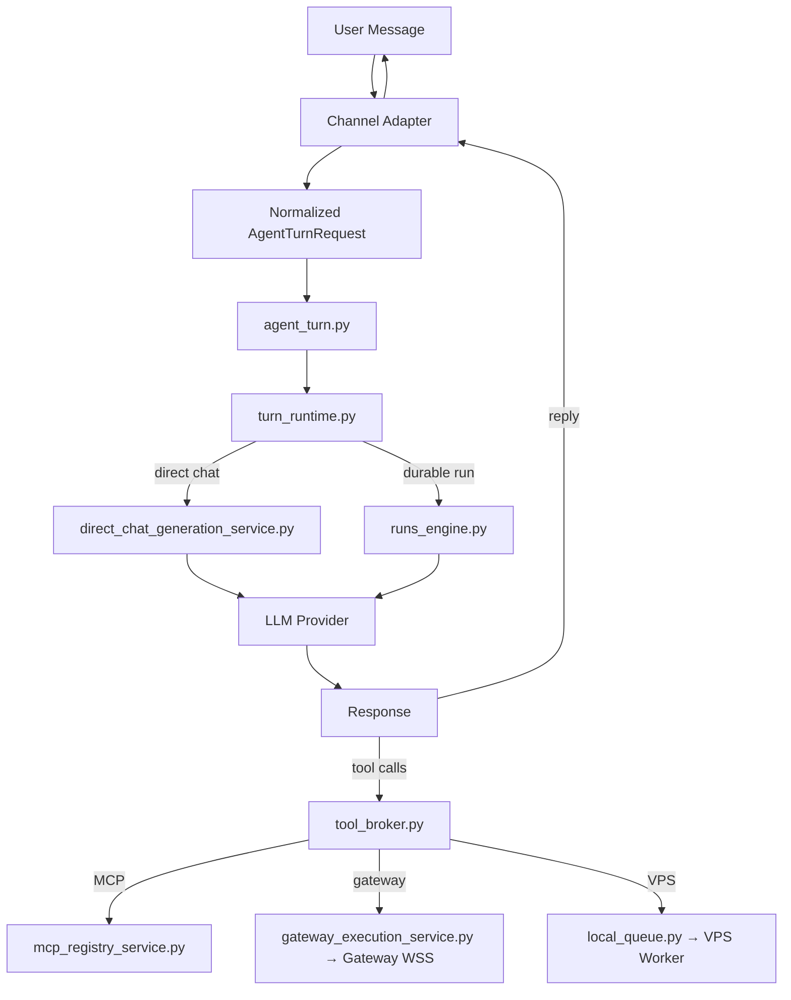

# Empyralis — Complete Platform Map

**Updated:** 2026-07-09  
**Commit:** `04ccc0e8` (post-Phase 8; this refresh also reflects substantial uncommitted work on top — Phase 7B consolidation, the Authority Mandate system, kill switch, and activity/usage attribution — see changelog below)  
**Graph:** 97,296 nodes · 190,019 edges · 4,448 communities · 3,259 files _(fresh graphify run 2026-07-08 — predates the changes in this refresh; treat as directional, not current)_  
**Test baseline:** ~1,319 pre-existing failures — compare failing sets in isolation, not counts  
**Code:** ~275,000 lines Python (server_modules/) + TypeScript (frontend/, gateway/) + Rust (kernel/; supervisor/ archived, see §2.3)  
**For:** Outside engineers and agents — read this cold, understand the entire platform.

> **2026-07-09 refresh — this map was materially stale and had already caused
> wrong briefs.** Corrected in this pass: the create-agent wizard is
> documented as its actual current 4-step flow (Placement → Brain → Channels
> → Connections, auto-named, agent created on step 1), not the old 5-step
> Name-first flow. The Rust Supervisor is documented as **archived by owner
> decision** (moved to `_archive/`, "agents do not control user desktops"),
> not "never compiled" as if still pending. Four new sections were added:
> **Authority Mandate** (§10), **Kill switch** (§11), **Attribution** (§12),
> and **One agent class** (§13) — covering work that existed in the repo but
> had no map entry. Every file reference touched by this pass was checked
> against the live tree, not memory; stale pointers to files deleted in the
> Phase 7B consolidation (`channel_execution_service.py`,
> `transparency_settings_service.py`, `supervisor_client.py`,
> `computer_control.py`, and their dead test files) were removed. Part 9 ("what
> blocks a real user") is rewritten to the true current list — the wizard,
> provider modes, kill switch, attribution, and first-run honesty gaps this
> map used to list as blockers are now solved and moved into "works today."
>
> **Phase 8 changes (2026-07-06):** The legacy workstation shell is gone. Every
> workspace surface now renders **fleet-native** inside `FleetShell` — landing,
> agents, projects, billing, inbox, hardware, settings — on the new
> **floating-panel chrome** (flat `--bg-canvas` with a bordered `--bg-panel`
> content column, Inter 13px). The `WorkspaceSurfacePage` surface router, the
> workstation kernel/shell-frame, and ~40 `workstation-*` panes were deleted (a
> 47-file grep-proven sweep); all legacy segment URLs 307-redirect to their
> fleet homes in `next.config.ts`. New this phase: live Work tab (7s polling +
> unread indicators), first-run onboarding (one action → the create-agent
> wizard; post-signup lands in the wizard), human error states + loading
> skeletons on every surface, and a CSRF fix so an expired session cookie no
> longer blocks re-login. Frontend section (2.5) below reflects this; backend
> sections carry forward from Fix-1 (owned separately).
>
> **Fix-1 changes (2026-07-05):** Provider system expanded to 4 modes + 17 providers. Create-agent wizard fully functional (all 5 steps). Interactive Model tab in agent detail. SQLite fallback for local dev (no DATABASE_URL needed).

---

## Part 1: Architecture Diagram

```
┌──────────────────────────────────────────────────────────────────────────┐
│                    CONSUMER SURFACES (Channels = Pigeons)                 │
│                                                                          │
│  Web Chat │ Telegram │ Discord │ Slack │ WhatsApp │ Signal │ iMessage    │
│  (Next.js)│ Bot API  │Interact │ Events│ Personal │ bridge │ BlueBubbles │
│           │+ GramJS  │  Bot+DM │+OAuth │ (Baileys, gataway )│  CLI   │   API       │
│                                                                          │
│  Every channel normalizes into AgentTurnRequest. No channel holds        │
│  routing logic, policy, or session state.                                │
└────────────────────────────┬─────────────────────────────────────────────┘
                             │  Normalized AgentTurnRequest
                             ▼
┌──────────────────────────────────────────────────────────────────────────┐
│                    CONTROL PLANE (Python/FastAPI :8001)                    │
│                                                                          │
│  server.py ── Composition root (21 routers mounted, 403 lines)           │
│  │                                                                       │
│  ├─ agent_turn.py ── Canonical turn entry (all channels converge here)   │
│  │   └─ turn_runtime.py ── Execution switchboard                         │
│  │       ├─ direct-chat path ── direct_chat_generation_service.py        │
│  │       │   └─ LLM provider → response → tool_broker (if tool calls)    │
│  │       └─ durable-run path ── runs_engine.py → run_service.py          │
│  │                                                                       │
│  ├─ Sage (operator agent) ── sage_agent_runtime_service.py               │
│  ├─ Studio (specialist agents) ── agent_registry_repository.py           │
│  ├─ Memory ── memory_service.py + unified_memory_service.py              │
│  ├─ Governance ── unified_governance_gate.py + runtime_policy.py         │
│  │                                                                       │
│  ├─ Tool Broker ── tool_broker.py                                        │
│  │   ├─ MCP path ── mcp_registry_service.py → external MCP servers       │
│  │   ├─ Gateway path ── gateway_execution_service.py → Gateway WSS       │
│  │   └─ VPS path ── local_queue.py → VPS worker (HTTP poll)              │
│  │                                                                       │
│  ├─ MCP Server (Empyralis AS MCP) ── mcp_server.py (9 tools at /mcp)     │
│  ├─ MCP Auth ── mcp_server_auth.py (per-workspace API keys)             │
│  ├─ OAuth Vault ── vault_store.py + connection_oauth_service.py          │
│  └─ Preflight ── preflight.py (kernel, Postgres, Redis checks)           │
└──────────┬──────────────────────┬──────────────────────┬─────────────────┘
           │ Cloud                │ Gateway (WSS)         │ VPS (HTTP poll)
           ▼                      ▼                       ▼
┌──────────────┐  ┌──────────────────────┐  ┌──────────────────────────┐
│  CLOUD TIER  │  │  AGENT COMPUTER      │  │  SELF-HOSTED NODE        │
│  (no hw)     │  │  (user hardware)     │  │  (user VPS)              │
│              │  │                      │  │                          │
│ • Bot APIs   │  │ empyralis-gateway    │  │ • Command worker          │
│ • Webhooks   │  │ (Node.js, WSS)       │  │ • HTTP poll → claim →    │
│ • OAuth apps │  │   ├─ channels/       │  │   execute → heartbeat    │
│ • Cloud      │  │   ├─ browser/        │  │ • Shell + File ONLY      │
│   Computer   │  │   ├─ supervisor/     │  │                          │
│   (droplet)  │  │   └─ bridges/        │  │                          │
│              │  │                      │  │                          │
│              │  │ empyralis-supervisor │  │                          │
│              │  │ ARCHIVED (owner      │  │                          │
│              │  │ decision 2026-07-04) │  │                          │
│              │  │  desktop control is  │  │                          │
│              │  │  OUT of the product; │  │                          │
│              │  │  code kept in        │  │                          │
│              │  │  _archive/supervisor/│  │                          │
└──────────────┘  └──────────────────────┘  └──────────────────────────┘

              empyralis-runtime-kernel (Rust CLI)
              Policy decision engine — 52 commands
              Reads JSON from stdin → writes {ok, decision, reason} to stdout
```

### Data Flow (Mermaid)



### Provider Architecture — Who Pays for the Brain?

Every agent has a `model_config` dict in its install metadata. Four payment modes
gate which providers are available. This is the single biggest user-facing
decision in the platform.

```
┌─────────────────────────────────────────────────────────────────────┐
│                    MODEL CONFIG (per agent)                         │
│                                                                     │
│  mode: "platform_credits" | "byok_api" | "cli_subscription" | "local" │
│  provider: "deepseek" | "anthropic" | "openai" | ...               │
│  model: "deepseek-chat" | "claude-sonnet-4-6" | ... (optional)     │
└─────────────────────────────────────────────────────────────────────┘

MODE 1: platform_credits (Empyralis pays)
├── DeepSeek ONLY (hard policy gate: PLATFORM_CREDIT_MODEL_ALLOWLIST)
├── Models: deepseek-chat, deepseek-v4-pro
├── No setup — works immediately
└── Billed against workspace credit ledger

MODE 2: byok_api (Customer pays provider directly)
├── 13 providers: Anthropic, OpenAI, DeepSeek, Google Gemini, Groq,
│   OpenRouter, xAI (Grok), Azure OpenAI, AWS Bedrock, Qwen, Mistral,
│   Ollama Cloud, Custom OpenAI-compatible
├── API key stored in workspace vault (vault_store.py)
├── Key never leaves workspace boundary
└── Customer billed by provider directly

MODE 3: cli_subscription (Customer's existing subscription)
├── Claude Code CLI — local Claude Pro subscription via Gateway
├── OpenAI Codex — ChatGPT/Codex subscription via Gateway
├── Gateway invokes local CLI with customer's login
├── Empyralis never touches the subscription token
└── Requires Gateway paired on customer's machine

MODE 4: local (Runs on customer's own hardware)
├── Ollama — local model runtime
├── No data leaves customer's machine
├── Requires Gateway + Ollama installed
└── Zero platform cost
```

**Where each mode is configured:**

| Surface | File | What it does |
|---------|------|--------------|
| Create-agent wizard | `FleetCreateAgentWizard.tsx` | `model_config` defaults to `platform_credits` the moment the agent is created (Step 1, "Placement"); the "Brain" step (Step 2) only PATCHes it if the user picks BYOK or local |
| Agent detail → Model tab | `FleetAgentDetail.tsx` (ModelTab) | Edits model_config post-creation via PATCH |
| Backend validation | `fleet_tools.py` `_VALID_MODEL_MODES` | Rejects invalid modes |
| Provider catalog | `provider_profiles.py` `PROVIDER_CATALOG` | 17 providers with auth modes, models, scopes |
| Platform credit gating | `provider_catalog_service.py` `PLATFORM_CREDIT_MODEL_ALLOWLIST` | Only DeepSeek for platform credits |
| Tier routing | `empyralis_model_tier_routing_service.py` | Maps public tiers → internal provider+model |
| Provider resolution | `provider_catalog_service.py` `resolve_provider_model_selection()` | Validates provider+model+surface+payer |

**Provider catalog (full list):**

| ID | Label | Auth | Platform Credits? |
|----|-------|------|-------------------|
| `deepseek` | DeepSeek | API key | **YES (only one)** |
| `anthropic` | Anthropic | API key / local CLI | No (BYOK) |
| `openai` | OpenAI | API key / OAuth | No (BYOK) |
| `gemini` | Google Gemini | API key / CLI OAuth | No (BYOK) |
| `groq` | Groq | API key | No (BYOK) |
| `openrouter` | OpenRouter | API key | No (BYOK) |
| `xai` | xAI (Grok) | API key | No (BYOK) |
| `azure_openai` | Azure OpenAI | API key | No (BYOK) |
| `bedrock` | AWS Bedrock | Access token | No (BYOK) |
| `qwen` | Qwen | API key | No (BYOK) |
| `mistral` | Mistral | API key | No (BYOK) |
| `ollama_cloud` | Ollama Cloud | API key | No (BYOK) |
| `custom_openai_compatible` | Custom OpenAI-compatible | API key | No (BYOK) |
| `vertex` | Google Vertex AI | Access token | No (BYOK) |
| `claude_code_cli` | Claude Code (Subscription) | Local CLI | No (subscription, hidden) |
| `openai-codex` | OpenAI Codex | OAuth | No (subscription) |
| `ollama` | Ollama | Local | No (local) |

### Key Contracts

1. **One turn engine** — all channels converge on `agent_turn.py`. No parallel turn contracts.
2. **Channels = pigeons** — transport only. Channel logic must not bleed into agent brain or control plane.
3. **Brokered everything** — tools → `tool_broker.py`, secrets → `secrets_broker.py`, runtime → policy-bound.
4. **No fallback** — credits at zero = hard stop. No silent downgrade.
5. **Internalized governance** — no approval UX. Agent internalizes rules. Kernel hard-blocks at execution.
6. **Shell-first tools** — agent uses shell + browser. Minimal bespoke tools. Keep: memory, channel plumbing, OAuth.
7. **WSS reverse tunnel** — Gateway opens outbound WSS to cloud. No inbound holes. Survives NAT/firewalls.
8. **Platform voice ≠ Agent voice** — "Heads up:" prefix for platform. Never "I"/"my" from infrastructure.

### Two MCP Surfaces

Empyralis has a DUAL MCP role:

**1. Empyralis AS MCP CLIENT** — connects TO 30+ SaaS apps (Gmail, GitHub, Slack, Notion, etc.)
- Files: `mcp_registry_service.py`, `connection_oauth_service.py`, `skill_registry.py`
- Flow: OAuth → credential vault → MCP server registration → tool discovery → approval → invocation
- Transport: streamable_http only (no stdio, no SSE)

**2. Empyralis AS MCP SERVER** — external AI clients connect TO Empyralis at `/mcp`
- Files: `mcp_server.py` (9 tools), `mcp_server_auth.py` (per-workspace API keys)
- Auth: Bearer token (`empyralis_mcp_...`) — SHA-256 hashed storage
- 5 read tools (live): list_agents, get_agent_activity, memory_read, memory_list, chat
- 4 write tools (gated behind `EMPYRALIS_MCP_WRITE_ENABLED=true`): create_agent, configure_agent, message_agent, memory_write

---

## Part 2: Complete File Map

### 2.1 Backend — `server_modules/` (~275,000 lines Python, ~190 service files)

This IS the production backend. Everything below lives at `server_modules/`.

#### Composition Root & Core

| File | Lines | Purpose |
|------|-------|---------|
| `server.py` | ~400 | FastAPI app, CORS, 21 router mounts, exception handlers, MCP mount, preflight |
| `mcp_server.py` | 267 | Empyralis AS MCP server — 9 tools at `/mcp` for external AI clients |
| `mcp_server_auth.py` | ~120 | Per-workspace MCP API key creation, SHA-256 hashing, revocation, resolution |
| `preflight.py` | 223 | Startup checks: kernel binary, Postgres (+stage_4b columns), Redis |
| `runtime_config.py` | — | Env, paths, provider resolution |
| `runtime_common.py` | — | Shared utilities, auth middleware |
| `state_paths.py` | — | Runtime state file path resolution |

#### Turn Engine

| File | Lines | Purpose |
|------|-------|---------|
| `agent_turn.py` | — | **Canonical turn entry** — all channels normalize into AgentTurnRequest → here |
| `turn_runtime.py` | — | **Execution switchboard** — direct chat vs durable run dispatch |
| `turn_ingress_service.py` | — | Turn ingress normalization |

#### Sage / Operator Agent

| File | Lines | Purpose |
|------|-------|---------|
| `sage_agent_runtime_service.py` | 3,417 | ⚠️ Sage agent loop — `_COMMUNICATION_SCOPES`, `_CONNECTOR_ROUTE_KEYWORDS`, `_GATEWAY_ROUTE_KEYWORDS` hardcode channel names |
| `sage_command_dispatcher.py` | — | Command dispatcher + error messages (classify_error token leak fixed in T2) |
| `sage_turn_adapter.py` | — | ✅ Unified sage turn execution for all channels |
| `sage_reply_dispatcher.py` | — | ⚠️ Reply dispatch |
| `sage_transparency_service.py` | — | Sage transparency events |
| `sage_daily_operator_service.py` | — | Daily operator tasks |
| `universal_operator.py` | — | Universal operator actions (14 strings fixed in T2) |
| `channel_adapter.py` | — | ✅ Channel normalization — NormalizedSageTurn |
| `error_response_service.py` | — | Error response normalization |

#### Direct Chat Subsystem (~30 files)

| File | Lines | Purpose |
|------|-------|---------|
| `direct_chat_service.py` | — | Direct chat orchestration |
| `direct_chat_generation_service.py` | 2,022 | LLM generation loop (provider-backed) |
| `direct_chat_composition_service.py` | — | Chat composition |
| `direct_chat_response_service.py` | — | Slash command dispatch |
| `direct_chat_provider_service.py` | — | Provider selection/routing |
| `direct_chat_provider_facade_service.py` | — | Provider facade |
| `direct_chat_entry_service.py` | — | Chat entry |
| `direct_chat_entry_policy_service.py` | — | Entry policy |
| `direct_chat_runtime_service.py` | — | Chat runtime |
| `direct_chat_runtime_facade_service.py` | — | Chat runtime facade |
| `direct_chat_runtime_entry_facade_service.py` | — | Runtime entry facade |
| `direct_chat_stream_runtime_service.py` | — | Stream runtime |
| `direct_chat_stream_state_service.py` | — | Stream state |
| `direct_chat_stream_transport_service.py` | — | Stream transport |
| `direct_chat_stream_response_service.py` | — | Stream response |
| `direct_chat_transport_service.py` | — | Chat transport |
| `direct_chat_memory_facade_service.py` | — | Memory facade |
| `direct_chat_handoff_service.py` | — | Handoff logic |
| `direct_chat_handoff_facade_service.py` | — | Handoff facade |
| `direct_chat_operator_binding_service.py` | 2,516 | Operator tool routing bindings |
| `direct_chat_operator_support_service.py` | — | Operator support |
| `direct_chat_callback_facade_service.py` | — | Callback facade |
| `direct_chat_support_binding_service.py` | — | Support binding |
| `direct_chat_metadata_service.py` | — | Metadata |
| `direct_chat_prompt_service.py` | — | Prompt assembly |
| `direct_chat_context_service.py` | — | Context building |
| `direct_chat_intervention_service.py` | — | Intervention builder |
| `direct_chat_availability_service.py` | — | Availability checks |
| `direct_chat_routing_service.py` | — | Routing |
| `direct_chat_hosted_usage_service.py` | — | Hosted usage tracking |
| `direct_chat_tool_catalog_service.py` | — | Tool catalog |

#### Channel System

| File | Lines | Purpose |
|------|-------|---------|
| `agent_channel_router.py` | 2,375 | ⚠️ Channel routing — per-channel handler classes, LOCAL_BRIDGE_PERSONAL_CHANNELS hardcoded |
| `channel_lane_contract_service.py` | — | Canonical channel lane definitions (discord_personal contradiction) |
| `channel_types.py` | — | Channel type definitions |
| `channel_platform_service.py` | — | Channel platform management |
| `channel_blocking_policy_service.py` | — | Channel blocking/safe mode |
| `personal_channel_sage_bridge_service.py` | — | ⚠️ 6 near-identical per-channel wrapper functions |
| `personal_channels_service.py` | 2,270 | Personal channel management |
| `personal_channel_handler_registry.py` | — | Personal channel handler registry |
| `personal_channel_thread_command_service.py` | — | Personal channel thread commands |
| `routes_sage_telegram_hosted.py` | — | ⚠️ Telegram hosted bot routes |
| `routes_personal_channels.py` | — | Personal channel API routes |

**Dead route files** (preserved, not mounted in server.py):
`routes_signal.py`, `routes_imessage.py`, `routes_wechat.py`, `routes_slack.py`, `routes_discovery.py`, `routes_mini_apps.py`

#### Connectors (`server_modules/connectors/`)

| File | Purpose |
|------|---------|
| `slack_connector.py` | Slack — OAuth, webhooks, message handling |
| `discord_connector.py` | ⚠️ Discord — bot REST + personal DM |
| `discord_bot_runtime_service.py` | Discord bot runtime |
| `telegram_ingress_service.py` | ⚠️ Telegram ingress |
| `telegram_connector_services.py` | Telegram connector services |
| `telegram_connector_context_service.py` | Telegram context |
| `telegram_connector_poll_service.py` | Telegram polling |
| `telegram_run_action_service.py` | Telegram run actions |
| `telegram_run_dispatch_service.py` | Telegram run dispatch |
| `telegram_inbound_context_service.py` | Telegram inbound context |
| `whatsapp_ingress_service.py` | ⚠️ WhatsApp ingress |
| `whatsapp_webhook_service.py` | WhatsApp webhook |
| `whatsapp_webhook_bridge_service.py` | WhatsApp webhook bridge |
| `whatsapp_transport_service.py` | WhatsApp transport |
| `whatsapp_autopilot_state_service.py` | WhatsApp autopilot state |
| `whatsapp_run_dispatch_service.py` | WhatsApp run dispatch |
| `github_connector.py` | GitHub — webhooks, issues, PRs |
| `linear_connector.py` | Linear API connector |
| `notion_connector.py` | Notion API connector |
| `dropbox_connector.py` | Dropbox API connector |
| `s3_connector.py` | AWS S3 connector |
| `smtp_connector.py` | SMTP/IMAP email connector |
| `connector_runtime.py` | Connector runtime base |
| `connector_webhook.py` | Connector webhook base |
| `runtime_status_service.py` | Connector runtime status |

#### Autopilot Subsystem (~18 files in `connectors/`)

`autopilot_endpoint_service.py`, `autopilot_runtime_exports.py`, `autopilot_runtime_facade_service.py`, `autopilot_runtime_support_service.py` (⚠️ 7 "I" messages), `autopilot_runtime_service_registry.py`, `autopilot_registry_facade_service.py`, `autopilot_approval_service.py`, `autopilot_skill_service.py`, `autopilot_workflow_setup_service.py`, `autopilot_event_service.py`, `autopilot_event_bridge_service.py`, `autopilot_state_bridge_service.py`, `autopilot_bridge_registry_service.py`, `autopilot_bridge_facade_service.py`, `autopilot_connector_shell_service.py`, `autopilot_channel_support_service.py`, `autopilot_common_support_service.py`, `autopilot_terminal_bridge_service.py`, `autopilot_run_entry_service.py`, `channel_delivery_outbox_service.py`, `channel_workspace_scope_service.py`

#### Gateway / Hardware

| File | Lines | Purpose |
|------|-------|---------|
| `gateway_execution_service.py` | — | Gateway tool dispatch |
| `gateway_protocol_service.py` | 2,254 | Gateway protocol handling (in 3-file import cycle with personal_channels_service) |
| `gateway_health_service.py` | — | Gateway health monitoring |
| `gateway_pairing_service.py` | — | Gateway pairing flow |
| `gateway_approval_service.py` | — | Gateway approval flow |
| `gateway_activity_service.py` | — | Gateway activity tracking |
| `gateway_browser_service.py` | — | Gateway browser execution |
| `gateway_inventory_service.py` | — | Gateway capability inventory |
| `gateway_state_repository.py` | 2,516 | Gateway state persistence |
| `routes_gateway.py` | 3,281 | Gateway REST + WSS routes |
| `hardware_runtime_target_resolver.py` | — | ⚠️ Hardware target resolution (self_hosted_node label bug) |
| `hardware_runtime_session_service.py` | — | Hardware runtime sessions |
| `hardware_action_broker_service.py` | — | Hardware action brokering |
| `hardware_access_policy_service.py` | — | Hardware access policy |
| `hardware_runtime_adapters/cloud_computer_adapter.py` | — | Cloud computer adapter |
| `hardware_runtime_adapters/gateway_adapter.py` | — | Gateway adapter |
| `hardware_runtime_adapters/self_hosted_node_adapter.py` | — | Self-hosted VPS adapter |
| ~~`supervisor_client.py`~~ | — | **Gone** — archived to `_archive/supervisor/` (see §2.3), not present in `server_modules/` |

#### Runtime / Sessions

| File | Lines | Purpose |
|------|-------|---------|
| `runtime_runtime_api.py` | 2,046 | Runtime registration, sessions, claims |
| `runtime_route_registry_service.py` | — | Runtime route registry |
| `runtime_route_registration_service.py` | — | Runtime route registration |
| `runtime_route_bootstrap_service.py` | — | Runtime route bootstrap |
| `runtime_run_entry_service.py` | — | Run entry |
| `runtime_run_query_service.py` | — | Run query |
| `runtime_run_control_service.py` | — | Run control |
| `runtime_run_approval_service.py` | — | Run approval |
| `runtime_run_delegation_service.py` | — | Run delegation |
| `runtime_run_detail_service.py` | — | Run detail |
| `runtime_run_access_service.py` | — | Run access control |
| `runtime_run_resume_service.py` | — | Run resume |
| `runtime_heartbeat_service.py` | — | Runtime heartbeat |
| `runtime_history_service.py` | — | Runtime history |
| `runtime_usage_service.py` | — | Runtime usage tracking |
| `runtime_workspace_service.py` | — | Runtime workspace service |
| `runtime_attachment_service.py` | — | Runtime attachment |
| `runtime_request_service.py` | — | Runtime request handling |
| `runtime_webhook_trigger_service.py` | — | Runtime webhook triggers |
| `runtime_local_execution_approval_service.py` | — | Local execution approval |
| `runtime_policy.py` | 3,885 | Runtime policy enforcement |
| `runtime_state_store.py` | 2,193 | Runtime state store |
| `local_queue.py` | 4,189 | Local queue — claims, heartbeats, dead letters (in 3 import cycles) |
| `machine_lease_service.py` | — | Machine lease management |
| `session_service.py` | — | Session management |
| `session_lifecycle_service.py` | — | Session lifecycle |
| `session_manager/manager.py` | — | Session manager |
| `session_manager/actor_queue.py` | — | Actor queue for sessions |
| `session_manager/observability.py` | — | Session observability |
| `session_manager/runtime_cache.py` | — | Session runtime cache |
| `thread_service.py` | — | Thread management |
| `setup_sessions.py` | — | Setup session management |

#### Runs Engine

| File | Lines | Purpose |
|------|-------|---------|
| `run_service.py` | 6,474 | Run orchestration service |
| `runs_core.py` | — | Runs core |
| `runs_engine.py` | — | Runs engine |
| `runs_execution.py` | 6,046 | Runs execution |
| `runs_history.py` | — | Runs history |
| `run_state_repository.py` | 3,865 | Run state persistence |

#### MCP / OAuth / Connector Bridge

| File | Purpose |
|------|---------|
| `mcp_registry_service.py` | MCP server registry, tool discovery, approval, invocation |
| `connection_oauth_service.py` | OAuth provider configs + `APP_MCP_SERVER_MAP` (30 providers) + `_register_mcp_servers_for_provider()` |
| `connection_catalog_service.py` | Connection catalog |
| `connection_readiness_service.py` | Connection readiness checks |
| `connection_verify_service.py` | Connection verification |
| `routes_connections.py` | Connection REST: `GET /api/connections/mcp-catalog`, MCP key CRUD |
| `connectors_actions.py` | ⚠️ DEPRECATED connector tools (2,521 lines — replaced by MCP, pending removal) |
| `connectors_core.py` | Connector core utilities |
| `connector_manifests.py` | Connector manifest catalog |
| `connector_validators.py` | Connector validation |
| `routes_connectors.py` | Connector REST routes |

#### Memory

| File | Lines | Purpose |
|------|-------|---------|
| `memory_service.py` | 2,701 | Memory/embedding service |
| `unified_memory_service.py` | — | Unified memory across captain + specialists |
| `agent_memory_tools.py` | — | memory_read, memory_write, memory_list tool implementations |

#### Agent Registry

| File | Lines | Purpose |
|------|-------|---------|
| `agent_registry_api.py` | 2,168 | Agent registry REST API |
| `agent_registry_repository.py` | 2,436 | Agent registry persistence (Sage + specialist seeds with display_name) |
| `agent_specialist_repository.py` | — | Specialist agent persistence |
| `specialist_service.py` | — | Specialist agent service |
| `fleet_tools.py` | — | fleet_list_agents, fleet_create_agent, fleet_configure_agent, fleet_get_agent_activity, fleet_message_agent, schedule_task + _parse_when() |

#### Auth / Billing / Quota

| File | Lines | Purpose |
|------|-------|---------|
| `auth.py` | 5,796 | Authentication — users, sessions, API keys, SQLite fallback |
| `db.py` | — | Database connection, pool management, `durable_runtime_required()` |
| `control_plane_repository.py` | 13,049 | **LARGEST FILE** — Postgres: tenants, workspaces, agents, installs |
| `provider_profiles.py` | 4,289 | Provider profile management |
| `secrets_broker.py` | — | Secret/vault access — hosted keys, workspace BYOK |
| `vault_store.py` | — | Encrypted credential vault |
| `billing_service.py` | — | Billing integration (Stripe) |
| `routes_billing.py` | — | Billing API routes |
| `entitlements_service.py` | — | Entitlement and quota enforcement |
| `quota_response_service.py` | — | ⚠️ Quota response messages |
| `quota_policy_service.py` | — | Quota policy |
| `workspace_bootstrap_service.py` | — | New workspace setup, credit grants |

#### Tools / Safety

| File | Purpose |
|------|---------|
| `tool_broker.py` | Tool access gateway |
| `tool_broker_guard_service.py` | Tool brokering safety guards |
| `direct_tool_approval_service.py` | Tool approval workflow |
| `direct_tool_loop_guard_service.py` | Loop detection (3 repeat → abort) |
| `skill_registry.py` | Skill definitions + MCP-to-skill integration (11 strings fixed in T2) |
| `skill_scanner.py` | Skill file scanner |
| `unified_governance_gate.py` | Unified governance gate |
| `hybrid_policy_service.py` | Hybrid cloud/local placement policy |
| `safe_mode_service.py` | Safe mode — degraded operation |
| `execution_sandbox_service.py` | Execution sandbox |
| `external_content_guard.py` | External content safety |

#### Other Services

`activity_ledger_service.py`, `notification_service.py`, `app_registry_api.py`, `app_bridge_service.py`, `acp_bridge_service.py`, `acp_manager.py`, `workflow_service.py`, `workflow_api.py`, `workflow_repository.py`, `agent/action_service.py`, `agent/automation_setup_service.py`, `agent/user_profile_service.py`, `inventory_skill.py`, `personal_context_engine.py`, `shared_operational_board_service.py`, `voice_notification_policy_service.py`, `doctor_report.py`, `health_core.py`, `routes_health.py`, `routes_agents.py`, `api_contract.py`, `logging_config.py`, `config_loader.py`, `cloud_cutover_config.py`, `sqlite_helpers.py`, `attachment_utils.py`, `url_security.py`, `browser_engine.py`, `blackbox_runtime_support.py`, `data_retention_service.py`, `retention_enforcement_job.py`, `platform_analytics_service.py`, `customer_ops_pack.py`

### 2.2 Gateway — `empyralis-gateway/src/` (Node.js/TypeScript)

The Gateway runs on user hardware, opens an outbound WSS tunnel to cloud, and routes capability invocations locally.

| Subsystem | Key Files | Purpose |
|-----------|-----------|---------|
| **Entry** | `index.ts`, `config.ts` | Process lock, subsystem init, WSS client start |
| **Cloud** | `cloud/ws-client.ts` (997 lines), `cloud/heartbeat.ts`, `cloud/heartbeat-payload.ts`, `cloud/reconnect.ts` | WSS connection, heartbeat, exponential-backoff reconnection |
| **Channels** | `channels/telegram/runtime.ts` (825 lines), `channels/whatsapp/runtime.ts` (665 lines), `channels/foundation/` (6 files: credential-redactor, draft-manager, outbound-store, reconnect-utils, typing-keepalive), `channels/local-bridge-runtime.ts` (433 lines), `channels/personal-runtime.ts`, `channels/personal-config-store.ts` | Personal messaging: Telegram (GramJS), WhatsApp (Baileys), Signal/iMessage/WeChat (local HTTP bridge) |
| **Capability router** | `supervisor/capability-router.ts` (directory name is historical — the Rust supervisor executor was removed from it in the 2026-07-04 archival) | Central dispatch hub — current `ExecutorName` type is `browser \| external_agent_proxy \| personal_channel \| shell_sandbox \| llm`. No supervisor executor; `supervisor/client.ts` and `supervisor/signing.ts` now live in `_archive/supervisor/gateway/`, not here. |
| **Browser** | `browser/runtime.ts`, `browser/worker.ts`, `browser/session-store.ts` | Browser automation via Python subprocess |
| **Pairing** | `pairing/device-identity.ts`, `pairing/token-store.ts` | Device UUID + pairing token persistence |
| **Protocol** | `protocol/types.ts`, `protocol/codec.ts` | Wire format `v1alpha2`: frame types, validation, 256KB limit, 32-level nesting limit |
| **Runtime** | `runtime/service-mode.ts`, `runtime/desktop-permissions.ts`, `runtime/runtime-metadata.ts` | OS-level service mode detection, 16 capabilities → 5 permission types |
| **Health** | `health/service-inventory.ts` (590 lines) | Passive inventory: PostgreSQL, Docker, Ollama, Codex CLI, GPU detection |
| **Bridges** | `bridges/signal-cli-bridge.ts` (381 lines), `bridges/bluebubbles-bridge.ts` (422 lines) | Standalone HTTP bridge servers for Signal (signal-cli JSON-RPC) and iMessage (BlueBubbles API) |
| **State** | `state/db.ts`, `state/journal.ts`, `state/outbox.ts`, `state/checkpoints.ts` | JSON-file persistence: atomic writes, corruption detection, NDJSON journal, outbox (at-least-once delivery) |

### 2.3 Supervisor — ARCHIVED BY OWNER DECISION (2026-07-04, Phase U1)

**Not "never compiled" — deliberately disabled and moved.** Per
`_archive/supervisor/README.md`: *"Empyralis agents do NOT control user
desktops. The Gateway STAYS (personal channels + VPS pairing). Desktop
control via supervisor is OUT of the product."* The code was fully
functional (as of commit `44451aa9c`, Phase P3) and is preserved for
auditability, not deleted — an 18-step revival checklist is documented in
that same README if desktop control is ever brought back.

**What moved:** `empyralis-supervisor/` (the whole Rust tree below) →
`_archive/supervisor/empyralis-supervisor/`; `server_modules/supervisor_client.py`
and `server_modules/computer_control.py` → `_archive/supervisor/`;
`empyralis-gateway/src/supervisor/{client,signing}.ts` → `_archive/supervisor/gateway/`.
Their test files (`test_supervisor_client.py`, `test_computer_control.py`)
still exist in `server_modules/tests/` but now fail to collect (import a
module that no longer exists) — dead tests, not a regression to chase.

**Current impact:** `gateway_execution_service.py:57-60` documents this
directly — desktop-control tool calls (`computer__click`, `computer__type`,
`computer__ocr`, `computer__clipboard_read`, `computer__clipboard_write`,
`computer__launch_app`, `computer__focus_window`, `computer__speak`,
`computer__applescript`) "have no executor on the gateway side." The Gateway
itself is unaffected — personal channels (Telegram/WhatsApp via GramJS/Baileys)
and VPS pairing route through it exactly as before; only the supervisor
dispatch branch is gone.

Original file inventory (historical reference — files below now live under
`_archive/supervisor/empyralis-supervisor/src/`, not `empyralis-supervisor/src/`):

HTTP server at `127.0.0.1:7788`. HMAC-SHA256 signature verification on all requests.

| File | Lines | Purpose |
|------|-------|---------|
| `main.rs` | 989 | Axum/Tokio HTTP server. `POST /execute` (policy eval + capability dispatch), `POST /interrupt` (cancellation), `GET /health`. SQLite audit trail. |
| `execution.rs` | 25 | ExecutionContext — request_id, run_id, CancellationToken |
| `capabilities/clipboard.rs` | 27 | Clipboard read/write (arboard crate) |
| `capabilities/control.rs` | 225 | Mouse/keyboard (enigo crate): click, move, type, key combos |
| `capabilities/filesystem.rs` | 497 | Read/write/append/delete with hard-protected roots (~/.ssh, ~/.gnupg), symlink bypass detection |
| `capabilities/launch.rs` | 16 | App/URL launch (opener crate) |
| `capabilities/ocr.rs` | 111 | Tesseract OCR: screen capture → text extraction, text-center finding |
| `capabilities/screenshot.rs` | 150 | Screenshot (xcap + macOS screencapture fallback), region cropping |
| `capabilities/shell.rs` | 549 | Shell execution with hard-blocked patterns: `rm -rf /`, `mkfs.*`, fork bombs, shutdown. Shell injection blocking. Read-only command enforcement. |
| `capabilities/system.rs` | 182 | Desktop notifications, AppleScript execution, text-to-speech |
| `capabilities/windows.rs` | 23 | Window enumeration (xcap): title, app_name, position, size |

### 2.4 Runtime Kernel — `empyralis-runtime-kernel/src/` (Rust CLI)

52 decision commands dispatched from `main.rs`. Reads JSON from stdin → writes `{ok, decision, reason}` to stdout.

| Group | Files | Purpose |
|-------|-------|---------|
| **Policy** | `policy.rs` (492), `presets.rs` (205), `risk.rs`, `authorization.rs`, `approvals.rs`, `safe_mode.rs` | Policy evaluation with 7 autonomy modes (yolo/cautious/read_only/safe_autopilot/trusted_workstation/ask_every_time/deny_all), 3 presets, capability allowlists/blocklists |
| **Execution** | `execution_plan.rs`, `execution_runtime.rs`, `execution_outcome.rs`, `execution_authorization.rs`, `sandbox.rs`, `sandbox_execution.rs` | Execution planning, Docker sandbox config, outcome processing |
| **Gateway** | `gateway.rs`, `gateway_action.rs`, `gateway_frame.rs`, `gateway_service.rs`, `gateway_state.rs`, `heartbeat.rs`, `outbox_delivery.rs` | Gateway frame validation, heartbeat evaluation, outbox delivery authorization |
| **Runs** | `runs.rs`, `run_api.rs`, `run_approval.rs`, `run_preparation.rs`, `run_record.rs`, `run_routing.rs`, `run_service.rs`, `run_triggers.rs` | Run lifecycle (max 3 attempts, 1000-cent budget, 600s runtime) |
| **Deployed** | `deployed_agent.rs`, `deployed_readiness.rs`, `deployed_data.rs`, `deployed_virtual_runtime.rs` + service variants | Agent deployment authorization |
| **Infra** | `control_plane.rs`, `session.rs`, `platform_orchestration.rs`, `virtual_computer.rs`, `lease.rs`, `queue.rs`, `scheduler.rs`, `state.rs` | Control plane decisions, session bounds (20/80/200 turns, 4h/24h/168h age) |

### 2.5 Frontend — `frontend/`

#### Pages (`frontend/app/`)

| File | Route | Purpose |
|------|-------|---------|
| `layout.tsx` | `/` | Root layout — font, metadata, theme bootstrap |
| `page.tsx` | `/` | Landing page → redirects |
| `login/page.tsx` | `/login` | Login |
| `signup/page.tsx` | `/signup` | Signup |
| `auth/complete/page.tsx` | `/auth/complete` | OAuth callback |
| `onboarding/page.tsx` | `/onboarding` | Onboarding wizard |
| `(account)/layout.tsx` | `/w/*` | Auth gate layout |
| `(account)/w/[workspaceId]/page.tsx` | `/w/[workspaceId]` | Workspace landing → **Fleet Home** (`FleetHome`) |
| `(account)/w/[workspaceId]/layout.tsx` | `/w/[id]/*` | Bootstraps the workspace, mounts `FleetShell` (shellSlot now `null` — no workstation shell) |
| `(account)/w/[workspaceId]/agents/page.tsx` | `/w/[id]/agents` | Agent list + "New agent" wizard host (honors `?new=1`) |
| `(account)/w/[workspaceId]/projects/page.tsx` | `/w/[id]/projects` | Projects list |
| `(account)/w/[workspaceId]/projects/[projectId]/…` | `/w/[id]/projects/[pid]/agents/[aid]/[tab]` | Project detail → routed, deep-linkable agent detail |
| `(account)/w/[workspaceId]/billing/page.tsx` | `/w/[id]/billing` | Usage/cost by project → agent |
| `(account)/w/[workspaceId]/inbox/page.tsx` | `/w/[id]/inbox` | Workspace activity + escalations feed (fleet-native, Phase 8) |
| `(account)/w/[workspaceId]/hardware/page.tsx` | `/w/[id]/hardware` | Paired computers + `GatewayPairPanel` (fleet-native, Phase 8) |
| `(account)/w/[workspaceId]/settings/page.tsx` | `/w/[id]/settings` | MCP API keys + billing link (fleet-native, Phase 8) |
| `(account)/w/[workspaceId]/fleet/page.tsx` | `/w/[id]/fleet` | Alias of Fleet Home (redirects to `/agents`) |
| `api/[...path]/route.ts` | `/api/*` | **Catch-all proxy** — forwards GET/POST/PATCH/DELETE to backend |
| `api/w/[workspaceId]/fleet/agents/route.ts` | `GET/POST /api/w/[id]/fleet/agents` | Fleet agent list + create proxy |
| `api/w/[workspaceId]/fleet/agent-activity/route.ts` | `GET /api/w/[id]/fleet/agent-activity` | Agent activity proxy |

#### Fleet UI (`frontend/lib/workspace/fleet/`) — Post-Fix-1

As of **Phase 8 the fleet surface is the _only_ workspace UI** — the legacy
workstation shell was deleted. `FleetShell` → `FleetShellDecider` →
`FleetContentFrame` renders every route directly inside a floating panel; the
old `shellSlot` fall-through is now `null` (see §2.5 "Legacy shell — removed").
Fleet components own their own data (no `useWorkspaceBoundary()` context).

| File | Purpose |
|------|---------|
| `FleetShell.tsx` / `FleetShellDecider.tsx` / `FleetContentFrame.tsx` | Themed root (canvas), segment router, and bordered content panel + breadcrumbs. |
| `PrimaryRail.tsx` | Persistent left rail (Inbox, Projects, Agents, Hardware, Billing, Settings) with keyboard chords. |
| `FleetHome.tsx` | Agent grid + status strip + "New agent" button. Opens wizard. |
| `FleetAgentDetail.tsx` | **Routed, deep-linkable** agent detail (not a modal) — `/projects/[pid]/agents/[aid]/[tab]`. 8 tabs (`TABS`, `FleetAgentDetail.tsx:54-63`): Overview, Work, Channels, Connectors, **Tools**, Hardware, Model (editable), Memory. Exports `ChannelsTab` for wizard reuse. Overview hosts `AgentTitle` (inline click-to-edit rename, `:497-588`) and `PersonaEditor` (instructions, `:593-639`) — the only places those fields are set post-creation. |
| `tabs/WorkTab.tsx` | End-customer conversations, split-view. **Live** — 7s polling of the list + open transcript, unread dots, "{n} new" count (Phase 8 Part A). |
| `first-agent-empty.tsx` | Shared first-run empty state + create-agent wizard (`FirstAgentEmpty` / `CreateFirstAgentEmpty`) used by Agents/Projects/Inbox (Phase 8 Part B). |
| `fleet-states.tsx` | Shared `FleetListSkeleton` + `FleetSurfaceError` — human error states + loading skeletons on every list/tab (Phase 8 Part C5). |
| `FleetCreateAgentWizard.tsx` | **v2, 4-step wizard** (own docstring, `:92-100`): Placement → Brain → Channels → Connections. Name/Project/Capability preset are no longer steps — sane defaults, editable later. Agent is created on Step 1's commit (`submitPlacement()`, `:182-217`); later steps are incremental PATCHes. Closing early = real agent, not lost work. |
| `FleetCommandPalette.tsx` | Keyboard-driven command palette for switching agent tabs. |
| `fleet-data.ts` | React hooks (each exposes `{ data, loading, error }` where relevant): `useFleetAgents`, `useFleetProjects`, `useFleetAgentActivity`, `useFleetAgentChannels`, `useFleetAgentConnectors`, `useFleetAgentTools`, `useWorkspaceActivity`, `useWorkspaceStatusStrip`. |
| `fleet-presentation.ts` | Agent summary projection, status/placement derivation, tint colors. |
| `fleet-preferences.ts` | Theme toggle — reads account-wide `globalTheme`, no separate fleet localStorage key. |
| `fleet-icons.ts` | Channel + connector icon registry (maps backend IDs to icon assets). |
| `fleet-provider-constants.ts` | **Shared provider catalog** — 4 modes, 17 providers, used by both wizard and Model tab. |
| `fleet-theme.css` | Fleet CSS: the **floating-panel chrome** (`--bg-canvas`/`--bg-panel`, Inter 13px), cards, grid, lists, wizard, work split-view + unread dots, empty/error/skeleton states, rail. |

#### Agent Detail — 7 Tabs (routed, deep-linkable: `/projects/[pid]/agents/[aid]/[tab]`)

| Tab | Data Source | Notes |
|-----|-------------|-------|
| **Overview** | `useFleetAgentActivity` → `GET /fleet/agent-activity` | Status, placement, role, recent activity feed |
| **Work** | `GET /api/threads?workspace_id=...&agent_id=...` (+ transcript) | End-customer conversations, split-view. **Live** — 7s polling + unread dots (Phase C switched this off the deployed-agents conversations endpoint onto fleet's own thread store) |
| **Channels** | `GET /fleet/agent-channels` | 7-platform grid. Telegram: hosted / BYO token / personal-via-Gateway. Slack/Discord: OAuth. WhatsApp/Signal/iMessage/WeChat: Gateway pair panel. Exports `ChannelsTab` for wizard reuse |
| **Connectors** | `GET /fleet/agent-connectors` | MCP/OAuth connector grid with inline credential setup |
| **Hardware** | agent `hardware_access` + gateway registrations | Cloud (default) vs a paired Gateway computer |
| **Model** | agent `model_config` + `PATCH /fleet/agents/{id}` | **Interactive** — 4-mode selector (platform credits / BYOK / subscription / local), provider dropdown, API key, Save |
| **Memory** | `GET /api/sage-context-files?agent_id=` | Split-pane MD file browser, editable + Save |

#### Wizard — 4 Steps (v2, `FleetCreateAgentWizard.tsx`)

`STEP_LABELS` (`FleetCreateAgentWizard.tsx:29`): `["Placement", "Brain", "Channels", "Connections"]`.
Name, project, and capability preset are no longer steps — they're sane
defaults (auto-generated name, `"standard"` preset), editable later from the
Overview tab. Every field below that isn't touched by a step is still set
automatically at creation (see Part 13 for the full breakdown of what's
seeded vs. what needs a later PATCH).

| Step | What happens | Persisted via |
|------|-------------|---------------|
| 1. Placement | Cloud (default) / self-hosted VPS / paired-Gateway computer | `POST /fleet/agents` — **agent is created here**, on first commit (`submitPlacement()`, `:182-217`, guarded so a later re-visit only PATCHes); immediately followed by `PATCH /fleet/agents/{id}` for `hardware_access`/`preferred_gateway_id` |
| 2. Brain | Who pays for the model (`platform_credits` default / BYOK / local) + which model | `PATCH /fleet/agents/{id}` — `model_config`, only sent for BYOK/local (platform_credits needs no patch — it's already the default) |
| 3. Channels | Optional — same `ChannelsTab` component as the agent detail page | Inline via `ChannelsTab`; button reads "Skip for now" if nothing's connected |
| 4. Connections | Optional — MCP/OAuth connector picker (`ConnectorPicker`) | Inline; explicitly "skip and add them later" |
| Finish | Closes wizard, opens agent detail | Agent already exists and is usable — closing at any step keeps a real, working agent, not a discarded draft |

**Auto-naming:** the wizard sends no `name`; the backend (`fleet_create_agent`,
`fleet_tools.py:1189-1203`) assigns one from a 50-name curated pool
(`agent_name_pool.py` — `NAME_POOL`, `assign_agent_name()`; "Sage" reserved
for the operator), collision-checked against every existing label in the
workspace including the master agent. **Inline rename** lives in the
Overview tab: `AgentTitle` (`FleetAgentDetail.tsx:497-588`) is a click-to-edit
control that PATCHes `display_name` directly — the only place an agent is
renamed post-creation.

#### Theme System

Single `data-theme` attribute on `<html>` and `<body>`. One source of truth:

| Layer | File | Role |
|-------|------|------|
| Design tokens | `shared/design-system/tokens.ts` | `DESIGN_SYSTEM_THEME_ATTRIBUTE = 'data-theme'` |
| Shared colors | `frontend/lib/ui/theme-tokens.css` | CSS custom properties consumed by all surfaces |
| Legacy shell | `frontend/lib/ui/chrome.css` | Consumes tokens via `var(--bg-page)` etc. |
| Fleet shell | `frontend/lib/workspace/fleet/fleet-theme.css` | Consumes same tokens |
| Preference source | `empyralis.account-shell.v2` localStorage → `globalTheme` | Account-wide, stored by `AccountShellProvider` |

#### Legacy workstation shell — **REMOVED (Phase 8)**

The workstation shell that used to render workspace surfaces is gone. A
grep-proven 47-file sweep deleted `WorkspaceSurfacePage.tsx`,
`workstation-kernel-shell.tsx`, `workstation-shell-frame.tsx`,
`desktop-startup-screen.tsx`, `AccountTenantSwitcher.tsx`, `WorkspaceHomeRedirect.tsx`,
and ~40 `workstation-*` surface panes (activity, artifacts, chat, deployed-agents,
sage-heartbeat/connectors/profile/tools, notifications, runs, settings,
studio-integrations, gateway-operator, hardware, billing, platform-analytics,
titlebar, hosted-mini-apps, discovery-pane, and their helpers). `layout.tsx`
passes `shellSlot={null}`; every legacy segment URL 307-redirects to its fleet
home in `next.config.ts`.

**What still lives in `frontend/lib/workspace/`** (had live consumers outside the
shell, so kept): `workspace-boundary.tsx` (16 importers), `workspace-shell.ts`,
`server-workspace-bootstrap.ts`, `workspace-setup-form.tsx`,
`workspace-channel-pairing-surface.tsx`, `hosted-mini-app-surface.tsx`,
`cloud-vps-setup-panel.tsx`, the `sage-chat/` stack + `workstation-chat-pane-hooks/-model`,
`workstation-split-workbench.tsx`, `workstation-surface-primitives.tsx`,
`workstation-stream-manager.ts`, `workstation-client.ts`. (`application-surface-tabs.ts`
is a pre-existing orphan, unrelated to the sweep — left for separate cleanup.)

### 2.6 `shared/` (Cross-Project Contracts)

| File | Purpose |
|------|---------|
| `nav-manifest.ts` | Canonical navigation destinations |
| `mini-app-sdk.js` | Mini-app SDK |
| `design-system/tokens.ts` | Shared design tokens |
| `api-contract/index.ts` | API type contracts |
| `api-contract/client.ts` | API client |
| `api-contract/model-tier-contract.ts` | Model tier definitions |

### 2.7 `legacy/` (v1 Reference Snapshot)

Broad snapshot of the old repo. Contains copies of: `frontend/`, `server_modules/`, `empyralis-gateway/`, `empyralis-supervisor/`, `empyralis-runtime-kernel/`, `cloud-session-manager/`, `python_engine/`, `scripts/`, `docs/`, `references/`. Most subdirectories contain only build artifacts (node_modules, target, venv). The `frontend/` and `server_modules/` copies have real source code — v1 reference implementations. Not yet pruned to clean backend+frontend split per target architecture.

### 2.8 `server/` — DOES NOT EXIST

The v2 target backend directory (`server/`) has NOT been created. The Linear PLATFORM OVERVIEW (2026-07-01) declares `server/` as THE future backend with: `agent/`, `tools/`, `oauth/`, `memory/`, `mcp/`, `vault/`, `channels/` — one file per concern. **Zero files exist at that path.** The consolidation hasn't started. All production backend logic is in `server_modules/`.

### 2.9 Config & Deploy Files

| File | Purpose |
|------|---------|
| `server.py` | FastAPI composition root (21 routers, MCP mount) |
| `mcp.json` | MCP client configuration for Empyralis connecting TO external MCP servers |
| `pytest.ini` | Pytest config: `blackbox_db` (needs Postgres), `kernel` (needs Rust binary) markers |
| `Dockerfile.*` | Container builds |
| `render.yaml` | Render.com deploy config |
| `graphify-out/graph.json` | AST knowledge graph (40MB, 28,619 nodes) |
| `graphify-out/GRAPH_REPORT.md` | Human-readable graph analysis with community reports |

---

## Part 3: Subsystem Connection Map

### 3.1 Entry Points — What Kicks Off a Turn?

Every inbound message enters through one of these files:

| Entry Point | Transport | File | Handler |
|-------------|-----------|------|---------|
| Telegram Bot webhook | HTTPS POST | `routes_sage_telegram_hosted.py` | Bot API → `sage_turn_adapter.py` → `agent_turn.py` |
| Telegram Personal | Gateway WSS | `gateway_protocol_service.py` | GramJS → Gateway → WSS → `gateway_execution_service.py` → `agent_turn.py` |
| Discord Bot | HTTPS Interactions | `connectors/discord_connector.py` | Discord HTTP → `sage_turn_adapter.py` → `agent_turn.py` |
| Discord Personal | Gateway WSS | `gateway_protocol_service.py` | Bot token via Gateway → `agent_turn.py` |
| Slack Events | HTTPS webhook | `connectors/slack_connector.py` | Slack API → `sage_turn_adapter.py` → `agent_turn.py` |
| WhatsApp Business | Twilio webhook | `connectors/whatsapp_webhook_service.py` | Twilio → `sage_turn_adapter.py` → `agent_turn.py` (BLOCKED by Meta ban) |
| WhatsApp Personal | Gateway WSS | `gateway_protocol_service.py` | Baileys → Gateway → WSS → `agent_turn.py` |
| Web Chat | HTTP POST | `routes_connectors.py` or chat API | Web → `direct_chat_service.py` |
| Direct API call | HTTP POST | `server.py` chat route | `direct_chat_entry_service.py` → `direct_chat_service.py` |
| Signal/iMessage/WeChat | local bridge → Gateway WSS | `gateway_protocol_service.py` | Bridge HTTP → Gateway → WSS (WIRED, untested) |
| MCP inbound | `/mcp` Streamable HTTP | `mcp_server.py` | External AI client → `empyralis_chat()` → direct chat path |

### 3.2 The Turn Engine

```
agent_turn.py  ←── All channels converge here
    │
    ▼
turn_runtime.py  ←── Execution switchboard
    │
    ├── direct-chat path (synchronous, in-process):
    │   direct_chat_service.py
    │     → direct_chat_generation_service.py  (LLM call)
    │       → direct_chat_provider_service.py  (provider selection)
    │       → direct_chat_prompt_service.py    (prompt assembly)
    │       → direct_chat_context_service.py   (context building)
    │       → direct_chat_tool_catalog_service.py  (available tools)
    │     → direct_chat_response_service.py    (response parsing)
    │     → direct_chat_composition_service.py (reply composition)
    │     → direct_chat_memory_facade_service.py   (memory hooks)
    │     → direct_chat_handoff_service.py     (agent-to-agent handoff)
    │
    └── durable-run path (async, persistent):
        runs_engine.py
          → run_service.py  (6,474 lines — orchestration)
          → runs_execution.py  (6,046 lines — execution)
          → runtime_policy.py  (3,885 lines — policy enforcement)
          → local_queue.py  (4,189 lines — claims, heartbeats)
          → runtime_run_control_service.py  (run lifecycle)
          → runs_history.py  (persistence)
```

### 3.3 Tool Dispatch

When the LLM responds with a tool call:

```
LLM response: "call tool X with args {...}"
    │
    ▼
tool_broker.py  ←── Tool access gateway
    │
    ├── MCP tools:
    │   mcp_registry_service.py
    │     → invoke_workspace_mcp_skill_async()
    │     → streamable_http → external MCP server
    │     → return result
    │
    ├── Gateway tools (shell, browser, channels):
    │   gateway_execution_service.py
    │     → gateway_protocol_service.py
    │     → WSS → Gateway capability-router.ts
    │       → supervisor client (Rust daemon) OR
    │       → browser worker (Python subprocess) OR
    │       → personal channel runtime (GramJS/Baileys)
    │     → return result
    │
    ├── VPS tools:
    │   local_queue.py
    │     → enqueue task → VPS worker polls → claims → executes
    │     → HTTP heartbeat → result returned
    │
    └── Fleet tools (agent management):
        fleet_tools.py
          → fleet_list_agents, fleet_create_agent, fleet_configure_agent, etc.
          → agent_registry_repository.py
```

### 3.4 Channel Response

When the agent produces a reply:

```
Agent output (text or tool result)
    │
    ▼
sage_reply_dispatcher.py  ←── Reply dispatch
    │
    ├── Cloud channels (Telegram Bot, Discord Bot, Slack):
    │   channel_adapter.py → channel-specific delivery
    │     → Telegram: Bot API sendMessage
    │     → Discord: Interaction response / REST API
    │     → Slack: chat.postMessage
    │
    ├── Gateway channels (Telegram Personal, WhatsApp Personal, etc.):
    │   gateway_execution_service.py
    │     → gateway_protocol_service.py
    │     → WSS → Gateway → channel runtime → send message
    │
    └── Web Chat:
        direct_chat_transport_service.py → SSE stream or HTTP response
```

### 3.5 OAuth → MCP Connector Flow

```
User clicks "Connect Gmail"
    │
    ▼
connection_oauth_service.py
    → GET /api/connections/oauth/{provider}/authorize
    → Redirect to Google OAuth consent screen
    → User approves
    → Google redirects to OAuth callback
    │
    ▼
connection_oauth_service.py: complete_oauth_callback()
    → Exchange code for tokens
    → Store tokens in vault_store.py (encrypted)
    │
    ▼
_register_mcp_servers_for_provider()  [Phase U]
    → Look up provider in APP_MCP_SERVER_MAP
    → For each MCP endpoint:
        mcp_registry_service.py: upsert_workspace_mcp_server_async()
    → MCP server registered in workspace
    │
    ▼
mcp_registry_service.py: discover_tools()
    → Connect to MCP endpoint (streamable_http)
    → Call list_tools()
    → Store discovered tools (approved: false by default)
    │
    ▼
User approves tools → skill_registry.py dispatches mcp_tool → invocation
```

### 3.6 Memory Flow

```
Agent writes memory:
    agent_memory_tools.py: memory_write(key, value)
      → memory_service.py
      → unified_memory_service.py
      → Three-tier scoping:
          1. config — agent configuration, prompts, rules
          2. outputs — generated content, decisions, results
          3. private — user-specific data, credentials

Agent reads memory:
    agent_memory_tools.py: memory_read(key)
      → memory_service.py
      → unified_memory_service.py
      → Returns value scoped to workspace + agent

Memory list:
    agent_memory_tools.py: memory_list()
      → Returns all keys visible to this agent in this workspace
```

### 3.7 Gateway Connection Lifecycle

```
1. User installs Gateway binary
2. Gateway: pair → POST /gateway/registrations (pairing token)
3. Cloud: returns gateway_id + session token
4. Gateway: WSS connect to cloud (outbound, TLS)
5. Gateway: send heartbeat with capability inventory
   → health/service-inventory.ts: probes PG, Docker, Ollama, Codex, GPU
6. Cloud: agent turn arrives with tool call
7. Cloud → Gateway: WSS tool.invoke frame
8. Gateway → capability-router.ts: dispatch to executor
   → browser / external-agent-proxy / personal-channels / supervisor
9. Gateway → Cloud: WSS tool.result frame
10. On disconnect: exponential backoff reconnect with outbox replay
```

### 3.8 VPS Worker Lifecycle

```
1. User installs worker on VPS
2. Worker: HTTP poll → GET /runtime/queue/claim?worker_id=X
3. Cloud: local_queue.py → find pending task → return claim
4. Worker: execute → shell command or file operation
5. Worker: HTTP heartbeat → POST /runtime/queue/heartbeat
6. Worker: HTTP result → POST /runtime/queue/result
7. Cloud: local_queue.py → mark complete → return result to waiting turn
8. If heartbeat missed: task returned to queue (dead letter after N retries)
```

---

## Part 4: God Objects and Fragility Points

### 4.1 God Objects — Top 10 by Edge Count

From `graphify-out/GRAPH_REPORT.md` (2026-07-08, fresh run):

| Rank | Node | Edges | What Breaks If It Changes |
|------|------|-------|---------------------------|
| 1 | `Communities` | 763 | Graph structure — metadata node |
| 2 | `RunStartRequest` | 175 | All run execution — turn start, session creation, VPS claim |
| 3 | `RunServiceTests` | 143 | Test suite for the second-largest service file (6,474 lines) |
| 4 | `InMemoryVirtualComputerRuntime` | 132 | All virtual computer tests and simulation |
| 5 | `enforce_workspace_access()` | 124 | Every API route — auth wall across the entire platform |
| 6 | `_scoped_connection()` | 118 | Every Postgres query through the control plane |
| 7 | `runtime_state_store_decision_command()` | 114 | All state persistence authorization |
| 8 | `AgentManifest` | 110 | Every agent definition, every registry read, every specialist |
| 9 | `_token()` | 102 | Auth token resolution — every request |
| 10 | `AgentTurnRequest` | 96 | **NEW** — canonical turn contract, all channels converge here |

**Largest files (lines):**

| File | Lines | Risk |
|------|-------|------|
| `control_plane_repository.py` | 13,049 | **God object** — tenants, workspaces, agents, installs, migrations all in one file |
| `run_service.py` | 6,474 | Run orchestration monolith |
| `runs_execution.py` | 6,046 | Execution monolith |
| `deployed_agent_service.py` | 6,037 | Deployment monolith |
| `auth.py` | 5,796 | Auth + session + API keys + SQLite in one file |

### 4.2 Import Cycles — All 19

From the graphify report (2026-07-08):

**1-file self-cycles (4):**
- `_archive/supervisor/empyralis-supervisor/src/capabilities/clipboard.rs` → self
- `legacy/frontend/shared/nav-manifest.ts` → self
- `scripts/orion_terminal/wizard/engine.py` → self
- `shared/nav-manifest.ts` → self

**3-file cycles (13):**
1. `gateway_execution_service.py → gateway_protocol_service.py → personal_channels_service.py → gateway_execution_service.py`
2. `conversation_memory_policy.py → memory_service.py → memory_summary_service.py → conversation_memory_policy.py`
3. `conversation_memory_policy.py → memory_service.py → workspace_context_memory_adapter.py → conversation_memory_policy.py`
4. `memory_service.py → workspace_context_memory_adapter.py → unified_memory_service.py → memory_service.py`
5. `local_queue.py → run_service.py → runtime_policy.py → local_queue.py`
6. `local_queue.py → runtime_runs_api.py → runtime_policy.py → local_queue.py`
7. `local_queue.py → runtime_runs_api.py → runtime_route_registration_service.py → local_queue.py`
8. `direct_chat_tool_catalog_service.py → skills_service.py → no_provider_service.py → direct_chat_tool_catalog_service.py`
9. `policy_service.py → skills_service.py → runs_execution.py → policy_service.py`
10. `runtime_config.py → setup_sessions.py → shared.py → runtime_config.py`
11. `runtime_common.py → runtime_config.py → setup_sessions.py → runtime_common.py`
12. `connector_validators.py → connectors/discord_connector.py → runtime_config.py → connector_validators.py`
13. `local_queue.py → run_service.py → runtime_attachment_service.py → local_queue.py`

**3-file cycles — new since Fix-1 (1):**
14. `agent_memory_tree_service.py → memory_service.py → workspace_context_memory_adapter.py → agent_memory_tree_service.py`

**3-file cycles — resolved since Fix-1 (1):**
- ~~`policy_service.py → skills_service.py → runtime_config.py`~~ — no longer present

**4-file cycles (2):**
15. `scripts/orion_terminal/__init__.py → app.py → flows.py → flows_shared.py → __init__.py`
16. `local_queue.py → run_service.py → policy_service.py → runtime_policy.py → local_queue.py` ⚠️ **NEW**

**4-file cycles — resolved since Fix-1 (1):**
- ~~`auth.py → direct_tool_config_service.py → skills_service.py → gateway_protocol_service.py`~~ — no longer present

`local_queue.py` is now in **5 cycles** (was 4) — still the most entangled file. `memory_service.py` appears in 4 cycles (was 3, gained `agent_memory_tree_service.py`).

### 4.3 Isolated Nodes — 2,804 with ≤1 Connection

The graph has 2,804 nodes with ≤1 connection. These are candidates for dead code, but many are dynamically called (test functions, route handlers registered via decorators). **Do not blindly delete** — each must be audited for dynamic dispatch.

### 4.4 Low-Cohesion Communities (2)

| Community | Cohesion | Nodes | Files |
|-----------|----------|-------|-------|
| Community 1 — "Agent Settings UI" | 0.02 | 251 | Frontend components: DataBadge, FormReadout, FormSelect, ListDetailPanel, SkeletonBlock, ChatMessage, AgentActionCapabilitySections |
| Community 2 — "Run Service Management" | 0.02 | 176 | activate_live_run, approval_resolution_fingerprint, begin_run_pending_approval, assert_workflow_turn_depth_allowed |

Both should be split. Community 1 is a catch-all for UI components that don't really relate. Community 2 bundles run lifecycle functions with approval and workflow functions that have weak connections.

### 4.5 Inferred Edges — 1,552 at 0.62 Avg Confidence

1,552 edges are inferred (not extracted from AST). At 0.62 average confidence, a significant number may be wrong. Key risk: inferred edges involving god objects (`enforce_workspace_access`, `_scoped_connection`) could mislead navigation.

### 4.6 Thin Communities — 989 of 4,448

989 communities have too few nodes or edges to be meaningful — they exist as isolated clusters in the graph. They are omitted from the report entirely.

---

## Part 5: Channel System — Truth Table

### 5.1 Personal Channels (require Agent Computer Gateway)

| Channel | Transport | Status | Session Owner | Routes Through Sage? | Requires Hardware? | Files |
|---------|-----------|--------|---------------|---------------------|--------------------|-------|
| `telegram_personal` | GramJS via Gateway WSS | **PROVEN** | `paired_gateway` | yes | yes | `gateway/channels/telegram/runtime.ts` (825 lines), `personal_channel_sage_bridge_service.py` |
| `whatsapp_personal` | Baileys via Gateway WSS | **PROVEN** | `paired_gateway` | yes | yes | `gateway/channels/whatsapp/runtime.ts` (665 lines) |
| `discord_personal` | discord.py bot token via Gateway | **WIRED** | `cloud_connector` ⚠️ | yes | no ⚠️ | `connectors/discord_connector.py` |
| `signal_personal` | signal-cli bridge → Gateway WSS | **WIRED** | `paired_gateway` | partial | yes | `gateway/bridges/signal-cli-bridge.ts` (381 lines), `routes_signal.py` (DEAD) |
| `imessage_personal` | BlueBubbles bridge → Gateway WSS | **WIRED** | `paired_gateway` | partial | yes (Mac) | `gateway/bridges/bluebubbles-bridge.ts` (422 lines), `routes_imessage.py` (DEAD) |
| `wechat_personal` | WeChat bridge → Gateway WSS | **PLANNED** | `paired_gateway` | no | yes | `routes_wechat.py` (DEAD) |

### 5.2 Business Channels (cloud-only, no hardware)

| Channel | Transport | Status | Routes Through Sage? | Files |
|---------|-----------|--------|---------------------|-------|
| `telegram_bot` | Bot API (webhook + polling) | **PROVEN** | yes | `routes_sage_telegram_hosted.py`, `connectors/telegram_ingress_service.py` |
| `discord_bot` | Discord HTTP Interactions | **PROVEN** | yes | `connectors/discord_connector.py`, `connectors/discord_bot_runtime_service.py` |
| `slack` | Slack Events API + OAuth | **PROVEN** | yes | `connectors/slack_connector.py` |
| `email_gmail` | Gmail API (OAuth) | **PARTIAL** | partial | `connectors_actions.py` (DEPRECATED), MCP bridge |
| `email_smtp` | SMTP/IMAP | **PARTIAL** | partial | `connectors/smtp_connector.py` |
| `whatsapp_business` | Twilio API | **BLOCKED** (nuance below) | — | Meta banned general-purpose AI assistants Jan 2026; task-specific bots (support, bookings, notifications) remain allowed |
| `apple_messages_business` | MSP API | **PLANNED** | — | Needs Apple approval |
| `web_chat` | WebSocket widget | **PLANNED** | — | Not implemented |
| `teams` | Teams Bot Framework | **PLANNED** | — | Not implemented |
| `matrix` | Matrix CS API | **PLANNED** | — | Not implemented |

### 5.3 Work System Connectors (cloud-only)

| Connector | Transport | Status |
|-----------|-----------|--------|
| `github` | GitHub API webhooks | **PROVEN** |
| `linear` | Linear API | **PROVEN** |
| `notion` | Notion API | **PROVEN** |
| `dropbox` | Dropbox API | **PROVEN** |
| `s3` | AWS SDK | **PROVEN** |
| `smtp` | SMTP/IMAP | **PROVEN** |
| `wechat_work` | WeChat Work webhook | **PROVEN** |
| `instagram_business` | Facebook Graph API | **PROVEN** |
| `microsoft_365` | Microsoft Graph API | **PARTIAL** |

### 5.4 Channel Violations Summary

- **Adding a channel requires touching 12+ files** — should be 1-2
- **Frontend only shows 2 channels** (Telegram, WhatsApp) despite 27 in backend catalog
- **Only 3 studio channels route through Sage**: `slack`, `discord`, `github`. All others return `channel_unavailable`
- **Two `telegram_personal` paths**: Gateway (GramJS on user machine) vs Cloud Session Manager (GramJS in cloud) — no code sharing
- **`discord_personal` metadata contradiction**: `runtime_lane: personal_gateway` but `session_owner: cloud_connector`

---

## Part 6: MCP/Apps Layer — Truth Table

### 6.1 Fully Wired + Bridge Auto-Registers (8)

These providers have OAuth → credential vault → MCP server auto-registration via `_register_mcp_servers_for_provider()` (Phase U):

| App | Provider | OAuth | MCP Transport | Status |
|-----|----------|-------|---------------|--------|
| Gmail | google_workspace | yes | streamable_http | **WIRED** |
| Google Calendar | google_workspace | yes | streamable_http | **WIRED** |
| GitHub | github | yes | streamable_http | **WIRED** |
| Notion | notion | yes | streamable_http | **WIRED** |
| Linear | linear | yes | streamable_http | **WIRED** |
| Slack | slack | yes | streamable_http | **WIRED** |
| Figma | figma | yes | streamable_http | **WIRED** |
| Dropbox | dropbox | yes | streamable_http | **WIRED** |

### 6.2 Frontend + Backend Bridge Live (12)

Endpoints in `APP_MCP_SERVER_MAP`, bridge wired (Phase U), frontend reads from single-source catalog API:

| App | Provider | Status |
|-----|----------|--------|
| Calendly | calendly | **WIRED** |
| ClickUp | clickup | **WIRED** |
| Webflow | webflow | **WIRED** |
| Monday.com | monday | **WIRED** |
| Box | box | **WIRED** |
| Confluence | confluence | **WIRED** |
| Miro | miro | **WIRED** |
| Intercom | intercom | **WIRED** |
| DocuSign | docusign | **WIRED** |
| Square | square | **WIRED** |
| Typeform | typeform | **WIRED** |
| Vercel | vercel | **WIRED** |

### 6.3 OAuth-Only, No MCP Tools (3)

| App | Provider | Status |
|-----|----------|--------|
| Todoist | todoist | **OAUTH_ONLY** — endpoints known, in catalog |
| HubSpot | hubspot | **OAUTH_ONLY** — endpoints known, in catalog |
| Jira | jira | **OAUTH_ONLY** — endpoints known, in catalog |

### 6.4 OAuth-Only, No Public MCP Endpoint (1)

| App | Provider | Status |
|-----|----------|--------|
| Microsoft 365 | microsoft_365 | **OAUTH_ONLY** — endpoint=null, no public MCP endpoint yet |

### 6.5 OAuth-Only, Standard Exchange (16)

canva, asana, zoom, airtable, stripe, salesforce, webhook, gitlab, and others — use `standard` token_parser.

**Total:** 30 providers in catalog. Honest status per provider (live/partial/preview). Single source: `GET /api/connections/mcp-catalog`.

### 6.6 Empyralis IS an MCP Server (Phase U2)

| Tool | Type | Description |
|------|------|-------------|
| `empyralis_list_agents` | Read | List all agents in workspace |
| `empyralis_get_agent_activity` | Read | Recent ledger activity for a specific agent |
| `empyralis_memory_read` | Read | Read memory entry by key |
| `empyralis_memory_list` | Read | List all memory entries |
| `empyralis_chat` | Read | Full turn through triage + reasoning |
| `empyralis_create_agent` | Write (gated) | Create new specialist agent |
| `empyralis_configure_agent` | Write (gated) | Configure agent settings |
| `empyralis_message_agent` | Write (gated) | Send message to agent's fleet inbox |
| `empyralis_memory_write` | Write (gated) | Write a memory entry |

Auth: Bearer `empyralis_mcp_...` (SHA-256 hashed). Write tools gated behind `EMPYRALIS_MCP_WRITE_ENABLED=true`. All calls ledgered with `event_class: mcp_inbound`, `actor: external_mcp_client`.

---

## Part 7: Violations — The Full Catalog

### 7.1 Hardcoded "I"/"my" Strings — Platform Impersonates Agent (~57 total)

**Fixed (Phase T2 — 26 strings):** `triage_service.py` (1), `skill_registry.py` (11), `universal_operator.py` (14), `sage_command_dispatcher.py` classify_error leak (1). All converted to platform voice ("Heads up: ...").

**Remaining (~31 strings in lower-priority paths):**

| File | Count | Status |
|------|-------|--------|
| `sage_command_dispatcher.py` | 3 | Fixed (platform_event.py constants) |
| `sage_reply_dispatcher.py` | 1 | Fixed (platform_event.py) |
| `quota_response_service.py` | 3 | Fixed (platform_event.py) |
| `autopilot_runtime_support_service.py` | 7 | **Deferred** |
| `inventory_skill.py` | 5 | **Deferred** |
| `agent/automation_setup_service.py` | 6 | **Deferred** |
| `agent/user_profile_service.py` | 4 | **Deferred** |
| `connectors/telegram_run_action_service.py` | 1 | **Deferred** |
| `tool_broker.py` | 1 | **Deferred** |

### 7.2 "Your"/"You've" Personalization (20 instances)

| Location | Count | Example |
|----------|-------|---------|
| `sage_command_dispatcher.py:28-78` | 8 | "your main thread", "your API key", "You've reached your AI limit" |
| `autopilot_runtime_support_service.py:135-176` | 5 | "your AI account", "your current safety settings" |
| `entitlements_service.py:552`, `direct_chat_hosted_usage_service.py:197` | 2 | "You've reached your AI limit" |
| `direct_chat_context_service.py:10-12` | 3 | "sage hit a temporary error" (lowercase — wrong persona) |
| `agent_policy_context.py:74` | 1 | "Your capabilities are currently suspended..." |

### 7.3 Channel Logic Bleeding into Control Plane (10)

| File | Line(s) | Issue |
|------|---------|-------|
| `sage_agent_runtime_service.py` | 130-140 | `_COMMUNICATION_SCOPES` hardcodes channel names |
| `sage_agent_runtime_service.py` | 158-169 | `_CONNECTOR_ROUTE_KEYWORDS` maps channel names in agent brain |
| `sage_agent_runtime_service.py` | 170-195 | `_GATEWAY_ROUTE_KEYWORDS` has channel-specific terms |
| `agent_channel_router.py` | 62-66 | `LOCAL_BRIDGE_PERSONAL_CHANNELS` hardcoded |
| `personal_channel_sage_bridge_service.py` | 291-514 | 6 near-identical per-channel wrapper functions |
| `sage_agent_runtime_service.py` | 832-836 | "my hardware", "my mac" routing tokens in agent code |

### 7.4 Gateway Logic Misplaced (6)

| File | Issue |
|------|-------|
| `gateway/capability-router.ts:38-214` | Bundles channel messaging + hardware execution in one router |
| `gateway/capability-router.ts:73-141` | `handleToolInvoke()` mixes browser, channel, and supervisor dispatch |
| `hardware_runtime_target_resolver.py:93-101` | `self_hosted_node` falls through to wrong label `cloud_provider` |
| `hardware_runtime_target_resolver.py:121-128` | Gateway-offline fallback loses execution environment info |
| `channel_lane_contract_service.py:50-56` | `discord_personal` contradicting `runtime_lane` vs `session_owner` |

### 7.5 Structural Problems (8)

1. `AgentTurnResponse.reply` conflates agent responses and platform errors — no flag to distinguish
2. API contract mirrors the conflation — no `is_platform_error` field
3. Intervention system exists but is underused — most errors use raw `reply` strings
4. Frontend `ChannelProvider` type is hardcoded `'telegram' | 'whatsapp'`
5. Frontend `CHANNEL_PROVIDER_DEFINITIONS` is static, not data-driven
6. Frontend `visibleProviders` is a hardcoded array
7. Adding a channel requires touching 12+ files
8. Generic `build_personal_channel_reply_async()` exists but is bypassed by per-channel wrappers

**Total: 75 known violations across 5 categories. 26 fixed, ~49 remaining.**

---

## Part 8: The Gap — Current vs Target Architecture

### 8.1 Target (from Linear PLATFORM OVERVIEW, 2026-07-01)

The target is ONE of each primitive:

| Primitive | Target Location | Current Reality |
|-----------|----------------|-----------------|
| ONE Agent class | `server/agent/` | `server_modules/` — Sage + specialist + autopilot = at least 3 agent classes |
| ONE channel router | `server/channels/router.py` | `agent_channel_router.py` + `channel_lane_contract_service.py` + `personal_channel_handler_registry.py` + `personal_channel_sage_bridge_service.py` = at least 4 routing layers |
| ONE OAuth vault | `server/vault/` | `vault_store.py` + `connection_oauth_service.py` + `secrets_broker.py` — 3 files |
| ONE MCP client | `server/mcp/client.py` | `mcp_registry_service.py` + `skill_registry.py` + `connectors_actions.py` (DEPRECATED) |
| ONE session store | `server/sessions/` | `session_service.py` + `session_lifecycle_service.py` + `session_manager/` (4 files) + `thread_service.py` + `setup_sessions.py` |
| ONE memory system | `server/memory/` | `memory_service.py` + `unified_memory_service.py` + `agent_memory_tools.py` + `conversation_memory_policy.py` + `memory_summary_service.py` |
| ONE remote-hands protocol | `server/hardware/` | 3 adapters + `gateway_protocol_service.py` + `gateway_execution_service.py` + `hardware_runtime_target_resolver.py` + `hardware_action_broker_service.py` |
| `server/` as THE backend | `server/` | **DOES NOT EXIST** — zero files created |
| `legacy/` as clean reference | `legacy/frontend/` + `legacy/server_modules/` | Broad snapshot with build artifacts, not yet pruned |
| `frontend/v2/` deleted | N/A | Still exists (build artifacts only) |

### 8.2 Duplicate Implementations

Each "ONE primitive" in the target currently has multiple implementations:

- **Channel routing**: 4 layers (agent_channel_router, channel_lane_contract, personal_channel_handler_registry, personal_channel_sage_bridge)
- **Agent classes**: Sage operator + fleet specialist + autopilot = 3 distinct agent types with separate code paths
- **Session management**: 7 files spread across session_service, session_lifecycle_service, session_manager/ (4 files), thread_service
- **Tool dispatch**: tool_broker.py + skill_registry.py + connectors_actions.py (DEPRECATED but still 2,521 lines)
- **Memory**: 5 files with import cycles between them

### 8.3 What `server/` Would Need

To reach feature parity with `server_modules/`, the `server/` directory would need:

- `agent/` — Sage loop, specialist service, triage, turn runtime, context building, prompt assembly
- `channels/` — Telegram, Discord, Slack, WhatsApp, Signal, iMessage adapters + router
- `tools/` — Tool broker, fleet tools, skill registry, MCP client, schedule_task
- `oauth/` — Provider configs, token exchange, refresh, APP_MCP_SERVER_MAP (30 providers)
- `memory/` — Memory service, unified memory, agent memory tools, embeddings
- `mcp/` — MCP registry, server auth, MCP server (Empyralis as MCP)
- `vault/` — Encrypted credential storage
- `gateway/` — Gateway protocol, execution, pairing, health, WSS handler
- `runtime/` — Sessions, runs engine, local queue, runtime policy, heartbeat
- `auth/` — Authentication, billing, entitlements, quotas, workspace bootstrap
- `connectors/` — Connector actions, manifests, validators
- `governance/` — Policy service, safe mode, governance gate, sandbox

**Estimated: ~190 files, ~275,000 lines of Python.** This is not a refactor — it's a full rewrite with a different architecture.

---

## Part 9: What's Missing for "One Real User"

Per the platform vision: the cure for doubt is ONE real user who finds it useful enough to come back the next day.

### 9.1 What Works Today (updated 2026-07-09)

- ✅ Platform boots (frontend :3000, backend :8001)
- ✅ Preflight checks pass for local dev (Postgres/Redis can be skipped)
- ✅ Telegram bot channel (PROVEN)
- ✅ Discord bot channel (PROVEN)
- ✅ Slack channel (PROVEN)
- ✅ OAuth → MCP bridge for 8 providers
- ✅ MCP catalog API with 30 honest statuses
- ✅ Empyralis as MCP server (9 tools, per-workspace API keys)
- ✅ Fleet tools: create, configure, list agents
- ✅ **Fleet Home UI** — agent grid, status strip, "New agent" button
- ✅ **4-step create-agent wizard (v2)** — Placement → Brain → Channels → Connections, agent created on Step 1, auto-named from a curated pool, inline click-to-edit rename from the Overview tab (Part 2.5, Part 13)
- ✅ **Agent detail modal** — 8 tabs (Overview, Work, Channels, Connectors, Tools, Hardware, Model, Memory)
- ✅ **Interactive Model tab** — switch provider/mode/payment from agent modal
- ✅ **Provider catalog** — 4 modes (platform_credits, byok_api, cli_subscription, local), 17 providers
- ✅ **Memory browser** — per-agent MD file tree with editable textarea + Save
- ✅ **Channels grid** — 7 platforms, Telegram 3-option sheet (hosted/BYO token/personal)
- ✅ **Connectors grid** — real MCP/OAuth connectors with inline credential setup
- ✅ **SQLite fallback** — entire agent registry works without DATABASE_URL (local dev)
- ✅ **Theme unification** — single `data-theme` attribute, dark mode consistent across all surfaces
- ✅ **Chat composer** — attach button visible with real file picker, vision support gating
- ✅ schedule_task for proactive agents, authority-tier-inherited (Part 10)
- ✅ Operator/specialist agent roles with purpose_preset
- ✅ **Kill switch** — workspace and per-agent emergency stop, hard-blocked before any LLM call, wired to real UI controls (Part 11)
- ✅ **Authority Mandate** — owner/audience/system tiers, two fail-closed choke points on tool execution, owner-declared per-agent `audience_tools` allowlist (Part 10)
- ✅ **Activity and usage attribution** — an agent's Overview activity feed and per-agent cost/usage now correctly filter by that agent's own install_id instead of returning empty or blending into Sage's identity (Part 12)
- ✅ **First-run honesty** — a freshly created agent's Overview ("Now" status strip, recent-activity feed), chat transparency events, and Work tab conversation rows show true zero/empty state instead of stale or fabricated data
- ✅ **One agent class** — Fleet is the only live agent path; Deployed/Studio is frozen as a dormant reference implementation, not active scaffolding (Part 13)

### 9.2 What Blocks a Real User

| Blocker | Detail | Impact |
|---------|--------|--------|
| **No production deploy** | Frontend runs on localhost:3000 — no public URL, no HTTPS, no production build. Unchanged since the last refresh — still the single biggest blocker. | Nobody outside this machine can use it |
| **Per-agent channel identities not built** | One shared workspace bot per channel — specialists can't have their own Telegram/Discord identities | Agent identity is invisible to end users |
| **No channel health alerts** | If a Telegram bot token expires or Discord webhook fails, no alert | Silent failures lose messages |
| **No mandate/schedule UI** | The Authority Mandate's `mandate.audience_tools` allowlist (Part 10) and per-agent wake/heartbeat scheduling (`runtime_heartbeat_service.py`) are both real, enforced backend mechanisms with **zero frontend surface** — owners can only set either via a raw PATCH | Owners can't see or control what their agent lets end-customers trigger, or when it wakes up, without reading API docs |

Smaller known gaps, not re-verified in this pass (carried forward from the
prior version of this map — confirm against the tree before relying on
them): no in-product MCP-server discovery tile, no guided
first-message onboarding walkthrough, and an unknown remaining count of
platform-voice "I"/"my" strings in lower-traffic paths (autopilot, inventory,
automation).

### 9.3 Minimum Viable Onboarding

To get ONE real user:

1. **Deploy frontend** — production build, public URL, HTTPS
2. **Per-agent channel identities** — so specialists have their own Telegram/Discord identities, not one shared workspace bot
3. **Mandate/schedule UI** — a real settings surface for `audience_tools` and wake scheduling, so owners aren't PATCHing JSON by hand
4. **Channel health alerts** — so a dead bot token fails loudly instead of silently

That's the shortest path to validating with a real user. The fleet console,
wizard, provider system, kill switch, and attribution — previously the
biggest gaps — are now built.

### 9.4 SQLite Fallback Architecture (Fix-1)

When `DATABASE_URL` is not set (local dev), the agent registry uses SQLite
instead of Postgres. This is why the platform works without a configured database.

```
Postgres path (production):               SQLite path (local dev):
  ensure_control_plane_schema()             _connect_local_control_plane_db()
  → asyncpg pool                            → sqlite3 connection
  → agent_definitions table                 → same schema, SQLite file
  → workspace_agent_installs table          → ~/.empyralis/state/control-plane/
                                              control-plane.sqlite3

Functions with dual paths:
  ensure_workspace_agent_registry_seeded()  → _ensure_agent_registry_seeded_local()
  list_agent_definitions()                  → _list_agent_definitions_local()
  create_workspace_agent_install()          → _create_workspace_agent_install_local()
  get_workspace_agent_install_bundle()      → _get_workspace_agent_install_bundle_local()
  update_workspace_agent_install()          → _update_workspace_agent_install_local()
  list_workspace_agent_installs()           → _list_workspace_agent_installs_local()

Fallback is transparent — callers use the same async functions and get the
same return shapes. They cannot tell which storage is active.
```

---

## Part 10: Authority Mandate

Distinguishes *who* is actually driving a turn — the workspace owner, an
end-customer over some channel, or an unattended scheduled/system trigger —
and hard-blocks non-owner-safe tool calls accordingly. Core module:
`server_modules/authority_mandate_service.py`.

**Tiers** (`authority_mandate_service.py:30-34`): `TIER_OWNER = "owner"`,
`TIER_AUDIENCE = "audience"`, `TIER_SYSTEM = "system"`. `"system"` is a
provenance label for scheduled/unattended turns, **not an elevated tier** —
only `owner` bypasses enforcement; `system` is checked exactly like
`audience`. `normalize_tier()` (`:76-86`) is the single coercion point:
anything outside the three valid strings fails to `"audience"`, never
`"owner"`.

**Derivation at ingress** — two live sites, converging on the same
vocabulary:
- **Channel/sender path** — `triage_service.resolve_sender_identity()`
  (`triage_service.py:83-137`) classifies a sender as `owner`/`audience`/
  `unknown` from the workspace's identity-linked channel bindings, called
  inside `handle_sage_chat` (`sage_agent_runtime_service.py:3020-3047`,
  defaulting to owner only when there's no live channel sender at all — a
  web/API session). Stamped as `authority_tier` at
  `sage_agent_runtime_service.py:2097` via
  `derive_tier_from_sender_class()` — the one site covering Sage and every
  fleet specialist, on every channel.
- **Web/API session path** — `agent_turn.build_direct_chat_turn_request`
  (`agent_turn.py:1028-1030`) derives from
  `derive_tier_from_owner_flag(_current_user_is_owner(current_user))`; a
  parallel helper (`agent_registry_api._authority_tier_for_current_user`,
  `:375-388`) does the same for registry/scheduler routes.

**Two fail-closed choke points** — both hard execution blocks, not
visibility filters, and both share one predicate,
`authority_mandate_service.is_tool_call_allowed()` (`:102-111`: owner always
passes; any other tier needs the tool marked `audience_safe`, either on its
`ToolDescriptor` manifest or via `mandate.audience_tools` below):
1. `skills_service._authority_mandate_gate()` (`:1506-1548`), gating both
   live tool-dispatch entry points (`execute_single_direct_tool_call_async`
   and its sync twin, `skills_service.py:3415-3417`/`3452` and
   `:3797-3799`/`3838`). Raises `RuntimeError` with
   `MANDATE_BLOCKED_MESSAGE` ("Heads up: that action is only available to
   the workspace owner.").
2. `runs_execution._connector_mandate_gate()` (`:2350-2389`), gating
   connector/MCP tool calls inside the durable-run path
   (`_workflow_execute_connector_action`, `:2481-2483`/`2522`).

Fail-closed means exactly that: a `session_ctx`/run with no stamped tier at
all is treated as `audience`, never `owner` — pinned by
`test_missing_authority_tier_key_fails_closed_to_audience`
(`test_skills_service.py:1214`) and `test_no_stamped_tier_blocked_fail_closed`
(`test_runs_execution_graph.py:2012`). `bounded_scheduler_service.py` is
**not** a third choke point — it only resolves/stamps a tier onto a wake
request for the two gates above to check later; it never itself blocks a
call.

**Inheritance** — `inherit_tier()` (`authority_mandate_service.py:89-99`) is
a thin fail-safe alias of `normalize_tier()`, and its only direct call site
in the repo is `fleet_tools.schedule_task` (`fleet_tools.py:1488`), which
persists the caller's tier onto the wake-request payload so a self-proposed
wake-up can never execute at a higher tier than the turn that scheduled it.
Run-to-run inheritance uses a different mechanism (dict propagation, not an
`inherit_tier()` call) and is **not uniform**: workflow-subflow and
local-tool child runs genuinely inherit — `build_workflow_child_metadata()`
(`run_service.py:132-148`) shallow-copies the parent's full metadata dict,
tier included. Orchestrator→specialist **delegation does not** —
`build_delegated_child_run_request()` (`run_service.py:5428-5498`) copies
ownership/lineage fields but not `authority_tier`, so a delegated child
re-derives its tier from scratch and lands on `audience` (the safe
direction — it can never escalate to owner this way — but it is
re-derivation, not literal propagation; no test currently pins this specific
path).

**`mandate.audience_tools`** — a plain `list[str]` at
`install_metadata["mandate"]["audience_tools"]`: an owner-declared allowlist
of tools an audience-tier sender may trigger even though they aren't
globally `audience_safe`. Set via `fleet_tools.fleet_configure_agent()`'s
`"mandate"` patch branch (`:763-787`, capped at 200 entries) through
`PATCH /api/w/{workspace_id}/fleet/agents/{agent_id}`. Consulted at both
choke points: `skills_service` reads it off `session_ctx["mandate_audience_tools"]`
(populated in `_resolve_specialist_toolset()`,
`sage_agent_runtime_service.py:1510-1514`); `runs_execution` fetches it fresh
via `_run_agent_mandate_audience_tools()` (`:2320-2347`). The tool that edits
this field is itself marked `audience_safe=False`, so an audience-tier
caller cannot grant itself more access.

**Tests:** `test_authority_mandate_service.py` (primitives),
`test_skills_service.py::AuthorityMandateGateTests` (choke point 1),
`test_runs_execution_graph.py::ConnectorActionMandateGateTests` (choke point
2), `test_hierarchy.py::FleetConfigureValidationTests` (mandate patch
validation), `test_agent_turn.py` (run-start tier precedence),
`test_bounded_scheduler_service.py` (wake-request tier grouping).

---

## Part 11: Kill Switch

Emergency-stop system. Core module: `server_modules/kill_switch_gate.py`.

**Scopes** (`kill_switch_gate.py:38-42`): `global_pilot` (flat key),
`workspace:{id}`, `agent:{id}`, `gateway:{id}`, `channel:{workspace_id}:{channel_name}`
(per the code comment — compound format, unverified in practice, see below).
**Only workspace and agent are actually wired end-to-end** (route + UI + live
enforcement). `gateway:` has routes but no UI. `global_pilot` and `channel:`
are checked by `evaluate_kill_switch()` but have **zero write callers**
anywhere in the codebase — nothing ever calls `set_kill_switch` with either
key. Don't describe all five as equally live.

**Core functions:** `evaluate_kill_switch()` (`:181-245`) — pure read, checks
global → workspace → agent → gateway → channel in order, then falls through
to a read-only bridge into the separate `safe_mode_service` system (below).
Returns a `KillSwitchDecision`. `assert_not_killed()` (`:248-284`) calls it
and raises `KillSwitchBlockedError` if blocked, after emitting a
`kill_switch.denied` security-audit event.

**Hard block, pre-LLM, on the primary chat pipeline:**
`sage_agent_runtime_service._run_sage_action_loop_v3()` (`:2008-2038`) calls
`evaluate_kill_switch()` as the very first thing it does — before tool
bundling, ~190 lines before the actual provider call
(`direct_chat_generation_service.stream_provider_backed_direct_chat()` at
`:2210`). If tripped, the function returns early with a synthetic "stopped"
reply; zero tokens are spent, no LLM call happens. (A second,
explicitly-commented *informational-only* check at `:3220` only sets a
prompt-context flag — it never blocks.) This path is reached by every
channel and the web/API chat entry (`sage_chat_api.py` → `sage_turn_adapter.py`
→ `handle_sage_chat`). Gateway/personal-channel dispatch has its own
pre-dispatch hard gate via `assert_not_killed(gateway_id=...)`, called from
`personal_channels_service.py`, `agent_channel_router.py`, and
`gateway_protocol_service.py` (16 call sites total).
**Resolved (2026-07-09 follow-up audit):** `direct_chat_runtime_service.py`'s
chat producer (`build_direct_operator_reply`/`build_chat_turn_event_stream`)
calls the generation function directly with zero references to
`kill_switch_gate` — genuinely unsafe if reachable. It is **confirmed
unreachable**. Every real web-chat turn sends `execution_mode="sync",
response_mode="stream"`; `turn_ingress_service.start_turn()` routes that
shape through `build_agent_turn_stream_response()`, which re-enters
`start_turn()` without a stream builder and falls to `agent_turn()` →
`turn_runtime.execute_agent_turn_request()` (`turn_runtime.py:71`) →
`direct_chat_service.execute_direct_chat_turn_request()` — the "UNIFIED
ENTRY" function whose entire body touches its injected
`DirectChatExecutionServices` exactly once (`chat_stream_key()`); it never
calls `build_direct_operator_reply`/`build_chat_turn_event_stream`, always
routing through `execute_sage_turn()` → `handle_sage_chat()` instead. The
other route to this module —
`direct_chat_service.build_direct_chat_event_producer()`, gated behind
`ORION_DIRECT_CHAT_SESSION_MANAGER` — is separately unreachable: its only
wrapper (`runtime_runs_api.py`'s `_build_direct_chat_event_producer` lambda)
has zero call sites in the repo. `agent_turn.py`'s own construction of these
services stubs them as `_unreachable` (`agent_turn.py:1467-1468`) — the code
already agreed with this finding. All three sites now carry a `DORMANT`
docstring/comment recording this evidence chain, so a future caller doesn't
wire into this path believing it's kill-switch-safe.

**REST routes** — workspace and agent scopes only have write routes:
`POST .../fleet/agents/{id}/stop` / `.../resume` (`routes_fleet.py:276,301`
→ `fleet_tools.py:1008,1053`) and `POST .../fleet/stop-all` / `.../resume-all`
(`routes_fleet.py:324,346` → `fleet_tools.py:1093,1130`). Gateway scope has
routes (`routes_gateway.py:1339` emergency-stop, `:1384` clear) but no
frontend control found. `routes_deployed_agents.py`'s kill/emergency-stop
routes are a **separate, unrelated mechanism** — they key a deployed-agent's
own metadata via a different Rust decision, not `kill_switch_gate`.

**Duplicate mechanism, not unified — flag for Part 7/8's violation
catalog:** `safe_mode_service.py` has its own independent `set_kill_switch()`
with its own storage and a different, richer scope model
(tenant/workspace/machine/capability/agent/channel/connector), exposed via
`POST /admin/kill-switch` and `POST /agent-registry/security/kill-switches`.
`kill_switch_gate` only reads it (read-only bridge,
`_evaluate_safe_mode_emergency_kill()`, `:287-352`) for
global/tenant/workspace/machine/agent — **not** channel, so a
channel-scoped safe-mode kill never affects `kill_switch_gate`'s decision.
A unifying reader, `safe_mode_service.resolve_operator_control_report()`,
exists but has zero callers — built, never wired.

**UI:** workspace scope — Settings page "Emergency stop"
(`StopAllAgentsSection`, `frontend/app/(account)/w/[workspaceId]/settings/page.tsx:24-115`).
Per-agent scope — `StopAgentControl` in the agent Overview header
(`FleetAgentDetail.tsx:313-363`). Both components' own comments cite the
exact backend key and enforcement site. No gateway- or global-scoped kill
control exists in the frontend.

**Rust kernel enforcement — write path only.** `set_kill_switch()`/
`clear_kill_switch()` (`:139,147`) call
`_enforce_kill_switch_state_decision()` (`:53-80`) *before* touching
in-memory state or the JSON file — fail-closed via
`rust_runtime_kernel_client.py` (unavailable kernel binary → block, per its
own docstring "Thin fail-closed client"). The **read** path
(`is_kill_active`/`evaluate_kill_switch`) is a plain in-memory/file lookup
with no kernel call — a compromised/bypassed write is what the kernel
guards against, not read latency or availability.

---

## Part 12: Attribution

Whether a piece of activity or usage links back to the *specific agent
install* that produced it, rather than blurring into the workspace or
Sage's own identity. Two independent mechanisms — do not conflate them.

**Activity ledger attribution** (`activity_ledger_events.install_id`,
`control_plane_repository.py:1361`). `specialist_activity` is not a table —
it's one whitelisted `event_class` value
(`activity_ledger_service.py:14-31`, EVENT_CLASSES) emitted whenever a
non-master agent handled a turn, as opposed to `sage_activity` for the
operator itself.

- **Write path:** `activity_ledger_service.append_activity_event()`
  (`:425-487`, `install_id` param at `:433`) →
  `control_plane_repository.append_activity_ledger_event()`
  (`:11811-11917`, `install_id` bound into the INSERT at `:11893`). This
  plumbing already existed. **What was actually broken and fixed in this
  pass:** the two call sites inside `handle_sage_chat`
  (`sage_agent_runtime_service.py:3649,4031`) previously didn't pass
  `install_id=` at all (defaulting to `NULL`) and hardcoded
  `event_class="sage_activity"`/`status="logged"` unconditionally — so
  every specialist's turn got misattributed into Sage's own identity, and
  failed turns were mislabeled as successfully "completed." They now pass
  `install_id=_acting_install_id` (resolved at `:2915-2935`, with a
  master-Sage fallback when no specialist is acting) and derive the correct
  event_class/status per turn outcome via `_sage_chat_ledger_fields()`
  (`:587-619`).
- **Read path:** `fleet_tools.fleet_get_agent_activity()` (`:469-537`) and
  `fleet_get_project_activity()` (`:540-599`) now filter
  `WHERE install_id = $N` (`:501`, `:579`). **Also broken before this
  pass:** both filtered on `actor_id` instead — which stores the *human*
  sender, never an agent's install id — so these queries always returned
  zero rows for any real agent turn, which is why an agent's Overview tab
  read "No activity yet" even after real conversations happened.
- **Tests:** `test_fleet_activity_install_id_attribution.py` (7 methods) —
  pins both the corrected SQL filter and the four `_sage_chat_ledger_fields()`
  outcome combinations (Sage/specialist × success/failure).

**Usage/billing attribution** — a **separate** system, untouched by this
pass, covered in full in the `usage_events` fix write-up: `usage_events.agent_install_id`
(`usage_events_repository.py:87-106`), set via a `contextvars.ContextVar`
(`USAGE_ATTRIBUTION`, `:24-30`) rather than an explicit parameter, read back
by `record_usage_from_context()` (`:56-85`), queried per-agent by
`summarize_usage(scope="agent", ...)` (`:202-290`).

**Where the two meet:** both mechanisms are fed by the same upstream value —
`sage_agent_runtime_service.py` computes `_acting_install_id` once per turn
(`:2926-2953`) and threads it into *both* `set_usage_attribution(agent_install_id=...)`
and the ledger writes' `install_id=...` — so a change to how the acting
install is resolved affects both, but they otherwise write to different
tables through different plumbing and should be reasoned about separately.

---

## Part 13: One Agent Class

Part 8.1 lists "ONE Agent class" as a target-architecture gap — as of the
2026-07-09 Phase 7B consolidation, this is now true in practice, not just
aspiration.

**Fleet (`workspace_agent_installs`) is the one live agent class.** 107 rows
in the shared dev database as of this refresh. Every current creation path
(the wizard, `fleet_create_agent`), read path (`fleet_list_agents`, agent
detail), and configuration path (`fleet_configure_agent`) operates on this
table exclusively.

**Deployed/Studio agents are FROZEN, not deleted — a dormant reference
implementation.** `server_modules/deployed_agent_service.py:1-19` (module
docstring, added in this consolidation) states it directly: *"Fleet ...
is now the one agent class. The live-channel delivery, quota/cost-cap
enforcement, and every Studio UI surface that used to call into this file
have been deleted as dead code ... What's left here is intentionally NOT
deleted: the customer-facing, monetized agent product this file implements
(public marketplace listing, daily message quotas with upsell CTAs, monthly
cost caps, GDPR-style external-user deletion, escalation-to-owner policy,
the Telegram shop-assistant vertical, computer-automation safety budgets) is
novel capability Fleet doesn't have an equivalent for ... It stays as a
dormant, fully-built reference implementation ... do not delete, do not
extend, do not treat as dead code to clean up. Any change here needs an
explicit owner decision first."*

The backing `deployed_agents` table still holds 6 historical rows — nothing
deletes them, but nothing live writes new ones either (`mcp_server.py`, the
one-time path that used to provision them, has zero references to deployed
agents left). The backend service files themselves
(`deployed_agent_service.py`, `deployed_agent_config_schema.py`,
`deployed_agent_runtime_contract_service.py`,
`deployed_agent_virtual_runtime_service.py`,
`deployed_agent_transparency_service.py`,
`deployed_agent_admin_dashboard_service.py`,
`deployed_agent_analytics_service.py`,
`deployed_agent_business_insights_service.py`,
`deployed_agent_marketplace_service.py`, `deployed_agent_test_turn_service.py`,
`routes_deployed_agents.py`, `routes_marketplace.py`) all still exist on disk
— D.10's file listing is still accurate. What's gone is everything that used
to call INTO them from the live product: the entire
`frontend/lib/workspace/deployed-agents/` directory (15 files, ~9,100 lines),
`frontend/lib/marketplace/marketplace-pane.tsx`, the Studio-specific
workstation panes, and three backend files that had zero real callers
(`channel_execution_service.py`, `deployed_agent_daily_quota_adapter.py`,
`deployed_agent_rate_limit_service.py` — see the changelog at the top of this
document). Full inventory and the ordered strangler-fig plan this cleanup
followed: `docs/DEPLOYED-AGENT-CONSOLIDATION-MAP.md`.

**Practical implication for anyone touching agent code:** if you're adding a
feature, it goes in the Fleet path (`fleet_tools.py`,
`agent_registry_repository.py`, `sage_agent_runtime_service.py`). If you find
yourself about to edit `deployed_agent_service.py` or its siblings for
anything other than the frozen monetized-product surface, stop and check
whether Fleet already has (or should have) the equivalent — that file's own
docstring is the owner-level warning not to casually extend it.

---

## Appendix A: Architecture Decisions (Why It's Built This Way)

These are recorded in `docs/PLATFORM.md` Section 7. Do NOT reverse without explicit instruction.

1. **Channels are pure transport (pigeon theory)** — stateless shells, normalize → deliver. No routing logic in channels.
2. **WSS reverse tunnel, not SSH** — outbound WebSocket survives NAT/firewalls. No inbound holes.
3. **MCP over custom connectors** — adopt open standard. 30 MCP-bridge connectors vs 5 custom channel adapters.
4. **No approval/deny flow** — agent is autonomous. Governance internalized. Hard boundaries at execution.
5. **No "I"/"my" in platform messages** — infrastructure is not a person. Platform voice ≠ agent voice.
6. **Dead routes preserved, not deleted** — Signal, iMessage, WeChat, Slack routes kept unmounted. One-line remount when bridges are ready.
7. **Rust Supervisor separate from Node.js Gateway** — separate runtimes, separate blast radius. A Gateway crash can't take down safety layer. (Superseded 2026-07-04: the owner decided agents should not control user desktops at all, so the Supervisor was archived rather than kept as a separate-blast-radius safety layer — see §2.3.)
8. **No fallback to cheaper models** — hard stop at zero credits. Honest, not silent degradation.

## Appendix B: Quick Reference — Key File Paths

```
Turn engine:        server_modules/agent_turn.py → turn_runtime.py
Sage agent:         server_modules/sage_agent_runtime_service.py (3,417 lines)
Tool broker:        server_modules/tool_broker.py
MCP client:         server_modules/mcp_registry_service.py
MCP server:         mcp_server.py (267 lines, 9 tools)
MCP auth:           server_modules/mcp_server_auth.py
OAuth provider map: server_modules/connection_oauth_service.py → APP_MCP_SERVER_MAP
Fleet tools:        server_modules/fleet_tools.py
Memory:             server_modules/memory_service.py (2,701 lines)
Auth:               server_modules/auth.py (5,796 lines)
Postgres:           server_modules/control_plane_repository.py (13,049 lines — LARGEST)
Preflight:          server_modules/preflight.py (223 lines)
Authority Mandate:  server_modules/authority_mandate_service.py (Part 10)
Kill switch:        server_modules/kill_switch_gate.py (Part 11)
Activity/usage attribution: server_modules/activity_ledger_service.py, usage_events_repository.py (Part 12)
Gateway (Node.js):  empyralis-gateway/src/
Supervisor (Rust):  ARCHIVED — _archive/supervisor/empyralis-supervisor/src/ (owner decision 2026-07-04, see §2.3)
Kernel (Rust CLI):  empyralis-runtime-kernel/src/
Frontend:           frontend/app/ + frontend/lib/workspace/
Frontend channels:  frontend/lib/workspace/workspace-channel-pairing-surface.tsx (hardcoded types)
Shared contracts:   shared/api-contract/
Legacy (v1 ref):    legacy/
Graph:              graphify-out/graph.json (117MB, 97,296 nodes)
Platform doc:       docs/PLATFORM.md (prescriptive rulebook)
Hardware tiers:     docs/HARDWARE_TIERS.md
CLI subscription:   docs/CLI_SUBSCRIPTION_SPEC.md (not built)
MCP client setup:   docs/MCP_CLIENT_SETUP.md
```

## Appendix C: Test Infrastructure

- **588 test files** in `server_modules/tests/`
- **108 tests pass** in baseline (without Postgres or Rust kernel)
- **Markers**: `@pytest.mark.blackbox_db` (needs Postgres), `@pytest.mark.kernel` (needs Rust binary)
- **Key test files**: `test_hierarchy.py` (33), `test_direct_chat_operator_binding_service.py` (20), `test_preflight.py` (10), `test_chat_voice_integrity.py` (10), `test_mcp_server.py` (7)
- **Conftest**: Auto-skips kernel tests when binary missing, mocks `run_runtime_kernel` for non-kernel tests, isolates state to tmp_path

---

## Appendix D: Complete server_modules/ File Catalog (~410 files)

Organized by subsystem with verified one-line purposes. Files marked ⚠️ are pass-through stubs that exist only to prevent import errors.

### D.1 Turn Engine (20 files)

| File | Purpose |
|------|---------|
| `agent_turn.py` | **Canonical turn contract**: AgentTurnRequest dataclass, all request builders converging on turn_runtime |
| `turn_runtime.py` | **Execution switchboard**: bridges AgentTurnRequest to direct_chat_service or run_service |
| `turn_ingress_service.py` | **Canonical ingress facade**: the ONLY accepted boundary for starting work |
| `sage_turn_adapter.py` | **Unified Sage ingress**: SINGLE entry point for ALL Main Agent channels |
| `sage_agent_runtime_contract.py` | SageTurnContract, SageTurnResult, SAGE_MODE, surface normalization |
| `sage_agent_runtime_service.py` | Runtime dispatch: wires activity ledger, specialist repo, transparency, tool broker |
| `run_service.py` | Durable run execution services + execute_durable_turn_request |
| `runs_engine.py` | Runs orchestration: model context, tool-loop detection, repeat-limit enforcement |
| `runs_execution.py` | Run execution with tool dispatch: Slack/Discord/GitHub/Linear connectors |
| `runs_core.py` | Core run creation, lifecycle management, schedule-to-run mapping |
| `runs_delegation.py` | Run delegation between agents |
| `runs_history.py` | Run history retrieval and archival |
| `runs_output.py` | Run output normalization |
| `run_execution_handle.py` | Transient runtime key blacklisting |
| `run_state_repository.py` | Postgres-backed run state: live_runs, archive, claims, queue |
| `sage_command_dispatcher.py` | Channel command dispatcher: EVERY active channel calls dispatch_command() |
| `sage_reply_dispatcher.py` | SINGLE owner of ALL channel reliability logic |
| `command_registry.py` | Single command registry — one source of truth for every /command |
| `agent_action_metering_service.py` | Action metering: categorizes agent actions into domains with hashes |
| `sage_transparency_service.py` | Sage/Main Agent transparency event emission |

### D.2 Channel Layer (60 files)

**Core abstraction:** `channel_adapter.py` (ChannelOrigin enum), `channel_transport.py` (ABC — ~30 lines to add a channel), `channel_types.py`, `channel_sdk.py`, `channel_gateway_bridge.py` (ONLY interface channels may use for Gateway), `channel_lane_contract_service.py`, `channel_platform_service.py`, `channel_preflight_service.py`, `channel_activity_service.py`, `channel_event_journal_service.py`, `channel_identity_service.py`, `channel_memory_overlay_service.py`, `channel_pairing_service.py`, `channel_concurrency_service.py` (24-thread default), `channel_blocking_policy_service.py`, `channel_user_acquisition_service.py`, `business_messaging_channel_adapter_service.py`, `channel_routing_models.py`, `channel_turn_request_service.py`, `channel_execution_quota_adapter.py`, `channel_errors.py`

**Telegram (12 files):** `connectors/telegram/transport.py`, `auth.py`, `keyboard.py`, `media.py`, `webhook.py`, `connector_support.py`; `connectors/telegram_connector_services.py`, `telegram_connector_context_service.py`, `telegram_connector_poll_service.py`, `telegram_inbound_context_service.py`, `telegram_ingress_service.py`, `telegram_run_action_service.py`, `telegram_run_dispatch_service.py`, `telegram_terminal_service.py`, `sage_telegram_hosted_service.py`

**Discord (3 files):** `connectors/discord_connector.py`, `connectors/discord_bot_runtime_service.py`, `discord_pairing_service.py`

**WhatsApp (7 files):** `connectors/whatsapp_ingress_service.py`, `whatsapp_transport_service.py`, `whatsapp_webhook_service.py`, `whatsapp_webhook_bridge_service.py`, `whatsapp_run_dispatch_service.py`, `whatsapp_autopilot_service_registry.py`, `whatsapp_autopilot_state_service.py`

**Slack (1 file):** `connectors/slack_connector.py`

**Personal Channels (6 files):** `personal_channels_service.py`, `personal_channels_repository.py`, `personal_channel_handler_registry.py`, `personal_channel_sage_bridge_service.py`, `personal_channel_thread_command_service.py`, `personal_context_engine.py`

**Agent Channel Router (1 file):** `agent_channel_router.py` — Path B: imports gateway services ONLY for channel delivery, not hardware dispatch

**Connector Infrastructure (12 files):** `connectors/connector_runtime.py`, `connector_webhook.py`, `runtime_status_service.py`, `channel_delivery_outbox_service.py`, `channel_workspace_scope_service.py`, `connectors_actions.py`, `connectors_core.py`, `autopilot_connectors.py`

**Other Connectors (6 files):** `connectors/github_connector.py`, `linear_connector.py`, `notion_connector.py`, `dropbox_connector.py`, `s3_connector.py`, `smtp_connector.py`

**Connection Services (6 files):** `connector_manifests.py`, `connector_metadata.py`, `connector_validators.py`, `connection_catalog_service.py`, `connection_certification_service.py`, `connection_readiness_service.py`, `connection_verify_service.py`

**Channel Routes (4 files):** `routes_connectors.py`, `routes_personal_channels.py`, `routes_sage_telegram_hosted.py`, `routes_connections.py`

### D.3 Direct Chat (28 files)

**Core:** `direct_chat_service.py`, `direct_chat_entry_service.py`, `direct_chat_entry_policy_service.py`, `direct_chat_context_service.py`, `direct_chat_generation_service.py`, `direct_chat_provider_service.py`, `direct_chat_provider_facade_service.py`, `direct_chat_response_service.py`, `direct_chat_prompt_service.py`, `direct_chat_routing_service.py`, `direct_chat_tool_catalog_service.py`, `direct_chat_composition_service.py`, `direct_chat_callback_facade_service.py`, `direct_chat_handoff_service.py`, `direct_chat_handoff_facade_service.py`, `direct_chat_transport_service.py`, `direct_chat_memory_facade_service.py`, `direct_chat_metadata_service.py`

**Operator:** `direct_chat_operator_binding_service.py`, `direct_chat_operator_support_service.py`, `direct_chat_support_binding_service.py`

**Other:** `direct_chat_availability_service.py`, `direct_chat_intervention_service.py`, `direct_chat_hosted_usage_service.py`

**Streaming (4 files):** `direct_chat_stream_runtime_service.py`, `direct_chat_stream_response_service.py`, `direct_chat_stream_state_service.py`, `direct_chat_stream_transport_service.py`

**Runtime Facade (4 files):** `direct_chat_runtime_service.py`, `direct_chat_runtime_facade_service.py`, `direct_chat_runtime_entry_facade_service.py`, `direct_chat_runtime_exports.py`

**Direct Tool (4 files):** `direct_tool_execution_service.py`, `direct_tool_config_service.py`, `direct_tool_loop_guard_service.py`, `direct_tool_runtime_facade_service.py`

### D.4 Runtime / Session / Runs (42 files)

**Runtime Core:** `runtime_config.py`, `runtime_common.py`, `runtime_models.py`, `runtime_policy.py`, `runtime_status.py`, `runtime_events.py`, `runtime_events_api.py`, `runtime_state_store.py`, `runtime_attachment_service.py`, `runtime_heartbeat_service.py`, `runtime_history_service.py`, `runtime_lane_queue.py`, `runtime_usage_service.py`, `runtime_workspace_service.py`, `runtime_webhook_trigger_service.py`, `runtime_request_service.py`, `runtime_local_execution_approval_service.py`

**Runtime Routes:** `runtime_route_bootstrap_service.py`, `runtime_route_registration_service.py`, `runtime_route_registry_service.py`, `runtime_route_request_handlers_service.py`, `runtime_route_run_handlers_service.py`

**Runtime Runs:** `runtime_run_access_service.py`, `runtime_run_control_service.py`, `runtime_run_detail_service.py`, `runtime_run_entry_service.py`, `runtime_run_query_service.py`, `runtime_run_replay_service.py`, `runtime_run_resume_service.py`, `runtime_run_delegation_service.py`

**Runtime API:** `runtime_runs_api.py`, `runtime_runtime_api.py`, `routes_runs.py`

**Session Management (10 files):** `session_service.py`, `session_lifecycle_service.py`, `session_diagnostics_service.py`, `session_transcript_store.py`, `setup_sessions.py`, `session_manager/manager.py`, `session_manager/actor_queue.py`, `session_manager/types.py`, `session_manager/runtime_cache.py`, `session_manager/observability.py`

### D.5 Gateway / Hardware (28 files)

**Gateway (16 files):** `gateway_protocol_service.py` (WSS connections, frame routing), `gateway_execution_service.py` (tool dispatch to Agent Computers), `gateway_contracts.py`, `gateway_registry_service.py`, `gateway_state_repository.py`, `gateway_activity_service.py`, `gateway_health_service.py`, `gateway_inventory_service.py`, `gateway_approval_service.py` ⚠️ (pass-through stub), `gateway_pairing_service.py`, `gateway_quota_enforcement.py`, `gateway_transparency_service.py`, `gateway_browser_service.py`, `gateway_browser_runtime.py`, `routes_gateway.py`

**Hardware (10 files):** `hardware_action_broker_service.py`, `hardware_access_policy_service.py`, `hardware_activity_event_service.py`, `hardware_result_correlator_service.py`, `hardware_runtime_session_service.py`, `hardware_runtime_target_resolver.py`, `hardware_runtime_adapters/cloud_computer_adapter.py`, `hardware_runtime_adapters/gateway_adapter.py`, `hardware_runtime_adapters/self_hosted_node_adapter.py`, `hardware_runtime_adapters/common.py`

**Agent Computer (6 files):** `agent_computer_policy_service.py`, `agent_computer_profile_service.py`, `agent_computer_surface_service.py`, `agent_computer_permission_secret_model.py`, `sage_agent_computer_selection_service.py`, `dedicated_workstation_setup_service.py`

### D.6 Memory (17 files)

`memory_service.py` (THE public API), `agent_memory.py` (private implementation), `agent_memory_tools.py` (3 tools: read/write/search), `unified_memory_service.py` (8-layer architecture), `memory_contracts.py`, `memory_summary_service.py`, `conversation_memory_facade_service.py`, `conversation_memory_policy.py`, `conversation_compaction.py`, `compaction_service.py`, `workspace_context_memory_adapter.py`, `semantic_runtime_memory_adapter.py`, `deployed_agent_memory_service.py`, `deployed_channel_memory_adapter.py`, `sage_memory_service.py`, `sage_memory_api.py`

### D.7 MCP / OAuth (6 files)

`mcp_registry_service.py` (MCP server registry, tool discovery, streamable_http), `mcp_server_auth.py` (per-workspace API keys, SHA-256), `connection_oauth_service.py` (OAuthProviderConfig, token exchange, APP_MCP_SERVER_MAP), `google_drive_api.py`, `google_workspace_cli.py`, `microsoft_365_graph.py`

### D.8 Billing / Quota / Credits (16 files)

`billing_service.py` (Stripe), `billing_credit_config.py`, `credit_ledger_contract.py`, `ledger_audit.py`, `durable_quota_store.py`, `quota_policy_service.py`, `quota_response_service.py`, `request_window_quota_adapter.py`, `deployed_agent_cost_cap_service.py`, `usage_accounting_service.py`, `usage_reporting.py`, `entitlements_service.py`, `pricing_registry_service.py`, `routes_billing.py`, `virtual_computer_billing_hook.py`

### D.9 Governance / Safety (22 files)

`unified_governance_gate.py` (single mandatory choke point — see Part 10 for the Authority Mandate layer inside it), `kill_switch_gate.py` (emergency stop — see Part 11), `safe_mode_service.py` (scoped incident control), `policy_service.py`, `policy_presets.py`, `agent_policy_context.py` (internalized governance in system prompt), `execution_mode_policy.py`, `hybrid_policy_service.py`, `egress_policy.py`, `failure_policy_service.py`, `safety_error_contract.py`, `computer_action_safety.py`, `external_content_guard.py`, `external_write_safety.py`, `external_user_privacy_service.py`, `response_leak_guard_service.py`, `secret_redaction_service.py`, `file_mount_security.py`, `url_security.py`, `healthguide_safety_service.py`, `capability_risk_classifier_service.py`, `security_audit_service.py`

### D.10 Agent Registry / Deployed Agents (18 files)

`agent_registry_api.py`, `agent_registry_models.py`, `agent_registry_repository.py`, `agent_specialist_repository.py`, `agent_manifest.py`, `agent_workspace_api.py`, `deployed_agent_service.py` (full lifecycle), `deployed_agent_config_schema.py`, `deployed_agent_runtime_contract_service.py`, `deployed_agent_virtual_runtime_service.py`, `deployed_agent_admin_dashboard_service.py`, `deployed_agent_analytics_service.py`, `deployed_agent_business_insights_service.py`, `deployed_agent_marketplace_service.py`, `deployed_agent_test_turn_service.py`, `deployed_agent_transparency_service.py`, `routes_agents.py`, `routes_deployed_agents.py`, `routes_marketplace.py`

### D.11 Sage Services (16 files)

`sage_chat_api.py`, `sage_profile_service.py`, `sage_profile_api.py`, `sage_services_service.py`, `sage_services_api.py`, `sage_skills_api.py`, `sage_context_files_api.py`, `sage_heartbeat_service.py`, `sage_heartbeat_api.py`, `sage_daily_operator_service.py`, `sage_dreaming_pipeline.py`, `sage_instruction_compiler_service.py`, `sage_doctor_service.py`, `sage_proof_log_service.py`, `routes_studio.py`, `routes_health.py`

### D.12 Infrastructure / Cross-Cutting (~130 files)

**Auth (4 files):** `auth.py` (5,796 lines — email/password, JWT, sessions, API keys), `client_identity_service.py`, `jwt_secret.py`, `account_shell_service.py`, `routes_auth.py`

**Database (3 files):** `db.py` (asyncpg pooling), `control_plane_repository.py` (13,049 lines — GOD OBJECT, includes `_connect_local_control_plane_db()` SQLite fallback), `sqlite_helpers.py`

**State (2 files):** `state_paths.py`, `acp_manager.py` (ACP protocol v1.0)

**Vault/Secrets (3 files):** `vault_store.py`, `vault_helpers.py`, `vault_migration_stage4b.py`, `secrets_broker.py`

**Provider/Model (9 files):** `provider_profiles.py` (4,289 lines, 17-provider catalog + model policies), `provider_catalog_service.py` (platform credit gating, BYOK-first providers, subscription/local providers), `model_router.py`, `multimodal_provider_service.py`, `no_provider_service.py`, `empyralis_model_tier_contract.py`, `empyralis_model_tier_routing_service.py` (maps public tiers → internal provider+model), `runtime_models.py`, `runtime_config.py`

**Tools (8 files):** `tool_broker.py`, `tool_broker_guard_service.py`, `tool_registry_service.py` (keyword-searchable, 8 always-visible tools), `tool_availability_truth.py`, `tools_http.py`, `tools_image_gen.py`, `web_tools.py`, `fleet_tools.py` (5 operator-only tools + schedule_task)

**Skills (10 files):** `skills_registry.py`, `skills_service.py`, `skill_registry.py`, `skill_scanner.py`, `capability_registry.py`, `installed_skills.py`, `installed_solutions.py`, `inventory_skill.py`

**Workflows (5 files):** `workflow_api.py`, `workflow_repository.py`, `workflow_service.py`, `demo_workflows.py`, `routes_workflows.py`, `automation_intents.py`

**Apps/Mini-Apps/Builder (10 files):** `app_bridge_service.py`, `app_registry_api.py`, `mini_apps_service.py`, `mini_app_host_service.py`, `mini_app_invoke_service.py`, `mini_app_token_exchange_service.py`, `builder_runtime_mapping.py`, `builder_schema.py`, `studio_app_boundary_service.py`, `studio_proof_agent_seed_service.py`, `routes_builder.py`, `connected_external_agent_service.py`

**Workspace (8 files):** `workspace_context.py`, `workspace_scope.py`, `workspace_config_schema.py`, `workspace_admin_service.py`, `workspace_ai_route_service.py`, `workspace_bootstrap_service.py`, `workspace_channel_operations_service.py`, `routes_workspaces.py`

**Telemetry/Observability (14 files):** `telemetry.py`, `logging_config.py`, `error_notification.py` (single source for every channel), `error_contracts.py`, `error_response_service.py`, `platform_event.py` (PlatformEvent constants), `activity_ledger_service.py`, `agent_trace_service.py`, `agent_transparency_events.py`, `transparency_event_store_service.py`, `transcript_events_service.py`, `transcript_internal_markup_migration.py`, `routes_agent_traces.py`, `notification_service.py`, `agent_completion_notification_service.py`

**Platform/Config/Misc (~25 files):** `shared.py` (global state, all process-local caches), `schemas.py` (all Pydantic models), `config_loader.py`, `config_defaults_service.py`, `platform_config_schema.py`, `api_contract.py`, `preflight.py`, `llm_task.py`, `idempotency.py`, `local_queue.py` (4,189 lines), `local_tool_executor.py`, `outbox_service.py`, `worker_dispatch_service.py`, `bounded_scheduler_service.py`, `execution_router.py`, `execution_sandbox_service.py`, `docker_execution_sandbox.py`, `file_bridge_service.py`, `universal_operator.py`, `internal_tool_markup_service.py`, `browser_checkpoint_service.py`, `browser_engine.py`, `hosted_secure_worker.py`, `blackbox_runtime_support.py`, `cli_companion_service.py`, `machine_capability_check.py`, `machine_lease_service.py`, `cloud_cutover_config.py`, `vps_provisioning_service.py`, `virtual_computer_runtime.py`, `voice_notification_policy_service.py`, `office_ooxml.py`, `attachment_utils.py`, `artifact_service.py`, `template_compiler_service.py`, `triage_service.py`, `rust_runtime_kernel_client.py`, `specialist_service.py`, `profile_api.py`, `public_bot_drill_support.py`, `outcome_packs.py`, `customer_ops_pack.py`, `thread_service.py`, `discovery_feed_service.py`, `marketplace_distribution_service.py`, `product_catalog_live_data_service.py`, `shop_assistant_revenue_agent_service.py`, `calorie_tracking_service.py`, `flashcards_tracking_service.py`, `health_core.py`, `health_diagnostics.py`, `doctor_gate.py`, `doctor_report.py`, `routes_doctor.py`, `routes_platform_analytics.py`, `platform_analytics_service.py`

**Pilot (4 files):** `pilot_invite_service.py`, `pilot_operations_service.py`, `pilot_proof_service.py`, `routes_pilot.py`

**Plugin System (4 files):** `plugin_system/hook_points.py`, `plugin_system/hook_registry.py`, `plugin_system/plugin_base.py`

**Agent Layer (6 files):** `agent/action_service.py`, `agent/routing_service.py`, `agent/menu_content_service.py`, `agent/automation_setup_service.py`, `agent/space_monitoring_service.py`, `agent/user_profile_service.py`

### D.13 Pass-Through Stubs (⚠️ exist only to prevent import errors)

| File | Status |
|------|--------|
| `approval_contracts.py` | Pass-through stub — observability via activity_ledger_service |
| `browser_approval_service.py` | Pass-through stub — observability via activity_ledger_service |
| `gateway_approval_service.py` | Pass-through stub — all checks return approved/empty |
| ~~`computer_control.py`~~ | **Gone, not just deprecated** — moved to `_archive/supervisor/computer_control.py` in the 2026-07-04 Supervisor archival (see §2.3). Its test file (`test_computer_control.py`) still exists and now fails to collect. |
| ~~`supervisor_client.py`~~ | **Gone, not just deprecated** — moved to `_archive/supervisor/supervisor_client.py` (see §2.3). Its test file (`test_supervisor_client.py`) still exists and now fails to collect. |
| `runs_engine.py` (lines 6-10) | Phase 3 stubs: _approval_correlation_id, _append_approval_audit are no-ops |

### D.14 File Counts by Subsystem

| Subsystem | Files |
|-----------|-------|
| Turn Engine | 20 |
| Channel Layer | 60 |
| Direct Chat | 28 |
| Runtime / Session / Runs | 42 |
| Gateway / Hardware | 28 |
| Memory | 17 |
| MCP / OAuth | 6 |
| Billing / Quota / Credits | 16 |
| Governance / Safety | 22 |
| Agent Registry / Deployed | 18 |
| Sage Services | 16 |
| Infrastructure / Cross-Cutting | ~130 |
| Pass-Through Stubs | 6 |
| **TOTAL** (non-test source files) | **~410** |
