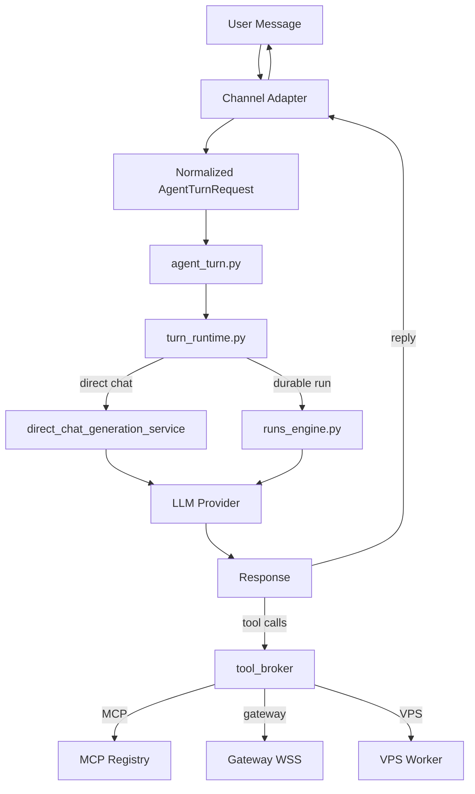

# Empyralis — Platform Architecture & Map

> **OUTDATED (2026-07-23):** this document predates the Phase 8 removal of
> the legacy workstation shell (2026-07-06 — `WorkspaceSurfacePage.tsx`,
> `workstation-kernel-shell.tsx`, and ~40 `workstation-*` panes described
> below as current were deleted in that phase) and predates the 2026-07-23
> founder ruling that "Sage" is dead product terminology (the platform has
> only agents — owner-facing, customer-facing serving the owner, and
> AskAI; this document uses "Sage" throughout as a live concept). It is
> superseded by `docs/PLATFORM-MAP.md`, the current canonical architecture
> doc. Kept for history; do not build from this — Appendix A of
> PLATFORM-MAP.md still cites this file's Section 7 (Architecture
> Decisions) as accurate, but everything else below should be treated as a
> historical snapshot only.

Managed, reliable, safe agent platform. Cloud-first, hardware as upgrade.
Consumers get their own agent in their channels.

**Stack:** Python (FastAPI) + TypeScript (Next.js 16) + Rust (policy kernel + supervisor)
**Updated:** 2026-07-03
**Current commit:** `ad2377b61` (Phase V — schedule_task tool)
**Test baseline:** 108 tests, 0 failures
**See also:** `docs/BUILD_STATE.md` (completed phases, boot requirements), `docs/HARDWARE_TIERS.md` (three-tier offering), `docs/CLI_SUBSCRIPTION_SPEC.md` (Gateway brain spec), `docs/MCP_CLIENT_SETUP.md` (connect AI clients to Empyralis), `graphify-out/graph.json` (AST knowledge graph), [Linear PLATFORM OVERVIEW](https://linear.app/mansurao/document/platform-overview-empyralis-one-agent-one-service-many-configurations-86a18989075a)

### Agent Maintenance Instructions

> After any code change, run these commands to keep the knowledge graph current.
> The graph is the structural source of truth — PLATFORM.md is the prescriptive rulebook.

```bash
graphify update .           # Refresh AST graph after any code change (no API cost, instant)
graphify cluster-only .     # Regenerate GRAPH_REPORT.md after structural refactors (needs API key)
```

> `graphify update .` is safe to run after every change. `cluster-only` is for PRs and merges —
> it regenerates the community report and suggested questions. If the graph is too large for
> HTML visualization (>5000 nodes), set `GRAPHIFY_VIZ_NODE_LIMIT=30000`.

---

## 0. Current Reality vs. Target Architecture — read this first

Two true things that look contradictory unless you know both:

**What's actually running in production right now** (empyralis.ai, VPS 165.227.25.201): the backend is `server_modules/` at repo root — ~190 Python service files, everything documented in Sections 2.8–2.9 below. The UI is root-level `frontend/`. This is real, deployed, and is what a user hits today. Nothing below this line is hypothetical.

**Where it's declared to be going** (per [Linear PLATFORM OVERVIEW](https://linear.app/mansurao/document/platform-overview-empyralis-one-agent-one-service-many-configurations-86a18989075a), updated 2026-07-01 — the owner's settled source of truth, one day newer than this file's prior revision): `server/` becomes THE backend (one `Agent` class, one channel router, one OAuth vault, one MCP client). `legacy/` becomes reference-only. `legacy/frontend` gets rewired onto `server/` and stays as THE UI. `frontend/v2/` — a bare chat skeleton — gets deleted once that rewire is live.

**The gap, verified 2026-07-02:** `server/` exists and its shape already matches the target (`agent/`, `tools/`, `oauth/`, `memory/`, `mcp/`, `vault/`, `channels/` — one file per concern, e.g. `oauth/refresh.py`, `oauth/exchange.py`, `mcp/client.py`, `channels/router.py`, `channels/telegram.py`). But it is skeletal — nowhere near feature parity with `server_modules/`'s ~190 files built up over months. Phase 1 of the Linear doc's 7-phase plan ("Backend unification — consolidate `server/`") has barely started. Today's `legacy/` directory is also not yet the clean two-folder split the plan describes — it's a broader, not-yet-pruned snapshot of the old repo (includes its own `frontend/`, `server_modules/`, gateway, supervisor, runtime-kernel copies).

**How to read the rest of this document:** Sections 1–5 describe what's real and deployed today (`server_modules/`-centric). They are accurate for "how it ships right now." They are NOT the target architecture — for that, read the Linear doc above. Don't let an engineer "fix" `server_modules/` toward some idealized shape without knowing `server/` is where that consolidation is actually supposed to land, per [[v2-rebuild-2026]].

---

## 1. Architecture Overview

```
┌──────────────────────────────────────────────────────────────┐
│                       CONSUMER SURFACES                       │
│  Web (Next.js)  │  Telegram  │  Discord  │  Slack  │  ...    │
│  Channel shells are PURE TRANSPORT — pigeons, not brains.    │
└──────────────────────────┬───────────────────────────────────┘
                           │  Normalized AgentTurnRequest
                           ▼
┌──────────────────────────────────────────────────────────────┐
│                     CONTROL PLANE (Python/FastAPI)             │
│  server.py → agent_turn.py → turn_runtime.py                 │
│                                                              │
│  ┌──────────┐  ┌──────────┐  ┌──────────┐  ┌──────────┐    │
│  │  Sage    │  │  Studio  │  │  Memory  │  │Governance│    │
│  │ (main AI)│  │(specialist│  │(LanceDB) │  │(kill-sw, │    │
│  │          │  │  agents)  │  │          │  │ approval)│    │
│  └──────────┘  └──────────┘  └──────────┘  └──────────┘    │
│                                                              │
│  Tool/Secret Brokers → Connectors → MCP → Runtime Placement │
└──────────┬─────────────────────┬─────────────────┬───────────┘
           │ Cloud                │ Gateway          │ VPS
           ▼                      ▼                  ▼
┌──────────────┐  ┌──────────────────┐  ┌──────────────────┐
│  CLOUD TIER  │  │  AGENT COMPUTER  │  │  SELF-HOSTED     │
│  (no hw)     │  │  (user hardware) │  │  (user VPS)      │
│              │  │                  │  │                   │
│ Bot API      │  │ empyralis-       │  │ Command worker    │
│ Webhooks     │  │ gateway (WSS)    │  │ (HTTP poll)       │
│ OAuth apps   │  │                  │  │                   │
│ Cloud        │  │ empyralis-       │  │ Shell + File      │
│ Computer     │  │ supervisor       │  │ ONLY              │
│ (droplet)    │  │ (local daemon)   │  │                   │
│              │  │                  │  │                   │
│ Capabilities:│  │ Capabilities:    │  │ Capabilities:     │
│ Chat, memory,│  │ Shell, FS,       │  │ Shell, file       │
│ API tools,   │  │ screenshot, OCR, │  │ read/write        │
│ browser      │  │ clipboard,       │  │                   │
│ control      │  │ AppleScript,     │  │                   │
│              │  │ personal channels│  │                   │
└──────────────┘  └──────────────────┘  └──────────────────┘
```

### Data Flow



### Key Contracts

1. **One turn engine** — all shells converge on `agent_turn.py`. No parallel turn contracts.
2. **Channels = pigeons** — transport only. Channel logic must not bleed into agent brain or control plane.
3. **Brokered everything** — tools → `tool_broker`, secrets → `secrets_broker`, runtime → policy-bound.
4. **No fallback** — credits at zero = hard stop. No fallback to cheaper model.
5. **Internalized governance** — no approval UX for consumers. Agent internalizes rules.
6. **Shell-first tools** — agent uses shell + browser. Minimal bespoke tools. Keep: memory, channel plumbing, OAuth connectors.

---

## 2. File Map — Every Significant File by Layer

### 2.1 Frontend — Pages (`frontend/app/`)

| File | Purpose |
|------|---------|
| `app/layout.tsx` | Root Next.js layout — font, metadata, CSS entry |
| `app/page.tsx` | Landing page — redirects to login or workspace |
| `app/globals.css` | Global CSS base |
| `app/landing-client.tsx` | Landing page client component |
| `app/login/page.tsx` | Login page |
| `app/signup/page.tsx` | Signup page |
| `app/auth/complete/page.tsx` | OAuth callback completion |
| `app/continue/page.tsx` | Session resume page |
| `app/onboarding/page.tsx` | Onboarding wizard entry |
| `app/onboarding/OnboardingClient.tsx` | Multi-step onboarding flow |
| `app/terms/page.tsx` | Terms of service |
| `app/privacy/page.tsx` | Privacy policy |
| `app/invite/[code]/page.tsx` | Invite code redemption |
| `app/preview/page.tsx` | Public agent preview |
| `app/healthz/route.ts` | Health-check endpoint |
| `app/(account)/layout.tsx` | Account shell layout — auth gate |
| `app/(account)/AccountHomeClient.tsx` | Account home — workspace switcher |
| `app/(account)/AccountTenantSwitcher.tsx` | Tenant switcher UI |
| `app/(account)/w/[workspaceId]/page.tsx` | Workspace root — redirects to Sage |
| `app/(account)/w/[workspaceId]/WorkspaceSurfacePage.tsx` | Main workspace surface renderer |
| `app/api/auth/google/callback/route.ts` | Google OAuth callback |
| `app/api/chat/route.ts` | Chat API route |
| `app/api/chat/stream/route.ts` | SSE streaming chat route |

### 2.2 Frontend — Workspace Shell (`frontend/lib/workspace/`)

| File | Purpose |
|------|---------|
| `workstation-kernel-shell.tsx` | Main workstation shell — nav, routing, surface mounting |
| `workstation-shell.ts` | Shell state, workspace model types |
| `workspace-shell.ts` | Workspace data types, route definitions |
| `workstation-titlebar.tsx` | Custom titlebar (Tauri desktop) |
| `workstation-billing-pane.tsx` | Billing/subscription management UI |
| `workstation-sage-connectors-pane.tsx` | MCP connector catalog + pairing UI |
| `workspace-channel-pairing-surface.tsx` | ⚠️ Channel pairing — hardcoded provider types |
| `sage-command-catalog.ts` | Slash command definitions |
| `sage-chat-pane.tsx` | Main chat interface |
| `sage-memory-pane.tsx` | Memory timeline view |
| `cloud-vps-setup-panel.tsx` | VPS/node setup panel |
| `workstation-chat-timeline-projection.ts` | Assembles thread messages + live/legacy trace events + pending approvals into one ordered chat timeline |
| `workstation-runs-pane.tsx` | Surface listing durable background agent runs/threads |
| `codex-chat/event-projector.ts` | Projects raw agent activity events (tool execution, Agent Computer status) into timeline-renderable cells |

⚠️ **Undocumented subsystem:** `frontend/lib/workspace/codex-chat/` (`cells.ts`, `timeline-reducer.ts`, `message-adapter.ts`, `event-projector.ts`, plus `transcript-event-contract.ts` alongside it) is a whole agent-activity/tool-progress timeline layer not previously mapped here — labels like "Connecting to your Mac...", "Running on your Mac" suggest this is the frontend half of the hardware tool-progress streaming gap noted in `verified-status-channels-hardware` memory (chat goes silent during hardware work — `emit_tool_progress` never wired server-side). Worth a dedicated file-map pass; not fully audited in this update.

### 2.3 Frontend — UI System (`frontend/lib/ui/`)

| File | Purpose |
|------|---------|
| `tokens.ts` | Design tokens — colors, spacing, radii |
| `motion.tsx` | Animation system (GSAP/Motion) |
| `chrome.css` | Shell chrome CSS |

### 2.4 Frontend — Shared (`frontend/shared/`)

| File | Purpose |
|------|---------|
| `nav-manifest.ts` | Canonical navigation destinations, routes, icons |
| `design-system/tokens.ts` | Shared design tokens |
| `api-contract/index.ts` | API type contracts (AgentTurnRequest, etc.) |
| `api-contract/model-tier-contract.ts` | Model tier definitions |

### 2.5 Gateway (`empyralis-gateway/src/`)

| File | Purpose |
|------|---------|
| `index.ts` | Gateway entry — WSS connection, runtime registration |
| `supervisor/client.ts` | HTTP client to local supervisor daemon |
| `supervisor/capability-router.ts` | ⚠️ Bundles channel messaging + hardware execution |
| `browser/runtime.ts` | Browser automation runtime |
| `browser/session-store.ts` | Browser session persistence |
| `pairing/token-store.ts` | Gateway pairing token management |
| `pairing/device-identity.ts` | Device identity for pairing |
| `health/service-inventory.ts` | Health checks and capability advertisement |
| `protocol/codec.ts` | Wire protocol codec |
| `runtime/service-mode.ts` | Service mode management |
| `runtime/desktop-permissions.ts` | Desktop permission resolution |
| `runtime/runtime-metadata.ts` | Runtime metadata |
| `cloud/heartbeat-payload.ts` | Cloud heartbeat payload building |
| `dev/local-bridge-harness.ts` | Dev harness for local bridges |
| `external-agent/proxy-runtime.ts` | External agent proxy |
| `channels/foundation/*.ts` | Channel foundation: typing, redaction, outbound, drafts |
| `channels/telegram/runtime.ts` | Telegram personal runtime (GramJS) |
| `channels/telegram/session-store.ts` | Telegram session persistence |
| `channels/telegram/message-mapper.ts` | Telegram message normalization |
| `channels/whatsapp/runtime.ts` | WhatsApp personal runtime (Baileys) |
| `channels/whatsapp/session-store.ts` | WhatsApp session persistence |
| `channels/whatsapp/message-mapper.ts` | WhatsApp message normalization |
| `channels/whatsapp/qr-login.ts` | WhatsApp QR code login flow |
| `channels/local-bridge-runtime.ts` | Local bridge runtime (Signal, iMessage, WeChat) |
| `channels/personal-config-store.ts` | Personal channel config persistence |
| `channels/personal-runtime.ts` | Personal channel runtime base |
| `bridges/signal-cli-bridge.ts` | Signal CLI bridge |
| `bridges/bluebubbles-bridge.ts` | BlueBubbles iMessage bridge |

### 2.6 Supervisor (`empyralis-supervisor/src/`)

| File | Purpose |
|------|---------|
| `main.rs` | Supervisor daemon — HTTP server on 127.0.0.1:7788 |

### 2.7 Runtime Kernel (`empyralis-runtime-kernel/src/`)

| File | Purpose |
|------|---------|
| `platform_orchestration.rs` | Platform orchestration entry |
| `run_api.rs` | Run API |
| `run_preparation.rs` | Run preparation/validation |
| `run_routing.rs` | Run routing decisions |
| `run_triggers.rs` | Run triggers |
| `run_approval.rs` | Run approval logic |
| `execution_plan.rs` | Execution plan building |
| `execution_runtime.rs` | Execution runtime |
| `execution_authorization.rs` | Execution authorization |
| `execution_outcome.rs` | Execution outcome handling |
| `sandbox_execution.rs` | Sandbox execution |
| `safe_mode.rs` | Safe mode enforcement |
| `gateway_service.rs` | Gateway service interface |
| `gateway_action.rs` | Gateway action definitions |
| `gateway_frame.rs` | Gateway wire format |
| `deployed_readiness.rs` | Deployed agent readiness |
| `deployed_data.rs` | Deployed agent data |
| `deployed_virtual_runtime.rs` | Virtual runtime for deployed agents |
| `deployed_virtual_runtime_service.rs` | Virtual runtime service |
| `control_plane_service.rs` | Control plane interface |
| `virtual_computer.rs` | Virtual computer runtime |
| `session_scheduler.rs` | Session scheduling |
| `runtime_session_api.rs` | Runtime session API |
| `local_worker.rs` | Local worker interface |
| `path_guard.rs` | Filesystem path guard |
| `presets.rs` | Policy presets |

### 2.8 Backend — Core Services (`server_modules/`)

| File | Purpose |
|------|---------|
| `server.py` | ⚠️ Composition root — FastAPI app, middleware, router mounting |
| `main.py` | Standalone entry (rarely used) |
| `mcp_server.py` | MCP server — exposes Empyralis AS an MCP server for external AI clients (9 tools: fleet, memory, chat) |
| `mcp_server_auth.py` | Phase U2 — per-workspace MCP API key creation, hashing, revocation, resolution |
| `preflight.py` | Phase T — startup preflight (kernel, Postgres, Redis), fails loud if missing |
| `fleet_tools.py` | Phase L+V — operator fleet tools + schedule_task proactive agent tool |
| `agent_turn.py` | Canonical AgentTurnRequest — all channels converge here |
| `turn_runtime.py` | Execution switchboard — direct chat vs durable run |
| `turn_ingress_service.py` | Turn ingress normalization |
| `agent_channel_router.py` | ⚠️ Channel routing — per-channel handler classes |
| `channel_adapter.py` | ✅ Channel normalization — NormalizedSageTurn |
| `sage_turn_adapter.py` | ✅ Unified sage turn execution for all channels |
| `sage_command_dispatcher.py` | ⚠️ Command dispatcher + error messages (hardcoded strings) |
| `sage_agent_runtime_service.py` | ⚠️ Sage agent loop — channel-specific keyword routing |
| `sage_reply_dispatcher.py` | ⚠️ Reply dispatch — has fallback message |
| `sage_transparency_service.py` | Sage transparency events |
| `sage_daily_operator_service.py` | Daily operator tasks |
| `auth.py` | Authentication — users, sessions, API keys, SQLite fallback |
| `db.py` | Database connection, pool management |
| `control_plane_repository.py` | Postgres control plane — tenants, workspaces, agents |
| `provider_profiles.py` | Provider profile management |
| `secrets_broker.py` | Secret/vault access — hosted keys, workspace BYOK |
| `vault_store.py` | Encrypted credential vault |
| `tool_broker.py` | Tool access gateway |
| `tool_broker_guard_service.py` | Tool brokering safety guards |
| `direct_tool_approval_service.py` | Tool approval workflow |
| `direct_tool_loop_guard_service.py` | Loop detection (3 repeat → abort) |
| `memory_service.py` | Memory/embedding service |
| `unified_memory_service.py` | Unified memory across captain + specialists |
| `activity_ledger_service.py` | Durable activity ledger |
| `notification_service.py` | Notification feed composition |
| `entitlements_service.py` | Entitlement and quota enforcement |
| `billing_service.py` | Billing integration (Stripe) |
| `workspace_bootstrap_service.py` | New workspace setup, credit grants |
| `hybrid_policy_service.py` | Hybrid cloud/local placement policy |
| `runtime_config.py` | Runtime configuration — env, paths, provider resolution |
| `runtime_common.py` | Shared runtime utilities, auth middleware |
| `runtime_policy.py` | Runtime policy enforcement |
| `safe_mode_service.py` | Safe mode — degraded operation |
| `universal_operator.py` | ⚠️ Universal operator actions (hardcoded strings) |
| `error_response_service.py` | Error response normalization |
| `agent_registry_api.py` | Agent registry REST API |
| `agent_registry_repository.py` | Agent registry persistence |
| `agent_specialist_repository.py` | Specialist agent persistence |
| `specialist_service.py` | Specialist agent service |
| `app_registry_api.py` | App install/uninstall/store API |
| `app_bridge_service.py` | App-to-agent bridge contracts |
| `mcp_registry_service.py` | MCP server registry, tool discovery, approval, invocation |
| `skill_registry.py` | Skill definitions + MCP-to-skill integration |
| `acp_bridge_service.py` | ACP — Agent Communication Protocol (not MCP) |
| `acp_manager.py` | ACP session management |
| `connection_oauth_service.py` | OAuth provider configs + APP_MCP_SERVER_MAP |
| `connection_catalog_service.py` | Connection catalog |
| `connection_readiness_service.py` | Connection readiness checks |
| `connection_verify_service.py` | Connection verification |
| `connectors_actions.py` | ⚠️ DEPRECATED connector tools (replaced by MCP) |
| `connectors_core.py` | Connector core utilities |
| `connector_manifests.py` | Connector manifest catalog |
| `connector_validators.py` | Connector validation |
| `routes_connectors.py` | Connector REST routes |
| `routes_billing.py` | Billing API routes |
| `routes_health.py` | Health check routes |
| `routes_agents.py` | Agent routes |
| `routes_personal_channels.py` | Personal channel routes |
| `routes_sage_telegram_hosted.py` | ⚠️ Telegram hosted bot routes (hardcoded strings) |
| `routes_signal.py` | Signal routes (dead) |
| `routes_imessage.py` | iMessage routes (dead) |
| `routes_wechat.py` | WeChat routes (dead) |
| `routes_slack.py` | Slack routes (dead — not registered in server.py) |
| `routes_discovery.py` | Discovery routes (dead) |
| `routes_mini_apps.py` | Mini-apps routes (dead) |
| `personal_channel_sage_bridge_service.py` | ⚠️ Personal channel bridge — 6 near-identical wrappers |
| `personal_channels_service.py` | Personal channel management |
| `personal_channel_handler_registry.py` | Personal channel handler registry |
| `personal_channel_thread_command_service.py` | Personal channel thread commands |
| `channel_lane_contract_service.py` | Canonical channel lane definitions |
| `channel_types.py` | Channel type definitions |
| `channel_platform_service.py` | Channel platform management |
| `channel_execution_service.py` | ⚠️ Channel execution (hardcoded strings) |
| `channel_blocking_policy_service.py` | Channel blocking/safe mode |
| `gateway_execution_service.py` | Gateway tool dispatch |
| `gateway_protocol_service.py` | Gateway protocol handling |
| `gateway_health_service.py` | Gateway health monitoring |
| `gateway_pairing_service.py` | Gateway pairing flow |
| `gateway_approval_service.py` | Gateway approval flow |
| `gateway_activity_service.py` | Gateway activity tracking |
| `gateway_browser_service.py` | Gateway browser execution |
| `gateway_inventory_service.py` | Gateway capability inventory |
| `hardware_runtime_target_resolver.py` | ⚠️ Hardware target resolution (mapping bugs) |
| `hardware_runtime_session_service.py` | Hardware runtime sessions |
| `hardware_action_broker_service.py` | Hardware action brokering |
| `hardware_access_policy_service.py` | Hardware access policy |
| `hardware_runtime_adapters/cloud_computer_adapter.py` | Cloud computer adapter |
| `hardware_runtime_adapters/gateway_adapter.py` | Gateway adapter |
| `hardware_runtime_adapters/self_hosted_node_adapter.py` | Self-hosted VPS adapter |
| `runtime_runtime_api.py` | Runtime registration, sessions, claims |
| `runtime_route_registry_service.py` | Runtime route registry |
| `runtime_route_registration_service.py` | Runtime route registration |
| `runtime_route_bootstrap_service.py` | Runtime route bootstrap |
| `runtime_run_entry_service.py` | Run entry |
| `runtime_run_query_service.py` | Run query |
| `runtime_run_control_service.py` | Run control |
| `runtime_run_approval_service.py` | Run approval |
| `runtime_run_delegation_service.py` | Run delegation |
| `runtime_run_detail_service.py` | Run detail |
| `runtime_run_access_service.py` | Run access control |
| `runtime_run_resume_service.py` | Run resume |
| `runtime_heartbeat_service.py` | Runtime heartbeat |
| `runtime_history_service.py` | Runtime history |
| `runtime_usage_service.py` | Runtime usage tracking |
| `runtime_workspace_service.py` | Runtime workspace service |
| `runtime_attachment_service.py` | Runtime attachment |
| `runtime_request_service.py` | Runtime request handling |
| `runtime_webhook_trigger_service.py` | Runtime webhook triggers |
| `runtime_local_execution_approval_service.py` | Local execution approval |
| `local_queue.py` | Local queue — claims, heartbeats, dead letters |
| `machine_lease_service.py` | Machine lease management |
| `supervisor_client.py` | Supervisor HTTP client |
| `run_service.py` | Run service |
| `runs_core.py` | Runs core |
| `runs_engine.py` | Runs engine |
| `runs_execution.py` | Runs execution |
| `runs_history.py` | Runs history |
| `session_service.py` | Session management |
| `session_lifecycle_service.py` | Session lifecycle |
| `session_manager/manager.py` | Session manager |
| `session_manager/actor_queue.py` | Actor queue for sessions |
| `session_manager/observability.py` | Session observability |
| `session_manager/runtime_cache.py` | Session runtime cache |
| `thread_service.py` | Thread management |
| `workflow_service.py` | Workflow service |
| `workflow_api.py` | Workflow API |
| `workflow_repository.py` | Workflow persistence |
| `quota_response_service.py` | ⚠️ Quota response messages |
| `quota_policy_service.py` | Quota policy |
| `direct_chat_service.py` | Direct chat orchestration |
| `direct_chat_generation_service.py` | LLM generation loop (provider-backed) |
| `direct_chat_composition_service.py` | Chat composition |
| `direct_chat_response_service.py` | Slash command dispatch |
| `direct_chat_provider_service.py` | Provider selection/routing |
| `direct_chat_provider_facade_service.py` | Provider facade |
| `direct_chat_entry_service.py` | Chat entry |
| `direct_chat_entry_policy_service.py` | Entry policy |
| `direct_chat_runtime_service.py` | Chat runtime |
| `direct_chat_runtime_facade_service.py` | Chat runtime facade |
| `direct_chat_runtime_entry_facade_service.py` | Runtime entry facade |
| `direct_chat_stream_runtime_service.py` | Stream runtime |
| `direct_chat_stream_state_service.py` | Stream state |
| `direct_chat_stream_transport_service.py` | Stream transport |
| `direct_chat_stream_response_service.py` | Stream response |
| `direct_chat_transport_service.py` | Chat transport |
| `direct_chat_memory_facade_service.py` | Memory facade |
| `direct_chat_handoff_service.py` | Handoff logic |
| `direct_chat_handoff_facade_service.py` | Handoff facade |
| `direct_chat_operator_binding_service.py` | Operator binding |
| `direct_chat_operator_support_service.py` | Operator support |
| `direct_chat_callback_facade_service.py` | Callback facade |
| `direct_chat_support_binding_service.py` | Support binding |
| `direct_chat_metadata_service.py` | Metadata |
| `direct_chat_prompt_service.py` | Prompt assembly |
| `direct_chat_context_service.py` | Context building |
| `direct_chat_intervention_service.py` | Intervention builder |
| `direct_chat_availability_service.py` | Availability checks |
| `direct_chat_routing_service.py` | Routing |
| `direct_chat_hosted_usage_service.py` | Hosted usage tracking |
| `direct_chat_tool_catalog_service.py` | Tool catalog |
| `personal_context_engine.py` | Personal context engine |
| `shared_operational_board_service.py` | Shared board (captain + specialists) |
| `agent/action_service.py` | Agent action definitions |
| `agent/automation_setup_service.py` | Agent automation setup templates |
| `agent/user_profile_service.py` | Agent user profile service |
| `voice_notification_policy_service.py` | Voice notification policy |
| `inventory_skill.py` | Inventory skill (ecommerce) |
| `unified_governance_gate.py` | Unified governance gate |
| `doctor_report.py` | System health report generation |
| `health_core.py` | Health check core |
| `state_paths.py` | Runtime state file paths |
| `api_contract.py` | API type contracts |
| `logging_config.py` | Logging configuration |
| `config_loader.py` | Config loading |
| `cloud_cutover_config.py` | Cloud cutover configuration |
| `sqlite_helpers.py` | SQLite utility helpers |
| `attachment_utils.py` | Attachment utilities |
| `url_security.py` | URL security validation |
| `browser_engine.py` | Browser engine interface |
| `execution_sandbox_service.py` | Execution sandbox |
| `blackbox_runtime_support.py` | Blackbox runtime support |
| `skill_scanner.py` | Skill file scanner |
| `external_content_guard.py` | External content safety |
| `data_retention_service.py` | Data retention policy |
| `retention_enforcement_job.py` | Retention enforcement job |
| `platform_analytics_service.py` | Platform analytics |
| `customer_ops_pack.py` | Customer ops utilities |
| `setup_sessions.py` | Setup session management |

### 2.9 Connectors (`server_modules/connectors/`)

| File | Purpose |
|------|---------|
| `slack_connector.py` | Slack — OAuth, webhooks, message handling |
| `discord_connector.py` | ⚠️ Discord — bot REST + personal DM (hardcoded strings) |
| `discord_bot_runtime_service.py` | Discord bot runtime |
| `telegram_ingress_service.py` | ⚠️ Telegram ingress (hardcoded strings) |
| `telegram_connector_services.py` | Telegram connector services |
| `telegram_connector_context_service.py` | Telegram context |
| `telegram_connector_poll_service.py` | Telegram polling |
| `telegram_run_action_service.py` | Telegram run actions |
| `telegram_run_dispatch_service.py` | Telegram run dispatch |
| `telegram_inbound_context_service.py` | Telegram inbound context |
| `whatsapp_ingress_service.py` | ⚠️ WhatsApp ingress (hardcoded strings) |
| `whatsapp_webhook_service.py` | WhatsApp webhook |
| `whatsapp_webhook_bridge_service.py` | WhatsApp webhook bridge |
| `whatsapp_transport_service.py` | WhatsApp transport |
| `whatsapp_autopilot_state_service.py` | WhatsApp autopilot state |
| `whatsapp_run_dispatch_service.py` | WhatsApp run dispatch |
| `autopilot_endpoint_service.py` | Autopilot endpoint |
| `autopilot_runtime_exports.py` | Autopilot runtime exports |
| `autopilot_runtime_facade_service.py` | Autopilot runtime facade |
| `autopilot_runtime_support_service.py` | ⚠️ Autopilot runtime support (7 "I" messages) |
| `autopilot_runtime_service_registry.py` | Autopilot service registry |
| `autopilot_registry_facade_service.py` | Autopilot registry facade |
| `autopilot_approval_service.py` | Autopilot approval |
| `autopilot_skill_service.py` | Autopilot skills |
| `autopilot_workflow_setup_service.py` | Autopilot workflow setup |
| `autopilot_event_service.py` | Autopilot events |
| `autopilot_event_bridge_service.py` | Autopilot event bridge |
| `autopilot_state_bridge_service.py` | Autopilot state bridge |
| `autopilot_bridge_registry_service.py` | Autopilot bridge registry |
| `autopilot_bridge_facade_service.py` | Autopilot bridge facade |
| `autopilot_connector_shell_service.py` | Autopilot connector shell |
| `autopilot_channel_support_service.py` | Autopilot channel support |
| `autopilot_common_support_service.py` | Autopilot common support |
| `autopilot_terminal_bridge_service.py` | Autopilot terminal bridge |
| `autopilot_run_entry_service.py` | Autopilot run entry |
| `channel_delivery_outbox_service.py` | Channel delivery outbox |
| `channel_workspace_scope_service.py` | Channel workspace scoping |
| `connector_runtime.py` | Connector runtime base |
| `connector_webhook.py` | Connector webhook base |
| `github_connector.py` | GitHub — webhooks, issues, PRs |
| `linear_connector.py` | Linear API connector |
| `notion_connector.py` | Notion API connector |
| `dropbox_connector.py` | Dropbox API connector |
| `s3_connector.py` | AWS S3 connector |
| `smtp_connector.py` | SMTP/IMAP email connector |
| `runtime_status_service.py` | Connector runtime status |

---

## 3. Channel System

### 3.1 Personal Channels (account_mode — requires Agent Computer gateway)

| Channel | Transport | Status | Session Owner | Notes |
|---------|-----------|--------|---------------|-------|
| `telegram_personal` | GramJS via Gateway WSS | **live** | `paired_gateway` | Controls user's Telegram account |
| `whatsapp_personal` | Baileys via Gateway WSS | **live** | `paired_gateway` | Controls user's WhatsApp account |
| `discord_personal` | discord.py bot token via Gateway | **live** | `cloud_connector` ⚠️ | Anomaly — uses bot token, not user account |
| `signal_personal` | signal-cli bridge HTTP poll | **wired** | `paired_gateway` | Needs bridge health check |
| `imessage_personal` | BlueBubbles bridge HTTP poll | **wired** | `paired_gateway` | Mac-only |
| `wechat_personal` | WeChat bridge HTTP poll | **planned** | `paired_gateway` | Not implemented |

### 3.2 Business Channels (bot_mode — cloud-only, no hardware)

| Channel | Transport | Status | Notes |
|---------|-----------|--------|-------|
| `telegram_bot` | Bot API (webhook + polling) | **live** | Primary cloud chatbot path |
| `discord_bot` | Discord HTTP Interactions | **live** | Cloud chatbot |
| `slack` | Slack Events API + OAuth | **live** | Cloud chatbot |
| `email` (gmail) | Gmail API (OAuth) | **partial** | Cloud connector |
| `email` (smtp_imap) | SMTP/IMAP | **partial** | Cloud connector |
| `whatsapp_business` | Twilio API | **blocked** | Meta banned AI assistants Jan 2026 |
| `apple_messages_business` | MSP API | **planned** | Needs Apple approval |
| `web_chat` | WebSocket widget | **planned** | |
| `teams` | Teams Bot Framework | **planned** | |
| `matrix` | Matrix CS API | **planned** | |

### 3.3 Work System Connectors (cloud-only)

| Connector | Transport | Status |
|-----------|-----------|--------|
| `github` | GitHub API webhooks | **live** |
| `linear` | Linear API | **live** |
| `notion` | Notion API | **live** |
| `dropbox` | Dropbox API | **live** |
| `s3` | AWS SDK | **live** |
| `smtp` | SMTP/IMAP | **live** |
| `wechat_work` | WeChat Work webhook | **live** |
| `instagram_business` | Facebook Graph API | **live** |
| `microsoft_365` | Microsoft Graph API | **partial** |

### 3.4 Channel Violations

- **Adding a channel requires touching 12+ files** — should be 1-2
- **Frontend only shows 2 channels** (Telegram, WhatsApp) despite 27 in backend catalog
- **Only 3 studio channels route through Sage**: `slack`, `discord`, `github`. All others return `channel_unavailable`
- **Two `telegram_personal` paths**: Gateway (GramJS on user machine) vs Cloud Session Manager (GramJS in cloud) — no code sharing, no unified routing decision
- **`discord_personal` metadata contradiction**: `runtime_lane: personal_gateway` but `session_owner: cloud_connector`

---

## 4. MCP / Apps Layer

### 4.1 Architecture

```
OAuth App → credential vault → MCP server registration → tool discovery → approval → invocation
```

- **Registry**: `mcp_registry_service.py` — per-workspace MCP servers
- **Discovery**: connects to remote `streamable_http` endpoint, calls `list_tools()`
- **Approval**: tools default to `approved: false` — must be explicitly approved
- **Invocation**: `skill_registry.py` dispatches `mcp_tool` → `mcp_registry.invoke_workspace_mcp_skill_async()`
- **Transport**: streamable_http ONLY — no stdio, no SSE

### 4.2 Connector MCP Status

- **Fully wired + bridge auto-registers (8):** gmail, google_calendar, github, notion, linear, slack, figma, dropbox — OAuth tokens stored → MCP server auto-registered via `_register_mcp_servers_for_provider()` (Phase U)
- **Frontend mcpEndpoint + backend bridge live (12):** calendly, clickup, webflow, monday, box, confluence, miro, intercom, docusign, square, typeform, vercel — endpoints in `APP_MCP_SERVER_MAP`, bridge wired (Phase U), frontend endpoints moved to single-source catalog API
- **OAuth-only, no MCP tools (3):** todoist, hubspot, jira — endpoints known, surfaced in catalog
- **OAuth-only, endpoint=null (1):** microsoft_365 — no public MCP endpoint yet
- **OAuth-only, standard exchange (16):** canva, asana, zoom, airtable, stripe, salesforce, webhook, gitlab, and others — use `standard` token_parser

**Total:** 30 providers in catalog. Honest status per provider: live | partial | preview (no fake "Set up").
**Single source:** `GET /api/connections/mcp-catalog` — backend `APP_MCP_SERVER_MAP`, frontend fetches from API (Phase U).

### 4.3 Empyralis IS an MCP Server (Phase U2)

Empyralis exposes itself as an MCP server at `/mcp` for external AI clients (Claude Code, Claude Desktop, ChatGPT).

- **Auth:** Per-workspace API key (bearer token) — create/revoke via `POST/DELETE /api/connections/mcp-keys`. Keys SHA-256 hashed in `~/.empyralis/state/runtime/mcp_api_keys.json`. Workspace resolved from key, never from tool args.
- **Read tools (live):** `empyralis_list_agents`, `empyralis_get_agent_activity`, `empyralis_memory_read`, `empyralis_memory_list`, `empyralis_chat` (full turn through triage + reasoning)
- **Write tools (gated):** `empyralis_create_agent`, `empyralis_configure_agent`, `empyralis_message_agent`, `empyralis_memory_write` — require `EMPYRALIS_MCP_WRITE_ENABLED=true`
- **Ledger:** All MCP calls ledgered with `event_class: mcp_inbound`, `actor: external_mcp_client`
- **Docs:** `docs/MCP_CLIENT_SETUP.md` — Claude Code, Claude Desktop (mcp-remote bridge), ChatGPT

### 4.4 ACP ≠ MCP

- **MCP** (Model Context Protocol) = how agents talk to external SaaS tools
- **ACP** (Agent Communication Protocol) = how external clients talk to the Empyralis gateway
- They share "CP" in the name. Completely different subsystems.

### 4.5 Fragility Points

- **MCP endpoint URLs no longer duplicated** — frontend `mcpEndpoint` values removed (Phase U), single source at `GET /api/connections/mcp-catalog`
- **streamable_http only** — local MCP servers using stdio are unsupported
- **Adding an OAuth app** requires touching 3 files (OAuth config, APP_MCP_SERVER_MAP, frontend card)
- **DEPRECATED** connector tools in `connectors_actions.py` still exist — marked for removal after 30-day stability

---

## 5. Known Violations

### 5.1 Hardcoded "I"/"my" Strings — Platform Impersonates Agent

**Phase T2 fixed (2026-07-03):** 26 strings across `triage_service.py`, `skill_registry.py` (11), `universal_operator.py` (14), and `sage_command_dispatcher.py` (classify_error token leak) converted to platform voice ("Heads up: ..."). `classify_error()` no longer appends raw error text to chat replies.

**Remaining (deferred — lower-priority paths):**

| # | File | Count | Status |
|---|------|-------|--------|
| 1 | `sage_command_dispatcher.py` | 3 | Fixed (platform_event.py constants) |
| 2 | `sage_reply_dispatcher.py` | 1 | Fixed (platform_event.py) |
| 3 | `channel_execution_service.py` | 2 | Fixed (platform_event.py) |
| 4 | `quota_response_service.py` | 3 | Fixed (platform_event.py) |
| 5 | `autopilot_runtime_support_service.py` | 7 | Deferred |
| 6 | `inventory_skill.py` | 5 | Deferred |
| 7 | `agent/automation_setup_service.py` | 6 | Deferred |
| 8 | `agent/user_profile_service.py` | 4 | Deferred |
| 9 | `connectors/telegram_run_action_service.py` | 1 | Deferred |
| 10 | `tool_broker.py` | 1 | Deferred |

**Fixed count:** 26 of ~57 identified. **Remaining:** ~31 in lower-priority code paths (autopilot, inventory, legacy connectors).

### 5.2 "Your"/"You've" Personalization (20 instances)

| # | File:Line | Current |
|---|-----------|---------|
| 1-8 | `sage_command_dispatcher.py:28-78` | "your main thread", "your API key", "You've reached your AI limit" |
| 9-13 | `autopilot_runtime_support_service.py:135-176` | "your AI account", "your current safety settings" |
| 14-15 | `entitlements_service.py:552`, `direct_chat_hosted_usage_service.py:197` | "You've reached your AI limit" |
| 16-19 | `direct_chat_context_service.py:10-12` | "sage hit a temporary error" (wrong persona — lowercase "sage") |
| 20 | `agent_policy_context.py:74` | "Your capabilities are currently suspended..." |

### 5.3 Channel Logic Bleeding into Control Plane (10 instances)

| # | File:Line | Issue |
|---|-----------|-------|
| 1 | `sage_agent_runtime_service.py:130-140` | `_COMMUNICATION_SCOPES` hardcodes channel names |
| 2 | `sage_agent_runtime_service.py:158-169` | `_CONNECTOR_ROUTE_KEYWORDS` maps channel names in agent brain |
| 3 | `sage_agent_runtime_service.py:170-195` | `_GATEWAY_ROUTE_KEYWORDS` has channel-specific terms |
| 4 | `agent_channel_router.py:62-66` | `LOCAL_BRIDGE_PERSONAL_CHANNELS` hardcoded |
| 5-9 | `personal_channel_sage_bridge_service.py:291-514` | 6 near-identical per-channel wrapper functions |
| 10 | `sage_agent_runtime_service.py:832-836` | "my hardware", "my mac" routing tokens in agent code |

### 5.4 Gateway Logic Misplaced (6 instances)

| # | File:Line | Issue |
|---|-----------|-------|
| 1 | `capability-router.ts:38-214` | Gateway bundles channel messaging + hardware execution in one router |
| 2 | `capability-router.ts:73-141` | `handleToolInvoke()` mixes browser, channel, and supervisor dispatch |
| 3 | `hardware_runtime_target_resolver.py:93-101` | `self_hosted_node` falls through to wrong label `cloud_provider` |
| 4 | `hardware_runtime_target_resolver.py:121-128` | Gateway-offline fallback loses execution environment info |
| 5 | `channel_lane_contract_service.py:50-56` | `discord_personal` contradicting `runtime_lane` vs `session_owner` |

### 5.5 Structural Problems (8 instances)

| # | Issue |
|---|-------|
| 1 | `AgentTurnResponse.reply` conflates agent responses and platform errors — no flag to distinguish |
| 2 | API contract mirrors the conflation — no `is_platform_error` field |
| 3 | Intervention system exists but is underused — most errors use raw `reply` strings |
| 4 | Frontend `ChannelProvider` type is hardcoded `'telegram' \| 'whatsapp'` |
| 5 | Frontend `CHANNEL_PROVIDER_DEFINITIONS` is static, not data-driven |
| 6 | Frontend `visibleProviders` is a hardcoded array |
| 7 | Adding a channel requires touching 12+ files |
| 8 | Generic `build_personal_channel_reply_async()` exists but is bypassed by per-channel wrappers |

---

**Total: 75 known violations across 5 categories.**

---

## 6. Completed Phases (2026-07-03)

| Phase | Commit | Description |
|-------|--------|-------------|
| A | `0820a732c` | Remove approval system — agent acts on reasoning |
| B | `7f594ec1f` | Platform voice — pigeon theory enforced |
| C | `207cb351c` | Import cycles broken via contract leaf modules |
| D | `1d5fa116c` | Honest test harness (skips + fakes) |
| E-F | multiple | Workspace isolation, per-agent credentials, channel bindings, tool gating |
| G | `cc308e21e` | Router wired, agent_id threaded, workers scoped |
| K | `38a531f7d` | Gateway ledger — channel + hardware audit trail |
| L+M+N | multiple | Operator role, 5 fleet tools, sub-agent gate, per-agent AI binding, Telegram single-path, Stage 5 memory |
| P | `6b66aac28` | Triage layers — scope + identity gates before reasoning |
| Q | multiple | Live verification — build, boot, migrations, ledger sanity |
| S | `c499c6d60` | Real turn completes — approval-era callback vestige removed |
| T | `be4627358` | Boot preflight + reproducible startup + 3 test fixes |
| T2 | `d1250b966` | Chat voice integrity — 26 "I"/"my" strings fixed, display_name config, slash registry cleaned, classify_error leak closed |
| U | `9b9947bfb` | MCP catalog honesty — OAuth→MCP bridge wired, single-source catalog API, frontend drift deleted |
| U2 | `df30aed76` | Empyralis as MCP server — per-workspace API key auth, 9 platform tools, MCP_CLIENT_SETUP.md |
| V | `ad2377b61` | Proactive agents — schedule_task tool + wake request integration |
| — | `38be4aa66` | Hardware tiers design doc |
| — | — | CLI subscription spec (Gateway brain — not built) |

## 6b. Current Priorities

1. **Phase W** — Fleet Console UI (Stage 9): agent cards, activity feed, agent detail, channels catalog, wizard
2. **Fix remaining violations** — ~31 "I"/"my" strings, channel leakage, structural problems
3. **Gateway hardening** — cycle #6 (outbox), cli_subscription Gateway build per spec
4. **One real user** — onboard, connect Telegram, get daily value

---

## 7. Architecture Decisions — Why We Built It This Way

This section exists so any agent reading this file knows WHY decisions were made
and does NOT reverse them without explicit instruction. Each entry is opinionated
and final unless Mansur says otherwise.

### Decision: Channels are pure transport (pigeon theory)

**Chosen:** Every channel (Telegram, Discord, WhatsApp, etc.) is a stateless
transport shell that normalizes inbound messages into `AgentTurnRequest` and
delivers outbound `AgentTurnResponse` back to the user. Channels never hold
routing logic, policy, or session state.

**Rejected:** Channels as control-plane participants — parsing commands,
enforcing quotas, managing sessions, or selecting agent targets.

**Why:** If channels carry logic, every new channel requires reimplementing the
same rules and every policy change requires touching every channel. The pigeon
model means the control plane is the single brain — channels are dumb pipes.
Adding a channel becomes a thin translation layer (inbound normalization +
outbound delivery), not a feature reimplementation. This also means the
platform can answer from any channel without the user knowing or caring which
one delivered the message.

### Decision: WSS reverse tunnel, not SSH, for hardware connection

**Chosen:** The Empyralis Gateway on user hardware opens an outbound
WebSocket Secure (WSS) connection to the cloud control plane and holds it open.
Commands flow down that tunnel; results flow up.

**Rejected:** SSH tunnels, direct TCP connections, or polling-based approaches.

**Why:** Outbound WSS survives NAT, consumer firewalls, and dynamic IPs without
port forwarding or static addressing — the user installs the Gateway and it
just connects. SSH requires key management, known hosts, and opens an
interactive shell surface that must be locked down. WSS is a single-purpose,
authenticated pipe that carries only our protocol. The connection is initiated
from inside the network, so no inbound holes are punched.

### Decision: MCP over custom connectors

**Chosen:** Model Context Protocol (MCP) is the primary integration surface for
external tools and data sources. The platform ships 38 MCP-bridge connectors.

**Rejected:** A proprietary connector SDK for every third-party service, or a
plugin marketplace where third parties build and host connectors.

**Why:** MCP is an open standard with growing ecosystem support — adopting it
means every MCP-compatible tool works with Empyralis without us writing a line
of integration code. The 5 custom connectors that remain (Telegram, Discord,
WhatsApp, Slack, VPS) are channels — not tools — and channels are transport, not
capability. A channel must speak the platform's internal protocol, which MCP
doesn't cover. Everything else bridges through MCP so the surface area we
maintain stays small.

### Decision: No approval/deny flow

**Chosen:** The agent is fully autonomous. When a user gives an instruction,
the agent acts on it immediately. There is no "Agent wants to X — approve?"
interrupt.

**Rejected:** A human-in-the-loop approval gate for sensitive actions
(spending money, sending messages, modifying production data).

**Why:** Approval flows break the core promise — an agent that needs permission
isn't an agent, it's a suggestion box. The governance model is internalized: the
agent is instructed through its system prompt and policy context to understand
risk, and the safety layer (Rust Supervisor) enforces hard boundaries at the
execution level. If an action is safe, it runs. If it violates a hard boundary,
it's blocked — no "ask the human" middle ground. This keeps latency low and the
experience decisive.

### Decision: No "I"/"my" in platform messages

**Chosen:** Every string the platform generates — error messages, status
notifications, quota warnings — uses impersonal, system-voiced language.
`PlatformEvent.channel_text` must never contain "I", "I'm", "my", "you've", or
"your".

**Rejected:** Friendly, first-person platform messages ("I hit an error", "Your
limit was reached") that make the infrastructure sound like the agent.

**Why:** The platform is infrastructure, not a person. When the agent says "I",
it speaks for itself. When the platform says "I", it impersonates the agent and
the user cannot tell who they're talking to. The channel layer is a pigeon — it
delivers messages, it doesn't author them. If the system has nothing to say, it
sends nothing. All platform-generated text goes through `PlatformEvent` so
there's one place to enforce this rule.

### Decision: Dead routes preserved, not deleted

**Chosen:** Route files for Signal, iMessage, WeChat, and Slack are kept in
`server_modules/` but unmounted from `server.py` — they are not reachable at
runtime.

**Rejected:** Deleting dead route files to keep the codebase lean.

**Why:** These channels are not abandoned — they're not yet built, or the
bridge layer (BlueBubbles, signal-cli) isn't production-ready. Deleting the
route files would lose the channel-specific message normalization and delivery
logic that was already written. When the bridge becomes viable, remounting a
route is a one-line change in `server.py`. Rewriting the route from scratch is
days of work. Dead code you might ship next quarter is scaffolding; dead code
you'll never ship is garbage. These are scaffolding.

### Decision: Rust Supervisor separate from Node.js Gateway

**Chosen:** The policy kernel and execution supervisor run in a Rust binary
(`empyralis-supervisor`). The Gateway that connects user hardware runs in a
Node.js process (`empyralis-gateway`). They are separate binaries, separate
runtimes, separate repos.

**Rejected:** Bundling supervisor logic into the Gateway (one process on
hardware), or writing the Gateway in Rust to unify the stack.

**Why:** The Supervisor enforces hard safety boundaries — filesystem scope,
network egress, process sandboxing. If it shares a runtime with channel logic
(Node.js event loop, npm dependency tree, JS type system), a bug in channel
code can escape into policy enforcement. Rust provides memory safety and zero-
cost abstractions for the tight kernel loop. Node.js provides fast iteration and
a massive ecosystem for the Gateway's integration surface (USB, Bluetooth,
OS-level APIs). Separate runtimes mean a Gateway crash doesn't take down the
safety layer, and a safety violation can't be papered over by Gateway code.

### Decision: No fallback to cheaper models

**Chosen:** When AI credits run out, the platform hard-stops. It does not
downgrade to a cheaper or smaller model to keep serving requests.

**Rejected:** Graceful degradation — "You're out of DeepSeek credits, so I've
switched you to Llama-3-8B for the rest of the month."

**Why:** Degradation breaks trust in two directions. The user experiences
suddenly worse answers with no explanation they asked for — the agent just gets
dumber mid-conversation. And the platform operator loses the signal that
capacity is insufficient — silent fallback masks the problem. A hard stop is
honest: the user knows exactly what happened and can add credits or wait.
There is one road (AI) and when it's closed, it's closed. No secret dirt path.

### Decision: No consumer-facing approval UX

**Chosen:** Governance rules are internalized by the agent through its system
prompt and policy context. The user never sees an approval screen, confirmation
dialog, or "Agent is waiting for permission" state.

**Rejected:** A visible governance layer — approval cards in the chat, a
dashboard queue of pending actions, email confirmations for high-risk
operations.

**Why:** Internalized governance is invisible governance. The agent knows the
rules (no spending over $X, no modifying production, no sending without
confirmation for first-time contacts) and follows them without asking. Visible
approval UX trains the user to click "Approve" reflexively — it adds friction
without adding safety. The hard boundaries live in the Rust Supervisor, which
blocks violations at execution time, not at conversation time. If the user
instructed it and the policy allows it, it runs. If policy blocks it, the agent
explains why — no queue, no dashboard, no interruption.
